# Kumpulan SQL Queries yang harus dipelajari sebagai Data Analyst

> 原文：<https://medium.easyread.co/kumpulan-sql-queries-yang-harus-dipelajari-sebagai-data-analyst-acc7e35e1db9?source=collection_archive---------2----------------------->


Photo by [Jan Antonin Kolar](https://unsplash.com/@jankolar?utm_source=medium&utm_medium=referral) on [Unsplash](https://unsplash.com?utm_source=medium&utm_medium=referral)

Halo guys, in this article I wanna share about several queries in SQL that I learned as a data analyst. Jadi waktu itu, aku pernah nanya ke mentor ku kalau mau jadi data analyst itu apa yang perlu dipersiapin? Jawabannya adalah SQL yang utama banget karena rata — rata perusahaan sekarang kalau nyimpan data udah pakai database dan untuk memperoleh data dari database harus pakai SQL.

Jadi inilah beberapa queries yang wajib banget dipahami sebagai seseorang yang ingin berkecimpung di dunia data. Sebenerya masih buanyak banget queriesnya tapi ini dasar dasarnya aja, ntar bisa dikembangin sesuai studi kasusnya gimana. Lets go.

Disini contoh queries nya menggunakan tools BigQuery dengan data public yang ada disana berjudul ‘’bikeshare Austin Trip”. Jadi, kolomnya berisi trip_id, subscriber_type, bikeid, start_time, start_station_name, start_station_id, end_station_name, end_station_name dan duration_minutes.

## 1\. AGGREGATION

Aggregation merupakan queries SQL yang berfungsi untuk melakukan operasional data numerik seperti penjumlahan, rata rata, total, minimum, maksimum dan lain lain.

**“Berapakah nilai rata — rata, jumlah, total, maksimum dan minimum durasi tiap stasiun mulai?”**

```
SELECT a.start_station_name,
       COUNT(a.trip_id) as jumlah_trip,
       SUM(a.duration_minutes) as total_durasi,
       AVG(a.duration_minutes) as avg_durasi,
       MIN(a.duration_minutes) as min_durasi,
       MAX(a.duration_minutes) as max_duration
FROM `bigquery-public-data.austin_bikeshare.bikeshare_trips` a
GROUP BY 1
ORDER BY 2 DESC;
```

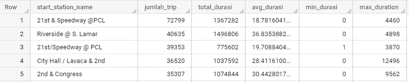

Hasil tabel diatas menjelaskan bahwa stasiun dengan trip terbanyak/ tersibuk adalah stasiun 21st & Speedway @ PCL dengan total trip 72799.

## 2\. GROUP BY & ORDER BY

Group by merupakan queries yang berfungsi untuk mengelompokkan data sesuai dengan kondisi yang diinginkan, sementara order by berfungsi untuk mengurutkan data dari tetinggi ke keterendah (DESC) atau dari terendah ke tertinggi (ASC).

**“Apakah nama stasiun berikutnya dari Ziliker Park yang mempunyai durasi rata — rata terlama untuk melakukan trip bersepeda?”**

```
SELECT  a.start_station_name,
        a.end_station_name,
        AVG(a.duration_minutes) as avg
FROM `bigquery-public-data.austin_bikeshare.bikeshare_trips` a
WHERE a.start_station_name = 'Zilker Park'
GROUP BY 1,2
ORDER BY 4 DESC
```

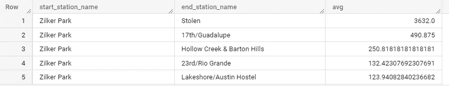

Nama stasiun dengan rata -rata durasi trip terlama dari Ziliker Park adalah stasiun Stolen dengan durasi rata — rata bersepeda 3.632 menit atau setara 60.5 jam atau setara 2.5 hari (emang ada ya nama stasiun stolen?, soale kalau dibahasa in artinya jadi gitu). Apakah durasi trip yang lama menandakan bahwa jarak antara kedua stasiun berjauhan? Jawabannya tidak guys, karena disini ada kolom tipe subscriber yang emang diperuntukkan bagi bikers agar bisa jalan jalan mengeksplore kota.

## 3\. WITH & CASE

WITH dan CASE merupakan queries SQL yang berfungsi untuk filter data sesuai dengan kondisi yang diinginkan. Namun, apa perbedaan antara WITH dan CASE? Bagaimana penggunaannya? Berikut adalah contoh kasus untuk penggunaan queries WITH dan CASE

**“Berapa jumlah trip *bikeshare* yang memiliki durasi berpesepeda diatas rata rata keseluruhan durasi pesepeda pada umumnya yang dikelompokkan berdasarkan nama stasiun awal dan berapa total durasinya?”**

```
SELECT  c.start_station_name, 
        COUNT(*) as greater_avg,  
        SUM(c.duration_minutes) as sum_all
FROM `bigquery-public-data.austin_bikeshare.bikeshare_trips` c
WHERE c.duration_minutes >(#subquery
     SELECT AVG(d.duration_minutes) FROM `bigquery-public-      
     data.austin_bikeshare.bikeshare_trips` d)
GROUP BY c.start_station_name
ORDER BY 2 DESC
LIMIT 10
```

Didalam klausa WHERE SQL, tidak bisa dilakukan aggregation sehingga alternativenya menggunakan *subquery* yang berfungsi untuk mengembalikan nilai dari query kecil (subquery) yang berisi fungsi untuk mencari nilai rata — rata durasi seluruh pesepeda. Nilai dari query kecil ini ( *subquery* ) akan digunakan sebagai kondisi pada query besar, dalam hal ini melalui WHERE. Hasil output dari query diatas adalah sebagai berikut.

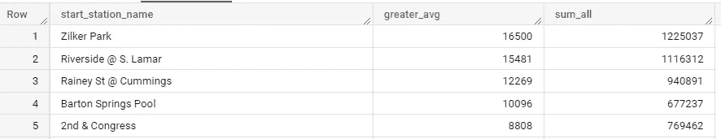

Berdasarkan tabel diatas dapat diartikan bahwa stasiun awal Zilker Park merupakan stasiun dengan jumlah pesepeda terbanyak yang melakukan trip diatas durasi rata — rata pesepeda pada umumnya di Austin sehingga dapat diasumsikan bahwa tipe subscribernya adalah kebanyakan bikers eksplorer. Namun, bagaimana jika dalam satu pertanyaan terdapat 2 kondisi seperti ini?

**“Berapa jumlah trip *bikeshare* yang memiliki durasi berpesepeda diatas dan dibawah dari rata — rata durasi keseluruhan pesepeda pada umumnya yang dikelompokkan berdasarkan nama stasiun awal?** ”

Pada kasus tersebut, tidak dapat menggunakan klausa WHERE, sehingga alternativenya menggunakan CASE.

```
SELECT a.start_station_name,
       SUM(CASE WHEN a.duration_minutes > (#subquery
              SELECT AVG(d.duration_minutes) FROM `bigquery-public-  
              data.austin_bikeshare.bikeshare_trips` d) 
           THEN 1 ELSE 0 END) as greater_avg,
       SUM(CASE WHEN a.duration_minutes < (
              SELECT AVG(d.duration_minutes) FROM `bigquery-public-
              data.austin_bikeshare.bikeshare_trips` d) 
           THEN 1 ELSE 0 END) as lower_avg
FROM `bigquery-public-data.austin_bikeshare.bikeshare_trips` a
GROUP BY a.start_station_name
ORDER BY 2
```

Query diatas menggunakan subquery untuk tiap CASE nya. Subquery berisi nilai rata rata durasi pesepeda umumnya dan kemudian dijadikan kondisi pada klausa CASE. Apabila kondisi pada CASE terpenuhi maka akan mengmbalikan nilai 1 (THEN 1), jika kondisi tidak terpenuhi maka akan mengembalikan nilai 0 (ELSE 0). Hasil dari pengembalian nilai tersebut kemudian di jumlahkan menggunakan SUM. Apabila suatu CASE tidak menggunakan ELSE, dan kondisi tidak terpenuhi maka akan mengembalikan nilai null. Maka lebih baik untuk selalu menyertakan nilai ELSE agar hasil tidak null. Hasil outpu dari query diatas adalah sebagai berikut.

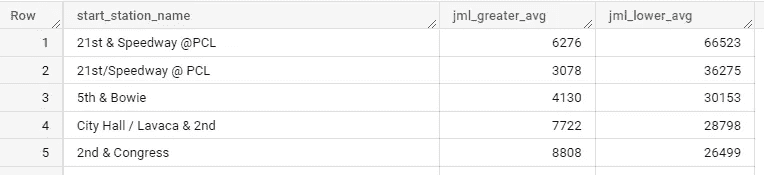

Pada studi kasus WHERE diatas, data diurutkan dari terbesar ke terkecil untuk data jumlah pesepeda diatas rata-rata, sementara pada studi kasus CASE ini diurutkan dari terbesar ke terkecil untuk data jumlah dibawah rata-rata. Berdasarkan tabel diatas, stasiun 21st & Speedway @ PCL merupakan stasiun dengan jumlah pesepeda dengan durasi trip dibawah rata — rata yang mengindikasikan bahwa tipe subscribernya tipe sat set. Walaupun stasiun 21st & Speedway @ PCL merupakan stasiun tersibuk, namun jumlah pesepeda dengan durasi trip diatas rata — rata masih jauh dibandingkan zilker Park.

## 4\. WINDOW FUNCTION

Window function merupakan queries SQL yang berfungsi sebagai analytical function untuk agregasi dan ranking terhadap suatu window atau sekumpulan rows menggunakan klausa OVER.

**“Berapa rata — rata durasi pesepeda dengan tipe subcriber tertentu untuk melakukan perjalanan dari stasiun zilker ke stasiun selanjutnya?”**

```
SELECT a.start_station_name,
       a.end_station_name,
       a.subscriber_type,
       a.duration_minutes,
      AVG(a.duration_minutes) OVER (PARTITION BY   
           a.start_station_name, a.end_station_name, 
           a.subscriber_type) as avg_partition,
FROM `bigquery-public-data.austin_bikeshare.bikeshare_trips` a
WHERE a.start_station_name = 'Zilker Park'
order by 5 DESC
```

Query di atas menggunakan aggregation AVG terhadap window yang dikelompokkan berdasarkan start stasiun, end stasiun dan tipe subscriber.

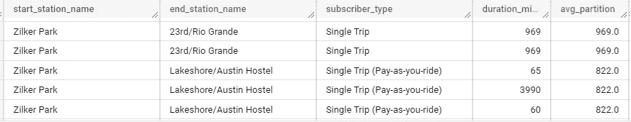

Gambar diatas menjelaskan bahwa rata rata durasi pesepeda dari stasiun zilker park ke stasiun 23rd/Rio Grande dengan tipe subscriber single trip adalah 696 dan durasi tiap pesepeda tersebut juga 696 menit. Dari gambar diatas dapat dilihat kalau tipe subscriber dapat menentuakn lama atau tidaknya trip suatu pesepeda.

## 5\. ROW_NUMBER, DENSE_RANK () DAN RANK()

Row number merupakan window function yang berfungsi untuk memberikan peringkat sesuai perintah yang diberikan.

**“Tampilkan 3 trip dengan durasi terlama untuk setiap perjalan dari stasiun awal ke stasiun berikutnya”**

```
SELECT sb.*,
FROM (
     SELECT e.start_time,
            e.start_station_name,
            e.end_station_name,
            e.subscriber_type,
            e.duration_minutes,
            ROW_NUMBER() OVER (PARTITION BY e.start_station_name 
            ORDER BY e.duration_minutes DESC) as rk
      FROM `bigquery-public-data.austin_bikeshare.bikeshare_trips` e
) sb
WHERE sb.rk < 4
```

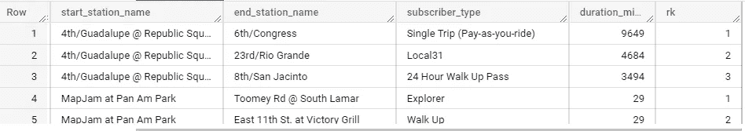

Dari hasil tabel dapat dilihat bahwa 3 trip terlama dari stasiun 4t/ Guadalupe @ Republic adalah menuju stasiun 6th/Congress, 23rd/Rio Grande dan 8th/San Jacinto, sementara 3 trip terlama dari stasiun MapJam at Pan Am Park adalah menuju stasiun Toomey Rd @ South Lamar, East 11th St. at Victory Grill dan Plaza Saltillo. Dan begitu juga pada stasiun lainnya.

Apa perbedaan antara row_number(), dense_rank() dan rank()?

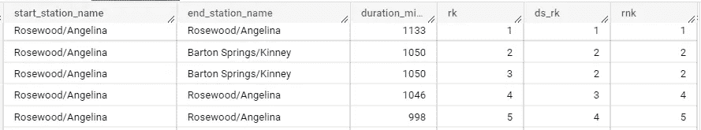

*   Row_number () berfungsi megurutkan seluruh nilai tanpa membedakan nilai duplikat maupun tidak. Lihat gambar diatas kolom rk
*   Dense_rank () berfungsi mengurutkan nilai dan apabila terdapat nilai yang duplikat maka akan mempunyai urutan peringkat yang sama, kemudian melanjutkan ke nilai selanjutnya. Lihat gambar diatas kolom ds_rk
*   Rank () berfungsi untuk mengurutkan nilai dan apabila terdapat nilai yang duplikat maka akan mempunyai urutan peringkat yang sama, namun peringkat selanjutnya dilangkahi sesuai banyaknya duplikat. Lihat gambar diatas kolom rnk

Penggunaan rank(), dense_rank() dan row_number disesuaikan dengan kasus yang ingin diselesaikan.

## 6\. LAG() DAN LEAD()

LAG merupakan query yang berfungsi untuk mengakses nilai row sebelumnya, sementara LEAD merupakan query yang berfungsi untuk mengakses nilai row selanjutnya.

```
SELECT
     e.start_station_name,
     e.end_station_name,
     e.duration_minutes,
     LAG(e.duration_minutes) OVER (PARTITION BY e.start_station_name 
         order by e.trip_id) as prev_duration,
     LEAD(e.duration_minutes) OVER(PARTITION BY e.start_station_name
         order by e.trip_id) as next_duration
FROM `bigquery-public-data.austin_bikeshare.bikeshare_trips` e
```

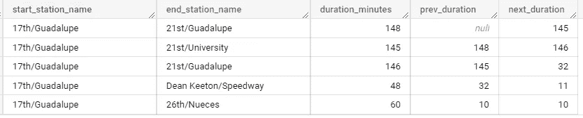

Pada gambar diatas, kolom prev_duration menggunakan query LAG sehingga nilai sebelum 148 tidak ada dan dibuat null, sementara kolom next_duration menggunakan query LEAD() sehingga pada row pertama berisi nilai 145 yang merupakan nilai next row dari row pertama.

**“Apakah trip saat ini lebih lama durasinya daripada trip sebelumnya?”**

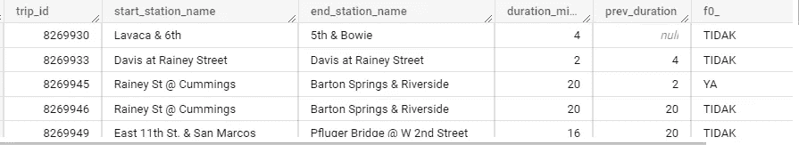

## 7\. SUBQUERY

Subquery sudah dijelaskan sedikit pada nomo 3, yang berfungsi untuk mengembalikan nilai didalam subquery sebagai kondisi. Dengan menggunakan contoh kasus yang sama dengan nomor 3, subquery tersebut dapat diubah seperti berikut agar lebih readible, flexible, lebih mudah dimodifikasi dan powerful.

**“Berapakah jumlah pesepeda yang melakukan durasi perjalanan lebih dari satu hari (1440 menit) untuk tiap stasiun?”**

```
SELECT sb.start_station_name,
       SUM(greater_1000) as num_1440,
       SUM(lower_10) as num_10,
FROM (
      SELECT a.start_station_name,
      (CASE WHEN a.duration_minutes > 1440 THEN 1 ELSE 0 END) as 
       greater_1000,
      (CASE WHEN a.duration_minutes < 10 THEN 1 ELSE 0 END) as 
       lower_10,
      FROM `bigquery-public-data.austin_bikeshare.bikeshare_trip` a
) sb
GROUP BY 1
ORDER BY 2 DESC;
```

Selain melalui WHERE, subquery juga dapat diimplementasikan melalui FROM, SELECT atau HAVING. Dengan adanya subquery, query yang dibuat menjadi lebih readible, flexible da powerful.

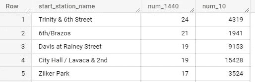

Stasiun dengan jumlah durasi diatas 1440 menit (1 hari) adalah stasiun Trinity & 6th Street dengan jumlah 24 trip.

## 8\. COMMON TABLE EXPRESSION (CTE)

Common table expression (CTE) merupakan query yang lebih powerful daripada subquery karena dapat memanggil suatu query berulang kali. Konsepnya CTE ini seperti fungsi pada pemograman lainnya yaitu awalnya kita mendefinisikan suatu fungsi dan memberikannya nama, kemudian fungsi dengan nama tersebut dipanggil pada query lainnya untuk menjalankan perintah tertentu. Untuk membuat CTE ini diawali dengan klausa WITH.

Menggunakan kasus yang sama dengan kasus diatas pada subquery, maka hasil query menggunakan CTE adalah sebagai berikut.

```
WITH sb as (
     SELECT a.start_station_name,
     (CASE WHEN a.duration_minutes > 1440 THEN 1 ELSE 0 END) as 
      greater_1000,
     (CASE WHEN a.duration_minutes < 10 THEN 1 ELSE 0 END) as 
      lower_10,
     FROM `bigquery-public-data.austin_bikeshare.bikeshare_trips` a
)SELECT sb.start_station_name,
SUM(greater_1000) as num_1440,
SUM(lower_10) as num_10,
FROM sb
GROUP BY 1
ORDER BY 2 DESC;
```

Perbedaan penggunaan antara keduanya yaitu subquery memproses 115.78 MB ketika memproses query, sementara ketika menggunakan CTE hanya memproses 51.08 MB, oleh karena itu penggunaan CTE agar query lebih optimal dan cepat tanpa memakan resource yang banyak.

# WRAP ALL TOGETHER

Ayo kerjakan studi kasus berikut.

Berapakah jumlah label, minimum, maksimum dan rata rata kategori lamanya durasi trip bersepeda? Kategorikan lama durasi trip pesepeda kedalam label berikut.

*   < 100 menit : cepet
*   100–1000 menit : sedang
*   > 1000 menit : lama

Maka outputnya akan seperti berikut.

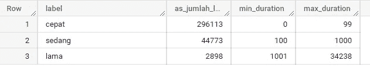

Queriesnya seperti ini.

```
WITH sb as (
        SELECT concat(a.start_station_name, a.end_station_name),
        a.duration_minutes,
        CASE WHEN a.duration_minutes < 100 THEN 'cepat'
             WHEN a.duration_minutes BETWEEN 100 AND 1000 THEN 
             'sedang'
             WHEN a.duration_minutes > 1000 THEN 'lama'
        END as label
FROM `bigquery-public-data.austin_bikeshare.bikeshare_trips` a
WHERE a.duration_minutes IS NOT NULL
GROUP BY 1,2
)SELECT label,
       COUNT(*) as_jumlah_label,
       MIN(sb.duration_minutes) as min_duration,
       MAX(sb.duration_minutes) as max_duration,
FROM sb
WHERE duration_minutes IS NOT NULL
GROUP BY label;
```

Oke guys, sekian kumpulan query SQL nya. Terima kasih :)