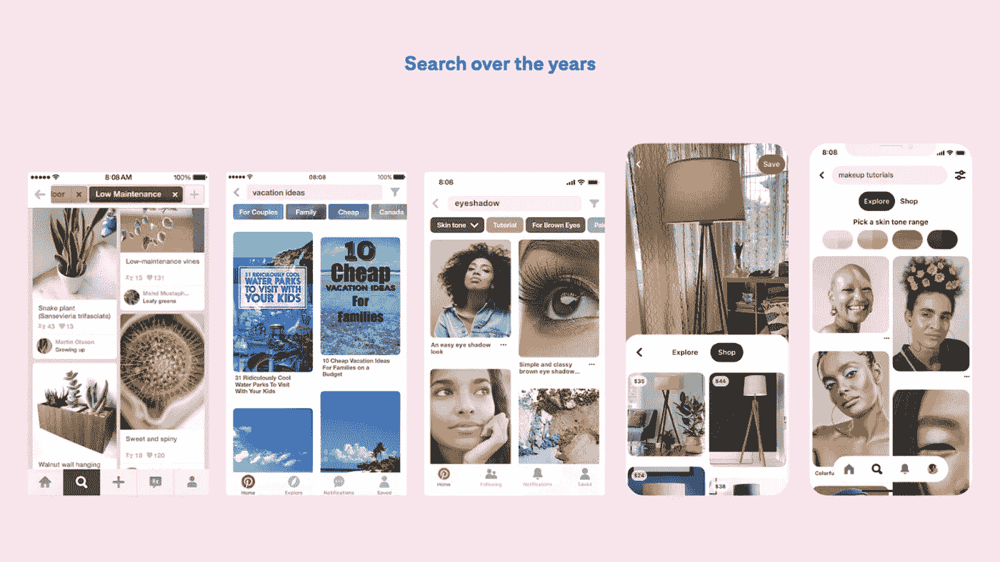

# Pinterest 搜索的演变

> 原文：<https://medium.com/pinterest-engineering/la-evoluci%C3%B3n-de-la-b%C3%BAsqueda-en-pinterest-9a2afc8d6c01?source=collection_archive---------0----------------------->

Naveen Gavini | 产品高级副总裁

这篇博客文章最初发表在 英语.To read the English version click [here](/pinterest-engineering/the-evolution-of-search-at-pinterest-c69e78ff2698)

当 Pinterest 首次推出时,它提供了一种从整个网络收集和组织想法的新方法。然而,最初作为存储的地方,它迅速发展成为一种独特的发现服务,用户可以从彼此,品牌和创作者那里获得灵感。2014 年,在 Pinterest.com 推出四年后,一小群工程师和设计师问道:“如果没有正确的答案,搜索引擎会是什么样子?”

我们意识到,当你仍然不确定你想要什么时,Pinterest 可以成为引导你的创意的服务,当你想探索这样的问题时:今晚晚餐吃什么?如何设计你的家?去哪里度假?有这么多的可能性,有时你不知道你想要什么,直到你看到它。就在那时,我们开始了认真寻找的旅程。

今天,Pinterest 通过计算机视觉推动全球搜索,并通过镜头,图像和引脚功能识别数十亿个对象,以及连接到数亿个产品引脚的产品搜索。

事实上,现在 Pinterest 上每月有超过 50 亿次搜索。(T3 )

**随着人们在大流行后为生活做准备,服装、度假和家庭装修的**[**搜索**](https://newsroom.pinterest.com/es/post/genz-and-the-reopening)**达到顶峰,婚礼搜索已达到流行前水平。(T11)**

对于 Z 世代,每位用户的搜索次数比上一年增加了 31%,而同期受众的搜索次数几乎翻了一番(超过 96%)。(T13 )

**在购物方面,产品搜索量比去年同期(第一季度末)增长了 20 多倍。(T15)**

# 在盒子外面寻找

作为 Pinterest 的早期工程师之一,我有机会开发一个名为“引导式搜索”的搜索引擎的第一个版本。引导式搜索允许您进一步细化或缩小搜索范围。你可以从一些通用的东西开始,比如烤肉,然后用更具体的东西结束,比如烤鸡或纯素烤鸡的夏季食谱。

> 搜索引擎是伟大的,当你知道你在寻找什么。但是互联网缺乏一种探索方式,一种从几个关键词开始的方法,并获得帮助,以扩大这种咨询并探索可能性。

引导式搜索设计已在整个行业中使用,作为点击主题并为您找到最佳答案的一种方式。该产品为计算机视觉驱动的视觉搜索铺平了道路。在[2015](https://newsroom.pinterest.com/es/post/our-crazy-fun-new-visual-search-tool)中,我们开始在松树内部进行物体识别工作,然后将技术引入相机搜索,以便可以搜索和找到您在网上或外面看到的任何内容的建议。

La búsqueda en Pinterest a lo largo de los años, desde Búsqueda guiada hasta búsquedas con gama de tonos de piel y Lens para comprar. Imagen de alta resolución [aquí](https://www.dropbox.com/s/nevad86h98czm6z/Search_Timeline.png?dl=0).

# 搜索的未来是视觉

在整个演变过程中,Pinterest 的搜索变得更加直观和有用,以帮助人们从灵感转向行动。我们将文本和视觉搜索的世界结合在一起,甚至创造了购买和完成 Pines 外观的技术。因为人们拍摄相同的图像并将其放置在不同的仪表板上,我们可以学习图像的深层语义。然后,我们可以教导我们的系统如何模仿用户对图像进行分类的方式。例如,当你想到一把椅子时,它们不是一堆单词,而是图片和椅子是什么概念的混合物。这就是我们教给计算机的。我们每天都在改进,通过机器学习将图像与人们对它们的看法联系起来。每次我们改进模型时,我们都会看到参与度的增加。

我们还推出了 Lens 内购买功能,并将我们的视觉搜索工作扩展到增强现实,AR Try on 用于唇部和眼影。

一路上,我们改进了相关的引脚,它已成为人们限制搜索的最常见方式之一:点击他们喜欢的引脚,然后滚动(本身就是一种视觉搜索)。

我们的主要重点之一是开发包容性产品,以确保每个人都能在 Pinterest 上感受到代表性。这包括皮肤色调的范围,以便人们可以过滤其范围内的美容搜索。我们还将这项技术应用于增强现实,并通过使用不同的数据集来减少人工智能的偏见。

从本质上讲,我们希望帮助用户根据灵感采取行动,例如在商店标签上进行购买,或通过创建者的 Idea Pin 学习新技能。我们继续投资构建我们的[内部搜索框架,以便在正确的时间向正确的人显示相关的引脚,并努力使搜索结果尽可能具有包容性,包括默认显示各种结果,从美容查询开始,以及许多即将到来的内容。](/pinterest-engineering/manas-realtime-enabling-changes-to-be-searchable-in-a-blink-of-an-eye-36acc3506843)

*   每个月,Pinterest 上有超过 50 亿次搜索(搜索包括文本搜索和视觉搜索,包括放大 Pin 上的对象以查看视觉上相似的 Pins)。此统计数据反映了自 2021 年 4 月以来的任何 30 天期间的全球搜索。

*我们正在构建世界上第一个视觉发现引擎。全球有超过 4.75 亿人使用 Pinterest 来梦想,计划和准备他们想要做的事情。*[*加入我们的团队!(T6) (T7)*](https://careers.pinterest.com/careers)