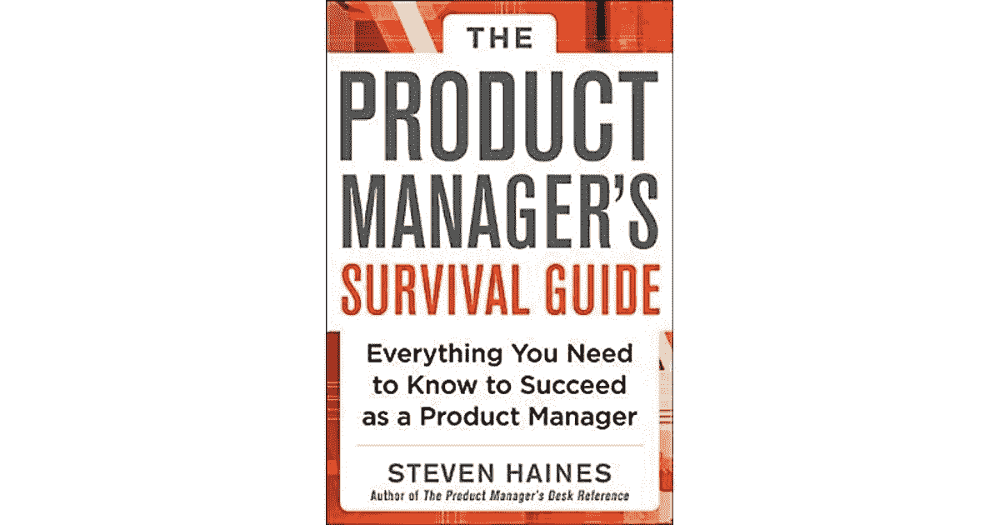
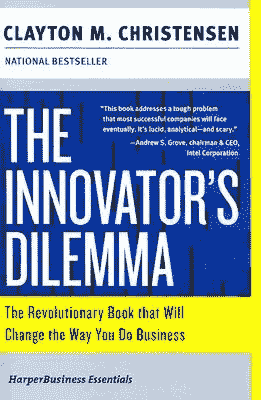
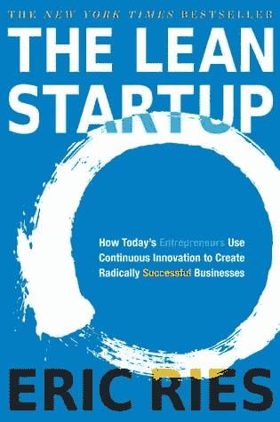

# Langkah Menjadi Seorang Product Manager

> 原文：<https://medium.easyread.co/langkah-menjadi-seorang-product-manager-818620a7b214?source=collection_archive---------1----------------------->

## Product Manager Life

## Kenapa begitu sulit mendapatkan pekerjaan dengan posisi sebagai Product Manager

Photo by [Austin Chan](https://unsplash.com/@austinchan?utm_source=medium&utm_medium=referral) on [Unsplash](https://unsplash.com?utm_source=medium&utm_medium=referral)

Product Manager merupakan salah satu *role* yang diminati saat ini, terutama di Indonesia. Jika melihat portal pencarian kerja dan coba lakukan pencarian dengan keyword “Product Manager” maka hasil nya akan banyak sekali lowongan kerja dengan posisi tersebut.

Product Manager semakin umum di Indonesia karena pertumbuhan startup yang kian banyak sehingga *demand* untuk *role* ini juga kian meningkat.

Akan tetapi untuk mempelajari ilmu tentang product management di sekolah formal seperti kampus masih terasa sulit didapatkan, tidak seperti posisi lainnya yang jalur nya sudah sangat jelas.

Misalkan, jika Anda ingin menjadi seorang dokter, maka belajar lah di sekolah kedokteran. Jika ingin menjadi seorang pengacara yang hebat, belajar lah di sekolah hukum. Untuk product management itu sendiri agak sulit di definisikan, karena product management disebut sebagai pengabungan antara [bisnis, teknologi dan user experience.](https://www.oreilly.com/library/view/product-leadership/9781491960592/ch01.html) Dan lebih baik lagi jika bisa memahami tentang pemasaran produk atau paham tentang *coding* .

# ***Background* yang harus dimiliki**

Seperti dijelaskan diatas, sekolah formal tidak mengajarkan tentang product management. Kalaupun ada, biasa nya tidak secara menyeluruh (dasar atau sekedar pengenalan saja). Jebolan universitas biasanya memiliki keahlian spesifik seperti *coding, network, finance,* atau *marketing* . Ini merupakan *starting point* yang bagus, akan tetapi untuk menjadi bagian dari product management dibutuhkan kemampuan tambahan yang tidak didapatkan di pendidikan formal.

Banyak juga orang yang beranggapan untuk menjadi seorang Product Manager maka harus masuk kuliah dengan spesifik disiplin ilmu. Padahal menurut saya semua orang bisa menjadi Product Manager dengan latar belakang disiplin ilmu yang beragam. Yang penting adalah memiliki keahlian yang dibutuhkan untuk menjadi seorang Product Manager.

# **Lalu bagaimana cara nya menjadi seorang Product Manager?**

## **Cara Pertama:**

Cara yang paling bagus adalah dengan sedini mungkin bergabung dengan tim yang mengembangkan produk. Anda bisa dengan membantu dalam melakukan *research* , atau membantu *testing* produk yang sedang dikembangkan. Intinya adalah lakukan apapun yang membuat anda tetap berinteraksi dengan produk itu sendiri atau *users* .

Pengalaman saya sendiri sebelum bergabung dengan tim produk ketika saya masih bekerja sebagai System Analyst, saya di *assign* kedalam tim yang sedang mengembangkan sebuah produk. Disana saya mulai belajar bagaimana cara megembangkan produk, mulai dari *ideation* , validasi ke *users* sampai *release* produk ke *market.*

Berikut adalah artikel tentang perjalanan saya dari project bertransformasi menjadi product management:

 [## Fitra’s Journey From Project to Product Management

### My journey in Project Management began in September 2013\. I started my journey by joining one of the software houses in…

productcoalition.com](https://productcoalition.com/transform-from-project-to-product-management-5c3aa47a3156) 

Sebenarnya ada beberapa kemiripan antara System Analyst dan Product Manager yaitu harus memahami apa yang dibutuhkan oleh *users* , dan juga melihat peluang atau masalah yang dihadapi. Kemudian, baik System Analyst atau Product Manager juga harus bisa menerjemahkan dan berkomunikasi mengenai *requirements* ke tim.

Yang menjadi pembeda antar dua posisi tersebut adalah Product Manager memiliki responsibilitas penuh terhadap sebuah produk, sedangkan System Analyst tidak. Maksudnya adalah Product Manager yang menentukan kemana arah produk ingin dibawa, sedangkan System Analyst hanya menerima arahan dan *scope* untuk dikerjakan.

## **Cara Kedua:**

Bagian ini akan saya pecah menjadi tiga:

*   *Attends the conference or seminar*
*   *Learns from Online Course*
*   *Read the books*

## **[1] Attends the conference or seminar**

Cara lain yang bisa dilakukan adalah dengan belajar dari pendidikan informal. Sekarang banyak sekali *resource* yang bisa digunakan untuk belajar menjadi seorang Product Manager. Mulai dari seminar atau konferensi yang membahas spesifik tentang dunia product management. Di Indonesia sendiri, acara semacam ini sudah mulai banyak diselenggarakan dari beberapa tahun belakang dan antusiasme nya juga terus meningkat.

Seperti konferensi tahunan yang rutin diselenggarakan oleh TechinAsia ( [Product Development Conference](https://pdc.techinasia.com/) ). Dengan menghadiri acara semacam itu akan menambah insight tentang perkembangan dunia product development, product manager, UX, dan lainnya.

此外，anda 还可以参加在线课程 T2 的在线课程 T4 的在线课程以及 LinkedIn 的在线课程[。Ada banyak *course* 与 tema 产品经理 saya sendiri pernah mengambil*course*di](https://www.linkedin.com/learning/me)[Udemy](https://www.udemy.com/)共同培训产品经理、产品管理和 UX。贝里库特是一名资深的产品经理，他的评级是。

 [## 成为产品经理:通过工作培训学习技能

### 2020 年 5 月更新:超过 1020 名学习过本课程的学生获得了产品经理的职位！现在的学生…

www.udemy.com](https://www.udemy.com/course/become-a-product-manager-learn-the-skills-get-a-job/) 

## **【3】看书**

> “你读得越多，你知道的事情就越多。你学得越多，你去的地方就越多”
> 
> 苏斯博士

这并不是一个简单的问题。他还是第一个负责产品管理的产品经理。有了它，我们就能在*在线课程*的研讨会上学习不需要的产品管理。事实上，世界产品管理领域有几个重要的例子。

**产品经理生存指南:成为成功的产品经理你需要知道的一切**

Product Manager’s Survival Guide — [Goodreads](https://www.goodreads.com/book/show/17118699-the-product-manager-s-survival-guide)

这是我的第一份工作。这不仅是最佳实践的范例，也是全球产品管理成功的关键。

麦格劳-希尔教育公司哈拉曼 224 号

**创新者的困境:将改变你做生意方式的革命性书籍**

The Innovator’s Dilemma — [Goodreads](https://www.goodreads.com/book/show/2615.The_Innovator_s_Dilemma)

这是颠覆性技术的开端，颠覆性技术帮助初创企业或企业家与现任企业*合作，并提供最新的解决方案。*

286 哈拉曼，哈珀平装本

**精益创业:今天的企业家如何利用持续创新来创造彻底成功的企业**

The Lean Startup — [Goodreads](https://www.goodreads.com/book/show/10127019-the-lean-startup)

许多人都认为这是对产品管理或创业公司有利的。这是一个很好的例子，它让我们能够根据客户的反馈来实现精益和敏捷。

299 哈拉曼，货币

# **半拉**

Dengan makin tumbuh nya startup dan perusahaan berbasis teknologi lainnya, maka kebutuhan Product Manager akan semakin banyak. Namun perjalanan kesana tidaklah mudah, dibutuhkan perencanaan yang matang dan juga kesabaran.

Beberapa cara diatas merupakan cara saya terjun ke dunia product management. Masih banyak jalan lainnya jika anda ingin masuk ke dunia produk, tinggal anda yang memilih jalan masuknya.

## Jika anda menyukai artikel ini, berikut beberapa artikel lainnya yang dapat anda nikmati:

 [## Tetap Produktif ketika Work from Home

### Mengukur produktifitas tim dan juga tantangan yang dihadapi ketika work from home

medium.com](https://medium.com/easyread/tetap-produktif-ketika-work-from-home-wfh-7dc27712ae5a)  [## 3 Useful Diagrams for Product Manager

### Diagrams more powerful than words when presenting a dense information

medium.com](https://medium.com/easyread/3-useful-diagrams-for-product-manager-67ae2df0d027)