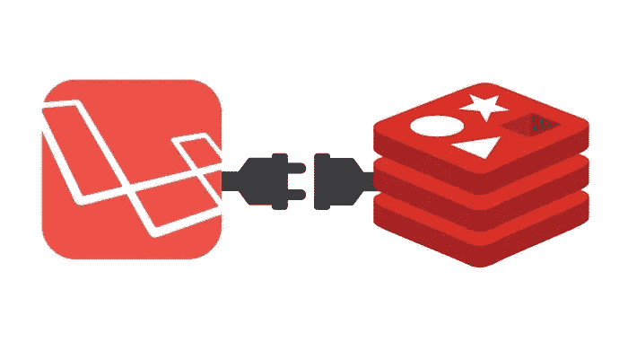
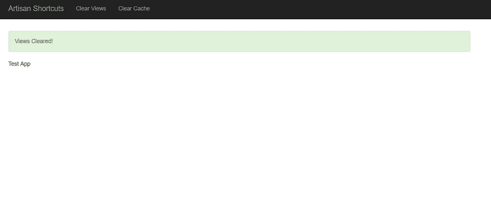
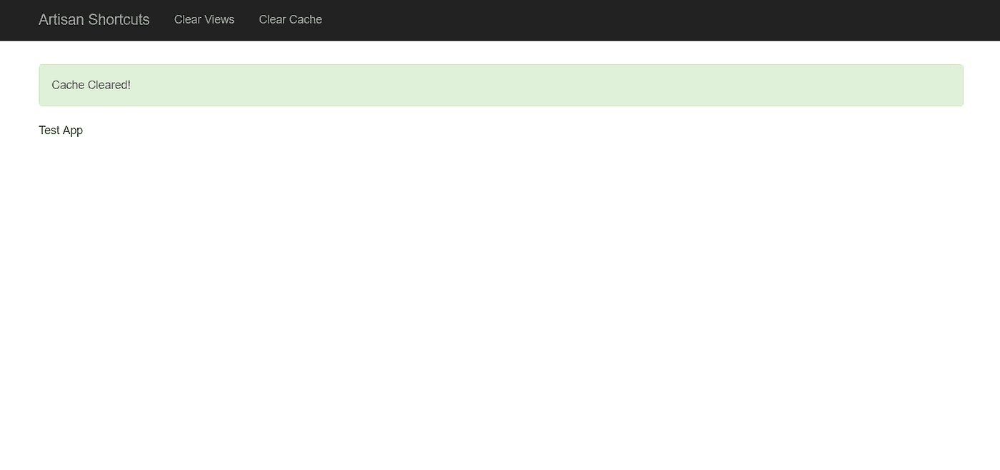

# Laravel:点击按钮清除缓存(Artisan 快捷键)

> 原文：<https://medium.com/quick-code/laravel-clearing-cache-with-a-click-of-a-button-artisan-shortcuts-b528f55028f8?source=collection_archive---------6----------------------->



Copyright: [https://blog.42mate.com](https://blog.42mate.com)

在本教程中，我们将学习如何使用 Laravel 命令清除编译后的视图和缓存。

对于一些只有一台显示器的人来说，在应用程序之间来回切换可能很麻烦。多亏了 Laravel 中的命令，我们可以在任何地方创建和调用这些命令。

**在开始之前，**请记住，这种方法只能用于开发目的。因为清除和重新缓存可能会影响站点的性能

让我们首先为我们的操作创建一个控制器，如下所示:

```
php artisan make:controller DevClearCacheController
```

现在向 DevClearCacheController 类添加以下方法，如下所示:

```
<?php
```

```
namespace App\Controllers;
```

```
**class** DevClearCacheController **extends** Controller
{
    **public function** clear_views()
    {
        \Artisan::call('view:clear');
```

```
 **return** redirect()->back()->with('status','Views Cleared!');
    }
```

```
 **public function** clear_cache()
    {
        \Artisan::call('cache:clear');
```

```
 **return** redirect()->back()->with('status','Cache Cleared!');
    }
```

```
 // you can also add methods for queue:start, queue:restart etc.
}
```

现在让我们将这些添加到 routes 目录下的 web.php 文件中。

```
<?php
```

```
...
```

```
Route::get('clear-views', '[[email protected]](https://tahirjan.com/cdn-cgi/l/email-protection)_views')
     ->name('clear-views');
```

```
Route::get('clear-cache', '[[email protected]](https://tahirjan.com/cdn-cgi/l/email-protection)_cache')
    ->name('clear-cache');
```

```
...
```

现在，让我们创建一个包含按钮的视图(我更喜欢在`navbar`中添加这些按钮):

```
<!DOCTYPE html>
<html lang="{{ App::getLocale() }}">
<head>
    <meta charset="utf-8">
    <meta http-equiv="X-UA-Compatible" content="IE=edge">
    <meta name="viewport" content="width=device-width, initial-scale=1">
    <meta name="csrf-token" content="{{ csrf_token() }}">
    <title>{{ config('app.name', 'Artisan Shortcuts') }}</title>    <link rel="stylesheet" href="https://cdnjs.cloudflare.com/ajax/libs/twitter-bootstrap/3.3.6/css/bootstrap.min.css">
</head>
<body>
<nav class="navbar navbar-inverse navbar-fixed-top">
    <div class="container">
        <div class="navbar-header">
            <ul class="nav navbar-nav">
            <li>**<a href="{{ route('clear-views') }}">Clear Views</a>**</li>
            <li>**<a href="{{ route('clear-cache') }}">Clear Cache</a>**</li>
            </ul>
        </div><!--/.nav-collapse -->
    </div>
</nav>
<div class="body-content">
@if (session('status'))
<div class="alert alert-success">{{ session('status') }}</div> @endif
<p>Test App</p>
</div>
</body>
</html>
```

现在让我们测试我们的应用程序，结果将类似如下:



*最初发表于*[](https://tahirjan.com/laravel-clearing-cache-with-a-click-of-a-button/)**。**

***请点击👏按钮下面几下，以示支持！⬇⬇谢谢！***