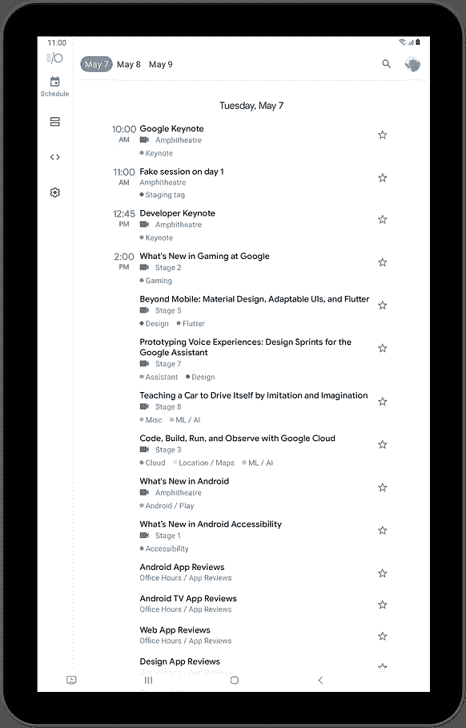

# 谷歌输入/输出应用程序中的大屏幕用户界面

> 原文：<https://medium.com/androiddevelopers/large-screen-ui-in-the-google-i-o-app-c4d3ddd98bd0?source=collection_archive---------0----------------------->

5 月 18 日至 20 日，谷歌完全在线主办了我们的年度 I/O 开发人员会议，包括 112 场会议、151 个代码实验室、79 次会议、29 次研讨会和大量激动人心的公告。虽然今年的活动不包括谷歌 I/O 应用的新版本，但我们确实更新了代码库，展示了现代 Android 开发中的一些新功能和趋势。

我们关注的一个领域是改善大屏幕上的应用体验:平板电脑、可折叠平板电脑，甚至 ChomeOS / Desktop。在过去的一年里，拥有大屏幕的设备越来越受欢迎，使用率也越来越高，如今已经超过了 2.5 亿台活跃设备，应用程序能够适应并明智地使用额外的屏幕空间至关重要。以下是我们用来让谷歌 I/O 应用在大屏幕上表现更好的一些技术。

# 响应导航

在宽屏设备上，比如平板电脑，也有横屏手机，用户经常从侧面拿着设备，这样用户的拇指就可以更容易地接触到这些区域。与此同时，由于有了额外的宽度，更自然的做法是将导航元素放置在侧面，而不是底部。为了支持这一符合人体工程学的转变，我们在 Android 的材料组件中增加了[导航导轨](https://material.io/components/navigation-rail)。

*Left: Bottom navigation in portrait. Right: Navigation rail in landscape.*

谷歌 I/O 应用程序在主要活动中使用了两种不同的布局，其中包含了我们的导航启示。`res/layout`中的一个包含`BottomNavigationView`，`res/layout-w720dp`中的一个包含`NavigationRailView`。在运行时，我们可以使用 Kotlin 的安全调用运算符(`?.`)来设置当前配置中存在的任何视图。

**提示**:如果您不需要数据绑定的所有功能，您仍然可以使用[视图绑定](https://developer.android.com/topic/libraries/view-binding)为您的布局生成绑定类，不需要`findViewById`调用。

# 一个或两个窗格

在 Schedule 特性中，我们使用 list-detail 模式来显示信息层次结构。在宽屏上，空间分为左侧的会话列表和右侧的选定会话的详细信息。这种布局的一个特殊挑战是，不同配置的相同设备可能具有不同的最佳视图，例如纵向与横向的平板电脑。由于这个应用程序使用 [Jetpack 导航](https://developer.android.com/guide/navigation?hl=en)在不同视图之间移动，这对导航图有什么影响，我们如何跟踪当前的屏幕内容？

*Left: Tablet portrait (single pane). Right: Tablet landscape (two pane).*

我们的方法使用了`[SlidingPaneLayout](https://developer.android.com/reference/kotlin/androidx/slidingpanelayout/widget/SlidingPaneLayout)`，它提供了问题的直观解决方案。总是有两个窗格布局，但第二个窗格可能看不到，这取决于屏幕的大小。`SlidingPaneLayout`如果根据为两个窗格指定的宽度尺寸有足够的空间，则仅显示这两个窗格。我们分别选择了 400dp 和 600dp 的窗格宽度。经过一些实验，我们发现即使在一个大的平板电脑上，当以纵向显示两个窗格时，信息也太密集了，所以这些宽度确保我们只能以横向显示两个窗格。

对于导航图，计划目的地现在是两个窗格的片段，并且可以在任一窗格中出现的所有目的地都被移动到新的导航图中。在每个窗格中，我们可以将该窗格的`NavController`用于同一窗格中的目的地，如会话详细信息和演讲者详细信息。但是，我们不能从会话列表目标直接导航到会话详细信息目标，因为它们现在位于不同的窗格中，因此位于不同的图形中。

相反，会话列表和双窗格片段共享一个包含 Kotlin 流的`ViewModel`。每当从列表中选择一个会话时，我们向该流发出一个事件，双窗格片段收集事件并重定向到细节窗格的`NavController`:

在窄屏幕上，滑动窗格成为导航的一个视觉方面，正如上面的`slidingPaneLayout.open()`调用所示。我们还必须以另一种方式处理窗格的滑动，从细节窗格“返回”到列表窗格。由于窗格目的地与主导航图分离，我们不能通过按设备上的后退按钮在窗格内自动向后导航，所以这也成为我们的责任。

所有这些情况都在一个注册在双窗格片段的`onViewCreated()`中的`OnBackPressedCallback`中处理。(你可以在这里阅读更多关于添加自定义后退导航[。)这个回调监听滑动窗格的移动和任一窗格中导航目标的改变，以便它可以重新评估它应该如何处理下一次后退按钮按下。](https://developer.android.com/guide/navigation/navigation-custom-back)

`SlidingPaneLayout`最近也进行了更新，以更好地支持可折叠设备。你可以在本指南的[中了解更多关于使用`SlidingPaneLayout`的信息。](https://developer.android.com/guide/topics/ui/layout/twopane)

# 资源限定符的限制

搜索应用程序栏也有依赖于屏幕的行为。在搜索时，您可以选择各种标签来过滤显示在结果中的会话，我们在两个位置之一显示当前活动的过滤器:当搜索文本字段较窄时，显示在下面；当搜索文本字段较宽时，显示在文本字段旁边。也许与直觉相反，窄模式出现在横向平板电脑上，而宽模式出现在纵向平板电脑上。

Search app bar on tablet landscape (narrow)

Search app bar on tablet portrait (wide)

以前，这是通过为搜索片段的视图层次结构的应用程序栏部分使用一个`<include>`标签来完成的，并提供两个版本的包含布局，其中一个像`layout-w720dp`一样合格。现在，搜索片段可以出现在同时显示两个窗格的屏幕的一个窗格中，这不再有效，因为在这种情况下，布局或其他类似的资源将使用整个屏幕宽度来解析，但我们实际上只对窗格的宽度感兴趣。

为了解决这个问题，这里是用于搜索的 [l](https://github.com/google/iosched/blob/main/mobile/src/main/res/layout/fragment_search.xml) ayout 的应用程序栏部分。注意两个`ViewStub`元素(第 27 行和第 38 行)。

两个`[ViewStub](https://developer.android.com/reference/android/view/ViewStub)s`分别指向不同的布局，它们都只包含一个`RecyclerView`(尽管属性略有不同)。这些存根在运行时不占用任何可视空间，直到它们被膨胀。剩下的就是在我们知道窗格有多宽之后选择膨胀哪个，所以我们可以通过使用`[doOnNextLayout](https://developer.android.com/reference/kotlin/androidx/core/view/package-summary#doonnextlayout)`扩展函数来等待`onViewCreated()`中`AppBarLayout`的第一次布局。

# 转换空间

得益于像`match_parent`尺寸、合格的资源和像`ConstraintLayout`这样的库，Android 一直有能力创建适用于多种屏幕尺寸的布局。然而，这并不总是为该尺寸的用户创造最佳体验。当用户界面元素太长、太远或太密集时，信息可能更难传达，触摸目标可能变得模糊，应用程序的可用性可能会受到影响。

对于像设置这样的功能，我们有一个简短的项目列表，可以在更宽的屏幕上展开。由于项目本身并不会有不同的布局，我们通过在`ConstraintLayout`的帮助下限制列表的宽度来解决这个问题。

在第 10 行，`@dimen/content_max_width_percent`是一个浮动维度，具有多个由不同屏幕宽度限定的值。在较小的设备上，这些值从 1.0 开始，在最大的设备上逐渐减少到 0.6，这样当屏幕变宽时，UI 元素不会因为过度拉伸而变形。

Settings on wide screens.

关于常见尺寸断点的便利参考，请参见关于支持不同屏幕尺寸的[指南](https://developer.android.com/training/multiscreen/screensizes?hl=en#TaskUseSWQuali)。

# 转换内容

Codelabs 功能的结构与 Settings 功能类似，但是我们没有限制内容的宽度，而是希望利用额外的屏幕空间。在狭窄的屏幕上，你会看到一个项目列表，点击时可以展开和折叠。在更宽的屏幕上，这变成了一个卡片网格，可以立即显示所有商品的详细信息。

*Left: Codelabs on narrow screens. Right: Codelabs on wide screens.*

单独的网格项目是`res/layout-w840dp`中的[替代布局](https://github.com/google/iosched/blob/main/mobile/src/main/res/layout-w840dp/item_codelab.xml)，数据绑定处理信息如何绑定到视图以及项目如何响应点击，因此尽管外观不同，实现它们并不需要太多时间。另一方面，这个片段没有替代的布局，所以让我们来看看在这两种配置中实现期望的外观和感觉所使用的一些技术。

一切都围绕着这个`RecyclerView`元素:

这里有两个资源，在我们为替代项布局选择的同一断点处，每个资源都有不同的值:

我们使用字符串资源设置了`app:layoutManager`，并提供了`android:orientation`和`app:spanCount`来配置 XML 中的布局管理器。注意，orientation 属性适用于两个布局管理器，但是 span count 只适用于`StaggeredGridLayoutManager`，也可以；如果一个`LinearLayoutManager`正在膨胀，它简单地忽略跨度计数。

用于`android:paddingHorizontal`的维度资源也用于名为`app:itemSpacing`的东西，它不是`RecyclerView`的标准属性，那么它来自哪里呢？这是一个用[绑定适配器](https://developer.android.com/topic/libraries/data-binding/binding-adapters?hl=en)定义的属性，这是我们向数据绑定库提供定制逻辑的方式。在运行时，数据绑定将调用下面的函数，并将解析后的资源值传递给它。

[SpaceDecoration](https://github.com/google/iosched/blob/main/mobile/src/main/java/com/google/samples/apps/iosched/widget/SpaceDecoration.kt) 是一个简单的`ItemDecoration`实现，它在每个项目周围添加空间，这解释了我们如何在 840dp 或更宽的项目之间获得一致的间隙(其中`@dimen/codelabs_list_item_spacing`具有正值)。通过对`RecyclerView`本身使用相同的填充量，效果是一个项目和`RecyclerView`边缘之间的间距与相邻项目之间的间距相同，从而在四周创建均匀的间距。要确保项目一直滚动到`RecyclerView`的边缘，请使用`android:clipToPadding="false".`

# 屏幕越多越好

Android 一直是一个多样化的硬件生态系统。随着用户继续采用更多的平板电脑和可折叠设备，请确保在这些不同的尺寸和长宽比下测试你的应用程序，这样你就不会让一些用户感到被忽略了。为了使这更容易，Android Studio 提供了[可折叠模拟器](https://developer.android.com/guide/topics/ui/foldables#emulators)和[自由形式窗口模式模拟器](https://developer.android.com/studio/releases/emulator#freeform_window_mode)，所以你可以看到你的应用程序如何响应这些情况。

我们希望我们对 Google I/O 应用程序所做的更改能给你一些想法，让你制作出漂亮、高质量的应用程序，能够很好地适应各种形状和大小的设备。从 [Github](https://github.com/google/iosched) 下载代码库并亲自试用。