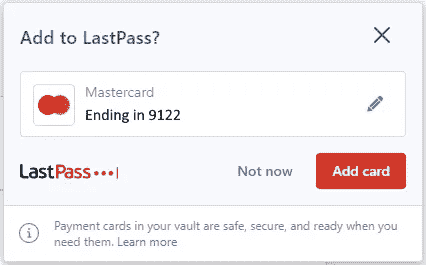

# LastPass 黑客:3300 万账户

> 原文：<https://medium.com/version-1/lastpass-hack-33-million-accounts-806b85301ca8?source=collection_archive---------2----------------------->

这种攻击的严重性不可低估。3300 万消费者账户。10 万个商业账户。密码库掌握在黑客手中，假以时日，将会被破解。

以下是关于黑客攻击以及对使用 LastPass 的个人可能造成的影响的常见问题的答案。

LastPass admitted a breach in August 2022 and December 2022

拉斯特帕斯说我的金库需要几百万年才能破解。这是真的吗？

如果你的密码很复杂，黑客就很难破解。一个简单的密码，由字典中的单词组成，将很快被破解。基于 2022 年可用的技术:

> 一个随机生成的 20 个字符的密码需要 300 万万亿年:E6AMYUBK6qUmeYhPyh83
> 
> 一个基于字典单词的密码，加上字母替换，不到一天就能在**被破解** : H0rses4C0urses！
> 
> 一个基于字典的 12 个字符的密码可以在**不到 10 分钟**内被破解

**这个密码迭代功能是什么？**

用于加密您的保管库的主密码受到 PBKDF2 的“扰乱”,使破解更加困难。

较新的 LastPass 帐户有大量的 PBKDF2 迭代，大约 100，000 次。但是旧帐户的迭代次数要少得多，只有 5000 次。

黑客知道这些缺省值，并将基于它们进行破解尝试。

**我在 LastPass 用的是 2FA。当然，我是安全的黑客？**

不。2FA 保护 LastPass 用户界面来访问您的密码库。它不能保护保险库本身。因为黑客已经窃取了你的整个密码库，这个 2FA 保护就一文不值了。

**我是 LastPass 的长期用户。这对我意味着什么？**

2011 年至 2017 年的账户违约率很低。密码长度只有 8 个字符，密码重复次数设置为 5，000 次。

LastPass 自 2017 年以来没有做任何事情来提示你(或强迫你)改变这些默认设置。因此，长期使用 LastPass 的用户面临的风险最大。

我的信用卡和银行账户怎么办？

任何使用 LastPass 管理信用卡或银行账户信息的人都面临很高的风险。此信息的泄露可能会带来灾难性的后果。立即采取措施保护您的财务信息。

Persistent nagging to manage your credit card numbers

LastPass 在检测到信用卡信息被输入网站时会不断提示。没有办法禁止这种唠叨，所以一些用户可能允许这种情况发生。

**我该怎么办？**

您必须**立即更改所有密码**。

存储在 LastPass 中的任何其他数据，如信用卡或安全票据，也应被视为受到威胁。采取措施保护自己。

点击[这个链接](/version-1/lastpass-hack-is-my-data-safe-4f217b65ce61)，在我的另一个博客中找到更多关于 LastPass 黑客事件的信息。

**关于作者:** Jamie Steele 是 Azure Version 1 的数据架构师。