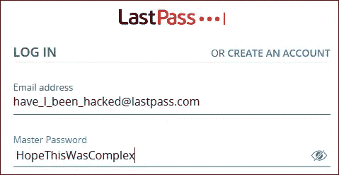

# LastPass Hack:我的数据安全吗？

> 原文：<https://medium.com/version-1/lastpass-hack-is-my-data-safe-4f217b65ce61?source=collection_archive---------4----------------------->

什么是 LastPass？一个运行在订阅表单上的密码管理系统。它通过使用软件发挥作用，可以是插件或应用程序的形式。

**在拉斯帕斯发生了什么？**一次主要的黑客攻击发生在 2022 年 8 月。后来，在 2022 年 12 月，利用早期黑客攻击中获得的情报，发生了第二次攻击。这导致客户数据遭到破坏。加密或打开内容的细节还不清楚。

因此，我花了一天的时间来修改我在 LastPass 中管理的所有密码。购物、金融、社交、运动。由于上次的黑客攻击，每个密码都被修改了。你也应该采取行动吗？

根据他们的网站，LastPass 为超过**3300 万消费者**和 **10 万商家**管理密码。如果你是其中之一，请继续阅读。

我的密码安全吗？LastPass 不知道您的密码，因为它们是使用您的个人主密码加密的。黑客需要破解你的主密码才能获得你的密码。

**我的主密码能被破解吗？**是的。这是黑客有多少时间的问题。如果你的密码是安全的并且长度合适，你就不太可能遇到问题。如果您的密码不安全，您应该立即采取措施。

**破解我的主密码需要多久？**点击此处，根据密码长度和复杂性进行评估。如果这还不到一个月，你应该采取行动:[https://www.passwordmonster.com/](https://www.passwordmonster.com/)

**我该怎么办？**为了安全和安心，请更改 LastPass 保管库中的每个密码。尽快这么做。

**黑客攻击中还有什么被破坏了？**您的密码已加密。您的其他信息可能没有加密。LastPass 暗示，用户名、网址、电话号码和电子邮件地址都没有加密。这给了黑客一个巨大的信息来源，即使没有你的密码。警惕网络钓鱼攻击和诈骗。

在 LastPass 发生了什么？一次主要的黑客攻击发生在 2022 年 8 月。后来，在 2022 年 12 月，利用早期黑客攻击中获得的情报，发生了第二次攻击。这导致客户数据遭到破坏。关于加密或开放的细节是模糊的。

我应该继续使用 LastPass 吗？一个高质量的密码管理员是必不可少的。它提高了您的安全性，保证了您的凭证和数据的安全。密码应该是复杂的，并且有足够的长度。你不能在脑子里记住这些，这意味着你会把它们写下来，或者使用一个管理器。

关于 LastPass 数据攻击的更多信息可以在[这里](/version-1/lastpass-hack-33-million-accounts-806b85301ca8)找到。

**关于作者:** Jamie Steele 是 Azure Version 1 的数据架构师。