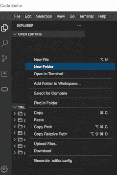
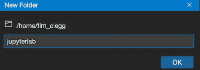
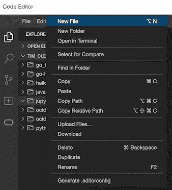
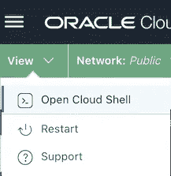
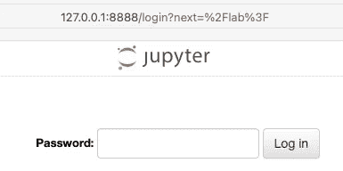

# 使用您的网络浏览器在 OCI 启动 JupyterLab (Jupyter )!

> 原文：<https://medium.com/oracledevs/launching-jupyterlab-jupyter-on-oci-using-your-web-browser-dddbb01f4a0e?source=collection_archive---------0----------------------->


*Photo by Pavel Danilyuk:* [*https://www.pexels.com/photo/person-using-silver-and-black-laptop-computer-5496464/*](https://www.pexels.com/photo/person-using-silver-and-black-laptop-computer-5496464/)

Jupyter 是一个流行的基于 web 的数据科学应用程序，允许用户运行许多不同语言的代码并与之交互。Jupyter 使用的 web 界面被称为 [JupyterLab](https://jupyterlab.readthedocs.io/en/stable/) ，它提供了一种用户友好和直观的方式来与代码和执行的代码的计算结果进行交互。本文将指导您使用 web 浏览器在 Oracle 云基础设施(OCI)上部署 Jupyter。是的，你的网络浏览器。

我们将使用一些巧妙的 OCI 工具和资源来实现这一点(比如 [OCI 云壳](https://docs.oracle.com/en-us/iaas/Content/API/Concepts/cloudshellintro.htm)和 [OCI 代码编辑器](https://docs.oracle.com/en-us/iaas/Content/API/Concepts/code_editor_intro.htm))。再加上 OCI A1 (arm)实例的强大功能，您可以快速利用大量功能来快速处理数据！

下面是我们在本文中要做的事情的简要概述:

1.  使用 OCI 代码编辑器(在您的浏览器中)创建一个容器定义(Docker 和相关文件)
2.  使用 OCI 云外壳(在您的浏览器中)构建并上传容器映像(多架构，即 arm64 和 amd64)
3.  在您的 OCI 计算实例上部署容器(通过 SSH)

我们构建的容器将基于 Oracle Linux 8 (OL8)并支持 x86_64(又名 amd64)和 aarch64(又名 arm64)架构。

# 重要的事情先来

您应该有一个 OCI 帐户和一个 OCI 实例(最好是一个虚拟机。Standard.A1.Flex shape)，您可以访问它(通过 SSH 连接到它)。访问[https://cloud.oracle.com](https://cloud.oracle.com/)注册一个免费账户(如果你还没有的话)。如果您没有配置 OCI 实例，请查看 OCI 文档[以了解配置计算映像的步骤。本文旨在使用一个 A1 计算实例(一个 *VM。Standard.A1.Flex* shape)运行 Oracle Linux 8。](https://docs.oracle.com/en-us/iaas/Content/Compute/Tasks/launchinginstance.htm#linux__linux-create)

# 将它扩展到朱庇特之外

本文特别关注 Jupyter，但是由于这些都是在构建/运行容器的上下文中完成的，因此它可以很容易地适应许多其他容器化的应用程序工作负载。您可以将它用于描述其他应用程序的 other 文件，并遵循大致相同的步骤来构建您的映像并将其推送到 OCI 集装箱注册中心(OCIR)。

这不是构建/发布容器映像的生产级解决方案！这只是为了做一些实验。应设置适当的管道，最好使用 [OCI DevOps](https://docs.oracle.com/en-us/iaas/Content/devops/using/home.htm) 。这超出了本文的范围，但是要知道这并不是一个终极解决方案。这不是为了生产！

# 创建容器定义

登录到您的 OCI 租赁，并打开 OCI 代码编辑器。如果你以前没有这样做过，参见 [OCI 文档](https://docs.oracle.com/en-us/iaas/Content/API/Concepts/code_editor_using.htm)以获得指导。

代码编辑器加载后，在文件编辑器视图中，右击您的名字下方的空白区域，弹出上下文菜单，点击*新建文件夹*:



Creating a new folder in OCI Code Editor

将其命名为 *jupyterlab* 并点击 OK 按钮:



New folder name

右键点击新建的 *jupyterlab* 文件夹，点击*新建文件*:



New file in OCI Code Editor

输入文件名，然后单击确定。您需要这样做两次，创建两个新文件:

*   jupyter _ generate _ passwd _ hash . py
*   Dockerfile 文件

请注意，您可能会在代码编辑器中看到一些弹出窗口，围绕着不同的插件。就像许多流行的编辑器一样，根据你的需要调整(和/或忽略)它！


Sample dialog to ignore

点击*jupyter _ generate _ passwd _ hash . py*文件并将以下内容粘贴到其中:

```
#!/usr/bin/python3from jupyter_server.auth import passwd
import os
print(passwd(os.environ['JUPYTER_PASSWORD']))
```

(值得表扬的是，以上内容改编自[https://jupyter-server . readthedocs . io/en/stable/operators/public-server . html](https://jupyter-server.readthedocs.io/en/stable/operators/public-server.html))

上面的脚本用于生成一个 Jupyter 可以在其配置文件中使用的密码格式(您将在下面的 Dockerfile 文件中看到它的使用)。如果您想使用基于令牌或其他身份验证方法，请根据需要随意修改。

默认情况下，OCI 代码编辑器会在运行时保存文件。可以在您的首选项中关闭此自动保存功能。如果您禁用了自动保存，请确保保存文件，否则享受自动保存功能。点击 *Dockerfile* 文件，并将以下内容放入其中:

```
FROM container-registry.oracle.com/os/oraclelinux:8-slim
ARG JUPYTER_PASSWORD
RUN microdnf install oraclelinux-developer-release-el8 && dnf install -y python39 python39-pip python39-devel gcc libffi libffi-devel && dnf clean all
RUN pip3 install packaging jupyterlab matplotlib
RUN mkdir /jupyter
RUN mkdir /root/.jupyter
COPY jupyter_generate_passwd_hash.py /root/.
RUN if [ -z "$JUPYTER_PASSWORD" ]; then echo 'Jupyter password not set.'; else printf " \
{\n\
  \"ServerApp\": {\n\
    \"password\": \"$(python3 /root/jupyter_generate_passwd_hash.py)\"\n\
  }\n\
}\n" > /root/.jupyter/jupyter_server_config.json; fi
EXPOSE 8888/tcp
CMD jupyter lab --allow-root --notebook-dir /jupyter --no-browser --autoreload --ip=0.0.0.0
```

保存这两个文件(这是由 OCI 代码编辑器自动完成的，除非您关闭了这个特性)。

# 构建和上传容器图像

在 OCI 代码编辑器窗口中，通过点击*视图*(屏幕左上角)启动云壳，然后*打开云壳*:



Opening up OCI Cloud Shell from inside OCI Code Editor

在云 Shell 会话中，切换到 *jupyterlab* 目录并启用 Python 脚本(*jupyter _ generate _ passwd _ hash . py*)的执行:

```
cd jupyterlab
chmod +x jupyter_generate_passwd_hash.py
```

接下来启用 arm 仿真(本例中使用[QEMU-用户静态](https://github.com/multiarch/qemu-user-static)):

```
docker run --rm --privileged multiarch/qemu-user-static --reset -p yes
```

(参见[这篇文章](/@timclegg/emulating-arm-architecture-in-oci-cloud-shell-d5774d2b95cb)了解更多关于 OCI 云壳中 arm 仿真的信息)

是时候构建 arm64 容器映像了:

```
JUPYTER_PASSWORD=<your clear-text password> docker build --pull --build-arg JUPYTER_PASSWORD --platform arm64 -t jupyterlab:v1.0.0-ol8-arm64 .
```

注意:这可能需要几分钟时间。为了防止 OCI 云 Shell 实例超时，每隔几分钟按一下<space>键，以保持其活动状态。如果您的云 Shell 会话不活动，只需重新打开云 Shell 并运行最后一个未完成的命令(Docker 通常从最后一个完成的检查点恢复)。</space>

现在构建 amd64 容器映像:

```
JUPYTER_PASSWORD=<your clear-text password> docker build --pull --build-arg JUPYTER_PASSWORD --platform amd64 -t jupyterlab:v1.0.0-ol8-amd64 .
```

注意:与 arm64 映像构建一样，您可能会不时地输入一两个空格，以防止 OCI 云 Shell 会话超时。

给刚创建的集装箱贴上标签，并上传到 OCI 集装箱注册处(OCIR):

```
docker image tag jupyterlab:v1.0.0-ol8-arm64 <region>.ocir.io/<namespace>/jupyterlab:v1.0.0-ol8-arm64
docker image tag jupyterlab:v1.0.0-ol8-amd64 <region>.ocir.io/<namespace>/jupyterlab:v1.0.0-ol8-amd64
docker image push <region>.ocir.io/<namespace>/jupyterlab:v1.0.0-ol8-arm64
docker image push <region>.ocir.io/<namespace>/jupyterlab:v1.0.0-ol8-amd64
```

必须创建一个清单，将两个特定于体系结构的容器映像联系在一起:

```
docker manifest create <region>.ocir.io/<namespace>/jupyterlab:v1.0.0-ol8 \
  --amend <region>.ocir.io/<namespace>/jupyterlab:v1.0.0-ol8-arm64 \
  --amend <region>.ocir.io/<namespace>/jupyterlab:v1.0.0-ol8-amd64
```

将清单推送到 OCIR，并将其从云外壳会话中移除(清理):

```
docker manifest push <region>.ocir.io/<namespace>/jupyterlab:v1.0.0-ol8
```

通过使用 OCI 云壳，我们已经登录到 OCI 集装箱注册(OCIR)和其他 OCI 服务，使它成为与 OCI 互动时使用的完美资源！

此时，我们已经为 amd64 和 arm64 构建了容器映像，还有一个清单，它给出了一个较短的名称(别名),我们可以用它来部署到 arm64 或 amd64 实例！为了验证已经构建了映像，在 Cloud Shell 中，运行 *docker image ls* 。您应该看到我们刚刚在那里生成的两个图像(<region>. ocir . io/<namespace>/jupyterlab:v 1 . 0 . 0-ol8-arm 64 和<region>. ocir . io/<namespace>/jupyterlab:v 1 . 0 . 0-ol8-arm 64)。还要通过在 [OCI 容器注册表](https://docs.oracle.com/en-us/iaas/Content/Registry/Tasks/registryviewingimagedetails.htm)中查找这两个映像来验证它们是否存在。

现在只需要运行容器映像。

# 运行容器

SSH 到您创建的 OCI A1 计算实例。假设 OCI 实例(一个新实例)上没有安装容器运行时，我们需要安装一个。我们可以安装 Docker，但由于 Podman 在 OL8 dnf repos 中，我们将安装 Podman(步骤更少):

```
sudo dnf install -y podman
```

我们需要登录到 OCIR，然后我们可以访问我们之前推送的容器:

```
podman login <region>.ocir.io
```

确保使用正确的用户名格式(参见本文了解更多信息)。OCI 云壳太棒了，为我们消除了所有的登录欺骗。使用您的 AuthToken 作为密码(但是您已经通过阅读 [OCI 文档](https://docs.oracle.com/en-us/iaas/Content/Registry/Tasks/registrypushingimagesusingthedockercli.htm)知道了，对吗？！).

是时候运行容器了:

```
podman run -it --rm --name jupyterlab -p 8888:8888 <region>.ocir.io/<namespace>/jupyterlab:v1.0.0-ol8
```

我们将看到大量文本输出到屏幕上(因为我们现在运行在交互模式下)。我们可以将它部署为一个守护进程( *-d* 而不是 *-it* )，但目前这是可行的。这个命令做了什么？我们要求 podman 以交互模式( *-it* )运行容器，当它完成执行时移除容器(*-RM*)，为正在运行的容器指定一个名称 *jupyterlab* ，并将容器的端口 8888 暴露给主机系统。

通常，除非需要，否则不公开资源是一种安全最佳实践(遵循最低访问级别/需要知道的原则)。正因为如此，我故意*而不是*提到向互联网暴露任何端口。我们可以使用 SSH 端口转发来访问 Jupyter 应用程序。

打开另一个 SSH 会话，这次使用端口转发设置:

```
ssh -L 8888:127.0.0.1:8888 -i <priv_key> opc@<instance_pub_ip>
```

在 SSH 会话处于活动状态(端口转发设置和工作)的情况下，打开 web 浏览器并转到 [http://127.0.0.1:8888](http://127.0.0.1:8888/) 查看 Jupyter 登录页面:



Sample Jupyter login screen

输入您在构建容器映像时使用的密码，您应该能够使用 Jupyter。

# 关掉它

现在我们正在进行两个 SSH 会话:一个运行容器，另一个是到 OCI 实例的端口转发。注销，关闭浏览器，关闭第二个 SSH 会话(带端口转发)，然后在第一个 SSH 会话上按 CTRL+C(中断容器执行)并告诉它关闭( *y* ):

```
[opc@a1-ol8 ~]$ podman run -it --rm --name jupyterlab -p 8888:8888 <region>.ocir.io/<namespace>/jupyterlab:v1.0.0-ol8
[I 2022-08-15 20:30:50.693 ServerApp] jupyterlab | extension was successfully linked.
[I 2022-08-15 20:30:50.702 ServerApp] nbclassic | extension was successfully linked.
[I 2022-08-15 20:30:50.704 ServerApp] Writing Jupyter server cookie secret to /root/.local/share/jupyter/runtime/jupyter_cookie_secret
[I 2022-08-15 20:30:50.944 ServerApp] notebook_shim | extension was successfully linked.
[I 2022-08-15 20:30:50.970 ServerApp] notebook_shim | extension was successfully loaded.
[I 2022-08-15 20:30:50.971 LabApp] JupyterLab extension loaded from /usr/local/lib/python3.9/site-packages/jupyterlab
[I 2022-08-15 20:30:50.972 LabApp] JupyterLab application directory is /usr/local/share/jupyter/lab
[I 2022-08-15 20:30:50.975 ServerApp] jupyterlab | extension was successfully loaded.
[I 2022-08-15 20:30:50.979 ServerApp] nbclassic | extension was successfully loaded.
[I 2022-08-15 20:30:50.980 ServerApp] Serving notebooks from local directory: /jupyter
[I 2022-08-15 20:30:50.980 ServerApp] Jupyter Server 1.18.1 is running at:
[I 2022-08-15 20:30:50.980 ServerApp] [http://abc123:8888/lab](http://abc123:8888/lab)
[I 2022-08-15 20:30:50.981 ServerApp]  or [http://127.0.0.1:8888/lab](http://127.0.0.1:8888/lab)
[I 2022-08-15 20:30:50.981 ServerApp] Use Control-C to stop this server and shut down all kernels (twice to skip confirmation).
[I 2022-08-15 20:30:56.511 ServerApp] 302 GET / (10.0.2.100) 0.84ms
[W 2022-08-15 20:30:56.554 ServerApp] Clearing invalid/expired login cookie username-127-0-0-1-8888
[W 2022-08-15 20:30:56.554 LabApp] Clearing invalid/expired login cookie username-127-0-0-1-8888
[I 2022-08-15 20:30:56.555 LabApp] 302 GET /lab? (10.0.2.100) 2.25ms
^C[I 2022-08-15 20:35:42.568 ServerApp] interrupted
Serving notebooks from local directory: /jupyter
0 active kernels
Jupyter Server 1.18.1 is running at:
[http://abc123:8888/lab](http://abc123:8888/lab)
 or [http://127.0.0.1:8888/lab](http://127.0.0.1:8888/lab)
Shutdown this Jupyter server (y/[n])? y
[C 2022-08-15 20:35:44.701 ServerApp] Shutdown confirmed
[I 2022-08-15 20:35:44.702 ServerApp] Shutting down 3 extensions
[I 2022-08-15 20:35:44.703 ServerApp] Shutting down 0 terminals
[opc@a1-ol8 ~]$
```

此时，您可以关闭第一个(剩下的最后一个)SSH 会话。如果愿意，您甚至可以销毁您的 OCI 计算实例(记住，容器映像仍然在 OCIR，所以如果您真的想清理它，请从 OCIR 删除它们)。

# 其他考虑

这不是一个生产就绪的 Jupyter 设置。它没有使用 TLS(实际上应该使用),也没有持久存储设置(所以当你停止容器时，你会丢失你的工作)。这并不理想。可以通过挂载一个本地目录(在运行容器的 OCI 实例上)来轻松添加存储，如下所示:

```
docker run -d --rm -p 8888:8888 --name jupyterlab --mount type=bind,source="$(pwd)",target=/jupyter <region>.ocir.io/<namespace>/jupyterlab:v1.0.0-ol8
```

上面的代码将在运行容器的 OCI 实例上运行。当使用 Podman(而不是 docker)时，可以做类似的事情。对于任何非实验性的 Jupyter 部署，您可能需要进行其他优化和更改。

# 但是 OCI 集装箱发动机(OKE)怎么样呢？

是的，这可以很容易地部署到 OKE。下面是一个实现这一点的方法示例:

```
apiVersion: apps/v1
kind: Deployment
metadata:
  name: jupyterlab
  namespace: default
spec:
  selector:
    matchLabels:
      app: jupyterlab
  replicas: 1
  template:
    metadata:
      labels:
        app: jupyterlab
        ver: v1.0.0-ol8
    spec:
      containers:
        - name: jupyterlab
          image: <region>.ocir.io/<namespace>/jupyterlab:v1.0.0-ol8
          imagePullPolicy: Always
          ports:
            - containerPort: 8888
              protocol: TCP
      imagePullSecrets:
        - name: <your name here>
---
apiVersion: v1
kind: Service
metadata:
  name: jupyterlab
  namespace: default
  labels:
    app: jupyterlab
  annotations:
    oci.oraclecloud.com/load-balancer-type: "lb"
    service.beta.kubernetes.io/oci-load-balancer-internal: "true"
    service.beta.kubernetes.io/oci-load-balancer-shape: "flexible"
    service.beta.kubernetes.io/oci-load-balancer-shape-flex-min: "10"
    service.beta.kubernetes.io/oci-load-balancer-shape-flex-max: "10"
    service.beta.kubernetes.io/oci-load-balancer-security-list-management-mode: "None"
    service.beta.kubernetes.io/oci-load-balancer-subnet1: "<subnet OCID here>"
spec:
  type: LoadBalancer
  ports:
    - port: 8888
      protocol: TCP
      targetPort: 8888
  selector:
    app: jupyterlab
```

将上述内容保存到一个文件中(下面命令中的 *< name.yml >* )用典型的*ku bectl Apply-f<name . yml>*应用。这部署了一个容器和一个位于其前面的 OCI 负载平衡器(LB)。

# 结论

除了启动和连接到容器，我们还能够使用 web 浏览器定义和构建多架构 Jupyter 容器映像(适用于 arm64 和 amd64)。OCI 代码编辑器和 OCI 云壳让这一切变得简单！希望您能体会到在 OCI 从浏览器内部编码、构建和部署是多么容易。试一试吧，因为我们在这篇文章中只是触及了皮毛。

直到下一次，保持位流…

在我们的[开发者公共松弛](https://bit.ly/odevrel_slack)上继续讨论吧！