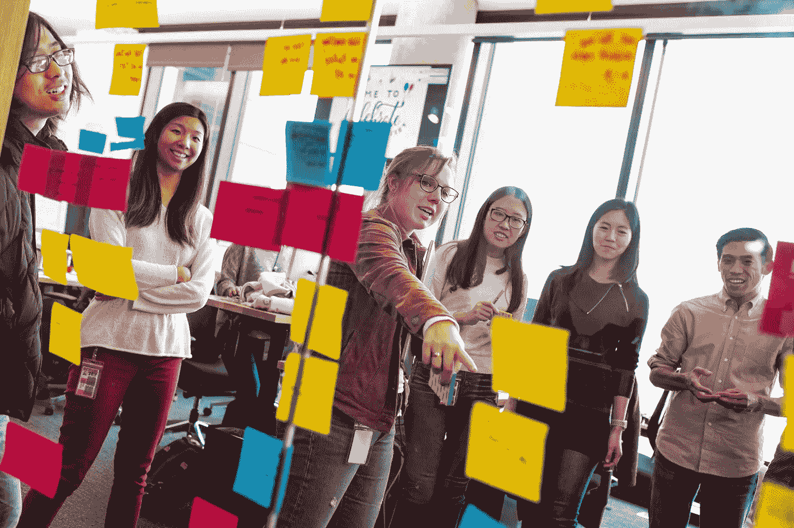

# 在 Pinterest 开始你的见习工程师生涯

> 原文：<https://medium.com/pinterest-engineering/launching-your-career-as-an-apprentice-engineer-at-pinterest-478eacba962f?source=collection_archive---------0----------------------->

阿尔贝托·卡雷拉斯·卡拉斯科|核心产品

2018 年，在专注于环境可持续发展十多年后，我决定开始一个新的职业生涯，即软件工程师。我在纽约参加了一个沉浸式软件开发课程，一年后，我前往 Pinterest 进行软件工程实习。这是我作为软件工程师的第一次职业经历，但我已经做好了准备，兴奋地继续学习，并准备搬到旧金山。

通过学徒制，来自非传统技术背景的工程师可以与工程师一起工作，并有机会成为全职工程师。因为学徒通常来自不同的领域或研究领域，他们给团队带来了独特而有价值的观点。

我在 Pinterest 的经历每天都激励着我(一个例子是 Pinterest 的[公司价值观](https://www.pinterestcareers.com/homepage#page_block_4_0)，其中包括诚信行事和把 Pinners 放在第一位)，提供了许多成长机会，并最终让我从学徒变成了全职软件工程师。在这里，我将在 Pinterest 的两个核心价值观框架内总结我的学徒生涯:赢或学和做一个所有者。

# 赢还是学

根据我在面试过程中提供的偏好，我被核心平台网络团队录用，该团队负责维护 Pinterest 的网络基础设施。我个人的工作重点是让 Pinterest 工程师能够进行更高效、更高质量的网络开发。

我的大多数项目都是大型的、关键的、团队合作的项目。当我开始时，最优先的任务之一是完成 web 服务器从 Python 到 Node.js 的迁移。我最初的许多任务都支持这种跨团队的工作，并帮助我熟悉我们基于文件的路由系统和在每个路由控制器中实现的可重用解决方案。

作为入职过程的一部分，我还处理了与[流程](https://flow.org/)问题相关的错误。这些较小的任务向我介绍了 Flow，这是一个 JavaScript 的静态类型检查器，它为我在整个源代码中提高流覆盖率做好了准备。

就像在任何新工作中一样，第一天的感觉相当强烈，这在很大程度上是因为我的队友的资历和明显的专业知识。然而，由于同事和导师的支持，我的冒名顶替综合症很快就消失了。在我推出未通过内部集成测试的代码后，一个难忘的时刻提前到来了。我的导师帮助我恢复提交，并与所有相关人员沟通以解决问题。我的导师在 Slack 的团队频道上分享了全部细节，而不是从我的团队获得负面反馈(或担心被默默评判)，每个人都庆祝我有机会学习！这是一个非赢即学的时刻，一个遇到的问题变成了一个很好的学习机会。

Pinterest 还提供了大量在工作中积极学习的资源。例如，所有的 web 工程师都可以参加每周的 Hangout & Refactor 会议。在这些会议期间，我们讨论最佳实践并结对编程来清理技术债务。Pinterest 还组织了一年一度的马拉松比赛，这是一场为期多天的黑客马拉松，工程师们可以在日常职责之外合作，开发一个想法或项目，并与公司其他工程师合作。这场马拉松让每个人都可以接触到 Pinterest 技术堆栈、产品和功能的不同部分。

# 成为主人

在我的热身任务之后，我开始着手两个高影响力的项目。首先是删除即将推出的 React 版本中不推荐使用的功能(例如，所有遗留上下文、不安全的生命周期方法、函数组件中的 defaultProps 和“Javascript:”URL)，并升级当前使用这些功能的所有 React 依赖项。

第二个项目是正在进行的改进和扩展 [Gestalt](https://pinterest.github.io/gestalt/#/) ，Pinterest 的 React UI 组件的开源集，用于我们在 UX &网站的可访问性一致性。对格式塔的贡献让我能够与其他团队和设计师在一个开源项目中合作，在一个更接近 Pinners 实际看到的层次上工作。

我的两个主要项目都要求我实践 Pinterest 的核心价值观之一:做一个所有者。为了让 Pinterest 成功，我将我的工作扩展到编码之外，做项目规划、写文档、审查大量代码、做内部技术演示(甚至写这篇博客！).

作为一名见习工程师，成功的关键因素是积极掌控项目和任务，让我的工作具有高能见度，并接受 Pinterest 的价值观。总的来说，这是一次很棒的经历，帮助我开始了我的软件工程生涯。

Pinterest 的学徒计划是我开始软件工程师职业生涯的一个独特机会。我得到了一位敬业的导师和一个由才华横溢的工程师组成的非凡社区的支持，他们分享了构建世界上第一个视觉发现引擎的兴奋，为每个人带来创造他们热爱的生活的灵感。