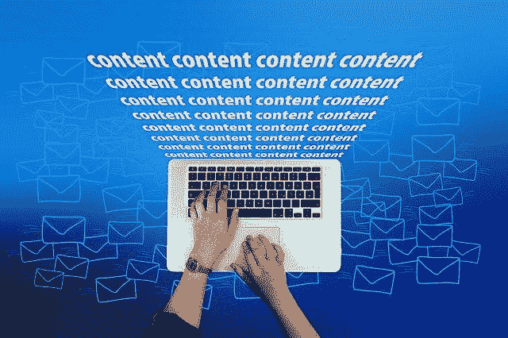
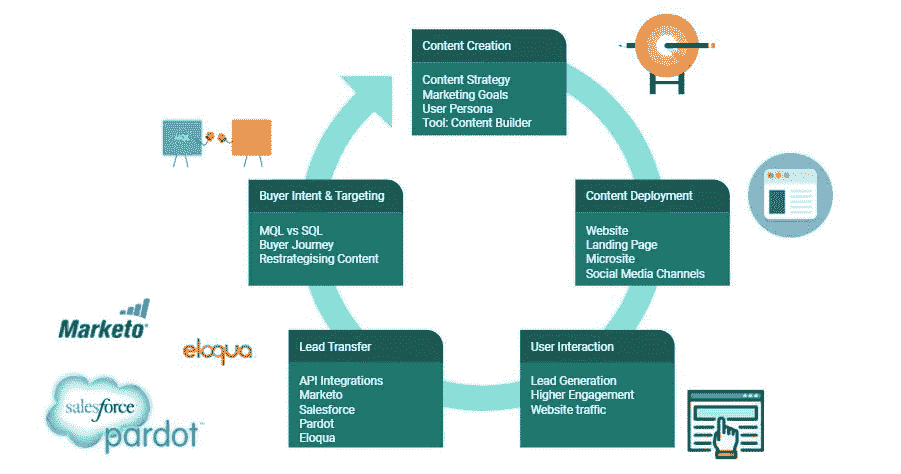

# 将你的内容与交互性分层是非常强大的。知道它的方式和原因。

> 原文：<https://medium.com/globant/layering-your-content-with-interactivity-is-powerful-know-how-and-why-of-it-ca1a6f761cb4?source=collection_archive---------1----------------------->

*内容，内容无处不在，这么多内容要吞噬！*

*注意力持续时间缩短导致客户参与暂停？*

[*Image by Gerd Altmann from Pixabay*](https://pixabay.com/users/geralt-9301/)

**这定义了一个现代营销人员的困境，他们正在努力构建真正吸引受众的内容，尤其是当每个潜在客户都被周围许许多多的内容轰炸时。在这种情况下，当务之急是将交互性引入到那些既不吸引人也不有趣，甚至可能没有教育意义的被动内容中。**

本文将带您了解交互式内容的重要性，您可以在内容中引入的各种层次的交互性，以及对交互式内容构思和创建过程的深入了解。

让我们更深入地探讨互动内容是如何解决现代营销人员的困境的？

**1)互动内容远比被动内容更吸引人:**“双向动态体验、实时对话、个性化互动、用户参与”是定义互动内容的一些术语。与此相反，被动内容仅仅意味着阅读一段*不会*促使用户参与的内容。想象一下，你正在阅读一个文本博客，而另一方面，你正在阅读同一个文本博客*，但是*融入了互动——互动视频、动画、AR/VR 体验、测验或投票？很有可能，你会更喜欢后者。

**2)吸引和教育的互动内容:**既然你知道有各种类型的互动内容可以吸引你的潜在用户，你可以从定义你的营销目标开始，然后创建不仅吸引你的观众，还能教育他们的内容。这是真的和相关的！研究表明，“93%的营销人员认为互动内容在教育购买者方面是有效的”*(来源:*[*【Smart Insights】*](https://www.smartinsights.com/customer-engagement/customer-engagement-strategy/using-interactive-content-digital-pr/)*)*这也极大地有助于获得客户忠诚度。

这种以双向对话为导向的内容有可能加快客户教育过程，也有助于营销人员深入了解买家的角色、买家旅程和购买意图。通过为与客户的互动创建最具资格的问题，营销人员可以非常清楚地了解销售线索——无论用户是销售就绪的销售线索，还是仍在等待营销人员参与、培训和培养的 MQL。

从上下文来看，*潜在客户的产生*可以被认为是互动内容营销最重要的方面。让我们看看它是如何发生的，为什么会发生？

**3)领先战略情报——统计和用户行为:**统计指出，“互动内容产生的转化率是被动内容的两倍。”*(来源:*[*woo rank*](https://www.woorank.com/en/blog/how-to-use-interactive-content-marketing-to-engage-and-convert-audiences)*)*问题是如何做到这一点？通过对用户行为的深刻理解。可关联的内容、有价值的体验和情感数据对于潜在客户的产生是最有力的，因为受众愿意提供他们的信息，以换取他们认为非常有价值的可下载的交互式白皮书/PDF 或视频。研究证实，由于数据的情感性或重要价值，当客户经历“沉浸式内容”的“个性化体验”时，他们更有可能分享自己的个人信息，从而导致潜在客户的培育和产生。*(来源:* [*单粒*](https://www.singlegrain.com/blog-posts/content-marketing/7-types-of-interactive-content-why-and-how-to-use-them/) *)*

现在，更有趣的是知道如何创建这样的互动内容，也产生线索？

互动内容工具:营销人员的线索生成平台

互动内容和销售线索的生成是齐头并进的。每一个互动内容工具都为营销人员提供了一个商机挖掘平台。因此，每一个门控互动内容都有一个*潜在客户生成模板*，允许营销人员收集潜在客户信息，以交换用户希望获得的有价值信息。这些潜在客户生成工具拥有*内容构建器或画布*，其界面类似于 powerpoint，但允许更大程度的创造性和个性化。其中的内容构建器允许添加图像、文本、信息图、动画和视频。不限于此，大多数交互式内容工具都能够创建交互式投票、评估、计算器、旅游指南和资源库，同时考虑到内容创建的其他相关方面，如屏幕显示或响应、搜索引擎优化以及与分析的集成。

举几个过去几年流行的交互式内容工具:

[Ion](https://www.ioninteractive.com/) ， [Contentools](https://contentools.com/) ， [SurveyMonkey](https://pt.surveymonkey.com/) ， [Thinglink](https://www.thinglink.com/) ， [Apester](https://apester.com/) ， [Snapapp](https://content.snapapp.com/snapapp-agencies/use-case-overview) 等等很多。

商业机构很容易将这些本地应用用于:

**a)重新利用组织的被动内容并创建互动内容。**

**b)在网站或微型网站上托管这些高度吸引人的内容，使其对访问者更具吸引力。**

**c)生成可以通过 API 集成转移到其他营销平台的销售线索。**

**5)交互式内容构思和创建的流程:**看看交互式内容构思和创建的流程，通常从定义 KPI 开始，一直到内容策略、内容构建、网站/登录页面/微型网站上的内容托管，直至生成和数据处理。没有必要提及的是，交互式内容工具允许 *API 与其他营销平台*集成，营销人员可以利用这些平台通过有意义的定向营销活动来影响他们的销售线索，引导客户沿着营销漏斗旅行。

互动内容营销的未来: 88%的营销人员表示，他们的静态内容中至少有 10%将在未来两年内实现互动。*(来源:* [*需求者*](https://www.demandgenreport.com/resources/research/the-campaign-confidence-gap) *)*

这是一个转变的好时机——让你的内容适度地吸引注意力和吸引人。作为营销人员，请注意静态内容，这些内容可以*相应地*转化为互动内容，为增加合格销售线索的数量铺平道路。

但在实现这一营销计划之前，保持你的网站用户就绪和用户友好，最重要的是你的分析工具准备读取大量的数据，因为通过将交互性分层到你的内容中，你肯定会增加你的网站流量数倍，因为它是压倒性的强大！快乐内容建设！

*点击* [*此处*](/globant/ai-powered-optimization-of-websites-steps-to-improve-customer-experience-with-ai-5c32c79e76e3#f943) *阅读 AI 如何辅助有效内容创作。*