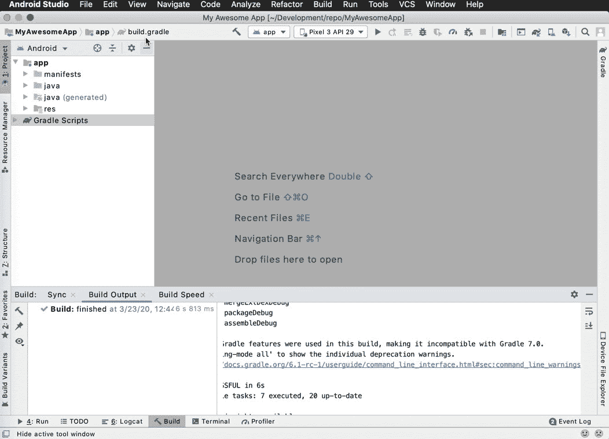
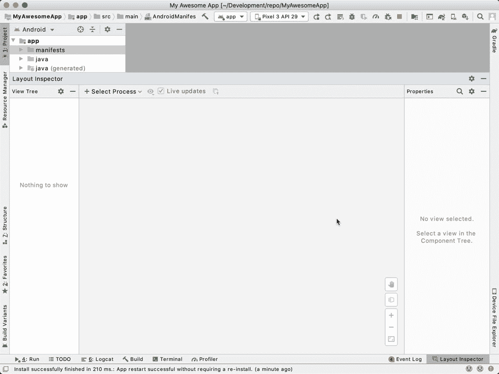
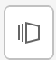
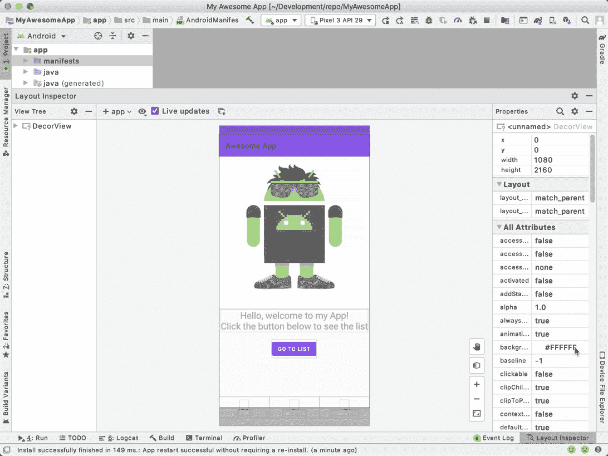
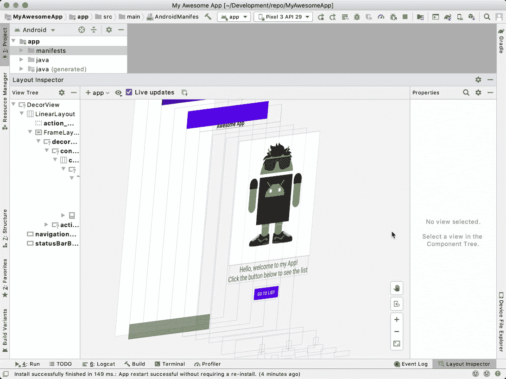
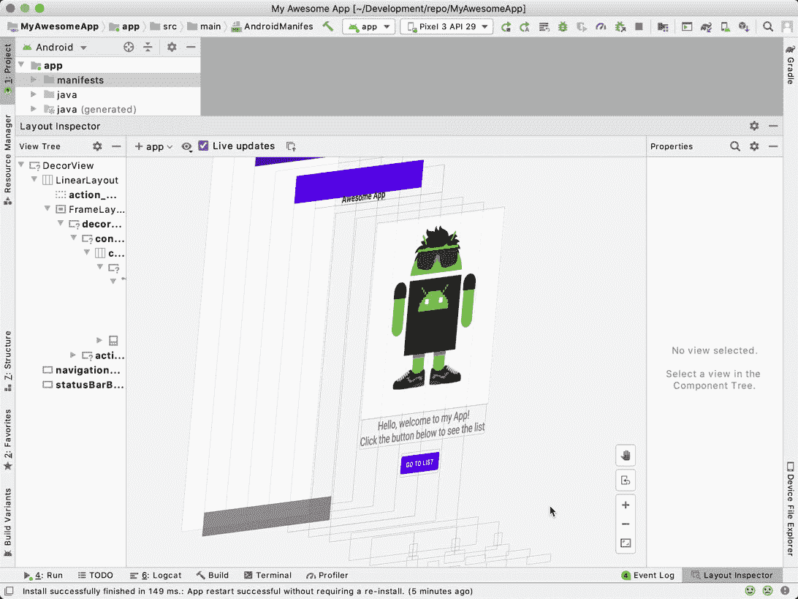
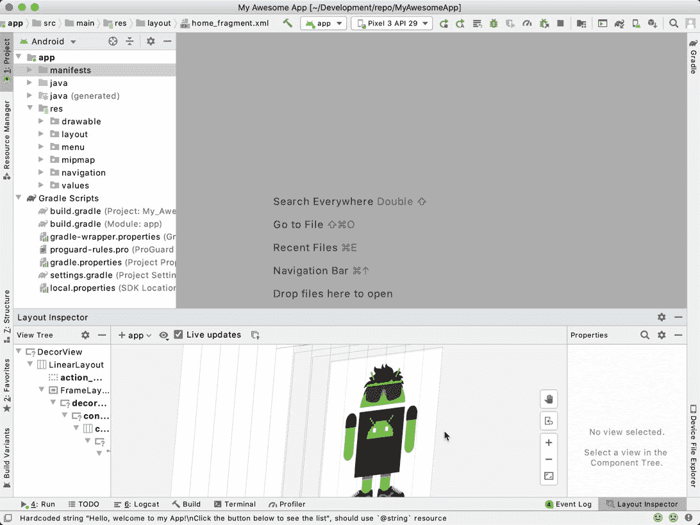
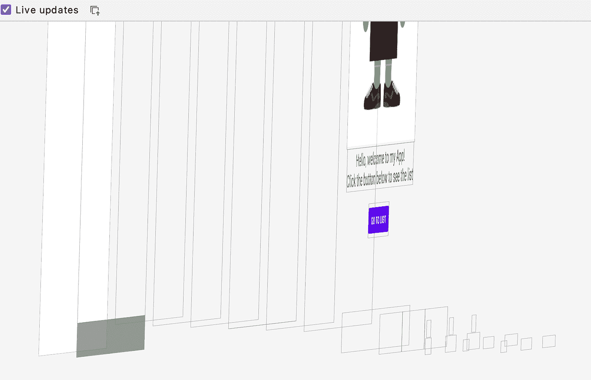
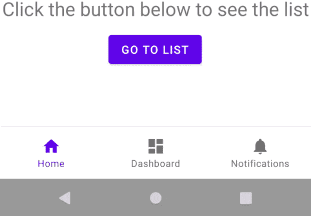

# 布局检查器

> 原文：<https://medium.com/androiddevelopers/layout-inspector-1f8d446d048?source=collection_archive---------0----------------------->

## 在 Android Studio 4.0+中调试 UI 层次结构

调试 UI 问题可能很棘手。Android Studio 4.0 附带了一个更新的*布局检查器*，可以让你以类似于 Chrome 开发工具的方式调试你的 Android 应用 UI(用户界面)。你可以跟着读，或者如果你愿意，你可以看录像。

布局检查器与您的设备或 Android 模拟器配合使用，并显示当前视图层次结构。这有助于查明问题并发现根本原因。与以前的版本不同，更新的布局检查器可以在 3D 透视图中显示视图层次结构，让您直观地看到视图是如何布局的。这样，您就可以检查层中的视图层次。它还显示了视图的所有属性，包括从其父视图继承的属性。

让我们看看最新版本的布局检查器是如何工作的。要打开布局检查器，点击**视图**并选择工具窗口菜单下的**布局检查器**。这将打开布局检查器窗口。

布局检查器仅显示正在运行的进程的 UI 层次结构。这意味着您需要连接到设备或模拟器上的可调试运行应用程序。有两种方法可以做到这一点:

*   如果你没有正在运行的进程，连接到一个设备或者启动一个 [Android 模拟器实例](https://developer.android.com/studio/run/emulator)，点击 **run** 启动应用。
*   如果您有正在运行的应用程序进程，请点击**选择进程**，选择您的运行设备，并从所选运行设备下的列表中选择您的运行应用程序。

选择应用程序流程后，布局检查器会创建当前 UI 层次结构的快照。如果您选择**实时更新**选项，当您与设备上的应用程序交互时，快照会动态更新。

此版本的布局检查器类似于以前的版本，但提供了更多功能。首先，布局检查器可以用两种方式显示 UI 层次结构:通常的 2D 轮廓格式，或者称为*旋转模式*的 3D 视图。

单击旋转按钮可以在 UI 层次的 2D 视图和 3D 视图之间切换。单击旋转按钮在两种模式之间切换。当您处于旋转模式时，您可以旋转 UI 层次的图像。旋转有助于您了解视图的布局。请注意，旋转仅适用于 API 级别为 29 及以上的设备。

您也可以选择一个视图并右键单击以仅显示其子视图。

同样，您可以显示选定视图的父视图。

右边的窗格显示了所选视图的所有声明的和继承的属性。通过单击任何已声明属性下方的链接，可以导航到布局的相应 xml 文件。与旋转功能一样，这仅适用于运行 API 级别 29 或更高的设备。

使用布局检查器，您还可以载入新的设计，并将其与您当前的 UI 进行比较。

要加载设计，点击**加载覆盖**并选择一个设计。图像加载后，您可以更改覆盖的 alpha 值，以查看当前布局和设计之间的差异。

# 运行中的布局检查器

到目前为止，我们已经看到了布局检查器是如何工作的，现在让我们看看它如何帮助解决应用程序问题。这里我们有一个简单的示例应用程序，它由一个包含一些静态文本内容和一个图像的片段组成。

如果你想边读这篇文章边尝试，先按照下面的步骤。

1.  打开 Android Studio 4.0，从文件菜单中选择新建项目。
2.  选择底部导航活动，单击下一步，然后单击完成。
3.  替换 [activity_main.xml](https://gist.github.com/yenerm/9a07014e71a9a9df4c0c72bd615d0671) 和 [fragment_home.xml](https://gist.github.com/yenerm/b0b84304fa57e8c9f99433eb489eba26) 的内容。
4.  替换 [HomeFragment.kt](https://gist.github.com/yenerm/7418d98137118d1e96f2e655346c54b4) 的内容。

当你运行这个应用程序时，你会看到一个可爱的 Android——但是少了点什么:底部的导航标签。查看布局文件，我们可以验证底部导航视图是否存在，但不知何故它没有出现在屏幕上。

这看起来是一个尝试布局检查器的好机会！让我们运行应用程序并检查这个问题。连接到 app 进程后切换到旋转视图，发现 app UI 有问题。

我们首先看到的是工具栏被布置在 LinearLayout 内部，随后是导航主机。在它下面，你可以在最底部看到导航标签。看起来底部的条被推离了屏幕。

可能导航主机尺寸不对。尝试将导航主机的高度设置为“wrap_content”:

切换回布局检查器，您可以看到线性布局具有正确的大小，但是底部导航标签没有放置在正确的位置:

有不同的方法来解决这个问题。我们可以给导航主机和底部的导航标签增加布局权重，或者我们可以切换到使用约束布局而不是线性布局，但是切换布局超出了本文的范围。所以让我们添加布局权重:

这是结果:

瞧啊。现在，当我们运行应用程序时，一切都在正确的位置。

尝试布局检查器的新功能，让我们知道你的想法！我们总是希望听到你喜欢什么，以及你有什么问题或你想看到的功能。