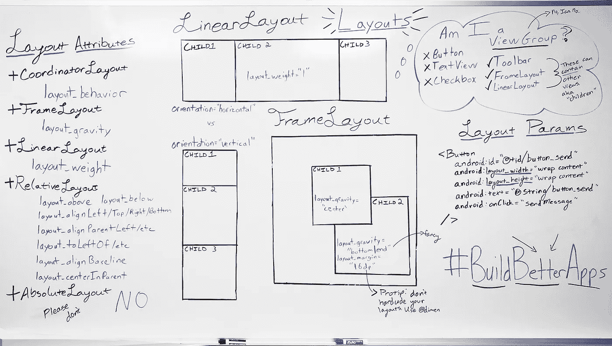

# 布局、属性和您

> 原文：<https://medium.com/androiddevelopers/layouts-attributes-and-you-9e5a4b4fe32c?source=collection_archive---------1----------------------->



This took a surprisingly long time to write out

那个古老的问题:

> 我应该使用什么样的布局？

了解你脑海中的画面(或者设计师给你的线框)如何转化为实际的布局和视图，是每个 Android 开发人员都可以从中受益的关键技能之一。

# 什么是布局？

只要浏览 developer.android.com 的布局，你会发现大量的类以“布局”结尾。他们都有什么共同点？它们都是 [*视图组*](http://developer.android.com/reference/android/view/ViewGroup.html?utm_campaign=android_series_layoutattributes_012116&utm_source=medium&utm_medium=blog) 的子类——一个 [*视图*](http://developer.android.com/reference/android/view/View.html?utm_campaign=android_series_layoutattributes_012116&utm_source=medium&utm_medium=blog) ，支持添加子视图(俗称子视图)。

如您所料，视图组的主要职责之一是布置这些子视图:选择每个视图的大小(“度量”阶段)，并将视图放置在视图组中(“布局”阶段)。

> **注意**:这并不是说这就是一个视图组的全部职责。它当然可以有自己的自定义行为，自己画东西，添加自己的孩子。例如 [*工具栏*](http://developer.android.com/reference/android/support/v7/widget/Toolbar.html?utm_campaign=android_series_layoutattributes_012116&utm_source=medium&utm_medium=blog) ，除了支持子视图之外，还有相当多的内置功能。

因此，如果您正在寻找一种特定的子视图布局方式，选择正确的布局将会起到很大的作用，这并不奇怪。错误的布局可能会使某个模式无法实现或执行得很糟糕，而另一个布局可能会简化事情。

# 布局 _ 属性

现在，就像任何视图一样，视图组可以使用 XML 属性，如 *LinearLayout* 的 *android:orientation* ，来改变它们如何布局它们的子视图，但这些是影响每个子视图的全局变化。为了逐个子视图进行更改，布局使用了一种不同的机制，即添加到**子视图**中的*布局 _* 属性。这些属性是不同的，因为 ***layout_* 属性是父视图组**的指令，而不是视图本身的指令。让我们从我写的[前一篇专业技巧](https://plus.google.com/+IanLake/posts/Hepj6KynZD5?utm_campaign=android_series_layoutattributes_012116&utm_source=medium&utm_medium=blog)中举个例子:

```
<android.support.design.widget.AppBarLayout>
  <android.support.v7.widget.Toolbar
    app:layout_scrollFlags="scroll|enterAlways" />
</android.support.design.widget.AppBarLayout >
```

如果你查看*工具栏*，你不会发现任何关于 *layout_scrollFlags* 的内容。如果你查看 [*AppBarLayout*](http://developer.android.com/reference/android/support/design/widget/AppBarLayout.html?utm_campaign=android_series_layoutattributes_012116&utm_source=medium&utm_medium=blog) ，你也不会找到任何东西。那些 *layout_* 属性实际上存储在 [*LayoutParams*](http://developer.android.com/reference/android/view/ViewGroup.LayoutParams.html?utm_campaign=android_series_layoutattributes_012116&utm_source=medium&utm_medium=blog) (具体来说，在本例中是 [*AppBarLayout。LayoutParams*](http://developer.android.com/reference/android/support/design/widget/AppBarLayout.LayoutParams.html?utm_campaign=android_series_layoutattributes_012116&utm_source=medium&utm_medium=blog) 子类)。当附加到父视图时，每个视图都有自己的 LayoutParams，作为父视图组想要跟踪的基本内容的存储位置。默认情况下，这只是一个宽度和高度(您几乎在每个视图中都可以看到的 *layout_width* 和 *layout_height* )，但是每个视图组都有机会在它们自己的 LayoutParams 子类中声明新的属性(如文档中的[所述)。](http://developer.android.com/guide/topics/ui/declaring-layout.html?utm_campaign=android_series_layoutattributes_012116&utm_source=medium&utm_medium=blog#layout-params)

> **注意:**这也是为什么从 XML 膨胀视图而不包括父视图(即，在[*layoutinflate . inflate()*](http://developer.android.com/reference/android/view/LayoutInflater.html?utm_campaign=android_series_layoutattributes_012116&utm_source=medium&utm_medium=blog#inflate%28int,%20android.view.ViewGroup,%20boolean%29)*)*是一个可怕的想法的首要原因——没有任何父视图，就没有人来解析和创建正确的 *LayoutParams* 对象，实际上**意味着所有这些属性都被丢弃了** —可能不是您想要的。

# 常见的 Android 布局

仅仅了解文档中解释的 *LayoutParams* 和 *layout_* 属性可能足以帮助您选择正确的布局，但是快速总结一下也无妨。

## 线性布局

[*LinearLayout*](http://developer.android.com/reference/android/widget/LinearLayout.html?utm_campaign=android_series_layoutattributes_012116&utm_source=medium&utm_medium=blog) 人生有一个目标:把孩子排成单行或单列(取决于其[*Android:orientation*](http://developer.android.com/reference/android/widget/LinearLayout.html?utm_campaign=android_series_layoutattributes_012116&utm_source=medium&utm_medium=blog#attr_android:orientation)是[横](http://developer.android.com/reference/android/widget/LinearLayout.html?utm_campaign=android_series_layoutattributes_012116&utm_source=medium&utm_medium=blog#HORIZONTAL)还是[竖](http://developer.android.com/reference/android/widget/LinearLayout.html?utm_campaign=android_series_layoutattributes_012116&utm_source=medium&utm_medium=blog#VERTICAL))。

然而，即使只有一个焦点，它仍然有一个锦囊妙计，即 [layout_weight](http://developer.android.com/guide/topics/ui/layout/linear.html?utm_campaign=android_series_layoutattributes_012116&utm_source=medium&utm_medium=blog#Weight) 属性，该属性允许子元素扩展其大小以填充剩余的空间——如果您有几个 *wrap_content* 元素和其他几个需要尽可能多的空间的元素，这很有用。

## 框架布局

[*FrameLayout*](http://developer.android.com/reference/android/widget/FrameLayout.html?utm_campaign=android_series_layoutattributes_012116&utm_source=medium&utm_medium=blog) 与 *LinearLayout* 相比有很大的不同:这里所有的子元素都被绘制成一个堆栈——不管有没有重叠。对定位的唯一控制是 [*layout_gravity*](http://developer.android.com/reference/android/widget/FrameLayout.LayoutParams.html?utm_campaign=android_series_layoutattributes_012116&utm_source=medium&utm_medium=blog#attr_android:layout_gravity) 属性——将子对象推向一侧或在 *FrameLayout* 内居中。

## 相对布局

[*relative layout*](http://developer.android.com/reference/android/widget/RelativeLayout.html?utm_campaign=android_series_layoutattributes_012116&utm_source=medium&utm_medium=blog)远没有前面两个那么简单:一看 [*RelativeLayout。LayoutParams*](http://developer.android.com/reference/android/widget/RelativeLayout.LayoutParams.html?utm_campaign=android_series_layoutattributes_012116&utm_source=medium&utm_medium=blog) 显示了大量的属性，这些属性都集中在相对于 *RelativeLayout* 的边缘或中心的[定位子节点](http://developer.android.com/guide/topics/ui/layout/relative.html?utm_campaign=android_series_layoutattributes_012116&utm_source=medium&utm_medium=blog#Position)(实际上类似于 *FrameLayout* )，而且还相对于彼此——比如说，一个子节点 [*layout_below*](http://developer.android.com/reference/android/widget/RelativeLayout.LayoutParams.html?utm_campaign=android_series_layoutattributes_012116&utm_source=medium&utm_medium=blog#attr_android:layout_below) 另一个子节点。

这有一个非常非常强大的优势(将任意的孩子彼此关联起来)，但是[注意你的表现](https://www.youtube.com/watch?v=dB3_vgS-Uqo?utm_campaign=android_series_layoutattributes_012116&utm_source=medium&utm_medium=blog)！

## PercentFrameLayout 和 PercentRelativeLayout

作为[百分比支持库](https://plus.google.com/+AndroidDevelopers/posts/C8oaLunpEEj?utm_campaign=android_series_layoutattributes_012116&utm_source=medium&utm_medium=blog)的成员，[*Percent frame layout*](http://developer.android.com/reference/android/support/percent/PercentFrameLayout.html?utm_campaign=android_series_layoutattributes_012116&utm_source=medium&utm_medium=blog)和[*Percent relative layout*](http://developer.android.com/reference/android/support/percent/PercentRelativeLayout.html?utm_campaign=android_series_layoutattributes_012116&utm_source=medium&utm_medium=blog)添加到它们的名称中，并添加了基于百分比的尺寸和边距，允许您使用*layout _ width Percent = " 50% "*来代替猜测适当的 *layout_width* 必须是什么。

它们还包含一个最令人兴奋的特性:[纵横比支持](https://plus.google.com/+AndroidDevelopers/posts/ZQS29a5yroK?utm_campaign=android_series_layoutattributes_012116&utm_source=medium&utm_medium=blog)，使得只声明一个维度(高度或宽度)并基于一个固定的纵横比成为可能。即使一个维度是 *wrap_content* 或 *match_parent* 也是如此！

## 网格布局

[*GridLayout*](http://developer.android.com/reference/android/support/v7/widget/GridLayout.html?utm_campaign=android_series_layoutattributes_012116&utm_source=medium&utm_medium=blog) 在 2011的冰激凌三明治中被引入，但也作为其自身[支持库](http://developer.android.com/tools/support-library/features.html?utm_campaign=android_series_layoutattributes_012116&utm_source=medium&utm_medium=blog#v7-gridlayout)的一部分可用(以支持回到 API 7)。旨在将项目放置在任意行和列中，并支持与 LinearLayout 相同的权重，它允许您在很大程度上扁平化视图层次结构，同时避免一些影响 *RelativeLayout* 性能的复杂元素排列。

与大多数布局不同， ***GridLayout* 不要求每个视图都有 *layout_height* 和*layout _ width***——列和行(以及它们包含的子元素)根据各自的 [*对齐方式*](http://developer.android.com/reference/android/support/v7/widget/GridLayout.Alignment.html?utm_campaign=android_series_layoutattributes_012116&utm_source=medium&utm_medium=blog) 按需增长和收缩。我强烈建议阅读一下 [*GridLayout。LayoutParams*](http://developer.android.com/reference/android/support/v7/widget/GridLayout.LayoutParams.html?utm_campaign=android_series_layoutattributes_012116&utm_source=medium&utm_medium=blog) 文档和[博客文章](http://android-developers.blogspot.com/2011/11/new-layout-widgets-space-and-gridlayout.html?utm_campaign=android_series_layoutattributes_012116&utm_source=medium&utm_medium=blog)(注意它是在 *GridLayout* 获得 *layout_weight* 属性之前写的)如果你想深入研究这个组件。

## 坐标布局

[*coordinator layout*](http://developer.android.com/reference/android/support/design/widget/CoordinatorLayout.html?utm_campaign=android_series_layoutattributes_012116&utm_source=medium&utm_medium=blog)是 [Android 设计支持库](http://android-developers.blogspot.com/2015/05/android-design-support-library.html?utm_campaign=android_series_layoutattributes_012116&utm_source=medium&utm_medium=blog)的一部分，是 *FrameLayout* 的子类，因此继承了其使用 *layout_gravity* 来定位子对象，但也包含了一个 [*行为*](http://developer.android.com/reference/android/support/design/widget/CoordinatorLayout.Behavior.html?utm_campaign=android_series_layoutattributes_012116&utm_source=medium&utm_medium=blog) 的概念。

通过使用类上的 [*@DefaultBehavior*](http://developer.android.com/reference/android/support/design/widget/CoordinatorLayout.DefaultBehavior.html?utm_campaign=android_series_layoutattributes_012116&utm_source=medium&utm_medium=blog) 注释、使用 *layout_behavior* 属性或者使用 [*setBehavior()*](http://developer.android.com/reference/android/support/design/widget/CoordinatorLayout.LayoutParams.html?utm_campaign=android_series_layoutattributes_012116&utm_source=medium&utm_medium=blog#setBehavior%28android.support.design.widget.CoordinatorLayout.Behavior%29) 将*行为*附加到视图允许*行为*拦截底层视图之前的所有内容:度量、布局、嵌套滚动、触摸事件、对指定从属视图的更改以及窗口插入。

要深入了解行为，请查看用 CoordinatorLayout 行为 拦截一切的 [*帖子。*](/google-developers/intercepting-everything-with-coordinatorlayout-behaviors-8c6adc140c26?utm_campaign=android_series_layoutattributes_012116&utm_source=medium&utm_medium=blog)

# 布局，布局，布局

即使只有上面描述的几个布局，您也可以构建一个丰富的 UI，既高性能又易于维护。下一次你在纠结于一个特定的布局时，考虑后退一步，看看是否有更简单的方法来使用不同的布局，或者构建你自己的自定义布局(并承担由此带来的责任——并非无关紧要)是否是最好的方法。

无论哪种方式，都使用正确的布局和#BuildBetterApps 的正确的 *layout_* 属性

关注 [Android 开发模式集](https://plus.google.com/collection/sLR0p?utm_campaign=android_series_layoutattributes_012116&utm_source=medium&utm_medium=blog)了解更多！

