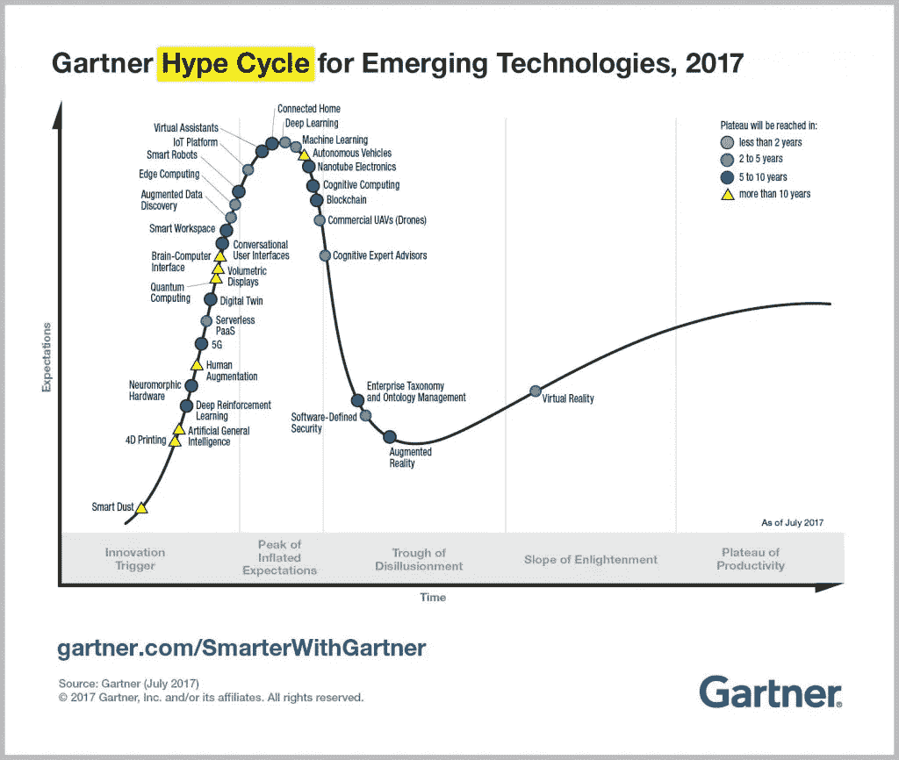

# 懒惰是我开始在谷歌上开发 Actions 的原因

> 原文：<https://medium.com/google-developer-experts/laziness-is-why-i-started-developing-for-actions-on-google-4685266883f6?source=collection_archive---------2----------------------->

## 你应该在谷歌上开发行动的两个原因

几年前，我接到一个纽约朋友的电话。他说，“放下你正在做的一切，开始为 iPhone 开发应用程序。”

我抗议道，怀疑自己是否有耐心用 Objective-C 这样的语言来开发。他回答道:

> “听我说，iPhone 将成为有史以来最大的东西，而现在他们的应用商店是空的。”

所以我付钱给苹果公司在他们的平台上开发，开发了我的第一个应用程序，但是我没有留下来。当时，我主要是使用 PHP 和 JS 为客户创建网站，并使用 Java 参与了许多项目。使用 Objective-C 进行深入研究看起来似乎只是为了在一个我不相信的平台上构建而做了大量的工作。我真傻。

我仍不时从他那里听到老一套的“我告诉过你了”，因为他是对的:那是为 iPhone 开发应用程序的时候了。不想编写 Objective-C 是一个蹩脚的借口。

所以当下一个“下一件大事”来临的时候，我会在那里。

脸书在 2007 年发布了他们的 API，我发现自己把所有的空闲时间都花在了破解平台和开发尽可能多的应用程序上。当脸书应用成为新闻时(突然之间，基本上每个公司都需要一个应用“只是为了留在游戏中”)，我能够利用我的经验和平台知识提供全天候的开发服务。

我创建程序和开发软件已经超过 25 年了，所以你可以想象 iPhone 应用程序商店并不是我错过的唯一“下一个大事件”，脸书应用程序也不是我抓住的唯一“大浪潮”。

我喜欢对新技术极客化，并且是一个早期采用者，所以我已经能够观察许多技术时尚或浪潮或任何你想叫它们来来去去的东西。我感到惊讶的既有我认为会成功但没有成功的，也有我认为不会持续但可能至少会和互联网一样长久的。

> 关键是，没有“下一件大事”是确定无疑的；如果你总是试图赶上下一波浪潮，你必须承担一些风险，并期待一些失败。

那么，为什么我认为你应该在谷歌上不停地进行黑客攻击，来度过你的空闲时间，获得经验和专业知识呢？

# 原因 1:人类懒惰。但是他们喜欢聊天。

作为一个企业家，我相信所有的人类都是懒惰的。

我们通常认为懒惰是消极的，但企业家知道事实并非如此。最好的、最惊人的、不可思议的、令人敬畏的技术进步都是由懒惰的力量创造出来的。

问问比尔·盖茨:

> “我选择一个懒惰的人去做艰苦的工作。因为一个懒惰的人会找到一个简单的方法去做。”

如果你看看人类和计算机(以及一般的技术)之间的交流史，你会发现懒惰的人是如何帮助计算机进步最多的。当我还是个孩子的时候，我哥哥用穿孔卡给计算机下命令，这个过程要花上几个小时，仅仅是让计算机完成最简单的任务。

当我开始编程时，键盘帮助我们做了和我哥哥的穿孔卡片一样的工作，但是更快更容易。然后某个“懒”的天才找到了一个方法，通过增加一个叫做鼠标的设备来改善人机交流界面。没过多少年，我们就有了触摸板。当然，触摸屏已经开始进一步革新我们与电脑互动的方式。然而，计算机仍然没有真正“理解”我们人类，我们需要帮助它们理解。

但这正在开始改变，随着技术演变为“人工智能”，我们越来越接近这种“理解”

机器学习(“AI”更准确的名称)允许计算机理解人类几千年来一直在做的最复杂的事情之一:说话。我们现在可以和我们的电脑、电话、汽车、电视交谈……它们真的能理解！

由于所有的人都很懒(不仅仅是比尔·盖茨最好的员工)，总的来说，我们更愿意和我们的技术对话，而不是打字。有[的数据支持这一点](https://www.branded3.com/blog/google-voice-search-stats-growth-trends/)。

我相信，好的技术应该总是以对人们尽可能透明为目标，这样他们就会花更少的精力去使用它。

既然说话是我们主要的交流方式之一，那么谷歌上的行动——这一切都是为了让人机界面尽可能“有声”——将是“下一件大事”的良好候选

因为在某种程度上，它已经是了！

# 原因 2:现在是产生最大影响的时候了！

如果你在创业领域——或者只是了解最新动态——我敢肯定你已经厌倦了“机器人”这个词。在过去的一年里，感觉每个新的创业公司都与机器人有关，或者更准确地说，是对话式用户界面(CUI)。

但是当谈到技术趋势并决定是否加入时，我喜欢看看它在 [Gartner 炒作周期](https://en.wikipedia.org/wiki/Hype_cycle)中的位置。

对于那些不熟悉它的人来说，炒作周期是由美国研究、咨询和信息技术公司 Gartner 汇总的新技术的成熟度、采用和社会应用的可视化表示。炒作周期通过五个阶段跟踪技术趋势，从“技术触发”到“生产力平台期”，在这一阶段，技术被纳入主流，并有助于刺激未来的进步。

根据 Gartner 年 7 月[日](https://www.gartner.com/smarterwithgartner/top-trends-in-the-gartner-hype-cycle-for-emerging-technologies-2017/)的一份报告，CUI 处于技术触发阶段的末期，这意味着接下来是“膨胀预期的峰值”阶段…

([source](https://www.gartner.com/smarterwithgartner/top-trends-in-the-gartner-hype-cycle-for-emerging-technologies-2017/))

……而“膨胀期望的顶峰”阶段恰好是创业者/开发者/产品进入的最佳时机！

这是循环的过山车性质开始变得有趣的时候:当未来的专家被确定，当这个领域的未来传奇开始出现。

换句话说，现在采取行动的人将对新趋势产生重大影响，因为它将沿着周期继续下去。

你想成为他们中的一员吗？

你会给多少钱回到 1994 年和互联网早期，买 10 个域名以后再卖(如 insurance . com:3560 万美元，2010 年卖出；insure . com:1600 万美元，2009 年出售；hotels . com:1100 万美元，2001 年出售；sex . com:1300 万美元，2010 年售出——名单还在继续。

或者你可能想回到 2011 年，以 12 美元的价格买一些比特币？[你可能是这个 12 岁投资比特币的高中辍学生，现在 18 岁成为百万富翁。](https://www.cnbc.com/2017/06/20/bitcoin-millionaire-erik-finman-says-going-to-college-isnt-worth-it.html)

你认为我不听朋友的话，为早期的 iPhone 开发尽可能多的应用程序是愚蠢的吗？

我没有时光机，但我要说的是，谷歌[目录](https://support.google.com/googlehome/answer/7126338)的行动现在相当空虚。你可能是为它做“下一件最好的事情”的人之一。