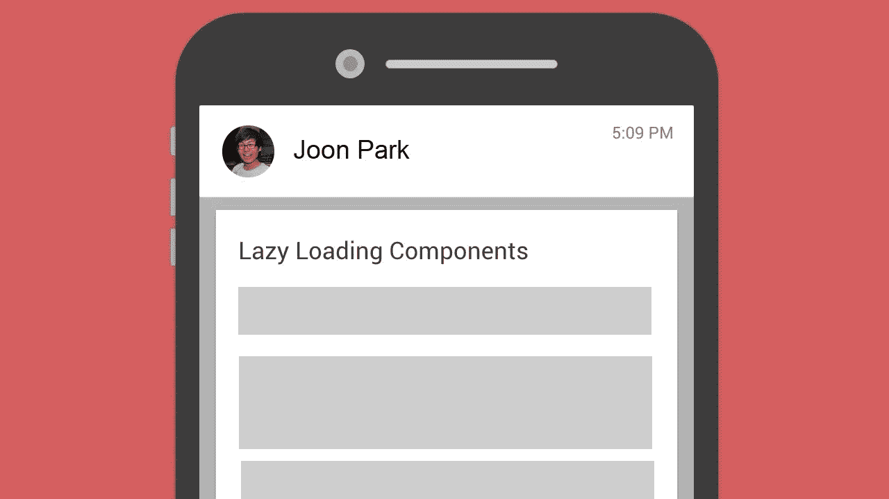
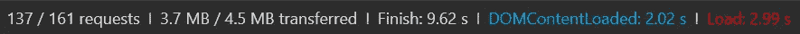
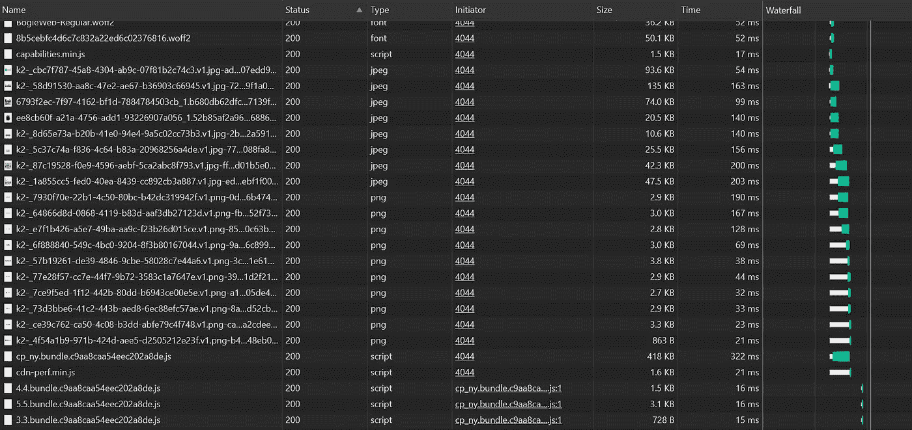
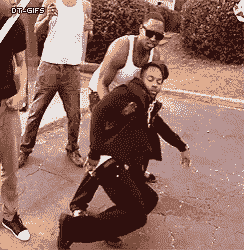
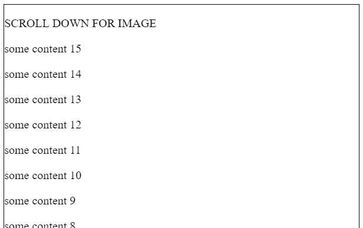
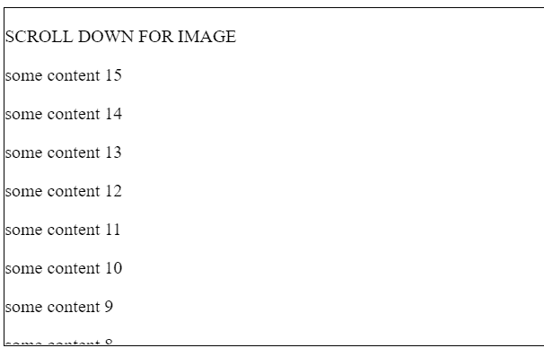
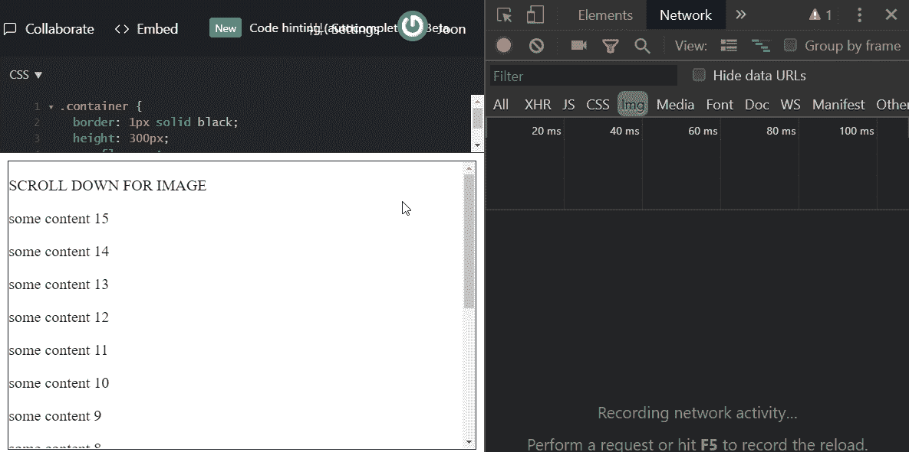

# 更新:这个故事是 2018 年的。从那以后可能发生了很大的变化，IntersectionObserver 在很大程度上不是延迟加载图像的推荐方法。

> 原文：<https://medium.com/walmartglobaltech/lazy-loading-images-intersectionobserver-8c5bff730920?source=collection_archive---------0----------------------->



# 使用 IntersectionObserver 延迟加载图像

对于现在的大多数网站来说，图片是网站性能的主要瓶颈。

尤其是对于电子商务网站，**图像构成了页面内容的大部分，并且往往尺寸很大**，通常每页在网络上总计达数兆字节的图像数据。

以[沃尔玛实验室](https://medium.com/u/c884135151a4?source=post_page-----8c5bff730920--------------------------------)的[首页](https://www.walmart.com/cp/home/4044)为例:


[https://www.walmart.com/cp/home/4044](https://www.walmart.com/cp/home/4044)

这是正在加载的图像数量的汇总:



137 张图片！网络上 80%以上的数据是图像。😬

现在看一下网络请求瀑布的片段:



在我们的具体例子中，代码分割模块代码的加载要晚得多，因为它首先需要主包`cp_ny.bundle`。然而，如果没有 18 个图像争夺带宽，主包可能会更快到达。



😵 [tenor.com](https://tenor.com/view/bruh-faint-gif-9862849) 😵

好吧好吧好吧。**那么我们该如何解决这个问题呢？你不能真的“修复”它，但是你可以做很多事情来优化图片在你的网站上的加载方式。在许多不同类型的优化中，例如不同的格式、压缩、模糊动画、CDNs 等。，我将介绍**“惰性加载”**。我将介绍如何使用 React 实现延迟加载的图像，但是只要您使用 JavaScript，实现(本质上)是相同的。**

以这个*超*简单反应`Image`组件为例:

```
class Image extends PureComponent {
  render() {
    const { src } = this.props;
    return ;
  }
}
```

它所做的只是接受一个`src` URL 作为道具，并使用它来呈现一个 HTML `img`元素。
[JSFiddle](https://jsfiddle.net/parkjoon/Lvhq8fap/)



下面是使这个图像组件延迟加载的基本步骤:
**1)** 最初不渲染图像源。
**2)** 设置图像与视口相交时的检测。
**3)** 当我们检测到图像将在视图中时渲染图像源。


## 步骤 1-最初不渲染任何图像

```
render() {
  return ;
}
```

## 步骤 2 —设置检测

```
componentDidMount() {
  this.observer = new IntersectionObserver(() => {
    // Step 3
  },
  {
    root: document.querySelector(".container")
  }); this.observer.observe(this.element);
}....render() {
  return  this.element = el} />;
}
```

**我在这里做了什么？**
**1)** 我给`img`元素添加了一个 [ref](https://reactjs.org/docs/refs-and-the-dom.html) ，这样我们就可以稍后更新`src` URL，而不会导致重新呈现。
**2)** 我创建了一个`IntersectionObserver`的新实例(稍后解释)。
**3)** 我告诉观察者使用`observe(this.element)`来“观察”我的图像元素。

什么是`IntersectionObserver`？听起来确实如此。这里是 MDN 的一个[快速总结:](https://developer.mozilla.org/en-US/docs/Web/API/Intersection_Observer_API)

> 交叉点观察器 API 提供了一种异步观察目标元素与祖先元素或顶级文档的视口的交叉点变化的方法。

乍一看，这似乎令人望而生畏，但他们实际上已经使 API 变得非常直观。在几个选项中传递了一个`IntersectionObserver`的实例。我们用的是`root`；这只是定义了我们将考虑的边界容器的 DOM 元素:我们想要检查我们的图像是否有交叉路径的容器。它默认为 visible viewport，但是我在 JSFiddle iframe 中将它显式地设置为一个容器，因为有一个我稍后将解释的特性不是为在 iframe 中使用而设计的。

`IntersectionObserver`是比`onScroll` + `getBoundingClientRect()`等传统方法更受欢迎的可见性检测方法，这是因为**实际的检测实现并不在主线程上运行。**然而，当一个交集被触发时，回调确实在主线程上运行，所以保持它的轻量级！

## 步骤 3-渲染图像！

现在我们需要为`root`和`target`元素之间的交集被触发时设置回调。在我们的例子中，它们分别是`.container` div 和`this.element` ref。

```
....this.observer = new IntersectionObserver(
  entries => {
    entries.forEach(entry => {
      const { isIntersecting } = entry; if (isIntersecting) {
        this.element.src = this.props.src;
        this.observer = this.observer.disconnect();
      }
    });
  },
  {
    root: document.querySelector(".container")
  }
);....
```

当发生交集时，回调会返回一个`entries`数组，这有点像触发交集的所有目标元素的快照。`isIntersecting`表示交叉口的方向。如果目标正在向根元素移动，那就是`true`。如果目标正在移出根元素，则为`false`。

因此，当我检测到图像元素与容器的底部边缘相交时，我手动设置图像`src`并清理不再需要的观察者。

## (秘密)第 4 步——看结果，跳一支快乐的舞


[JSFiddle](https://jsfiddle.net/parkjoon/sgz9rbnf/)


[tenor.com](https://tenor.com/view/dancing-dance-dancing-baby-baby-toddler-gif-5478110)

**等一下……**你在结果中注意到什么了吗？
让我为您加速滚动，节流网速:



Throttled Network Speed

由于我们只在用户已经到达应该看到图像的位置时才加载图像，因此**用户在下载**之前不能向下滚动并看到图像。通常，这对于拥有快速互联网的台式电脑来说不是问题，但是现在很多消费者都在手机上冲浪，有时，他们会被 3G 或者更糟的东西卡住……EDGE。😱

谢天谢地，`IntersectionObserver` API 提供了增加或缩小根元素(我们的`.container`元素)检测边界的能力。
我们需要做的就是在我们放置选项的地方添加一行代码来指定一个根容器:

```
rootMargin: "0px 0px 200px 0px"
```

`rootMargin`选项接受符合常规 CSS 边距规则的字符串。在我们的例子中，我们告诉它增加底部检测边界`200px`。这意味着当根元素*加上* `200px`的底部出现时(默认边距为`0`)将触发交集回调。



[JSFiddle](https://jsfiddle.net/parkjoon/ytfc7vh5/)

不错。因此，即使我们只滚动到第四个最后一行内容，图像也已经加载到了屏幕下方的`200px`。

## 等等。


[tenor.com](https://tenor.com/view/woah-whoa-wait-hold-on-hold-up-gif-9844131)

对于那些仔细检查 gif 的人来说，你会注意到当图像被加载时滚动条会跳跃。幸运的是，这很容易修复。问题是最初`0`高度的图像元素现在跳到了`300px`。您所需要做的就是通过给图像添加`height={300}`属性来设置一个固定的高度。

那么，我们在家庭部登录页面[沃尔玛实验室](https://medium.com/u/c884135151a4?source=post_page-----8c5bff730920--------------------------------)上看到了什么样的性能优势呢？根据网络速度、CDN 可用性、页面上的图像数量、它们的相交规则等，性能优势**变化很大**。换句话说，你最好自己在应用程序中实现这一点，并找出实际的好处。

如果你仍然对我们在[沃尔玛实验室](https://medium.com/u/c884135151a4?source=post_page-----8c5bff730920--------------------------------)看到的好处感到好奇，我们在预生产环境中进行的内部合成慢速 3G 测试显示，加载时间减少了 **32%，速度指数**减少了**22%，折叠次数**减少了 **17%。**

感谢阅读！😊