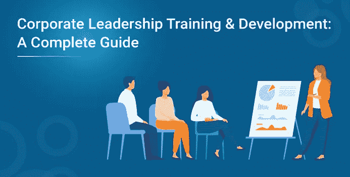

# 企业领导力培训与发展:完整指南

> 原文：<https://medium.com/edureka/leadership-training-development-a-complete-guide-8027c54420d1?source=collection_archive---------1----------------------->

**企业领导能力培训&发展简介**

虽然有人说“领导者是天生的”，但也有人相信“领导者是可以造就的”，无论事实如何。他们当然需要掌握一些技能，至少有资格被称为领导者。虽然，当这些技能被详细说明时，看起来会有新的发展。然而，它们确实能让你洞察什么是好的领导者。

领导力永远不会被称为一种情感，尽管它也可以被称为一种美德。而有些人也可能称其为一项可以多年掌握的技能。澄清什么是领导，什么不是领导。让我们来看看今天关于“领导力培训与发展”的讨论主题。

**企业为什么要投资企业领导力培训与发展？**

*   这个问题最简单的答案是增长。一个好的领导者总是着眼于成长，从他的经历和教训中学习，他可能在工作中学习，也可能不学习。虽然他学到的一些东西，他可能不需要在不久的将来，他可能记下的一些指针，肯定可以帮助他填补谁之间的差距，人们可以称之为一个好的领导者和一个伟大的领导者。
*   这个问题的答案 2 可能是为了填补领导空缺。在这个时代，组织肯定发现很难找到真正的领导者。证明他们所处地位的理由可能有很多。然而，这无疑激励他们投资领导力培训和发展。
*   激发领导力培训和发展投资的第三个也是最有说服力的原因是变革管理。正如他们所说，变化是唯一不变的。我们在这里谈论的变化可能是由代沟、远程工作者的崛起引起的，甚至仅仅是由于快速的全球化。

**一个好的领导者应该具备的一些最重要的技能/技能组合**

*   诚实
*   战略思维
*   完成
*   倾听
*   热情
*   热情
*   可靠性

根据一个领导者发现自己所处的许多方面和情况，这个清单当然可以不断地重复。尽管如此，并没有一个对所有人都适用的解决方案。在大多数情况下，企业领导力培训和发展计划有助于实现上述许多目标。

**企业领导力培训与发展计划如何才能更有效？**

*   **定义目标或结果**
    需要考虑的第一步是结果。一种落后的方法，总是会帮助你考虑一些可能会也可能不会影响你旅程的方面。
*   **包括开箱即用的方法**
    虽然我们中的一些人可能习惯于某种学习方法。当然，总是有一群人，当使用创造性的方法时，他们更喜欢学习某些方面。
*   **培养学习文化**
    培养学习文化的最佳方式是通过灌输知识共享。这当然可以通过奖励那些不懈努力发展技能的员工，并要求他们激励自己的同事效仿来实现。
*   **努力引入正确的领导力培训方法组合** 你可以添加的最重要的方法是:-
    —一对一学习
    —小组学习
    —自我指导学习
*   **制定明确的学习目标** 你的培训吸引特定的受众是很重要的。换句话说，公司的每个领导团队都应该接受培训，牢记清晰的结果。为了让公司培训公司和你的员工的课程更加有趣和充实。

企业领导培训和发展计划不仅提高了公司领导人的领导素质，而且还为新的和新兴的领导人让路。

如果你想查看更多关于人工智能、DevOps、道德黑客等市场最热门技术的文章，那么你可以参考 [Edureka 的官方网站。](https://www.edureka.co/blog/?utm_source=medium&utm_medium=content-link&utm_campaign=corporate-leadership-training-development-guide)

*原载于 2020 年 12 月 31 日*[*https://www.edureka.co*](https://www.edureka.co/blog/corporate-leadership-training-development-guide)*。*