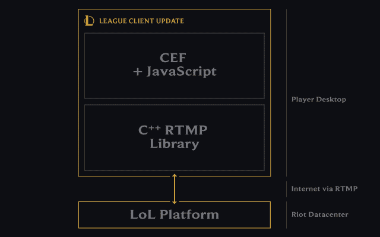
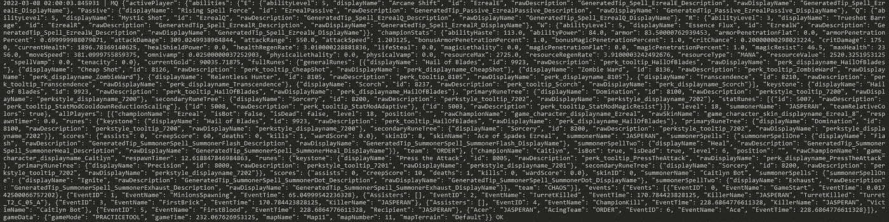
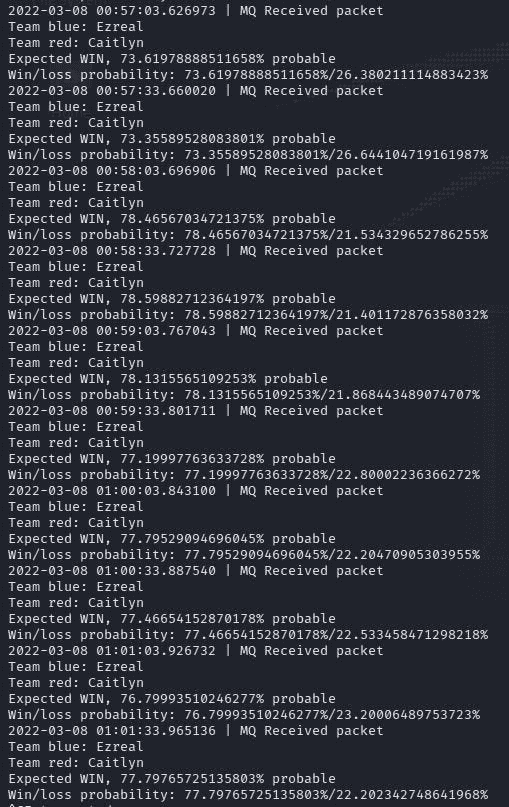
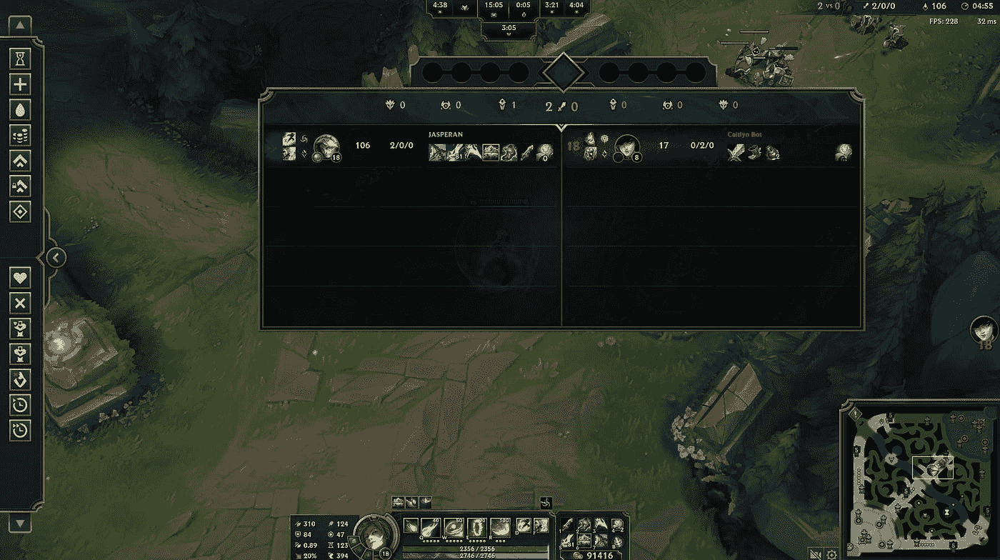

# 使用 Oracle 云基础设施的英雄联盟优化器:实时预测

> 原文：<https://medium.com/oracledevs/league-of-legends-optimizer-using-oracle-cloud-infrastructure-real-time-predictions-58aa36127db6?source=collection_archive---------0----------------------->

# 回顾和介绍

欢迎来到英雄联盟优化器系列第五篇！

在本文中，我们将测试我们在本系列文章中所做的所有工作。我们将看到我们创建的这些模型如何做出有意义的预测。简而言之，我们将在我的一个游戏中有一个英雄联盟伙伴，我们将能够看到该模型如何反映游戏在任一点的状态，并能够预测游戏的结果(无论是赢还是输)。所以，事不宜迟，让我们开始吧。

# 连接到实时客户端数据 API

为了提取实时游戏信息，我们需要从 Riot Games 访问实时客户端数据 API。

联盟客户端 API 包含一组协议，CEF (Chromium Embedded Framework)使用这些协议在英雄联盟进程和 C++库之间进行通信。



CEF 和这个 C++库之间的通信发生在本地，所以我们必须使用 localhost 作为我们的连接端点。您可以在此处找到关于此通信[的更多信息。](https://developer.riotgames.com/docs/lol)

您也可以参考第 4 篇文章，在那里我解释了我们在使用 Live Client Data API 时遇到的最有趣的端点。

对于本文，我们将使用以下端点:

```
# GET https://127.0.0.1:2999/liveclientdata/allgamedata
# Sample output can be found in the following URL, if interested. https://static.developer.riotgames.com/docs/lol/liveclientdata_sample.json
# This endpoint encapsulates all other endpoints into one.
```

当我们加入一个英雄联盟游戏时，联盟进程打开端口 2999。我们将利用这一点，我们将反复请求 localhost:2999 提取实时比赛信息，并将其合并到我们的 ML 管道中。我们的 ML 模型的结果将告诉我们是否可能赢或输。

# 体系结构

为了正确地发出请求，我们需要访问 localhost 作为调用端点。然而，我们可能不希望访问我们正在玩的本地计算机上的数据(因为计算机资源应该被用来获得最大的游戏性能)。为此，我创建了一个使用**消息队列**的架构，允许我们从互联网上的任何机器发出请求。

对于这个架构提案，我已经创建了两个文件，您可以在本系列文章的[官方资源库的 src/ section 下找到它们:live_client_producer.py 和 live_client_receiver.py](https://github.com/oracle-devrel/leagueoflegends-optimizer)

# 生产者

生产者负责向本地主机发出请求并存储它们，而自己不做任何预测。这背后的想法是让我们玩联赛的计算机尽可能地卸载并专注于比赛，而不增加由进行 ML 预测引起的额外复杂性(这可能占用相当多的资源)。

因此，我们这样声明我们的生产者的主要部分:

```
while True:
    try:
        # We access the endpoint we mentioned above in the article
        response = requests.get('https://127.0.0.1:2999/liveclientdata/allgamedata', verify=False)
    except requests.exceptions.ConnectionError:
        # Try again every 5 seconds
        print('{} | Currently not in game'.format(datetime.datetime.now()))
        time.sleep(5)
        continue # Send to RabbitMQ queue.
    if response.status_code != 404:
        to_send = build_object(response.content)
        send_message('live_client', to_send)
    time.sleep(30) # wait 30 seconds before making another request
```

我们需要考虑到，如果我们不在游戏中，我们会得到一个 ConnectionError 异常。为了避免这种硬件中断，我们捕捉异常并不断向端点发出请求，直到有用的东西出现。

为此，我选择了 **RabbitMQ 消息队列**，这是一个非常简单有效的解决方案，可以将我们的结果存储到一个队列中。这确保了以下几点:

*   从任何 IP 地址访问和使用队列中的数据，而不仅仅是本地主机
*   如果我们需要对我们的预测进行时间序列可视化，消息顺序是有保证的。因此，我们声明我们的消息队列。

```
_MQ_NAME = 'live_client'credentials = PlainCredentials('league', 'league')
connection = pika.BlockingConnection(
pika.ConnectionParameters(
    '{}'.format(args.ip),
    5672,
    '/',
    credentials))channel = connection.channel()
channel.queue_declare(queue=_MQ_NAME)
```

注意，在上面的代码片段中，我们需要创建一个 **PlainCredentials** 对象，否则从公共网络到生产者所在的 IP 地址的认证将会失败。[查看这篇文章](https://programmerall.com/article/92801023802/)，了解如何为我们新创建的用户设置虚拟主机、认证和权限。

此外，每个传入的对象都需要被处理并“转换”成 ML 管道所期望的相同结构:

```
# We remove useless data like items (which also cause quotation marks issues in JSON deserialization)
def build_object(content):
    # We convert to JSON format
    content = response.json()
    for x in content['allPlayers']:
        del x['items'] # delete items to avoid quotation marks
    built_obj = {
        'activePlayer': content['activePlayer'],
        'allPlayers': content['allPlayers']
    }
    content = json.dumps(content)
    content = content.replace("'", "\"") # for security, but most times it's redundant.
    print(content)
    return content # content will be a string due to json.dumps()
```

最后，我们声明一个函数，该函数以字符串格式接收**消息**，并将其插入消息队列，以备使用。

```
def send_message(queue_name, message):
    channel.basic_publish(exchange='', routing_key=queue_name, body='{}'.format(message))
    print('{} | MQ {} OK'.format(datetime.datetime.now(), message))
```

由于我们已经构建了消息队列生成器，如果我们在游戏中运行它，我们不断增长的消息队列将存储消息，即使没有人决定“消费”它们并进行预测。现在，我们需要通过**消费者**来完成这项工作。

# 消费者

在消费者中，我们将连接到 RabbitMQ 服务器。这个服务器不一定需要位于我们运行生产者模块的地方。它可以在任何地方，就像 Apache web 服务器一样。只是要确保生产者和消费者中的连接都指向 RabbitMQ 的同一个服务器 IP 地址。我们将使用我们在第 4 篇文章中训练的轻型模型(使用来自原始数据集的 50.000 行进行训练，因为使用更大的模型会产生更高的预测时间)进行预测:

```
# We load the AutoGluon model.
save_path = args.path  # specifies folder to store trained models
_PREDICTOR = TabularPredictor.load(save_path)def main():
    try:
        # localhost if the rabbitmq server is located in the same machine as the receiver.
        connection = pika.BlockingConnection(pika.ConnectionParameters(host='localhost', heartbeat=600, blocked_connection_timeout=300))
        channel = connection.channel() # declare queue, in case the receiver is initialized before the producer.
        channel.queue_declare(queue='live_client') def callback(ch, method, properties, body):
            print('{} | MQ Received packet'.format(datetime.datetime.now()))
            process_and_predict(body.decode()) # consume queue
        channel.basic_consume(queue='live_client', on_message_callback=callback, auto_ack=True) print(' [*] Waiting for messages. To exit press CTRL+C')
        channel.start_consuming() # we listen 24/7 for new messages in the live_client queue
    except pika.exceptions.StreamLostError:
        connection = pika.BlockingConnection(pika.ConnectionParameters(host='localhost', heartbeat=600, blocked_connection_timeout=300))
```

注意:如果您遇到“连接重置”错误，[请查看 pika](https://pika.readthedocs.io/en/stable/examples/heartbeat_and_blocked_timeouts.html) 上的这篇文档，它向 pika ConnectionParameters 对象添加了一些参数，以确保良好的连接。

每当我们使用队列中的一条消息时，我们通过调用 **process_and_predict** 使用我们的自动引导模型来预测结果:

```
def process_and_predict(input): json_obj = json.loads(input)
    team_color = str()
    for x in json_obj['allPlayers']:
        if x['team'] == 'ORDER':
            team_color = 'blue'
        else:
            team_color = 'red' print('Team {}: {}'.format(team_color, x['championName'])) # Timestamp given by the Live Client API is in thousands of a second from the starting point. timestamp = int(json_obj['gameData']['gameTime'] * 1000)
    data = [
        json_obj['activePlayer']['championStats']['magicResist'],
        json_obj['activePlayer']['championStats']['healthRegenRate'],
        json_obj['activePlayer']['championStats']['spellVamp'],
        timestamp,
        json_obj['activePlayer']['championStats']['maxHealth'],
        json_obj['activePlayer']['championStats']['moveSpeed'],
        json_obj['activePlayer']['championStats']['attackDamage'],
        json_obj['activePlayer']['championStats']['armorPenetrationPercent'],
        json_obj['activePlayer']['championStats']['lifeSteal'],
        json_obj['activePlayer']['championStats']['abilityPower'],
        json_obj['activePlayer']['championStats']['resourceValue'],
        json_obj['activePlayer']['championStats']['magicPenetrationFlat'],
        json_obj['activePlayer']['championStats']['attackSpeed'],
        json_obj['activePlayer']['championStats']['currentHealth'],
        json_obj['activePlayer']['championStats']['armor'],
        json_obj['activePlayer']['championStats']['magicPenetrationPercent'],
        json_obj['activePlayer']['championStats']['resourceMax'],
        json_obj['activePlayer']['championStats']['resourceRegenRate']
    ] # We build the structure as our ML pipeline expects it (column names, and order).
    sample_df = pd.DataFrame([data], columns=['magicResist', 'healthRegenRate', 'spellVamp', 'timestamp', 'maxHealth',
        'moveSpeed', 'attackDamage', 'armorPenetrationPercent', 'lifesteal', 'abilityPower', 'resourceValue', 'magicPenetrationFlat',
        'attackSpeed', 'currentHealth', 'armor', 'magicPenetrationPercent', 'resourceMax', 'resourceRegenRate'])
    prediction = _PREDICTOR.predict(sample_df)
    pred_probs = _PREDICTOR.predict_proba(sample_df) expected_result = prediction.get(0)
    if expected_result == 0:
        print('Expected LOSS, {}% probable'.format(pred_probs.iloc[0][0] * 100))
    else:
        print('Expected WIN, {}% probable'.format(pred_probs.iloc[0][1] * 100)) print('Win/loss probability: {}%/{}%'.format(
        pred_probs.iloc[0][1] * 100,
        pred_probs.iloc[0][0] * 100
    ))
```

这是让一切正常工作所需的最后一段代码。现在，我们可以进入一个游戏，运行我们的生产者代码(在我们玩联赛的机器上)和消费者代码(同时，虽然不是必须的)来获得游戏的实时预测。

# 设置

我们初始化生产者和消费者流程:

```
# producer must be run in the same server as where we're playing League
python live_client_producer.py --ip="RABBITMQ_IP_ADDRESS"
# in this case, receiver is running in localhost (in the same server as the rabbitmq server).
python live_client_receiver.py --ip="RABBITMQ_IP_ADDRESS" -p="MODEL_PATH"
```

# 游戏！

由于我使用轻量级模型来进行预测，并且训练数据只有 50000 行，所以我预计结果会大致不准确。因此，为了让事情变得明显并展示其功能，我选择在练习工具中与一个 AI 机器人进行一场联赛。这将允许我快速升级，并从练习工具中购买黄金物品，这将花费我大约 30 到 35 分钟的时间。

我选择了 Ezreal，买了一个标准的混合 AD-AP 版本，这在游戏后期特别好，因为冷却时间的减少会让你变成一个怪物，敌人很难用我的 e 来抓住我。

从生产者的角度来看，我们每 30 秒发出一次请求，并期待一次预测。这是我们存储的数据类型，然后从我们的消息队列中使用:



当我们开始游戏时，我们得到一个非常平均的 60/40 的胜率概率。这是因为如果我们保持距离，Ezreal 通常在早期游戏中优于 Miss Fortune。由于训练数据来自真正的大师+玩家，通常游戏开始时非常安静，玩家直到游戏中期都表现得非常安全。所以 Ezreal 以更大的胜率概率开局是有道理的。


在开始游戏后，因为我们在练习工具中，我选择了完全构建并从商店购买所有物品(标准的 AD-AP 构建)。


在下一个请求之后，HTTP 请求立即向模型提供我的当前统计数据，这些数据在游戏开始时严重不足。如果我们回顾一下我们的模型所考虑的统计数据，它们是:

```
# Code from where we built the model
sample_df = pd.DataFrame([data], columns=['magicResist', 'healthRegenRate', 'spellVamp', 'timestamp', 'maxHealth',
        'moveSpeed', 'attackDamage', 'armorPenetrationPercent', 'lifesteal', 'abilityPower', 'resourceValue', 'magicPenetrationFlat',
        'attackSpeed', 'currentHealth', 'armor', 'magicPenetrationPercent', 'resourceMax', 'resourceRegenRate'])
```

因此，对于特定时间戳，任何被视为四分位范围异常值的统计数据都会导致模型将其视为异常，并最终返回一个有利于获胜的预测。在我的建造中，我故意增加我的移动速度，攻击伤害，护甲穿透，生命，能力，攻击速度，最大法力值和魔法穿透百分比。为了让这一点更清楚，我还在我的匹配等级上增加了 17 级，这反过来增加了我的魔法抗性，护甲和最大生命值。这将“欺骗”我的模型，让它看到在我玩游戏的过程中，我所有的值都远远高于平均水平。

因此，预测的胜率飙升至 70%左右，并在比赛的剩余时间里保持不变:



由于我只考虑玩家统计，杀死我的人工智能对手并没有给我任何额外的获胜概率，如杀死，助攻，死亡，视觉得分等。在这个模型中没有被考虑。还要注意，进行预测的模型仅使用 50，000 行进行训练，而不是我们的**更大的**模型中的数千万行。当然，如果我们使用更大的模型，预测会产生更好的结果；我们在本文中没有这样做，因为预测时间会显著增加。



我把这个任务(有了这个系列文章的[官方知识库中的所有可用数据，这个任务应该会很有趣)留给你:尝试通过添加更多变量来改进当前的模型，比如:](https://github.com/oracle-devrel/leagueoflegends-optimizer)

*   杀死
*   死亡
*   助攻
*   视力评分
*   人群控制得分
*   玩家级别

欢迎您对资源库做出开源贡献！通过 Developer Relations @ Oracle 与我们一起进入开源世界永远都不晚。

我真的希望你喜欢阅读和学习这个系列的英雄联盟。我们在几个月内从零开始构建了一些真正令人惊叹的东西。

# 我如何开始学习 OCI？

请记住，你可以随时免费注册 OCI！您的 Oracle Cloud 帐户提供多项始终免费的服务和价值 300 美元的免费试用，可用于所有符合条件的 OCI 服务，最长 30 天。这些永远免费的服务在**无限期**内有效。免费试用服务可能会一直使用到您的 300 美元免费点数用完或 30 天到期，以先到者为准。你可以[在这里免费注册](https://signup.cloud.oracle.com/?language=en&sourceType=:ow:de:te::::&intcmp=:ow:de:te::::)。

# 加入对话！

如果你对 Oracle 开发人员在他们的自然环境中发生的事情感到好奇，请加入我们的公共休闲频道！我们不介意成为你的鱼缸🐠

# 许可证

由[伊格纳西奥·吉尔勒莫·马丁内兹](https://www.linkedin.com/in/ignacio-g-martinez/)[@贾斯珀兰](https://github.com/jasperan)撰写，由[艾琳·道森](https://www.linkedin.com/in/dawsontech/)编辑

版权所有 2021 Oracle 和/或其附属公司。

根据通用许可许可证(UPL)1.0 版进行许可。

详见[许可证](https://github.com/oracle-devrel/leagueoflegends-optimizer/blob/main/LICENSE)。