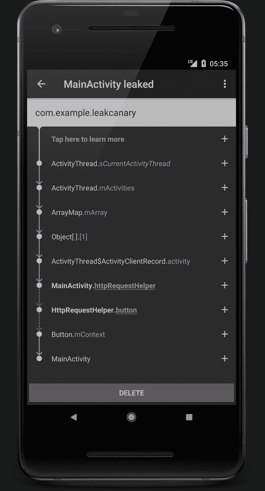
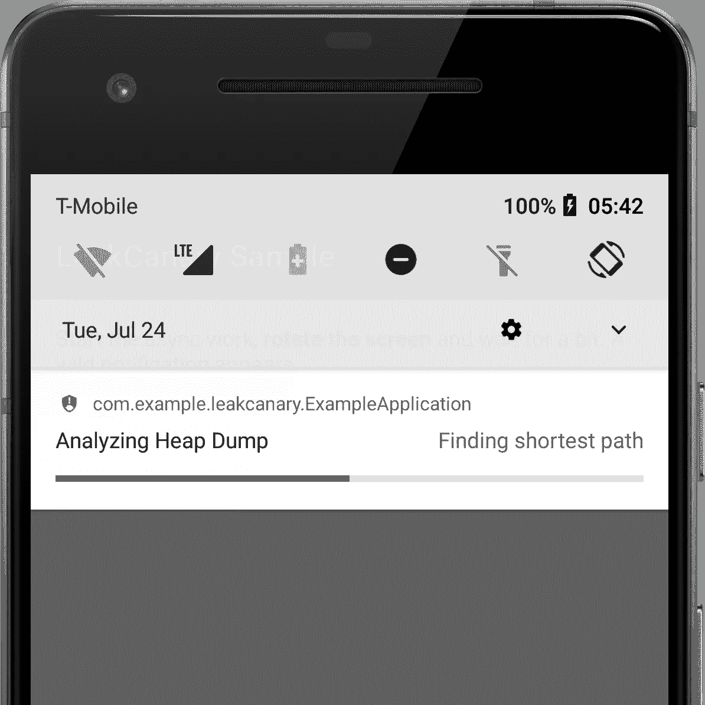
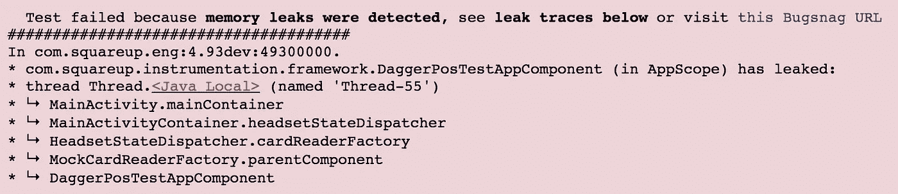
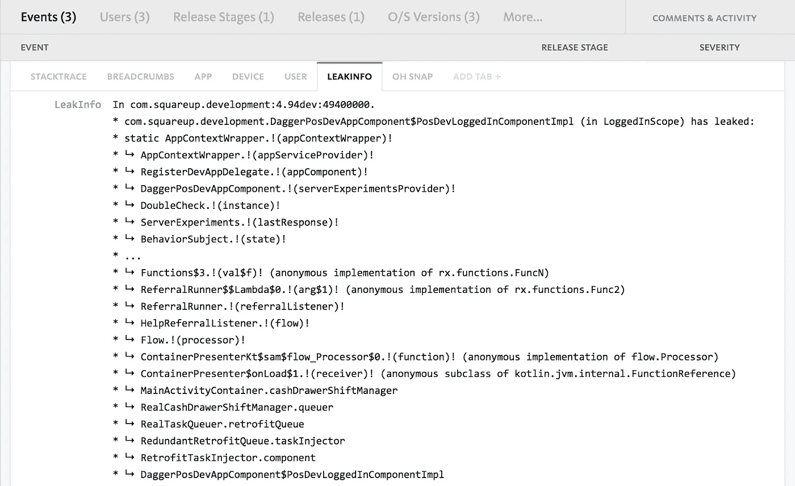

# LeakCanary 1.6🐤

> 原文：<https://medium.com/square-corner-blog/leakcanary-1-6-91fad513b5cf?source=collection_archive---------0----------------------->

我们刚刚发布了一个新版本的 [LeakCanary](https://github.com/square/leakcanary) ，它有几个新功能！

> 注意，我们已经行动了！如果您想继续了解 Square 的最新技术内容，请访问我们的新家[https://developer.squareup.com/blog](https://developer.squareup.com/blog)

Update your build.gradle

# 泄漏原因的重点

通过确定活动和视图实例等对象的预期**可达性**，LeakCanary 现在用红色下划线波突出显示了泄漏的可能原因。

我们还简化了泄漏跟踪 UI，并添加了上下文帮助。

This leak was caused by either MainActivity.httpRequestHelper or HttpRequestHelper.button

# 泄漏分析在前台服务中运行

分析服务现在作为前台服务运行，以支持 Android O+，并提供进度通知，这应该有助于每个人了解 LeakCanary 在任何给定时间点都在做什么。

默认情况下，我们还关闭了对保留堆大小的计算，以减少分析时间。

Analysis in progress

# UI 测试中的泄漏检测

在 Square，我们对每个 pull 请求运行 UI 测试(使用 [Firebase 测试实验室](https://firebase.google.com/docs/test-lab/)，我们希望确保我们可以防止新的内存泄漏被合并到 master。

LeakCanary 在每次 UI 测试结束时运行，并在检测到泄漏时报告测试失败。

UI Test failure in Square POS, the leak cause is in red.

要进行设置，请参见仪器测试中的[运行 LeakCanary。](https://github.com/square/leakcanary/wiki/Customizing-LeakCanary#running-leakcanary-in-instrumentation-tests)

# 向崩溃后端报告跟踪

我们希望跟踪漏洞，而不必构建后端。事实证明，泄漏跟踪与堆栈跟踪非常相似。`AnalysisResult.leakTraceAsFakeException()`使您能够将泄漏作为伪造的堆栈跟踪上传到您首选的崩溃报告程序。这里有一个关于 [Bugsnag](https://www.bugsnag.com/) 的例子:

replay(1).autoConnect() caused a leak

要进行设置，请参见[上传到服务器](https://github.com/square/leakcanary/wiki/Customizing-LeakCanary#uploading-to-a-server)。

# 更新 LeakCanary

这里是[完整的变更日志](https://github.com/square/leakcanary/blob/master/CHANGELOG.md)，请尝试一下并给我们反馈！