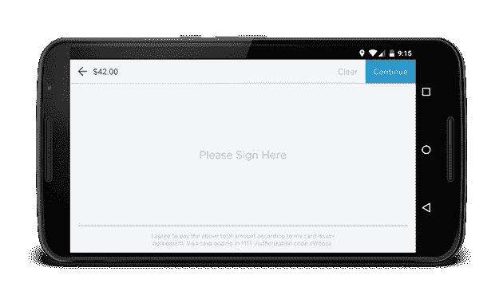

# LeakCanary:检测所有内存泄漏！

> 原文：<https://medium.com/square-corner-blog/leakcanary-detect-all-memory-leaks-875ff8360745?source=collection_archive---------0----------------------->

## Android 和 Java 的内存泄漏检测库。

*作者写的*[](https://twitter.com/Piwai)**。**

> *注意，我们已经行动了！如果您想继续了解 Square 的最新技术内容，请访问我们的新家[https://developer.squareup.com/blog](https://developer.squareup.com/blog)*

```
*java.lang.OutOfMemoryError
        at android.graphics.Bitmap.nativeCreate(Bitmap.java:-2)
        at android.graphics.Bitmap.createBitmap(Bitmap.java:689)
        at com.squareup.ui.SignView.createSignatureBitmap(SignView.java:121)*
```

# *没有人喜欢内存不足或崩溃*

*在 Square Register 中，我们[在位图缓存中绘制客户的签名](https://corner.squareup.com/2010/07/smooth-signatures.html)。这个位图是设备屏幕的大小，我们在创建它的时候遇到了很多内存不足(OOM)的问题。*

**

*我们尝试了几种方法，但都没有解决问题:*

*   *使用位图。Config.ALPHA_8(签名不需要颜色)。*
*   *捕捉 OutOfMemoryError，触发 GC 并重试几次(灵感来自 [GCUtils](https://android.googlesource.com/platform/packages/inputmethods/LatinIME/+/ics-mr1/java/src/com/android/inputmethod/latin/Utils.java) )。*
*   *我们没有想到从 Java 堆中分配位图。幸运的是，壁画还不存在。*

# *我们看待它的方式是错误的*

*位图大小不是问题。当内存快满时，任何地方都可能发生 OOM。这种情况在创建大对象的地方更常见，比如位图。OOM 是一个更深层次问题的征兆:内存泄漏。*

# *什么是内存泄漏？*

*一些对象具有有限的寿命。当它们的工作完成后，它们将被垃圾回收。如果一个引用链在一个对象的预期生命周期结束后仍将它保存在内存中，这将导致内存泄漏。当这些漏洞累积起来时，应用程序就会耗尽内存。*

*例如，在调用 Activity.onDestroy()之后，Activity、它的视图层次结构以及它们相关的位图都应该是垃圾可收集的。如果在后台运行的线程持有对该活动的引用，则相应的内存不能被回收。这最终会导致 OutOfMemoryError 崩溃。*

# *寻找内存泄漏*

*寻找内存泄漏是一个手动过程，Raizlabs 的 [Wrangling Dalvik](http://www.raizlabs.com/dev/2014/03/wrangling-dalvik-memory-management-in-android-part-1-of-2/) 系列对此有很好的描述。*

*以下是关键步骤:*

1.  *通过 [Bugsnag](https://bugsnag.com/) 、 [Crashlytics](https://try.crashlytics.com/) 或[开发者控制台](https://play.google.com/apps/publish/)了解 OutOfMemoryError 崩溃。*
2.  *尝试重现问题。您可能需要购买、借用或窃取遭受崩溃的特定设备。(并非所有设备都会出现所有泄漏！)您还需要找出是什么导航序列触发了泄漏，可能是通过蛮力。*
3.  *当 OOM 发生时转储堆([下面是如何做的](https://gist.github.com/pyricau/4726389fd64f3b7c6f32))。*
4.  *用 [MAT](http://eclipse.org/mat/) 或 [YourKit](https://www.yourkit.com/) 在垃圾堆周围翻找，找到一个应该被垃圾收集的对象。*
5.  *计算从该对象到 GC 根的最短强引用路径。*
6.  *找出路径中不应该存在的引用，并修复内存泄漏。*

*如果一个库可以在你进入 OOM 之前完成所有这些工作，让你专注于修复内存泄漏，那会怎么样？*

# *介绍 LeakCanary*

*[LeakCanary](https://github.com/square/leakcanary) 是一个开源 Java 库，用于检测调试版本中的内存泄漏。*

*让我们看一个猫的例子:*

```
***class** **Cat** **{**
**}**
**class** **Box** **{**
  Cat hiddenCat**;**
**}**
**class** **Docker** **{**
  **static** Box container**;**
**}***// ...*Box box **=** **new** **Box();**
Cat schrodingerCat **=** **new** **Cat();**
box**.**hiddenCat **=** schrodingerCat**;**
Docker**.**container **=** box**;***
```

*创建一个 RefWatcher 实例，并为其提供一个要监视的对象:*

```
**// We expect schrodingerCat to be gone soon (or not), let's watch it.*
refWatcher**.**watch**(**schrodingerCat**);***
```

*当检测到泄漏时，您会自动获得一个很好的泄漏跟踪:*

```
** GC ROOT static Docker.container
* references Box.hiddenCat
* leaks Cat instance*
```

*我们知道你正忙着写特性，所以我们使它非常容易设置。只需一行代码，LeakCanary 就会自动检测活动泄漏:*

```
***public** **class** **ExampleApplication** **extends** Application **{**
  @Override **public** **void** **onCreate()** **{**
    **super.**onCreate**();**
    LeakCanary**.**install**(this);**
  **}**
**}***
```

*开箱后，您会收到一个通知和一个漂亮的显示:*

**

# *结论*

*启用 LeakCanary 后，我们发现并修复了应用程序中的许多内存泄漏。我们甚至在 Android SDK 中发现了一些[漏洞。](https://github.com/square/leakcanary/blob/master/library/leakcanary-android/src/main/java/com/squareup/leakcanary/AndroidExcludedRefs.java)*

*结果是惊人的。我们现在从 OOM 错误中减少了 94%的崩溃。*

**

*如果你想消除 OOM 崩溃，现在就安装 leak canary！*

*[](https://twitter.com/Piwai) [## 皮埃尔-伊夫·里考(@皮瓦伊)|推特

### Pierre-Yves Ricau (@Piwai)的最新推文。安卓贝克@广场。巴黎/旧金山

twitter.com](https://twitter.com/Piwai)*