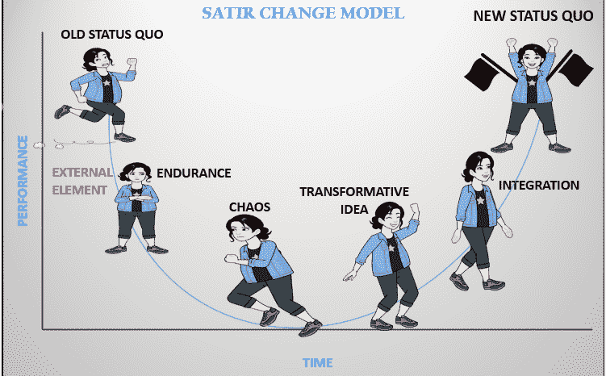
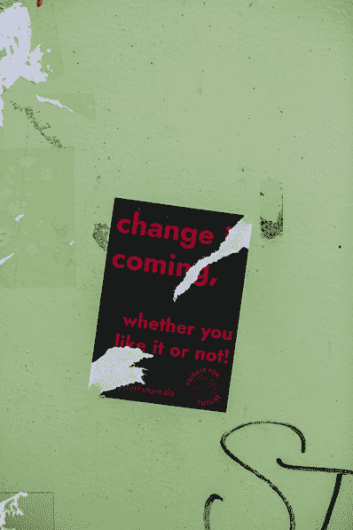
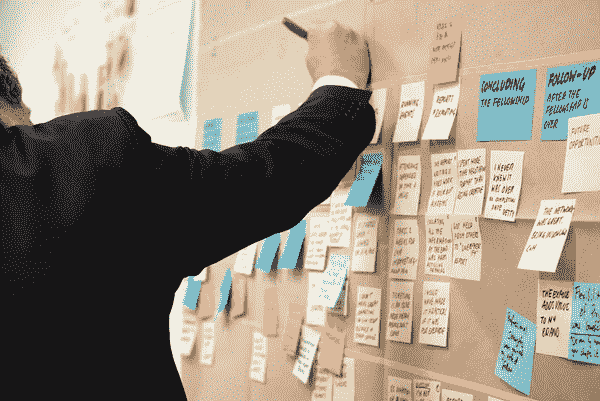
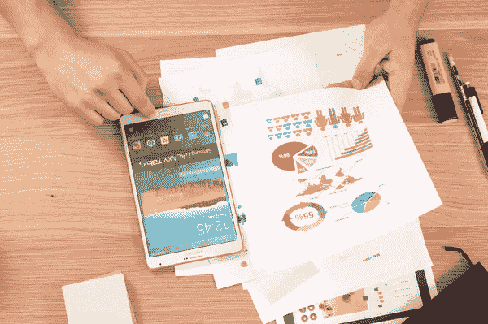

# 精益变革管理

> 原文：<https://medium.com/globant/lean-change-management-19cf47dc2979?source=collection_archive---------0----------------------->

*   **创新管理-**

“文化早餐吃策略”——彼得·德鲁克

帕扎尼湾。

想到转型这个词，你首先想到的是什么？也许是改变，恐惧，反抗，创新，策略，或者不确定性。这通常是因为人们在生理上不适应变化。我们的[大脑](https://ioncoaching.com/las-neurociencias-y-el-cambio/)是一个原始实体，仅仅是为了生存。这就是为什么人们在面对重大变化时会表现出抗拒、谨慎甚至恐惧，尤其是在涉及适应新环境的转变时。

鉴于变化的不确定性，萨提亚变化模型或萨提亚曲线旨在帮助我们关注转型期间的人员和现状的不同阶段:

“My own”

*萨提亚变革模型的各个阶段基于这样一个理念，即你总是可以通过对你寻求变革的事物进行新的整合来进行改进。*这些类型的模型让人们明白转型不是目的，而是一个不断进化的动态过程。我甚至把它比作一个需要根据生态系统来适应的生物。

现在，总的来说，我们会遇到大多数团队在这个过程中所涉及的阶段和行为，这就是为什么了解精益变更管理是重要的。那么，什么是精益变革管理呢？

¨Spiske, M.¨

精益变革管理(LCM)是一个反馈驱动的管理变革的框架，它由敏捷、精益启动、变革管理和设计思维的最佳元素组成。它主要基于反馈，促进共同创造，通过实验和学习实现持续改进，并有新的发现和对人的强烈关注，从而在 360°环境中创造价值。它影响到组织的所有层面，以便带来无论大小的变革，从数字或组织转型到敏捷转型。

这一切都始于一个小想法，并导致一个大的变化。

¨[Szczepanska](https://unsplash.com/@joszczepanska), J.¨

精益变革管理通常用于人们希望经历数字化或文化转型的复杂环境中。这个框架的实施是非常实验性的，并且允许迭代变化，它基于一系列支柱:

*   *创造愿景并理解变革的目的*:这在整个变革过程中非常重要，因为它是一个指南针。
*   *共同创造和内在激励:参与其中的人必须有决心和动力去合作实现变革。*
*   *对齐和影响度量:“如果你不能度量它，你就不能改进它”——彼得·德鲁克。衡量进步总是很重要的，这样才能知道什么在变得更好，什么是我们可以不做的。*

*使用* [*LCM*](https://leanchange.org/resources/lcm/) *周期:精益变革管理周期主要包括基于发现的持续实验，以实现微小的改进。*

@Firmbee.com

因此，当我们处理如此复杂的情况，以至于成为组织文化的专家不再能够保证成功的转型(很大程度上是因为在一个组织中从“A”到“B”涉及到大量的工作)时，考虑小而连续的步骤来实现我们的目标更为实际。这就是为什么采用 LCM 这样的框架是组织转型的关键。

不管我们寻求哪种类型的转型，LCM 都提供了实现预期目标的有用工具。

如果您想了解有关该主题的更多信息，我们邀请您查看以下链接:

> [**什么是精益变革管理？**](https://leanchange.org/lean-change-management-3/)