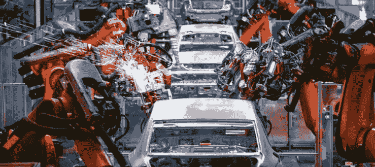

# 精益原则和质量改进

> 原文：<https://medium.com/globant/lean-principles-and-quality-improvements-6940adce5d7d?source=collection_archive---------0----------------------->

也许你听说过玛丽·近藤。她是一名组织专家，也是 KonMari Media，Inc .的创始人，她出版了一本全球畅销书《改变生活的整理魔法:日本的整理和组织艺术》。随意精益方法起源于日本，这与玛丽的专业知识有很大关系

**精益制造的起源和演变**

精益制造源于日本公司采用的旨在改善制造工厂的文化。他们设法改善工作和生产线的结果，尽管他们不是第一个试图优化公司生产和利润的人。

20 世纪初，最早的生产优化技术出自泰勒和亨利·福特之手。泰勒为劳动的科学组织奠定了基础，后来亨利·福特引进了第一个大规模汽车制造链。

**丰田制造系统**

19 世纪末，丰田集团的创始人丰田章男在日本提出了第一个精益制造思想。

丰田章男发明了一种装置，可以检测织机上的问题，并在断线时发出信号提醒工人。丰田章男的机器不仅自动化了以前的手工作业，而且还增加了机器错误检测能力的元素，“Jidoka”，一种具有人情味的机器。当一个元素有缺陷时，生产停止，他们避免产生错误。这一措施允许一名操作员控制多台机器，从而提高了生产率。

丰田喜一郎发展了这一哲学，并选择创造一种“创造的理想状态，在这种状态下，机器、设施和人一起工作来增加价值，而不产生浪费”。创造方法和技术来消除运营、生产线和流程之间的浪费。结果就是准时制(JIT)方法。

正是丰田英治提高了工人的生产率，为 JIT 系统增加了价值，并建立了丰田生产系统(TPS)。该模式基于仅生产客户要求的产品，并通过 SMED(一分钟换模)系统和丰富丰田系统的不同技术减少了换模时间。在丰田英治的支持下，大野泰一帮助建立了丰田生产体系，并为“创造事物”或“丰田模式”的丰田精神奠定了基础。

**什么是精益？**

*   这是一个过程改进的概念
*   价值是客户想要的质量。
*   只有在价值流动的情况下，才有可能在要求的数量和时间内交付客户想要的东西。
*   浪费阻碍了价值的流动。

为了让价值流动，有必要:

**1。从客户的角度识别价值。**价值由生产者创造，但由顾客定义。公司需要了解客户对其产品和服务的价值，这反过来可以帮助他们确定客户愿意支付多少钱。该公司必须努力消除其业务流程中的浪费和成本，以便实现客户的最优价格，从而为公司带来最高利润。

**2。绘制价值流图。**该原则涉及记录和分析生产特定产品或服务所需的信息流或材料流，目的是识别浪费和改进方法。[价值流图](https://searcherp.techtarget.com/definition/value-stream-mapping)涵盖了产品的整个生命周期，从原材料到处理。

公司必须检查循环的每个阶段是否有浪费。任何不增加价值的东西都必须被淘汰。精益思想建议将供应链整合作为这项工作的一部分。

**3。创造流动。**消除功能障碍，找出缩短交付周期的方法。这有助于确保从收到订单到交货的整个过程顺利进行。流动对于消除浪费至关重要。精益制造依赖于防止生产过程中的中断，并实现一套协调和集成的流程，在这些流程中，活动以恒定的流程进行。

**4。建立拉动系统。这意味着你只有在有需求的时候才会开始新的工作。精益制造使用拉动系统而不是推动系统。(也就是说，当收到新消费者的要求时，就开始了良好的生产，而不是根据预测来安排许多产品的开发)。**

**5。通过持续的流程改进**或改善来追求完美。精益制造基于不断追求完美的理念，这需要针对质量问题的根本原因，找出并消除价值流中的浪费。

**精干&敏捷**

精益和敏捷是互补的。两者都告知方法，如 Scrum，看板。

**共性:**

*   提高质量
*   加强学习
*   持续改进
*   赋予人们权力

**好处**

*   缩短交付时间。
*   质量的提高。
*   更大的容量。
*   降低成本，提高盈利能力
*   更多的客户满意度。
*   合作者的参与、责任、承诺和满意度

*注*:持续改进适用于任何类型的项目和团队。在我们的经验中，所有的团队都随着迭代显示出改进，但是那些敏捷实现差的团队受到的影响更快更深

**其他精益实践**

**吉多卡:(自动化)**

在软件开发中，类似于制造的机制提供了检测任何缺陷/故障并自动停止处理的能力

实现示例:持续集成。停下来，解决，继续。

**安东:(灯)**

它结合了 Jidoka 和可视板，因此开发团队可以检查流程是否在轨道上，并立即识别任何问题/偏差

实现示例:指示整个团队相关信息的可视仪表板:仪表板、散热器监视器、标记卡、阻塞、发布/集成日期

**指标**

开发流程最常见的度量是:交付时间、增值时间、非增值时间和周期时间

有几种工具可用于收集和分析指标

例如，JIRA 工具免费为他们提供了足够的灵活性

示例图表:

X 轴表示日期，Y 轴表示完成周期所用的天数(即从“准备开发”到“完成”)。

绿色的点表示用户故事已经“完成”，蓝色的线是这些数据点的平均值。

如果蓝色的线减少，这意味着周期时间随着迭代的进行而改进。

**持续改进**

它意味着持续执行改进组织过程的行动。

有一些众所周知的方法来实现它，例如:

**5S:** 清除、组织、清洁、标准化、纪律

**改善:**选择问题，分析原因，确定行动，验证结果，标准化

**A3:** 背景、当前状况、目标状况、根本原因分析、实验、确认、跟进

**用成功案例解释精益实践:**

精益开发定义了软件开发的七个原则。

在我们的案例中，我们为一个拥有 20 多个团队(超过 500 名成员的团队)的重要航空公司客户实施了这些方法，在成熟度和周期时间方面取得了显著的改进

下面您将看到它们以及为每一个实施的**主要行动**:

**1。消除浪费:**

旨在从流程和产品中去除一切不会为客户增加价值的东西。

对以下几种价值进行分类很重要:

**附加值:**客户想要

**非增值但必要:**法律、法规或政策要求

**非增值:**废物

废物类型:

*   生产过剩:没有被要求的特性，多余的/不需要的编码。
*   等待:延迟/瓶颈，等待验证或确认，暂停代码审查。
*   交通:任务切换，过度多任务。
*   过度处理:没人阅读的文件/报告，不灵活的流程。
*   缺陷:缺陷发现得越快，减少浪费的可能性就越大。每个过程步骤都应该是防错和自检的。
*   杀手锏:返工、重写、重做、重新测试
*   清单:未完成的工作，没有代码的文档，没有合并的代码，没有测试的代码，没有部署的代码

实施示例:

*   BDD，三个朋友
*   早期测试，左移
*   精细的用户故事，增加的代码审查员
*   统一的内部/外部沟通渠道

**2。放大学习:**

这意味着从几个角度学习改进结果，比如团队成员的技能，以及客户对产品的反馈

实施示例:

*   结对编程
*   角落之间的知识转移(业务分析师、开发人员、质量控制)，角色转换，跟踪
*   简短的客户/开发会议团队，了解领域问题
*   根本原因分析

**3。尽可能晚的决定:**

把不可逆转的决定安排到最后负责任的时刻。避免长期计划(过于详细)。在没有完全理解业务需求的情况下，不要提交想法或项目。

实施示例:

*   故事映射
*   推广峰值和概念验证，以最大限度地减少不确定性

**4。尽快交付**

问题不是为什么团队想要快速交付，而是，是什么减缓了他们的速度。越早交付没有重大缺陷的产品，就能越早收到反馈，并整合到下一次迭代中

实施示例:

*   测试自动化:功能、CI/CD/配置
*   左移测试/早期测试
*   测试数据准备就绪

**5。授权给团队**

避免微观管理。让那些有知识和专长的人来做工作和决策。

实施示例:

*   授权/自主/所有权方面的工作
*   质量保证的再技能
*   建议解决方案，而不是询问方向/避免不必要的批准
*   根据复杂性增加代码评审批准者

**6。构建完整性于:**

通过系统组件作为一个平滑、紧密的整体协同工作的程度来衡量。确保组件匹配/配合良好

实施示例:

*   CI/CD
*   特征映射
*   合同测试
*   第三方集成

**7。看整体:**

避免影响整个产品的局部改进。大型系统开发将需要更多的组织一起工作，以及他们之间明确的关系

实施示例:

*   影响映射
*   跨团队的产品发现会议
*   指标收集和分析

**结果和跟进**

我们创建了一组导师，他们自愿跟进并推动每个团队基于精益原则的行动实施。

在行动的同时，我们测量了每个任务的周期时间，以及“阶段”之间的周期时间，以便测量开发流程、检测瓶颈和测量改进

此外，我们跟踪缺陷，以确保减少周期时间的行动不会影响交付的质量

在实现中立即发现的一件事是，用户故事越小(就故事点而言),实现动作的周期时间减少得越快

作为一个整体的持续改进，我们遵循了一个基于实验的组织框架，并提供了团队成员和高层管理的可见性，以及巨大的承诺和切实的成果

我们必须考虑到这是一个迭代的过程，它需要一个心态的改变，整个团队的参与，结果将逐步实现

**参考书目**

精益软件开发— *玛丽·波彭迪克/汤姆·波彭迪克*

精益思想— *詹姆斯·p·沃马克/丹尼尔·t·琼斯*