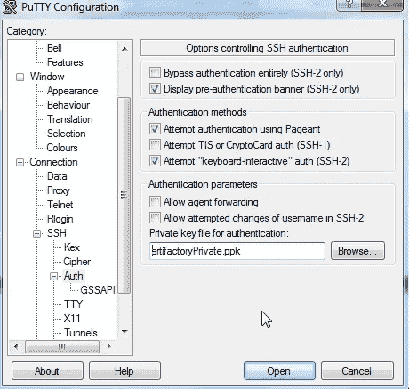
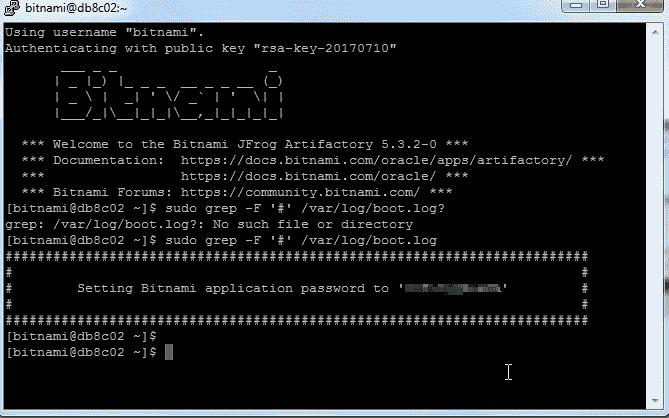
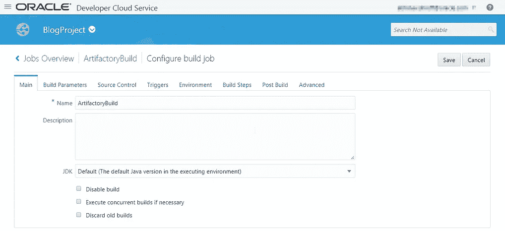

# 借助 Oracle 开发人员云服务跃入 JFrog 的 Artifactory

> 原文：<https://medium.com/oracledevs/leapfrog-to-artifactory-with-oracle-developer-cloud-service-7d42b8b5cb28?source=collection_archive---------1----------------------->

本博客帮助您了解使用 Oracle Developer Cloud Service 在 Oracle Cloud 上开发 JFrog Artifactory 的 DevOps。它将向您展示如何在 Oracle Compute Cloud 上安装 JFrog Artifactory 虚拟机，然后作为 Oracle Developer Cloud Service 上构建作业的一部分，如何将 Nodejs 应用程序的构建工件推送到 Artifactory 实例。


**使用的平台和技术堆栈**

*   **开发者云服务** — CI & CD 平台
*   **JFrog Artifactory** —神器库管理员
*   **计算云服务** — Oracle IaaS 产品，用于从 Oracle market place 安装 Artifactory VM。
*   **Node.js —** 用于开发构建的示例应用程序
*   **咕哝** —构建工具

**关于 Artifactory**

JFrog 的 Artifactory 是一个开源项目，创建它是为了使用二进制库加快开发周期。它是一个高级的存储库管理器，为团队创建了一个单一的地方来有效地管理他们所有的二进制工件。Artifactory 集成了所有主要的 CI/CD 和 DevOps 工具，为从开发到生产跟踪工件提供了端到端的自动化防弹解决方案。

**计算云服务**

[计算云服务](https://cloud.oracle.com/compute)是一种企业级基础设施服务，可提供快速调配的虚拟计算环境，以轻松迁移工作负载并以可预测、一致的性能、控制和可见性大规模运行它们。

**在 Oracle Compute 上安装 Artifactory**

先决条件:

*   拥有一个使用云计算云服务的 [Oracle 云帐户](http://cloud.oracle.com/tryit)。
*   访问 Oracle 市场
*   油灰和腻子的安装

**从 Oracle Market Place 获取 JFrog Artifactory 虚拟机:**

使用此 [url](https://cloudmarketplace.oracle.com/marketplace/en_US/homePage.jspx) 访问 Oracle Marketplace 并搜索 Artifactory。在显示搜索结果时，选择 Oracle Linux 映像，如下面屏幕截图中的光标所示。您也可以选择任何其他映像，但是为了这篇博客的目的，我使用的是 Oracle Linux 映像。现在点击 OL 6.7 上的 JFrog Artifactory 来选择虚拟机镜像。


单击推荐选项，您将导航到虚拟机页面，在该页面中，您必须单击“获取应用程序”按钮来触发在 Oracle 计算实例上安装此映像的过程。

注意:要实现这一点，您必须使用[https://cloud.oracle.com](https://cloud.oracle.com)登录 Oracle 云帐户，同时您还必须使用您的凭据登录 Oracle Marketplace。一旦你登录了


现在，您将能够在屏幕截图中的下拉列表中看到您已登录的云帐户域。选中复选框并单击安装按钮，如屏幕截图所示，以触发在 Oracle Compute Cloud Service 实例上安装 Artifactory 虚拟机的过程。


单击安装按钮，您将看到如下屏幕截图所示的屏幕。现在，要创建虚拟机实例并放置所需的配置，请使用页面上的“启动计算控制台”按钮转到计算控制台。


在计算控制台中，选择列出的图像，然后通过单击下一个箭头按钮，移动到向导中的下一个选项卡“形状”。

您可以根据自己的需求和感知负载选择形状。为了写博客，我选择了推荐的形状，如下图所示。


在 instance 选项卡中，上传 SSH 公钥。SSH 公钥和私钥可以使用名为 PuTTYGen 的工具生成。请确保将私钥保存在可访问的位置，因为需要它来为 Artifactory admin 用户重置密码。你可以从 http://www.putty.org/.[下载 PuTTY】](http://www.putty.org/)


在“网络”选项卡中，创建允许入站和出站权限的安全列表。您也可以稍后从计算控制台进行更改，方法是创建新的安全应用程序、规则和列表，并将其与安装了 Bitnami 的 Artifactory VM 的计算实例相关联。


在“存储”选项卡中，将选择的默认存储空间 10GB 更新为 Bitnami 推荐的 60 GB。

现在，单击“查看并创建”以创建安装了 Artifactory 虚拟机的计算实例。安装虚拟机并使其进入运行状态需要几分钟时间。可以在计算云服务控制台中检查虚拟机的状态。

**访问 Artifactory Web 应用程序的步骤:**

安装 Artifactory 虚拟机后，您可以导航到 Oracle Compute Cloud Service 控制台，以获取安装了 Artifactory 虚拟机的计算实例的公共 IP 地址，如下面的屏幕截图所示。

注意:由于安全策略，这些值已经被混淆。


现在启动 PuTTY，使用从计算云控制台检索的公共 IP 连接到 Artifactory 虚拟机。然后单击会话，并输入检索到的 Artifactory 计算节点的公共 IP 地址。

在类别菜单中选择连接下的数据。输入自动登录用户名“bitnami”，如下图所示。


现在在类别菜单中选择“连接”下的“认证”。单击 Browse 按钮，然后选择使用 PuTTYGen 为 SSH 连接生成的私钥。完成后，点击“打开”。

现在，您应该能够看到连接到 Artifactory 虚拟机的 SSH 会话终端，如下所示。



要检索用户名“user”的密码，要访问 Artifactory web 控制台，请在上面显示的终端中使用下面的命令。

```
sudo grep -F ‘#’ /var/log/boot.log
```

在浏览器中，使用链接:http:// <compute public="" ip="">导航到 Artifactory web 控制台，并使用从终端检索的“用户”用户名和密码登录。</compute>


下面的屏幕截图显示了 Artifactory 的 web 控制台。单击默认创建的样例存储库‘example-local-repo’来检查 curl 命令。您还必须通过导航到编辑配置文件页面从生成 API 密钥，如下面的屏幕截图所示。


注意:您还需要创建一个 Bitnami 帐户。请使用以下链接了解更多详情:

[https://docs . bitnami . com/oracle/FAQ/#使用 Oracle 云平台控制台](https://docs.bitnami.com/oracle/faq/%23using-the-oracle-cloud-platform-console)

**Oracle 开发者云服务构建作业配置:**

下面是 **ArtifactoryBuild** 的构建作业配置屏幕截图，它将构建 Nodejs 应用程序档案并将其上传到 Artifactory。

为构建作业选择一个名称。对于这个博客，我将其命名为“ArtifactoryBuild”。因为这是针对 Nodejs 应用程序的，所以可以将 JDK 保留为默认值。

选择已经上传了 Nodejs 应用程序代码的存储库，它将由 Grunt 构建以创建一个 zip 文件。



在 Environment 选项卡中，选择要用于构建的 Nodejs 版本。对于这个博客，我用的是 4.8.0


我们将使用执行 shell 构建步骤。作为构建步骤的一部分，首先我们将文件夹更改为项目文件夹‘mocha test’。我们将使用 npm 安装来安装所有需要的 Nodejs 模块，如下图所示。然后使用“grunt”命令为部署构建 zip 存档。

一旦在“MochaTest”中创建了 zip 文件，我们就使用 cURL 调用 Artifactory REST API 将生成的 zip 文件上传到 Artifactory 的“example-local-repo”中。下面是需要使用的 cURL 命令。

```
curl -x http://<Devloper Cloud Service proxy host>:<proxy port> -H ‘X-JFrog-Art-Api: <Artifactory API Key>’ -T <generated zip file to be uploaded> http://<public IP address of the Compute hosting the Artifactory VM>/artifactory/example-repo-local/
```


**样本值:**

要上传的生成的 zip 文件—nodeapl . zip

在执行构建作业时，您可以继续检查 Artifactory web 控制台，它将在“example-local-repo”存储库中列出“nodeappl.zip”文件，如下面的屏幕截图所示。


您也可以使用 API key 和 cURL 命令从 Artifactory 存储库中提取文件。

如果您再次运行构建，新版本的 zip 文件将存储在 Artifactory repo 中。


你可能仍然有一个问题:

为 Artifactory 配备专用计算节点有意义吗？

答案是，是的。它将是一个公共的存储库，用于存储您所有的定制或生成的工件，这些工件可以以受控和安全的方式全面下载。你可以用 Artifactory 做更多的事情。要了解更多关于 Artifactory 的信息，请使用此[链接](https://www.jfrog.com/artifactory/)。

编码快乐！

> 本文表达的观点是我个人的观点，不一定代表甲骨文的观点