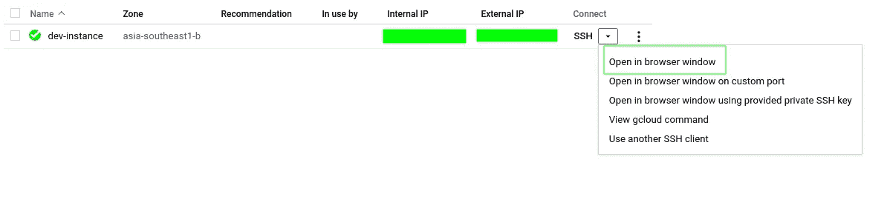

# Learn Google Cloud Platform (GCP) -Spring Boot Hello World

> 原文：<https://medium.easyread.co/learn-google-cloud-platform-gcp-spring-boot-hello-world-e02f5aec3e52?source=collection_archive---------6----------------------->

## Bagaimana menjalankan program java sederhana di Google Cloud Platform


Photo by [Leo Sagala](https://unsplash.com/@leosagala_?utm_source=medium&utm_medium=referral) on [Unsplash](https://unsplash.com?utm_source=medium&utm_medium=referral)

> Disclaimer : Materi ini saya pelajari dari [https://www.qwiklabs.com/](https://www.qwiklabs.com/) .
> 
> Untuk pemahaman yang lebih lengkap silahkan kunjungi [https://www.qwiklabs.com/](https://www.qwiklabs.com/) .

[***Google Cloud Platform***](https://cloud.google.com/) atau biasa disingkat GCP merupakan salah satu layanan cloud computing dari google. Ada banyak layanan yang terdapat pada GCP seperti Google AppEngine, Google BigQuery, Google Compute Engine, Google Cloud Storage, dll.

*Nah* , untuk artikel kali ini saya akan mencoba menjalankan program java sederhana menggunakan spring boot di GCP. Langkah-langkahnya dapat kamu ikuti seperti dibawah ini.

# **Create Compute Engine Virtual Machine Instance**

Tahapan pertama untuk memulai menjalankan program java sederhana menggunakan spring boot di GCP adalah membuat VM Instance. Bagaimana langkah-langkahnya?

*   Klik **Navigation Menu > VM Instances** .
*   Pada halaman **VM Instance** , Klik ***create*** *.*
*   Lengkapi form seperti dibawah.


Tampilan Form Untuk Membuat Instance

*   Setelah VM Instance berhasil dibuat, maka hasilnya seperti gambar dibawah.


Tampilan VM Instance yang sudah dibuat

# **Install Software and Configure**

Setelah proses diatas dilakukan maka kita dapat melakukan koneksi SSH ke VM instance yang telah kita buat seperti gambar dibawah.



Tampilan Untuk Koneksi SSH

Langkah selanjutnya tentu saja instalasi dan konfigurasi software. Detailnya bagaimana? Ikuti langkah di bawah ini.

*   Update Debian Package List

```
**sudo apt-get update**
```

*   Install Git

```
**sudo apt-get install git -y**
```

*   Install Java 8

```
**$sudo apt-get install -yq openjdk-8-jdk
$sudo update-alternatives --set java /usr/lib/jvm/java-8-openjdk-amd64/jre/bin/java**
```

*   Install Maven

```
**sudo apt-get install -yq maven**
```

*   Configure IP tables

```
**sudo iptables -t nat -A PREROUTING -p tcp --dport 80 -j REDIRECT --to-port 8080**
```

# **Configure VM and Run Application**

Setelah proses instalasi dan konfigurasi aplikasi, sekarang saatnya konfigurasi VM Instance yang kita buat, dan jalankan aplikasinya.

*   Clone Repository

```
**git clone https://github.com/sintongPanjaitan/Medium-Spring-Hello-World-Web.git**
```

*   Pindah ke project yang telah diclone

```
**cd ~/Medium-Spring-Hello-World-Web/**
```

*   Build the application

```
**mvn clean install**
```

Pastikan project telah berhasil di build seperti gambar berikut


Tampilan Project Berhasil Dibuat

*   Run the application

```
**mvn spring-boot:run**
```

Kita dapat mengakses dengan menggunakan external ip ketika melakukan create VM instance. Maka hasilnya sebagai berikut.


Tampilan Program Sederhana

*Nah,* sebenarnya ada banyak lagi fitur dari GCP yang dapat dimanfaatkan, mungkin akan saya bahas di lain kesempatan. Selamat mencoba :)

> Thanks to [https://www.qwiklabs.com/](https://www.qwiklabs.com/) for such a great tutorial and GDG Jakarta for giving me [monthly subscription](https://www.qwiklabs.com/my_account/credits) .