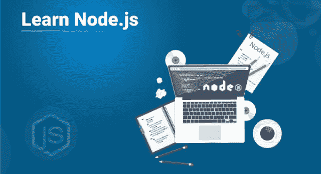
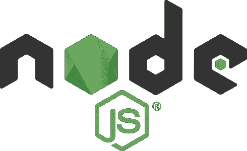
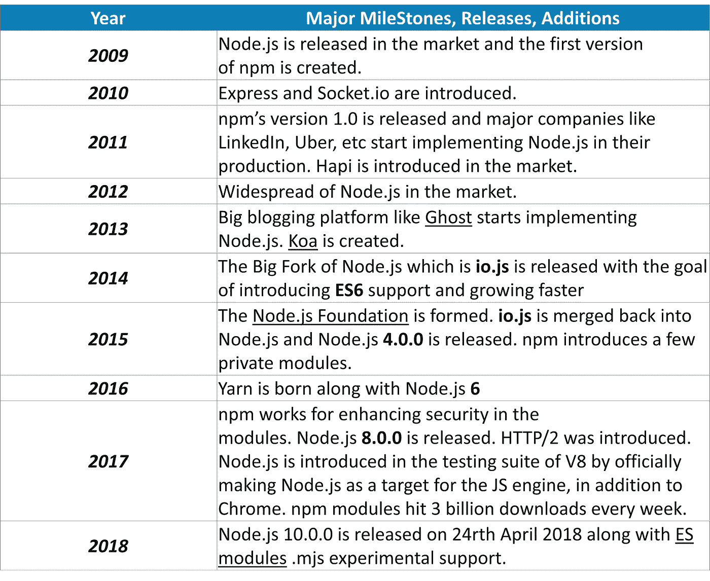

# 如何学习 Node.js？—初学者的完整路线图

> 原文：<https://medium.com/edureka/learn-node-js-b3a9c6fb632c?source=collection_archive---------1----------------------->

每当我们从任何技术开始时，你想到的第一个问题是，你应该从哪里开始？如果你是第一次接触 **Node.js** 并且对 Node.js 有同样的疑问，那么你已经偶然发现了正确的地方。在本文中，我将为您绘制一个路线图，帮助您学习 Node.js，同时列出一个全面的最佳资源列表，帮助您开始使用 Node.js。

下面是我将在这篇 learn Node.js 文章中介绍的路线图概述:

*   Node.js 简介
*   历史和版本
*   入门指南

1.  Node.js 架构
2.  安装 Node.js
3.  NPM(节点包管理器)
4.  JSON 文件
5.  Node.js 基础
6.  文件系统
7.  事件
8.  HTTP 模块
9.  结构
10.  数据库
11.  Node.js 与 Docker

让我们开始吧。

# Node.js 简介

Node.js 是在 Chrome 的 V8 JavaScript 引擎上开发的一个强大的框架，该引擎是市场上最快的 JavaScript 引擎之一。它将 JavaScript 代码直接编译成本机机器代码，最终提高了使用 Node.js 构建的应用程序的效率。它是一个轻量级框架，大量用于开发服务器端 web 应用程序。它扩展了 JavaScript API，以提供常见的服务器端功能。

由于其更好的吞吐量和更高的一致性，它被用于大规模的应用程序开发，例如视频流站点、单页应用程序和其他 web 应用程序。Node.js 使用事件驱动的非阻塞 I/O 模型，这使得它成为数据密集型实时应用程序的正确选择。

现在让我们进一步学习 Node.js 的历史。

# 历史和版本

Node.js 最初于 2009 年由**赖安·达尔**发布。在短短的 10 年时间里，Node.js 已经深深扎根于 web 应用开发领域。在 Node.js 之前，JavaScript 曾经主宰这个市场，并且非常繁荣。但是，是什么触发了对 Node.js 的需求呢？

嗯，正如您可能知道的，当谈到客户端脚本时，JavaScript 非常精通，但是当谈到使用服务器端 JavaScript 开发动态页面时，它失败得很惨。这就是 Node.js 炫耀其创新特性的地方，这些特性有助于在服务器上用 JavaScript 编程。

下面我列出了 Node.js 历史上的主要版本和基准。

现在您已经熟悉了 Node.js 的背景和起源，让我们更进一步，看看在您学习 Node.js 之前您需要知道什么。

# 从 Node.js 开始:学习 Node.js

为了学习 Node.js，你必须朝着正确的方向迈出第一步。下面我按顺序列出了主题，以及你掌握每一个主题时可以参考的来源。

## **1 .Node.js 架构**

Node.js 使用单线程事件循环模型架构，这意味着 Node.js 上的所有客户端请求都由单线程执行。但是这种架构不仅仅是单线程的，也是事件驱动的，最终帮助 Node.js 同时处理多个客户端。

## 2.安装 Node.js

安装 Node.js 是学习 Node.js 的下一步。这是最简单的过程之一，你需要做的就是访问 [Node.js 官方网站](https://nodejs.org/en/download/)并下载 Node.js 的稳定版本。但在安装之前，你需要确保你有足够的空间和至少 4GB 的 RAM。

## 3.NPM(节点包经理)

一旦完成了安装部分，下一步就是学习 npm。NPM 或节点包管理器充当 Node.js 应用程序的核心。它提供了大约 *800，000+* 个预构建库，这些库为 Node.js 开发人员提供了强大的工具，并加快了整个应用程序开发过程。

## 4.JSON 文件

JSON 文件被认为是 Node.js 应用程序的核心。这是您在处理 Node.js 项目时需要创建的第一个文件。清单文件保存了项目的元数据。换句话说，项目的 package.json 文件用于管理项目中使用的依赖项以及脚本，这些是生成构建、运行测试等所必需的。

## 5.Node.js 基础知识

这是您接触 Node.js 脚本的第一步。为了在 Node.js 中执行简单的“Hello World ”,您需要对 JavaScript 中的变量、数据类型、运算符、函数等概念有一个基本的理解，因为 Node.js 是一个 JavaScript 框架。

## **6。文件系统**

当您完成 Node.js 的基础知识时，您将已经完成了在 Node.js 中创建和执行基础程序的工作。现在，您的下一步将是在文件中而不是在控制台上读写数据。为了访问物理文件系统，Node.js 使用 fs 模块。

## 7.事件

Node.js 因其事件驱动的应用程序而最受欢迎。Node.js 提供了一个 events 模块，您需要使用它来创建和处理定制的*事件。*由于 Node.js 应用基于单线程和事件驱动的架构，所以支持并发。

## 8.HTTP 模块

Node.js 在行业中大量使用的另一个功能是开发基于服务器的应用程序。使用 http 模块，您可以轻松地用 Node.js 构建一个 REST API。

## 9.结构

每次创建 Node.js 应用程序时，从头开始为每个函数编写代码是非常耗时的。因此，Node.js 提供了许多框架，这些框架将帮助您以更好的特性更快地开发应用程序。下面是一些最常用的 Node.js 框架:

*   快递. js
*   AdonisJs
*   流星. js
*   NestJs
*   帆

## 10.数据库

到目前为止，您已经知道如何使用 Node.js 开发一个功能完整的 web 应用程序。现在，您需要将您的应用程序提升一个档次，并将数据存储在数据库中。您可以根据自己的偏好和需要使用任何数据库。仅举几个例子:

*   关系型数据库
*   MongoDB
*   卡桑德拉
*   神谕
*   CouchDB

## 11.带有 Docker 的节点

如果你想让你的应用摆脱任何环境依赖，你将需要 Docker。Docker 是一个容器化平台，用于将应用程序及其依赖项一起打包到 Docker 容器中。这确保了无论环境如何变化，我们的应用程序都能轻松流畅地运行。因此，您可以将 Docker 视为一种工具，它旨在使使用容器的应用程序的创建、部署和执行变得更加容易和高效。

就这样，我们到了这篇文章的结尾。我希望我能够涵盖学习 Node.js 路线图中的所有要点。如果你想获得更多关于 Node.js 的见解，你也可以参考我关于 Node.js 的其他文章。

如果你想查看更多关于人工智能、Python、道德黑客等市场最热门技术的文章，你可以参考 [Edureka 的官方网站。](https://www.edureka.co/blog/?utm_source=medium&utm_medium=content-link&utm_campaign=learn-node-js)

请留意本系列中的其他文章，它们将解释 Node.js 的各个方面

> 1. [NodeJS 教程](/edureka/node-js-tutorial-800e03bc596b)
> 
> 2.[使用 Node.js 和 MySQL 构建 CRUD 应用程序](/edureka/node-js-mysql-tutorial-cef7452f2762)
> 
> 3.[使用节点构建 CRUD 应用程序。JS 和 MongoDB](/edureka/node-js-mongodb-tutorial-fa80b60fb20c)
> 
> 4.[提出 Node.js 请求的 3 种最佳方式](/edureka/node-js-requests-6b94862307a2)
> 
> 5.[如何对 Node.js App 进行 Dockerize？](/edureka/node-js-docker-tutorial-72e7542d69d8)
> 
> 6.[用 Node.js 构建 REST API](/edureka/rest-api-with-node-js-b245e345f7a5)
> 
> 7.[从头开始构建 Node.js】](/edureka/rest-api-with-node-js-b245e345f7a5)
> 
> 8. [Express.js 基础](/edureka/learn-node-js-b3a9c6fb632c)

*原载于 2019 年 8 月 2 日 https://www.edureka.co**的* [*。*](https://www.edureka.co/blog/learn-node-js/)