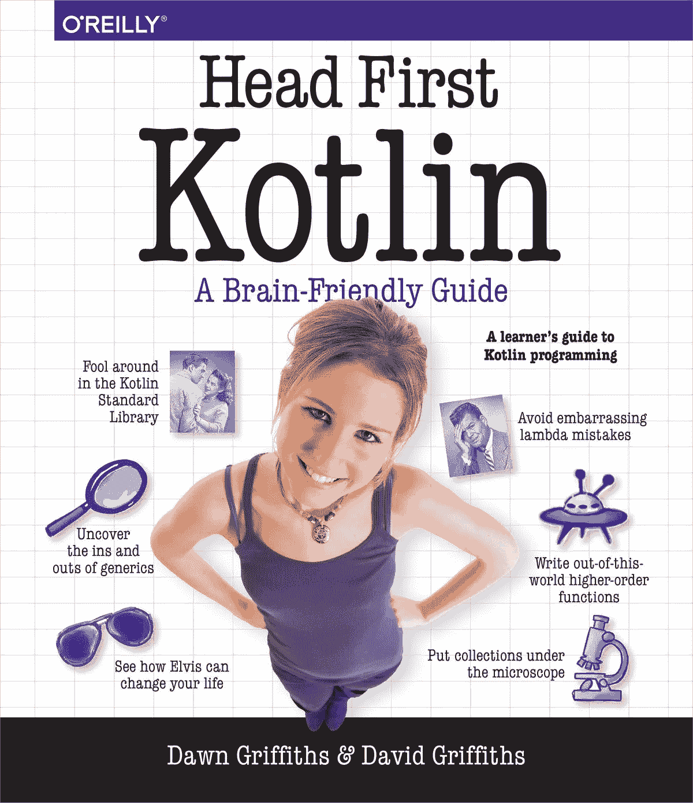

# 如何在 9 个月内学会编程

> 原文：<https://blog.kotlin-academy.com/learn-programming-in-9-months-eac3f049c5bc?source=collection_archive---------2----------------------->

> 如今，由于隔离，许多人无法工作。他们有很多时间，但前途未卜。在这段时间里，程序员似乎做得很好。我们不仅可以很好地完成我们的工作，而且对我们服务的需求也在增长。愿意帮助那些需要帮助的人，我决定做我最擅长的事情:写作来帮助人们学习编码。那么下面就是你的 9 个月如何学习编程的实用计划。

在过去的几年里，我被问到的最常见的问题是“如何成为一名程序员？”。这迫使我一遍又一遍地思考这个问题。我的个人经历在这里没有太大的帮助，因为我从很小的时候就开始学习编程。虽然在过去的几年里，我观察并帮助了相当多的人开始走上这条道路，成为一名没有任何背景的开发人员。包括三个和我很亲近的人。这次经历和与他们的讨论让我明白了什么有效，什么无效。现在我觉得我对如何有效地成为一名开发人员有了一个很好的了解。

# 需要多长时间？

对于我观察到的大多数人来说，他们花了大约 9 个月的时间才找到第一份开发人员的工作。几乎所有人当时都有工作，所以他们不能完全投入到学习中，但他们都非常认真地对待学习，几乎利用了所有的业余时间。我估计他们中的大多数人每周至少花 30 个小时学习。粗略估计总共需要大约 1000 个小时的学习时间。这是一项巨大的投资。这是值得的，但前提是你要把它当作你未来的职业来认真对待。

# 好玩吗？

如果你自己学习的话，编程会很有趣。作为一名学生，我从编码挑战或有趣的项目中获得了很多乐趣。虽然这种方法需要更多的时间。许多人以计算机科学硕士的身份完成了学业，然而他们还没有准备好开始一份真正的工作。他们仍然需要学习在现实生活项目中使用的某些工具。当一个人学习找一份程序员的工作时，他或她需要专注于那些工具。看看我的朋友，这通常不是一个有趣的经历。

我想说编程很有趣。我喜欢它，随着时间的推移，我观察到的那些人也对编程产生了热爱。通常是在他们最终获得编程职位的时候。但是他们学习的时候一点都不好玩。我观察到的几乎所有人都在寻找工作，向城市里的每家公司投简历，压力非常大，非常辛苦。那不是一段愉快的时光。虽然，最后，他们都为自己走过的路感到幸福和自豪。

> 我看不出有人不应该成为程序员的理由。一开始很辛苦，但最后总会有回报的。Marek——我的一个朋友从那条路经过。

# 好吧，我决定了。那计划是什么？

如果你想尽快成为一名开发人员，你需要专注于一个单一的职位，并获得所有的要求。计划是这样的:

1.  选择你的职业
2.  打下基础
3.  遵循逐步教程
4.  开始独立编程
5.  建立投资组合
6.  开始申请工作

## 选择你的职业

这是另一篇文章的主题，因为有许多可能的职业选择，每一个都有一些特点。你需要找到的是你想要申请的具体工作职位类型(你可以在你当地的工作机会中搜索，看看公司在寻找什么样的常见编程工作职位)。最后，你需要决定:

1.  你想做什么样的发展？(后端/前端/Android/iOS/桌面/游戏/数据科学/数据工程/运营/分析/…)
2.  你想学什么编程语言？
    ( **科特林**/**JavaScript**/**Python**/**Swift**/**Java**/c#/Lua/Scala/Go/Ruby/PHP/Dart/…)
3.  你想用什么框架？
    (Spring/Ktor/Django/React/Angular/Vue/Android SDK/iOS SDK/Flutter/Ruby on Rails/Symfony/Laravel/…)

一些受欢迎的和容易开始的职业选择是:

*   使用 Django 在 Python 中进行后端开发
*   使用 React 进行 JavaScript 前端开发
*   使用 Android SDK 在 Kotlin 中进行 Android 开发

选择最适合你的，以及你所在城市的点播。

## 打下基础

第一步是最难的，因为你需要让你的大脑非常熟悉基本的编程概念和文字。这就像学习写和读。有人给你看信是不够的。你需要习惯它们并学会使用它们，这需要很多时间。你可以从看一些视频开始，但你应该尽快开始写一个非常简单的代码。

对于视频，记得搜索初学者的课程。有很多课程是为开发者设计的。它们对你来说太难了。你需要先打好基础。还有，选择较长的视频。你需要慢慢来。这些是初学者学习课程的好例子:

我强烈推荐你边做边学的课程，但你会得到像这样的循序渐进的指导:

 [## freeCodeCamp.org

### 在家学习编码。构建项目。获得认证。自 2014 年以来，超过 4 万名 freeCodeCamp.org 大学毕业生…

www.freecodecamp.org](https://www.freecodecamp.org/)  [## CoderDojo | Raspberry Pi 项目

### CoderDojo 是一个自由、开放、志愿者领导的编码俱乐部(Dojo)的全球运动，7-17 岁的年轻人(忍者)在这里…

projects.raspberrypi.org](https://projects.raspberrypi.org/en/coderdojo) 

我强烈推荐教你一步一步编写代码的游戏，比如:

 [## CodeCombat -编写游戏来学习 Python 和 JavaScript

### 教孩子编程通常会让人感到力不从心。CodeCombat 帮助所有的教育工作者教学生如何编码…

codecombat.com](https://codecombat.com/) 

我也推荐你选择的语言的首选书籍:

你需要学习这些课程，直到你觉得你可以自信地使用你选择的语言。这需要时间，因为你的大脑需要适应。但这也是必不可少的，你不应该开始下一步，直到你对一种语言感到舒适。

## 遵循逐步教程

你需要从头到尾学会在自己选择的框架内做项目。一个简单的学习方法是跟随一个有经验的老师一步一步地向你展示如何做一个编程项目。幸运的是，互联网上有很多这样的课程，几乎适用于任何语言和框架。找到它们的一个简单方法是在 YouTube 上输入“在<framework of="" your="" choice="">中写下<something you="" want="" to="" write="">”。看看这个:</something></framework>

 [## 在 android - YouTube 中编写测验

### 欣赏您喜爱的视频和音乐，上传原创内容，并在上与朋友、家人和全世界分享这些内容…

www.youtube.com](https://www.youtube.com/results?search_query=write+quiz+in+android)  [## 在 vue - YouTube 中编写游戏

### 欣赏您喜爱的视频和音乐，上传原创内容，并在上与朋友、家人和全世界分享这些内容…

www.youtube.com](https://www.youtube.com/results?search_query=write+game+in+vue)  [## 在 django - YouTube 上写商店

### 欣赏您喜爱的视频和音乐，上传原创内容，并在上与朋友、家人和全世界分享这些内容…

www.youtube.com](https://www.youtube.com/results?search_query=write+shop+in+django) 

并不是所有的课程都是好的，但是大部分已经足够好了，所以你可以很容易地从开始到结束跟随并建立一个项目。跟着他们，可以做很多项目。把它们收集起来，因为它们既是你可以联系到的知识，也是你以后建立投资组合时可以用到的东西。

也有专业课程按部就班的教你。您可以在以下网址找到它们:

 [## 学习最新的技术技能；推进您的职业发展| Udacity

### 只有 Udacity 拥有交付真正成果的所有关键因素。人工智能和医疗保健领域的顶级专家将介绍人工智能如何…

www.udacity.com](https://www.udacity.com/)  [## Coursera |通过顶级机构的在线课程培养技能

### 免费加入 Coursera，在线学习。通过耶鲁、密歇根、斯坦福等顶尖大学的课程培养技能…

www.coursera.org](https://www.coursera.org/)  [## Pluralsight -无限在线开发人员、IT 和网络安全培训

### 在 Pluralsight，我们每天都亲眼目睹技术如何将不可能变为可能。这就是为什么复视一号…

www.pluralsight.com](https://www.pluralsight.com/) 

…还有许多其他的。如果没钱投资，一个不错的选择就是用“最佳免费 X 课程”搜索最佳免费课程。像这样:

 [## 最佳免费 javascript 课程-谷歌搜索

### 编辑描述

www.google.com](https://www.google.com/search?q=best+free+javascript+courses) 

## 开始独立编程

你需要自学编程。一个好方法是从简单的挑战开始，这些挑战需要你想出如何解决它们。这方面的好网站有:

 [## 黑客银行

### 加入 700 多万开发者。练习编码，准备面试，然后被录用。

www.hackerrank.com](https://www.hackerrank.com/)  [## Codewars:训练你的编码技能

### Codewars 是开发人员通过挑战掌握代码的地方。在道场训练形，达到你的最高境界…

www.codewars.com](https://www.codewars.com/) 

## 建立投资组合

你做了一些项目，你可以使用编程语言。是时候变得更加独立，写点自己的东西了。你可以基于你在学习一门课程时写的一个项目，但是你需要开始包括你自己的特色和你自己的想法。

如果你做一些对你有用或重要的事情，那是最好的。你锻炼吗？制作一个应用程序来帮助你锻炼(我在 lead 4 用不同的语言和技术制作了这样的应用程序)。你是漫画迷吗？做一个超级英雄画廊。你喜欢狗吗？给狗主人做点东西。但最重要的是，建立你的简历应用程序。它可以是一个个人网站，或者一个个人应用程序，或者一个返回你的职业和项目信息的 API。

*   当你这样做时，在 Github 上搜索一个类似的项目，并阅读它以激发灵感。
*   问谷歌“如何在 Y 中做 X”，在栈溢出和文章上找到你的答案。
*   观看可能显示如何做你想做的事情的教程。

这是你练习的关键部分，因为:

1.  你建立了一个可以在简历中展示的作品集，招聘人员会阅读的。
2.  这是对你未来工作的最好模拟，因为当你发明了一个特性并学习实现它时，这与你有一个需要实现的任务非常相似。

**建立至少 2 或 3 个不同的项目。**这非常重要，因为每一个项目都会让你学到很多东西，而且更多的项目在简历中会更好看。

## 开始申请工作

在 Github 上分享你的项目，让你很容易看到它们是如何工作的。然后你就可以开始写简历了。包括你的项目和你学到的所有重要的东西。如果你收到了一些证书，它们可能也会有所帮助。让你的简历看起来不错(创意是有帮助的)，你就可以开始发了。

这是最令人沮丧的时候，因为你不太可能在下个月找到工作。大多数公司会忽略你的简历，但不应该为此担心。你感兴趣的职位大概有成千上万的工作机会。试着把你的简历发给所有人。别担心。娱乐处理需要一些时间，尤其是对于初级开发人员。你不太可能在第一个月找到理想的工作。更有可能是第二次或第三次。但是你需要每周发送数百份申请。相信过程。这肯定需要一些时间。

同时，开始准备。了解编程面试。招聘人员会问一些常见的问题。学习它们。

同样在第一次面试中，你可能会觉得自己很蠢。别担心。检查你不知道的一切，询问反馈，了解他们对你的期望，在复试中，你肯定会感到更加自信。回答面试问题是一门技能，也是需要学习的。它来自实践。

# 单击👏说“谢谢！”并帮助他人找到这篇文章。

了解卡帕头最新的重大新闻。学院，[订阅时事通讯](https://kotlin-academy.us17.list-manage.com/subscribe?u=5d3a48e1893758cb5be5c2919&id=d2ba84960a)，[观察推特](https://twitter.com/ktdotacademy)并在媒体上关注我们。

如果你需要一个科特林工作室，看看我们如何能帮助你: [kt.academy](https://kt.academy/) 。

