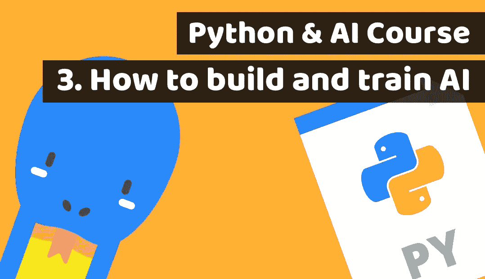

# 通过为金融科技构建投资人工智能来学习 Python 第 3 课:如何构建和训练人工智能

> 原文：<https://medium.com/duomly-blockchain-online-courses/learn-python-by-building-investment-ai-for-fintech-lesson3-how-to-build-and-train-ai-db32477b529f?source=collection_archive---------0----------------------->

[Python course Lesson 3: How to build and train AI](https://www.blog.duomly.com/python-course-with-building-a-fintech-investment-ai-lesson-3-how-to-build-and-train-ai)

本文最初发表于:

[https://www . blog . duomly . com/python-course-with-building-a-fin tech-investment-ai-lesson-3-how-to-build-and-train-ai](https://www.blog.duomly.com/python-course-with-building-a-fintech-investment-ai-lesson-3-how-to-build-and-train-ai)

# 介绍

在今天的 Python 与人工智能课程中，我们将学习如何构建人工智能以及如何训练人工智能。