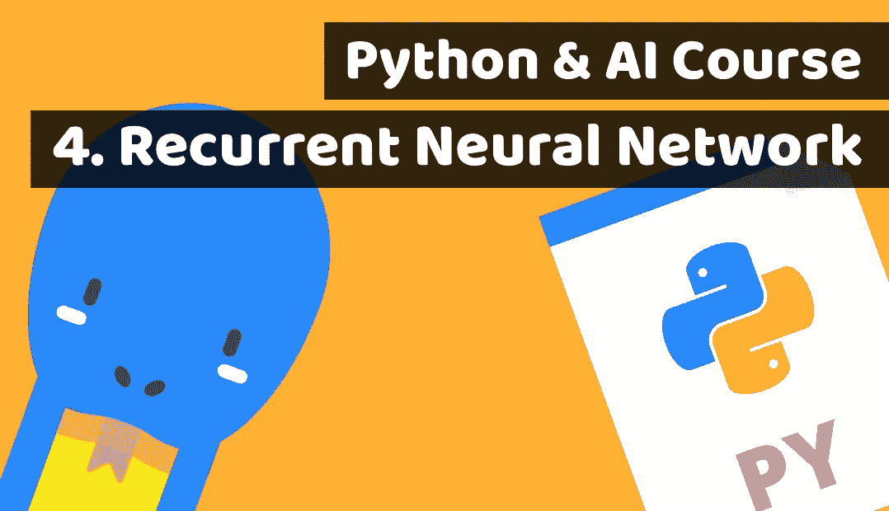

# 通过为金融科技构建投资人工智能来学习 Python 第 4 课:递归神经网络(RNN)

> 原文：<https://medium.com/duomly-blockchain-online-courses/learn-python-by-building-investment-ai-for-fintech-lesson4-recurrent-neural-network-rnn-2ba840708e6e?source=collection_archive---------0----------------------->

[Duomly — Programming Online Courses](https://www.duomly.com)

本文原载:
[https://www . blog . duomly . com/python-course-with-building-a-fin tech-investment-ai-lesson-4-recurrent-neural-network-rnn](https://www.blog.duomly.com/python-course-with-building-a-fintech-investment-ai-lesson-4-recurrent-neural-network-rnn)

# 介绍

在今天的人工智能 Python 课程中，我们将学习如何进行预测…