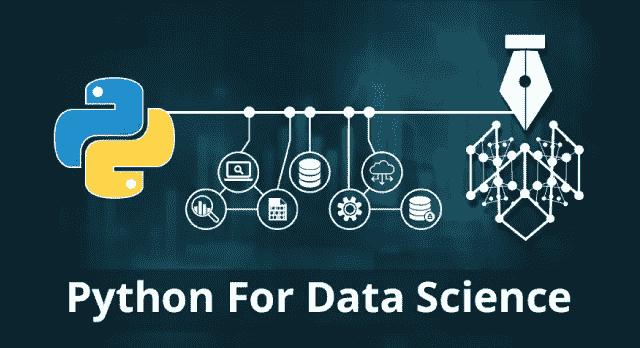
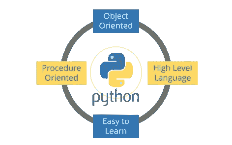
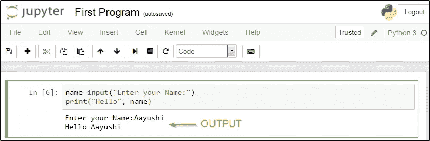
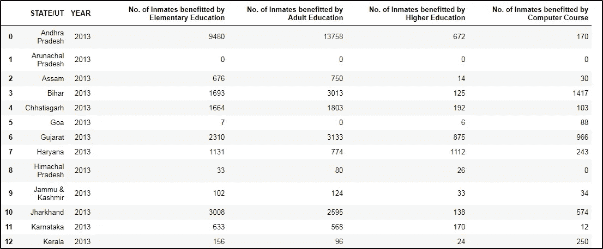
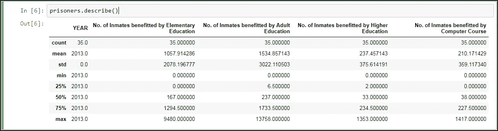
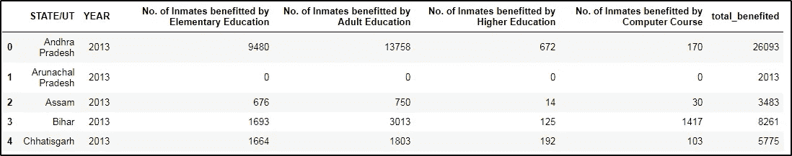
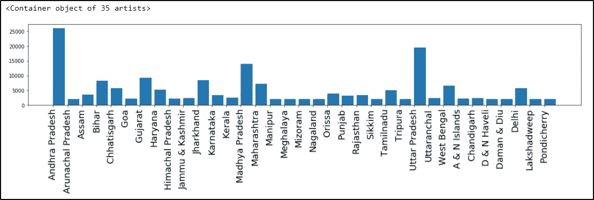

# 用于数据科学的 Python——在数据科学中使用 Python 库

> 原文：<https://medium.com/edureka/learn-python-for-data-science-1f9f407943d3?source=collection_archive---------2----------------------->



面向数据科学的 Python 是数据分析领域专业人士的必修课。随着 IT 行业的发展，对熟练的数据科学家的需求越来越大，Python 已经发展成为最受欢迎的编程语言。通过这个博客，你将学习基础知识，如何分析数据，然后使用 Python 创建一些漂亮的可视化效果。

这篇关于“Python 用于数据科学”的博客包括以下主题:

*   为什么学 Python 是为了数据科学？
*   Python 简介
*   Python 与数据科学的 Jupyter 安装
*   Python 基础
*   用于数据科学的 Python 库
*   演示:实际实施

让我们开始吧。:-)

# 为什么学 Python 是为了数据科学？

毫无疑问，Python 是最适合数据科学家的语言。我列出了几个要点，这将有助于您理解人们为什么选择 Python 进行数据科学研究:

*   Python 是一种免费、灵活、强大的开源语言
*   Python 以其简单易读的语法将开发时间缩短了一半
*   使用 Python，您可以执行数据操作、分析和可视化
*   Python 为机器学习应用和其他科学计算提供了强大的库

> 你知道最棒的是什么吗？数据科学家是收入最高的工作之一，据《Indeed.com》统计，其年收入约为*130，621 美元。*

# *Python 简介*

**

*Python 是由 Guido Van Rossum 在 1989 年创建的。它是一种具有动态语义的解释语言。它可以在所有平台上免费访问和运行。Python 是:*

*1)面向对象
2)高级语言
3)简单易学
4)面向过程*

# *Python 与数据科学的 Jupyter 安装*

*让我来指导您在系统上安装 Jupyter 的过程。只需遵循以下步骤:*

*第一步:进入链接:http://jupyter.org/*

***第二步:**你可以点击“在你的浏览器中尝试”或者“安装笔记本”。*

*嗯，我会推荐你用 *Anaconda 发行版*安装 Python 和 Jupyter。一旦你安装了 Jupyter，它会在你的默认浏览器上打开，在命令提示符下输入“Jupyter Notebook”。现在让我们在 Jupyter 上执行一个基本程序。*

```
*name=input("Enter your Name:") 
print("Hello", name)*
```

*现在要运行它，按下“ ***Shift+Enter*** ”并查看输出。参考下面的截图:*

**

# *数据科学的 Python 基础*

*现在是你动手编程的时候了。但为此，您应该对以下主题有一个基本的了解:*

***变量**:变量是指用来存储值的预留内存位置。在 Python 中，在使用变量之前不需要声明变量，甚至不需要声明变量的类型。*

***数据类型** : Python 支持多种数据类型，定义了对变量可能的操作和存储方式。数据类型列表包括数字、列表、字符串、元组、集合和字典。*

***操作符**:操作符帮助操作数的值。Python 中的操作符列表包括算术、比较、赋值、逻辑、按位、成员和标识。*

***条件语句**:条件语句帮助执行一组基于条件的语句。即有三个条件语句——If、Elif 和 Else。*

***循环**:循环用于迭代小段代码。有三种类型的循环，即 While、for 和嵌套循环。*

***函数**:函数用来把你的代码分成有用的块，让你对代码进行排序，让它更具可读性，重用它&节省一些时间。*

# *用于数据科学的 Python 库*

*这就是 Python 和数据科学的真正威力所在。Python 附带了许多用于科学计算、分析、可视化等的库。其中一些列举如下:*

## ***Numpy***

*NumPy 是用于数据科学的 Python 的核心库，代表“数值 Python”。它用于科学计算，包含一个强大的 N 维数组对象，并提供集成 C，C++等的工具。它还可以用作通用数据的多维容器，您可以在其中执行各种数字操作和特殊功能。*

## ***Matplotlib***

*Matplotlib 是一个强大的 Python 可视化库。它可以用于 Python 脚本、shell、web 应用服务器和其他 GUI 工具包。使用 Matplotlib 可以使用不同类型的图以及多个图的工作方式。*

## ***Scikit-learn***

*Scikit learn 是主要的吸引力之一，其中您可以使用 Python 实现机器学习。这是一个免费的库，包含简单有效的数据分析和挖掘工具。您可以使用 scikit-learn 实现各种算法，如逻辑回归、时间序列算法。*

## ***Seaborn***

*Seaborn 是 Python 中的一个统计绘图库。因此，无论何时您将 Python 用于数据科学，您都将使用 matplotlib(用于 2D 可视化)和 Seaborn，Seaborn 具有漂亮的默认样式和绘制统计图形的高级界面。*

## ***熊猫***

*Pandas 是 Python 中用于数据科学的一个重要库。它用于数据操作和分析。它非常适合于不同的数据，如表格，有序和无序的时间序列，矩阵数据等。*

# *演示:实际实施*

***问题陈述**:给你一个数据集，其中包含一系列方面的综合统计数据，如监狱机构的分布&性质、监狱过度拥挤、囚犯类型等。您必须使用这个数据集来执行描述性统计，并从数据中获得有用的见解。以下是一些任务:*

1.  ***数据加载:**使用 pandas 加载数据集“囚犯. csv”并显示数据集中的前五行和后五行。然后用描述熊猫的方法找出列数。*
2.  ***数据操作:**创建一个新列——“受益总人数”，这是通过所有模式受益的囚犯总数。*
3.  ***数据可视化:**创建一个条形图，x 轴上显示每个州的名称，其受益囚犯总数作为条形图的高度。*

# *解决方案:*

*对于数据加载，编写以下代码:*

```
*import pandas as pd
import matplotlib.pyplot as plot
%matplotlib inline
file_name = "prisoners.csv"
prisoners = pd.read_csv(file_name)
prisoners*
```

**

*现在要在 Pandas 中使用 describe 方法，只需键入以下语句:*

```
*prisoners.describe()*
```

**

*接下来，用 Python 和数据科学博客，让我们执行数据操作。*

```
*prisoners["total_benefited"]=prisoners.sum(axis=1) 
prisoners.head()*
```

**

*最后，让我们用 Python 为数据科学博客做一些可视化。参考以下代码:*

```
*import numpy as np
xlabels = prisoners['STATE/UT'].values
plot.figure(figsize=(20, 3))
plot.xticks(np.arange(xlabels.shape[0]), xlabels, rotation = 'vertical', fontsize = 18)
plot.xticks
plot.bar(np.arange(prisoners.values.shape[0]),prisoners['total_benefited'],align = 'edge')*
```

## ****输出—****

**

*我希望我关于“Python 用于数据科学”的文章对您有所帮助。*

*如果你想查看更多关于人工智能、DevOps、道德黑客等市场最热门技术的文章，你可以参考 Edureka 的官方网站。*

*请留意本系列中的其他文章，它们将解释 Python 和数据科学的各个方面。*

> *1. [Python 教程](/edureka/python-tutorial-be1b3d015745)*
> 
> *2. [](/edureka/python-functions-f0cabca8c4a) [Python 编程语言](/edureka/python-programming-language-fc1015de7a6f)*
> 
> *3. [Python 函数](/edureka/python-functions-f0cabca8c4a)*
> 
> *4.[Python 中的文件处理](/edureka/file-handling-in-python-e0a6ff96ede9)*
> 
> *5. [](/edureka/scikit-learn-machine-learning-7a2d92e4dd07) [Python Numpy 教程](/edureka/python-numpy-tutorial-89fb8b642c7d)*
> 
> *6. [Scikit 学习机器学习](/edureka/scikit-learn-machine-learning-7a2d92e4dd07)*
> 
> *7. [Python 熊猫教程](/edureka/python-pandas-tutorial-c5055c61d12e)*
> 
> *8. [Matplotlib 教程](/edureka/python-matplotlib-tutorial-15d148a7bfee)*
> 
> *9. [Tkinter 教程](/edureka/tkinter-tutorial-f655d3f4c818)*
> 
> *10.[请求教程](/edureka/python-requests-tutorial-30edabfa6a1c)*
> 
> *11. [PyGame 教程](/edureka/pygame-tutorial-9874f7e5c0b4)*
> 
> *12. [OpenCV 教程](/edureka/python-opencv-tutorial-5549bd4940e3)*
> 
> *13.[用 Python 进行网页抓取](/edureka/web-scraping-with-python-d9e6506007bf)*
> 
> *14. [PyCharm 教程](/edureka/pycharm-tutorial-d0ec9ce6fb60)*
> 
> *15. [](/edureka/linear-regression-in-python-e66f869cb6ce) [机器学习教程](/edureka/machine-learning-tutorial-f2883412fba1)*
> 
> *16.[Python 中从头开始的线性回归算法](/edureka/linear-regression-in-python-e66f869cb6ce)*
> 
> *17. [Python 正则表达式](/edureka/python-regex-regular-expression-tutorial-f2d17ffcf17e)*
> 
> *18.[Python 中的循环](/edureka/loops-in-python-fc5b42e2f313)*
> 
> *19. [Python 项目](/edureka/python-projects-1f401a555ca0)*
> 
> *20.[机器学习项目](/edureka/machine-learning-projects-cb0130d0606f)*
> 
> *21.[Python 中的数组](/edureka/arrays-in-python-14aecabec16e)*
> 
> *22.[在 Python 中设置](/edureka/sets-in-python-a16b410becf4)*
> 
> *23.[Python 中的多线程](/edureka/what-is-mutithreading-19b6349dde0f)*
> 
> *24. [Python 面试问题](/edureka/python-interview-questions-a22257bc309f)*
> 
> *25. [Java vs Python](/edureka/java-vs-python-31d7433ed9d)*
> 
> *26.[如何成为一名 Python 开发者？](/edureka/how-to-become-a-python-developer-462a0093f246)*
> 
> *27. [Python Lambda 函数](/edureka/python-lambda-b84d68d449a0)*
> 
> *28.[网飞如何使用 Python？](/edureka/how-netflix-uses-python-1e4deb2f8ca5)*
> 
> *29.[Python 中的套接字编程是什么](/edureka/socket-programming-python-bbac2d423bf9)*
> 
> *30. [Python 数据库连接](/edureka/python-database-connection-b4f9b301947c)*
> 
> *31. [Golang vs Python](/edureka/golang-vs-python-5ac32e1ef2)*
> 
> *32. [Python Seaborn 教程](/edureka/python-seaborn-tutorial-646fdddff322)*
> 
> *33. [Python 职业机会](/edureka/python-career-opportunities-a2500ce158de)*

**原载于 2018 年 3 月 8 日*[*【www.edureka.co】*](https://www.edureka.co/blog/learn-python-for-data-science/)*。**