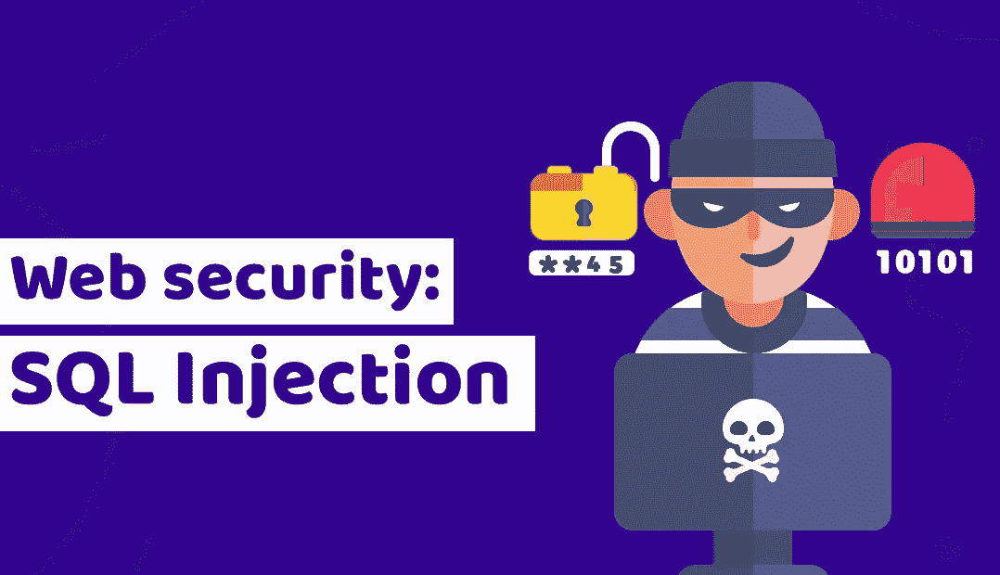

# 通过黑银行 app 学习 SQL 注入

> 原文：<https://medium.com/duomly-blockchain-online-courses/learn-sql-injection-by-hacking-a-bank-app-dd52807ad934?source=collection_archive---------4----------------------->



[Programming courses online](https://www.duomly.com)

# 介绍

今天我们将学习如何进行 SQL 注入攻击，以及如何防止它。

你知道黑客每年窃取数十亿美元吗？

你知道几乎每 30 秒钟就有一次新的黑客攻击吗？

如果我们是开发人员，我们应该始终关心我们代码的安全性(至少有一点)。不管我们做前端还是后端，两者都是脆弱的。

今天，我想向您介绍一下 SQL 注入攻击，它是什么，如何进行，为什么它是危险的，以及如何保护您的应用程序免受攻击。

开始吧！

如果你喜欢视频，这里是 youtube 版本:

What is SQL Injection tutorial

# 什么是 SQL 注入

SQL 注入是最流行的 OWASP 漏洞之一，它非常容易实现，但也可能造成可怕的破坏。

这有点像我们可以将一些自定义的和不需要的命令推送到 SQL 数据库的情况。

例如，当我们有用户名输入时，我们可以输入自定义命令。

像我们可以使用删除整个表，从其他数据库表或自动解锁管理员帐户的数据。

# 为什么 SQL 注入是危险的

**数据泄露**

通过 SQL 注入，攻击者可以快速访问普通用户永远无法访问的数据。

例如，这可能是你的私人信息，银行交易，敏感的个人数据，如你的身份证，或你住在哪里。

更糟糕的是，如果数据库易受攻击，攻击者可以在一瞬间公开访问数百万条记录。

**可能的损坏**

这种类型的攻击可能引发任何 SQL 命令，而不仅仅是获取数据。

例如，攻击者可以从您的帐户向他自己的帐户汇款，更改您的帐户余额，或者删除所有记录。

那会非常痛苦，尤其是没有后援的时候。

**未授权访问**

当我们构建一个应用程序时，通常，我们对 x 角色有一些权限。

像只有管理员可以删除或编辑记录，对朋友的请求需要被邀请的人接受，等等。

如果攻击者可以进入数据库，从您的帐户发送消息，将他的帐户添加为经过验证的朋友，或者编辑您的社交档案中的帖子，会怎么样？

# 让我们执行一次 SQL 注入攻击

现在，我们将进行一次简单的攻击来获取某人的帐户访问权限。

我们建立了一个银行应用程序，你可以测试攻击，检查代码和响应，以了解它是如何完全工作的。

**进行 SQL 注入攻击的要求:**

**下载我们的后端代码:**

以下是 Golang 银行应用后端代码的链接:

[https://github.com/Duomly/go-bank-backend](https://github.com/Duomly/go-bank-backend)

克隆它并进入这个文件夹。

**设置您的 PostgreSQL 数据库:**

您需要创建一个新的 Postgres 数据库。

将其命名为 bankapp 并使用用户 Postgres，或者您可以使用任何您想要的用户。

在这种情况下，您需要更改连接字符串。

**在后端代码中设置连接:**

您需要在两个文件中设置连接字符串，vulnerable-db.go 和 migrations.go

**开始迁移:**

现在您需要转到 main.go，注释 API 代码，并取消对迁移代码的注释。

主函数的代码应该是这样的。

```
func main**()** **{**migrations.Migrate**()**// api.StartApi()**}**
```

**从**下载我们的前端代码

在这一步，我们应该转到 URL:

[https://github.com/Duomly/angular9-tailwind-bank-frontend](https://github.com/Duomly/angular9-tailwind-bank-frontend)

克隆应用程序并转到文件夹。

接下来，我们应该通过 npm install 安装我们的依赖项，并通过 npm start 启动应用程序。

**让我们开始乐趣:**

在配置的最后一步，我们应该取消之前所做的更改的注释，并启动 API。

main.go 中主函数的代码应该如下所示:

```
func main**()** **{**// migrations.Migrate()api.StartApi**()****}**
```

最后一步是运行 main.go，在终端中键入:

```
go run main.go
```

恭喜你，你已经准备好开始黑客了！

**标准凭证:**

我们创建了两个不同的用户，他们的标准凭据是:

**用户 1:**

```
user: Martinpassword: Martin
```

**用户 2:**

```
user: Michaelpassword: Michael
```

**我们将做什么:**

正如你所注意到的，我们有一个简单的哈希算法，寻找一个已经哈希过的密码。

因此，我们将放入密码输入字段的所有技巧都将被转换为散列(即使我们将在那里添加一些 SQL 命令)，这意味着 SQL 不会将它们视为 SQL 命令。

在这种情况下，我们需要关注用户名输入。

这是可行的，因为它是作为一个纯字符串进入 SQL 的。

我特别创造了一个脆弱的地方。

不应该这样在自己的 app 里做。

在文章的下一部分，我会告诉你应该如何正确地做。

**通过用户名查找用户**

要通过用户名获取用户，我们可以在用户名输入中使用这些字符串之一。

当然，你可以使用更多的方法。

```
Martin’ or username=’Martin’ AND 1 = 1 --
```

或者

```
xx’ or username=’Martin’ AND 1 = 1 --
```

这有点像通过名字 Martin 或名字 Martin 获得用户，如果我们将第一个 Martin 改为 Michael，我们将获得两个配置文件。

第二种方法的工作原理类似于获取用户名为 xx 或 Martin 且为 true 的用户。

**获取所有用户**

通过在用户名输入中使用这个字符串，我们将能够从名为 users 的表中获得所有记录。

```
Martin’ or 1 = 1 --
```

这种方法的工作原理类似于获取用户名为 Martin 或 true 的用户。

这意味着“或真”将获得所有其他用户，因为条件已通过。

**通过 ID 获取用户**

当我们在用户名输入字段中使用这一组合时，我们可以通过用户的 id 来获取用户。

当我们寻找 admin(通常默认情况下 admins 有 ID 1)时，这尤其有用。

```
xx’ or id=2 AND 1 = 1 --
```

这种方法的工作原理类似于获取一个用户名为 xx 或 id 2 的用户。

**这些符号的含义:**

```
OR 1=1
```

这个意思是 1 等于 1，这是真的。就像通过了条件。

```
'
```

这一个记号就像是从弦上逃脱。

这使我们有可能对 SQL 中的字符串进行转义，并开始调用适当的 SQL 命令。

```
--
```

这有点像一个注释，让 SQL 忽略这两个破折号后的语句的其余部分。

这非常有用，例如，当我们需要发送更多字段时，比如密码。

当我们使用这个标记时，我们的 SQL 将忽略密码也应该被验证的信息。

# 如何保护应用免受 SQL 注入

**前端表单验证**

当然，一个聪明的攻击者不应该有那么多问题来逃避前端验证。

然而，这将是第一个障碍。

您可以在表单中添加特殊验证。

这可以检查你的电子邮件是否等于电子邮件，如果你的用户名有任何特殊字符或长度不太大。

如果您检测到可疑的组合，您可以阻止该表单。

您可以向后端发送关于使用该 IP/凭证的用户试图进行某种攻击的红色标志。

你可以，比如，暂时屏蔽他的 IP，或者永久封杀他。

同样，攻击者会知道如何避开你的禁令。

尽管如此，这是一个新的障碍，一些人可以放弃在你的应用上花更多的时间。

**后端变量验证**

下一个想法是如何保护后端，它将验证所有的字符串和数据是否被正确发送，并通过所有的 regexp 验证。

这非常有帮助，因为通过后端验证比通过前端验证要困难得多。

这很有帮助，尤其是如果你对用户可以立即拨打的电话数量进行了限制。

**附加通道比较，如 CompareHashAndPassword**

这种方法可以帮助您停止向攻击者发回数据。

当然，如果您让攻击者执行 SQL 注入，他可能会删除某些东西或更改记录。

例如，您仍然可以在 DB 中找到 x 用户记录。

接下来，使用 bcrypt.CompareHashAndPassword 对凭证进行身份验证。

应用程序不会将请求的数据返回给客户端，应该会抛出一个非验证错误。

**使用 SQL 库/框架**

使用一些框架，如 golang 的 gorm 或 node.js 的 sequelize，可以在安全性方面给你很大帮助。

在大多数情况下，有一个额外的安全层。

这将检查参数是否正确，并从用户发送到后端的数据中构建适当的查询。

**声明类型**

这一条非常关键。通过声明紧类型，你将避免很多问题，不仅仅是安全问题。

如果你将设置所有的接口和类型，几乎不可能发送回错误的数据。

所有的数据将以 100%的格式发送，您希望返回给最终的客户端(用户)。

# 结论

恭喜你！

现在，您知道了如何执行 SQL 注入攻击，以及如何保护您的应用程序免受这种攻击。

希望对你在构建自己的软件的时候很有帮助。

你需要记住，用它来对付你没有得到所有者许可的应用是非法的。

无论如何，你可以下载我们的代码，构建你自己的应用程序，或者找到虚拟实验室，在那里你可以做和测试。

关注我们以获得更多关于编码的教程。

以下是我的 SQL 连接教程:

[SQL 连接示例教程](https://www.blog.duomly.com/sql-join-with-examples-tutorial/)


[Programming courses online](https://www.duomly.com)

感谢阅读，

Duomly 的 Radek