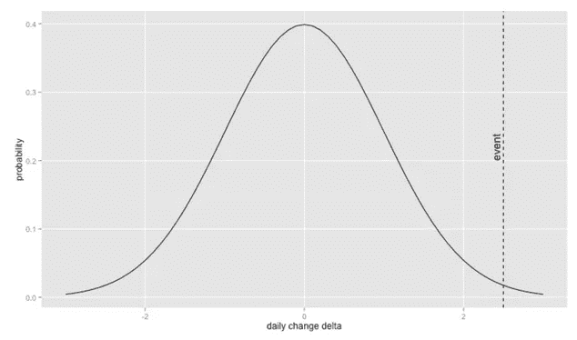
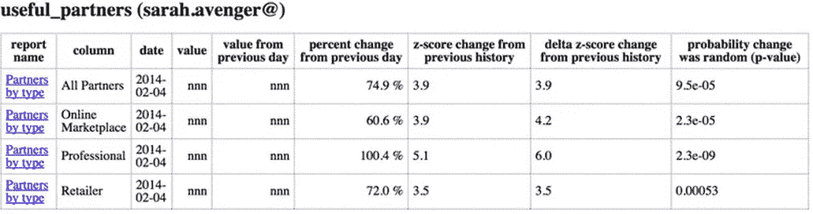

# 从异常指标中了解您的业务

> 原文：<https://medium.com/pinterest-engineering/learning-about-your-business-from-anomalous-metrics-7d2b7ac0bea9?source=collection_archive---------1----------------------->

Dan Frankowski | Pinterest 数据科学家，商业分析

你的图表让你沮丧吗？你觉得自己淹没在数据中了吗？数据的最佳用途是促进有用的行动。坐下来喝一杯，我来讲一个让我们自己的数据皱眉头颠倒的故事。或者，不那么可爱:了解如何在你的日常业务指标中寻找异常可以帮助你更快地发现、了解和应对你的业务变化。

今年是 2013 年。我们总是试图更好地了解我们的服务，所以我们发现自己在问，现有的 Pinners 快乐吗？报名的人多吗？新用户开心吗？我们围绕每月活跃用户的顶线目标构建了大量图表，如果这个数字上升或下降，我们会试图解释它，通常是通过挖掘其他关于单个功能、平台或几十个因素中任何一个的图表和数据。有时候我们发现了一些问题或者有了很大的改进，但是几天之内(或者偶尔几个星期)都不会注意到。).也许我们在一个平台上改善了体验，或者在一个浏览器中破坏了体验，或者改善了类别提要中的 pin 流，或者破坏了类别提要。一旦我们理解了我们的数据，我们就可以修复损坏的部分，并从成功中学习和庆祝。

问题是:图表太多。有数百张图表(数千行！)，每天搬来搬去。在那一大堆生产线中，只有几个变化是那天对我们的业务最重要的，但是我们没有人来评估每一条生产线。

在那年晚些时候的一次黑客马拉松上，我们尝试了一种快速的黑客技术来找出图表上最有信息量、最令人惊讶、最反常的线条。

我们有一项资产:我们将大部分日常业务指标存储在一个地方，一个名为 [Pinalytics](https://engineering.pinterest.com/blog/building-pinalytics-pinterest%E2%80%99s-data-analytics-engine) 的内部系统。在 Pinalytics 数据的基础上构建一些东西可能是通用的和广泛使用的。它每天每条线有一个点，所以虽然它不是非常详细，但每个点后面通常有很多数据，所以它应该没有那么嘈杂。一分钟后检测到一些东西可能比等一整天要好，但这是一个更困难的问题，我们认为一天后检测到总比没有好。

我们需要做两件事:找到异常数据，并将信息发送给正确的人。我们快速破解了每一个，如下所示。

## 寻找异常数据

为了发现异常，预测将会发生什么，并突出与预测的大偏差。我们尝试了一个简单的模型:预测一个稳定的每日变化率。也就是说，第三天和第二天之间的差异与第二天和第一天之间的差异相同。例如:第一天、第二天和第三天，你网站的用户数量可能是 1000、1010 和 1020，这意味着你每天增加 10 个用户。如果你在一个月内每天增加 10 个用户，然后有一天你没有增加任何用户，这是一个异常。

然而，每天的变化不会完全一样。如果你增加 9 个用户而不是 10 个，也许这只是一个随机波动。为了解决这个问题，我们使用过去的变化来预测今天的变化。

为了更详细，我们采用了过去四到六周的每日变化，假设它们是正态分布的(即[钟形曲线](https://en.wikipedia.org/wiki/Normal_distribution))，然后将今天的变化放在该正态曲线上。由此，我们计算出一个 [p 值](https://en.wikipedia.org/wiki/P-value)，粗略地说，这是随机偏离模式的概率。因此，p 值非常低的变化不可能是随机发生的。在我们的快速破解中，我们忽略了许多微妙之处，比如多重比较。我们将 p 值阈值设置为 0.001，千分之一。实际上，一个真正的异常往往远远超出正常范围。我们不希望人们学会忽略电子邮件，所以我们更愿意相当确定地报告真正的异常情况。

## 发送给正确的人

我们的目标是快速发现和理解异常，并采取任何必要的措施。

不是每个人都对每张图感兴趣。我们考虑过允许人们订阅图表中的异常，但我们担心没有人会这么做。生活是忙碌的，当利益未知时，为什么要去寻找更多的工作呢？(记住，这是一个快速的破解。)

我们认为公司里可能有人最了解一条线移动的原因，或者会根据它的移动采取行动，或者两者兼而有之。

因此，我们做了这些事情:

1.  我们将每个图表放入一个报告组中(例如，“垃圾邮件”组中可能有 20 个图表)。我们给每个报告组一个单独的所有者，我们认为这个所有者可能关心这个组的数据。我们不允许团队，因为与一个人交谈比与一个团队交谈更容易。如果是错误的报告组或所有者，我们会根据反馈进行重新分配，而不是询问他人。(剧透:这只是稍微有用，见下文。)
2.  我们将所有异常情况按照所有者、组和图表分类，发送到一个电子邮件列表中，其中包含我们的“度量复仇者”，即公司中对业务进展感兴趣的人。为了便于获得更多细节，每个异常都与显示异常的图表相关联。一位用户要求在电子邮件中显示迷你图(小线条)，这样他就可以在手机上看到。这将是伟大的，但不是在我们的快速黑客。
3.  每天，我们中的一个人会查看所有的异常情况(通常在一打左右)，然后用一些简短的评论回复邮件说:“莎拉，这个数字昨天变化很大。你知道为什么吗？”

## 我们表现如何？

我们做得很好。

我们发现了很多公司员工感兴趣的异常现象。在某些情况下，我们会找到坏掉的东西进行调查。在其他情况下，我们发现了没有人预料到的积极变化。我们还发现了一些人预期的变化(比如说，他们正在进行一项实验)，但许多人并不知道，因此合适的人可以教育大量观众(我们的指标复仇者)来传播这一变化，并提供非常具体的数据来说明它如何影响我们的日常指标。

过去几个月异常变化的例子:

*   在我们开始发邮件推荐感兴趣的人关注后，他们的兴趣增加了
*   关于董事会的推送通知跟随破产
*   在我们进行实验时，Google+的注册信息发生了变化
*   当我们发布一个新的列宾体验时，我们的追踪中断了
*   我们对移动网络注册的跟踪发生了变化

这些例子显示了变化的广度:面向用户和跟踪变化，预期的和未预期的。

## 如何变好

我们为期一天的黑客攻击(嗯，花了几天)在 18 个月(15 个互联网年)后仍然在运行，尽管在两个不同的数据集上以不同的形式运行(Pinalytics 版本 1 和 2)。更好的是，它仍在提供价值。但是，有很多方法可以改善。

首先，异常检测过于繁琐。它发现错误的异常。这个模型过于简单。我们的数据具有很强的星期效应(例如，星期六不同于星期二)，这是我们的模型所忽略的，以及一些很强的一年中的日子效应(例如，圣诞节不同于其他日子)。此外，没有哪个图表对我们的业务更重要的概念，所以它对不太重要的真实变化发出警报，这是令人分心的。

**如果你做一件事，确保有足够少的提醒让人们继续关注**。最好跳过一些真实的事件，而不是展示一堆虚假的事件，这可能会训练每个人忽略这些警报。我们采取了一个重要的步骤(可能值得它自己的博客帖子)来减少错误警报:我们开始制作纠正垃圾邮件的业务指标。我们选取了最近发现的垃圾邮件发送者帐户，将它们添加到列表中，并调整了扣除垃圾邮件发送者活动的业务指标。在垃圾邮件纠正之前，许多重要的图表就像垃圾邮件发送者活动中的旗帜一样忽上忽下(这影响指标，但不一定影响用户！).

第二，异常检测遗漏了一些东西。我们的数据有很强的星期效应，这不仅解释了大的变化，也隐藏了小的变化。如果某个东西通常在周六上涨，但这个周六没有，那就是反常的。它也会错过渐进的变化，比如说超过一周。这些逐渐的变化很难被发现，可能会与季节性混淆，但仍然可能被错过。最后，即使它发现一些非常重要的事情，我们应该继续警告，直到我们修复，它会调整到新的级别，并在一天后停止警告，只要第二天是我们以前见过的大小变化。这既是一个特性(更少的警报)也是一个缺陷(一个变更无论有多重要都只被警告一次)。

第三，异常检测太慢。如果在报告日结束时发生了不好的事情，那么这又是一天的用户操作，然后第二天的一部分汇总数据以查看异常情况，从而导致近两天的延迟。这种方法很有价值，但是更快地获取数据会更好。但是请注意，进行实时异常检测更加困难，一方面是因为数据更少，另一方面是因为仪器的实时测量系统更加复杂，并且可能工作能力更加有限。比如 Graphite，有时间序列平均和滞后，但不是通用编程语言。

第四，我们可以改善谁能看到什么。将报告分配给有所有者的组对于视觉分组来说是很好的，但是所有者对于被提名查看这些报告有不同的反应。好吧，很多人不看。有更多的行动是由一个感兴趣的团体开始的，他们看到了一个可能预示着不好的异常现象，并给所有度量复仇者发电子邮件，询问是否有人知道原因。仍然有一个度量复仇者的全球电子邮件列表，但我们公司继续增加人员和图表。有更多的人要看，允许团队订阅他们自己的提醒可能更有价值。我们还可以尝试更系统地教导人们为什么以及如何看待这些异常现象。最后，我们还做了一些工作来提供异常检测作为一个库，其他团队可以使用它们自己的数据，但是要让这个库投入使用还有很多工作要做。

## 摘要

一个基于每日变化呈正态分布假设的简单模型可以在几个小时内实现。修改模型，直到它只有几个警报，大部分是真实和重要的。把它挂在给你的度量复仇者的每日电子邮件上，你就上路了！

Dan Frankowski 是商业分析团队的数据科学家。

*鸣谢:安德里亚·伯班克，王春燕和我一起开发了这个。我们还使用了许多人建立的数据和电子邮件基础设施，并依靠我们的度量标准复仇者的宽容警惕来回应许多持续的问题。我们都对数据的可能性保持开放的态度，如果使用得当，数据可以帮助我们变得更好。*