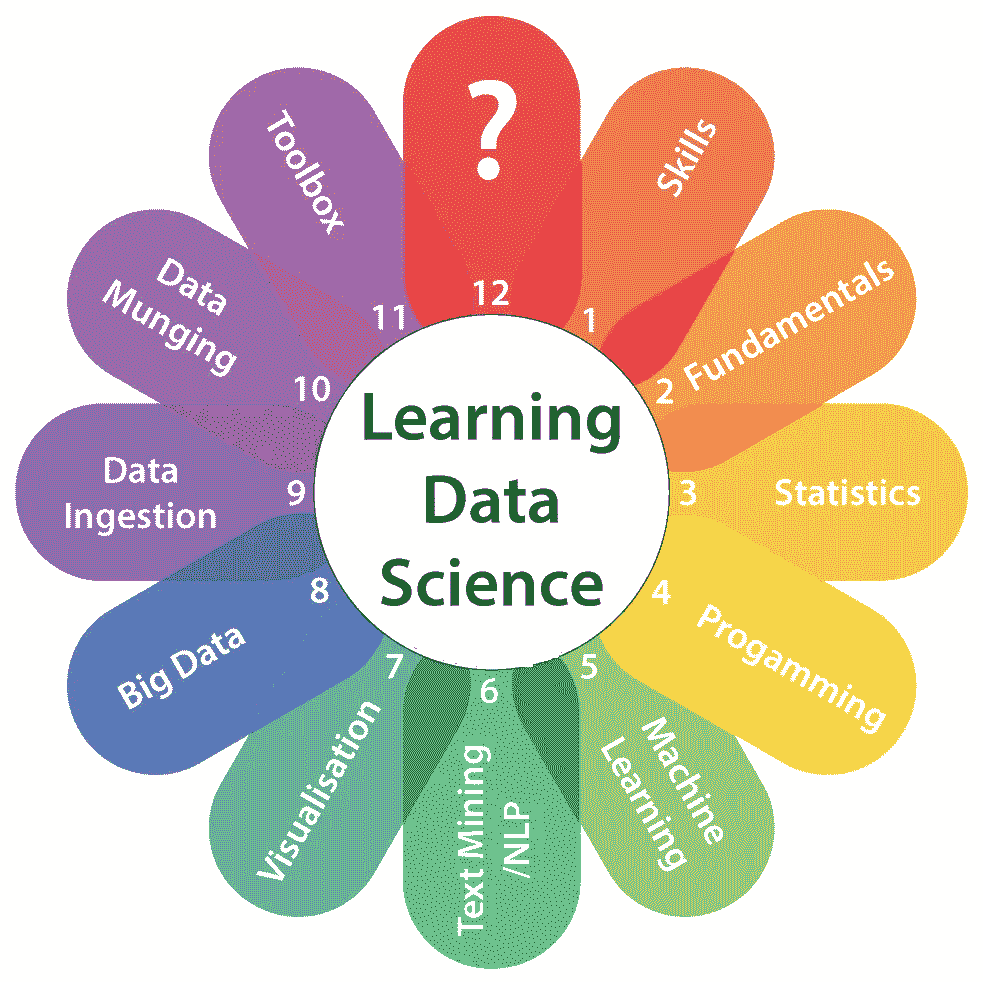

# 学习数据科学——4 个不为人知的事实

> 原文：<https://medium.com/quick-code/learning-data-science-4-untold-truths-4fd2e2e4a798?source=collection_archive---------0----------------------->

你有没有想过学习数据科学？你并不孤单。在过去的几年里，这一直是一个非常热门的话题，在接下来的几年里，肯定也会是这样。然而，很少有人真正成为数据科学家。

为什么？

嗯，部分问题是许多有抱负的数据科学家不知道从这个领域可以期待什么。或者更糟糕的是，基于许多误导性的(有时是 scammy)“如何成为数据科学家”的文章，他们抱有错误的期望。当他们碰壁的时候，他们会失去动力并退出。

在这篇文章中，**我想向你展示关于学习数据科学**你应该知道的四个不为人知的真相——我以前从未在其他地方看到过它们被写下来。

# 不为人知的真相#1:学习数据科学很难！

**学习数据科学并不容易。这需要你付出大量的工作、精力和时间。**

最近在我的 Instagram feed 里看到一个广告，上面写着:
*“参加这个课程，1 个月掌握数据科学！”*

我当时就想:*真是胡说八道！？*

我从事数据科学已经 6 年多了。我担任过高级 DS 职位(除了教学之外)。但我不会说我*掌握了数据科学或分析*。我知道一个事实，没有人能在 1 个月内掌握数据科学。事实上，我个人的估计(基于我接触过的学生)是，从零到初级水平的学习过程需要大约 6-9 个月。
(本课程将详细介绍: [**数据科学在线培训**](https://onlineitguru.com/data-science-course.html)

**学习数据科学很难！**
少数在线教育平台暗示相反。

*   *“这个查询只改一个字。运行它！嘣，你学会了 SQL…"*
*   *“只要看一下讲师运行 Python 代码的这个视频课程，你也会知道 Python 的……”*
*   *“只要摆弄一下这个交互式图表，你马上就会理解回归分析…”*

两年前，我面试了一个初级 DS 职位的人。他没有任何实践经验，但他在一个流行的“只需将代码输入浏览器”的在线学习平台上学习了 SQL。(具体平台我这里就不点名了。:-))

我给了他一台开着 SQL 管理器的电脑，还有一个简单的现实任务。他必须连接两个 SQL 表，然后做一个简单的分段。他解决不了这个任务！他遇到了语法错误，他不能调试他的代码，他不能得到上下文，他不能发现数据…

**而这时候我才意识到，这些网校很多给人的只是数据科学知识的错觉。**

# 你想拥有真正的数据科学知识

你要有真正的数据科学知识。但是这需要什么呢？

嗯，首先也是最重要的: **(1)大量实践(2)在真实的数据环境中。**
不要试图跳跃式前进:花时间和精力，建立自己的数据服务器！

是的，有时候(嗯，通常在开始的时候)你会打错一段代码，你的电脑会报错，这很烦人。但事情就是这样的！**我们会犯错，我们会从中吸取教训，下次我们会做得更好。**

并且还要花时间大量练习！
当你练习的时候，**犯些愚蠢的错误没关系。**例如，不小心弄乱了你之前构建的数据管道，损失了几个小时的工作时间，这没什么大不了的……(这种情况在我的学生身上时有发生。)但是，再说一遍:在现实生活的数据项目中，我们都会做傻事。至少，我在大三的时候是这样做的——这花费了我很多额外的工作时间。但我从中吸取了教训。

我们会犯错，我们会从中吸取教训，我们不会再犯。

> *注意:怎么练？我在上述* [***数据科学在线课程***](https://onlineitguru.com/data-science-course.html) ***中分享了几个(甚至更多)想法。***

学习数据科学并不容易，需要时间。如果你不能接受这个事实，那么也许这个职业并不是你的最佳选择。但是如果你不介意艰难地学习数据科学，这几个月的学习时间将是你最好的长期投资之一。(下面我再回到这个。)

# 不为人知的真相#2:这不是“学习数据科学”，而是“提高你的数据科学技能”

世界变化真的很快，不会再慢了。我坚信，如果一个人想要跟上时代的步伐，唯一的方法就是专注于提高技能。

为什么？你可能已经听说了，根据研究人员的预测，今天 65%的小学生将从事尚不存在的工作。

您可能还听说过，目前工程相关信息的估计“半衰期”约为 4 年。所以，你今天学到的关于 IT 的 50%的东西在 4 年内都会过时。

这对你来说意味着什么？
***你获得和提高的技能*远比你学到的实际信息*重要。***

也意味着“学习数据科学”不是关于 ***学习*** 数据科学。

它是关于:

*   *提高*你的编码*技能*。
*   *提高*你的业务*技能*。
*   *提高*你的数学/统计*技能*。
*   *提高*你的数据可视化、展示、交流和其他软*技能*。

学习数据科学不是为了:

*   学习 Python 的某个包。

 [## 使用 python 的数据科学|数据科学博客| OnlineITGuru

### 数据科学的编程概念需要一种简单的语言，实现代码和管理代码应该很简单

onlineitguru.com](https://onlineitguru.com/blog/data-science-with-python) 

*   了解这个或那个 KPI 的不同行业基准。
*   学习某些统计模型。
*   学习如何使用谷歌数据工作室或 Tableau。

今天看似重要的东西，在 5 年后可能变得无关紧要
,因为掌握 Scikit-learn 库或 Google Data Studio 等工具在今天看起来可能很重要……但我敢打赌，5 年后将会出现更好的机器学习包和更好的数据可视化软件。

不要误解我，我仍然认为今天，你应该学习这些东西，因为它们是当前数据科学和分析生态系统的一部分，也是学习曲线本身的一部分。

我是说，你应该记住，当你学习这些(或任何其他)工具时，重要的事情不是塞进每一个小的语法细节，或者哪个按钮在特定软件中的什么位置——而是理解大图。为什么该工具会以这种方式工作？背后的逻辑是什么？这个功能在其他类似工具中是如何工作的？一旦掌握了这些，在工具之间(甚至在编程语言之间)进行转换将变得轻而易举。

你将为不断变化的未来做好更多准备。

**因此，为了让你的数据科学职业经得起未来考验:专注于你的技能，而不是你学到的信息！**

# 不为人知的真相#3:因为很难，学习数据科学是一项伟大的投资

我们也来谈谈职业前景吧！
学习数据科学是一项巨大的短期和长期投资。
短期投资部分我估计不用解释了。

*“对数据科学家的需求高得惊人……几乎每个美国大城市都存在数据科学技能短缺的问题。在全国范围内，我们缺少 151，717 名具有数据科学技能的人，纽约市、旧金山湾区和洛杉矶的短缺尤为严重。”*

此外，根据 Glassdoor 的研究，数据科学家连续三年被评为美国最好的工作。

*注意:以上数字仅适用于美国——我没有欧盟或世界其他地区的确切数据。但以我的经验来看，在欧盟我们也有同样的趋势。*

高需求和持续短缺让数据科学家处于非常有利的位置。意思是:

*   **更高的薪水和更好的福利**
*   **更好的工作保障**
*   **更好的工作条件(例如，弹性工作时间、在家工作等。)**

此外，数据科学家在公司内部是一份备受尊敬的工作(在外部世界也是如此)。你将成为你的经理和同事愿意倾听的人。

关键是:学习数据科学无疑是一项不错的短期投资。

 [## 最佳数据科学面试问答- 2019

### 你是正确的地方，如果你正在寻找数据科学面试问题和答案，获得更多的信心来破解…

onlineitguru.com](https://onlineitguru.com/interviewquestions/data-science-interview-questions) 

# 但是学习数据科学也是一项好的长期投资吗？

我的答案是**是的**我有两个原因。

**理由#1:** 只看数据！2018 年，美国数据科学家的缺口为 151，717 人。2011 年，这一数字约为 14 万。因此，在 7 年内，市场无法产生足够多的新数据科学家来填补空白。(甚至还长了一点。)

**原因 2:** 这是我在介绍中已经提到过的。许多人想学习数据科学…然而，他们中毕竟没有多少人成为数据科学家。
为什么？因为学数据科学很难。它是硬技能(如学习 Python 和 SQL)和软技能(如业务技能或沟通技能)等的结合。
**这是一个没有多少学生能过的入学门槛。他们受够了统计、编码或太多的商业决策，于是辞职了。**

所以问题是:

*   数据科学适合你吗？
*   如果是:你愿意付出努力和辛勤工作吗？

如果是的话，这将是你一生中最好的职业投资之一。

# 不为人知的真相#4:学习数据科学不是学习机器学习、深度学习(或任何其他数据术语)

如果让你猜，你认为数据科学家工作中最耗时的部分是什么？

换句话说，你认为在真正实践数据科学和分析时，你最需要做的是什么？

*提示:不是机器学习。*

答案是…
。
。
。
**…数据清理。**

数据科学家常说:*“80%的数据科学是数据清洗。20%的人抱怨数据清理。”*
好吧，显然，那是个笑话。

但当你进入第一个数据科学角色时，你会亲眼看到:这不是全天候进行机器学习和预测分析。

因为为了能够运行适当的 ML 算法，您必须首先完成许多其他步骤:

*   数据收集
*   数据格式编排
*   数据清理
*   将数据转换为正确的格式
*   发现和理解数据
*   运行其他数据分析项目
*   数据可视化
*   自动化上述步骤
*   诸如此类…

相信我:当你处理真实数据时，这些事情就像机器学习和预测分析一样令人兴奋。

# 那么什么是重要的呢？

当你在学习数据科学时，你不应该专注于打磨你的 ML 技能。相反，你应该关注:

*   熟练使用 Python 和 SQL
*   理解更简单的分析方法背后的业务逻辑
*   熟悉统计学的基础知识
*   练习和体验使用原始和未清理的数据集的痛苦
*   学习如何自动化
*   诸如此类…

这些东西将帮助你成为一名更好的数据科学家，并最终获得你的第一份工作——而不是另一门深度学习或人工智能课程。

 [## 具有深度学习的数据科学|数据科学博客| OnlineITGuru

### 深度学习被称为机器学习的子部分。它涉及到针对功能的算法和系统的设计

onlineitguru.com](https://onlineitguru.com/blog/data-science-deep-learning) 

所以总结一下:

*   **学习 Python 和 SQL–重要**
*   了解深度学习——不重要
*   **学习统计学基础知识——重要**
*   学习人工智能——不重要
*   **实践数据清理、数据格式化和自动化–重要信息**
*   理解“人工神经网络”——不重要

至少，在初级水平…
稍后(1 或 2 年内)，当你的职业生涯向前发展时，你将不得不在工作中学习上述这些花哨的机器学习方法。

但是现在:把注意力集中在对你下一步重要的事情上！

# 结论

我知道:成为数据科学家、机器学习大师、深度学习大师……这些听起来都很令人兴奋。你最终会到达那里。
*(我是说，如果你想的话。例如，我从对业务有更大影响的更简单的分析项目中获得了更多的乐趣。*