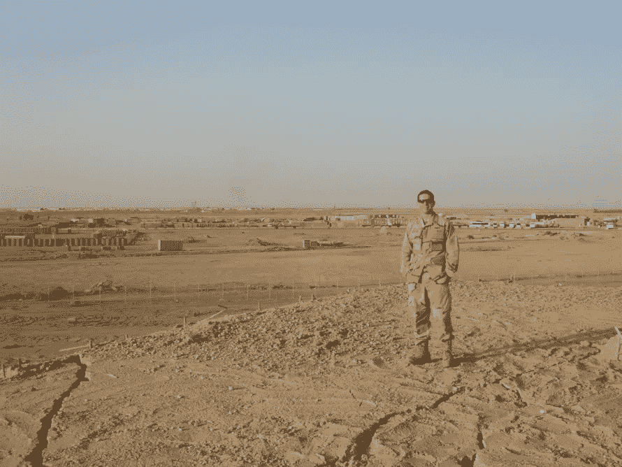
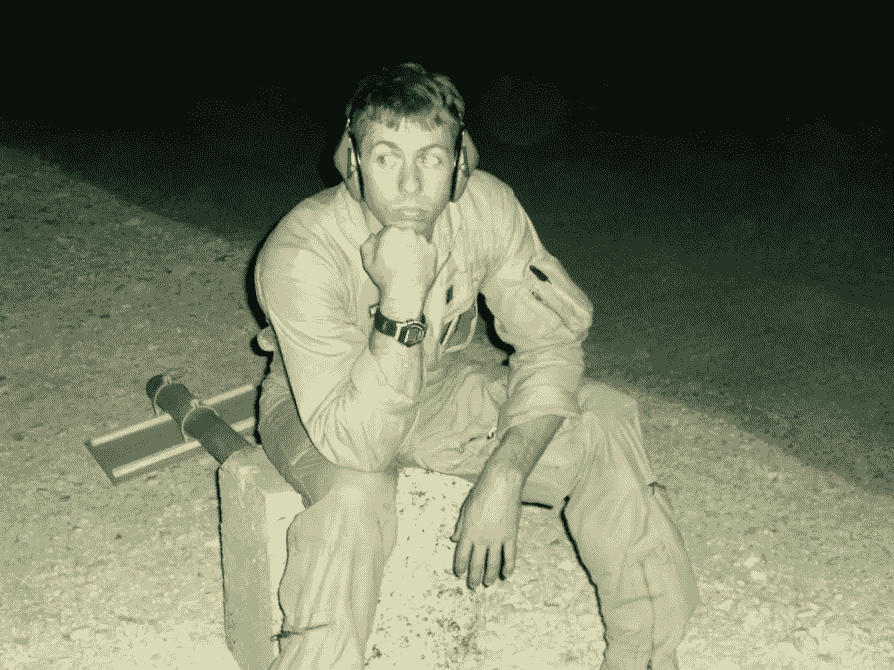

# 从灾难中学习:坠毁的飞机到高效的团队

> 原文：<https://medium.com/capital-one-tech/learning-from-disaster-crashing-planes-to-productive-teams-132ce0d40a38?source=collection_archive---------4----------------------->

## 关于构建软件，团队资源管理能教会我们什么

在我成为软件工程师之前，我是美国海军的一名空勤人员。回顾我作为一名海军空勤人员的时光，我学到了许多重要的经验教训，这些经验教训能够应用到我的软件开发工作中。无论我们谈论的是空勤人员还是软件开发人员，团队在风格和方法上可以有很大的不同。

在这两种角色中，我所在的团队都依赖于他们的成员不仅拥有自己的职能(飞行员、雷达操作员、飞行工程师与移动、网络、后端开发人员)，还能有效地交流信息，并就重要问题畅所欲言，而不管站在哪个位置。

虽然这些是任何运作良好的团队的重要属性，但这些团队合作技能是在海军中专门训练的，并且我将这些技能带到了我的科技职业生涯中。这种培训被称为机组人员资源管理(CRM)培训，由美国宇航局艾姆斯在 20 世纪 70 年代开发，旨在解决在涉及功能完好的飞机的事故中人为错误的作用。

# 人为错误的作用

那么，是什么导致了 CRM 的产生呢？

激励 CRM 培训发展的重大事件之一是 1978 年联合航空公司 173 号航班的坠机事件。

根据国家运输安全委员会(NTSB) *(脚注 1)* 的消息，173 航班的机组人员在降落前正在波特兰机场上空盘旋，对起落架的一个问题进行故障排除。在 DC-8 的驾驶舱里，坐着飞行员、副驾驶和飞行工程师，他们正在勤奋地处理应急起落架着陆检查清单。根据驾驶舱语音记录器，飞行工程师在多个场合提到燃料供应减少。不幸的是，飞行员未能理解燃料情况的严重性，在剩余燃料不到五分钟的情况下掉头离开了机场。由于燃料耗尽，173 号航班最终坠毁在离机场 6 英里的地方。

关于这次事故的更多信息可以在这里阅读[。](https://en.wikipedia.org/wiki/United_Airlines_Flight_173)

# CRM 和共享心智模型

CRM 旨在鼓励机组成员之间更好的沟通，以更好地促进共享心理模型并减少这些事件的发生。虽然 CRM 培训根据开发培训课程的军事部门或航空公司而采取不同的形式，但它现在是任何军事或民用空勤人员培训的必修部分。

我在美国海军巡逻中队 47 担任空战系统操作员期间，我的客户关系管理培训包括七个因素，按排名顺序排列如下:

1.  **情境感知**
2.  **决策**
3.  **自信**
4.  **任务分析**
5.  **通信**
6.  **领导**
7.  **适应性/灵活性**

## CRM 和软件开发

*AW2 Norman Standing on an abandoned Hardened Aircraft Shelter (HAS) at Ali Air Base / Camp Adder, Iraq.*

自 20 世纪 70 年代以来，客户关系管理已经成为飞行员和机组人员航空培训的主要内容。如今，CRM 培训的原则开始在驾驶舱之外的领域得到应用，在这些领域中，人为错误会影响预期的结果。例如，一些医院已经对手术室进行了 CRM 培训，以减少医疗从业人员中的人为错误*(脚注 2)* 。但是 CRM 适用于像软件开发这样良性的东西吗？的确，我们的故障模式远没有严重到威胁生命的程度。然而，如果你正在阅读这篇文章，并且你和我一样，你可能不认为任何关于软件开发的事情是良性的。虽然软件项目可能需要更长的时间才能失败——并且当它们失败时会产生明显不同的影响——根据 IAG 咨询公司 2008 年的一项研究，68%的软件项目有“不大可能成功的机会”*(脚注 3)* 如果改进的共享心智模型能够像在飞行和外科手术中一样积极地影响这个数字，会怎么样？

虽然一个软件开发项目的失败可能并不意味着生与死的区别，但是仍然可以从 CRM 中旨在减少错误和促进更有意义的交流的团队合作原则中学到很多东西。让我们一个一个的来看这七个方面。

# **情境感知**

由 DARPA 赞助的海军分析中心写了一篇 70 多页的论文，关于定义和测量共享态势感知(脚注 4) 。我不想在这里潜那么深。该论文中的一段引文将态势感知定义为*“一幅清晰、准确、通用、相关的战场图像。”软件工程师每天都在极其复杂的战场上工作。作为一名与开发团队一起解决问题的软件工程师，在开始工作之前建立一个共享的问题心智模型是很重要的。*

在对软件应用程序中的问题进行故障诊断时，尽早就有关情况的某些基准因素进行沟通非常重要。我们在哪个环境中进行故障诊断？我们有导致问题的代码的快照吗？我们是否有来自发生崩溃的前端的日志以及任何相关的会话后端日志，这些日志可能有助于建立导致崩溃的情况的更好的心理模型？

你的团队可能有他们自己的特定需求来建立一个共享的心智模型，所以在你下一次意想不到的作战室 bug bash 之前，花些时间好好想想会是什么。

美国海岸警卫队提供了一些有用的提示，以确定你或你的团队是否正在经历情景意识的丧失*(脚注 5)* ，并可能需要采取纠正措施。如果你发现自己是在凭直觉而不是按照正确的程序操作，或者开始发现自己专注于一个可能无法解决更大问题的问题，那么这可能是一个很好的时机，与你的团队一起回头，确保每个人都在同一页上。对一个问题进行故障诊断和过度关注解决方案的交付可能会导致您跳过某些过程，比如运行单元和集成测试。但是如果不进行这些检查，最终可能会导致更大的问题。

*注意——如果你的 CI/CD 管道设置正确，你将无法跳过这些步骤，Jenkins 也是你的队友:)*

# **决策**

每天，从你第一次启动电脑的那一刻起，你就被各种信息淹没了。然而，没有完整的信息，或者完美的信息，你永远无法做出完美的决策。你*能*做的是利用你拥有的信息，运用逻辑和合理的判断做出可能的最佳决策。

虽然有些决定很容易，但其他决定可能需要一个框架来解决问题。在培训手册*直升机飞行员航空决策(脚注 6)* 中描述了一个解决问题的框架。

*   检测变化
*   估计变化的重要性
*   选择结果
*   确定选项
*   做最佳选择
*   评估结果

举一个你的 app 所依赖的第三方 API 突然宕机的情况。显然，要做出任何决定，你必须能够**察觉到变化的发生**，所以请记住，做出决定所需的信息不仅需要准确和充足，而且*及时*。接下来，您必须**确定这一变化的重要性**。这对你的用户来说只是一个小小的不便，还是这种破坏应用的行为？这个问题的答案可能意味着直接调用第三方 API 的 CTO 或简单地确保错误状态得到正确处理之间的区别。

在确定一个问题或变化的重要性时，你可以用一些问题来帮助确定变化的重要性。摘自《海岸警卫队决策培训手册》*(脚注 7)* :

*   谁受影响；谁不是呢？
*   什么情况受影响；有哪些相关的东西不受影响？
*   问题出在哪里？
*   问题是什么时候出现的？
*   受问题影响的区域会影响其他区域吗？到什么程度？

一旦知道了变化的重要性，你必须**确定结果应该是什么**。例如:*“用户甚至不应该意识到 API 关闭了。”*在这种情况下，各种利益相关方当然需要参与确定期望的结果。然后是工程**决定实现这一理想状态的选项**。这些选项可能包括:

*   不要让用户看到损坏的功能，只需关闭它。
*   在该供应商关闭时使用替代 API。

一旦确定了选项，您必须执行**实现选项**所需的步骤。最后，当变革被推动时，工作还没有结束。确保**验证变更符合团队选择的结果的期望**。

# **自信**

军衔结构是美国军队文化的重要组成部分。在大多数军事环境中，通常不会询问上级。飞机甲板是一个独特的情况，任务的利益和机组人员的安全比一些标准的军事协议更重要。例如，最低级别的机组成员向任务指挥官提出飞机上的不安全状况是完全可以接受的。

自信是军用飞机上的一项资产，因为以自信方式行事的人这样做是因为他们与任务的结果和成功有利害关系。表现出自信行为的软件开发人员也是如此。

*在软件开发团队中表现得自信意味着你关心产品，并且愿意冒险提出自己的想法并证明它们是错误的。这是自信的一个重要方面。自信不是侵略性的行为，也不意味着将你自己的想法凌驾于他人之上，因为它们是你的想法。它意味着“愿意积极参与、陈述并保持一种立场，直到被其他选择更好的事实所说服。”(脚注 8)*

软件开发团队的所有成员都有责任在软件开发过程中积极地提出他们的最佳想法，并在遇到问题时提出来。这也取决于软件开发团队的领导者如何利用这种能量，确保团队成员感到被授权，并喜欢团队倾听他们的想法或注意他们的警告。

# **任务分析**

客户关系管理的这一方面是军事部门所特有的，在民用的 FAA 客户关系管理培训指南中没有涉及。我在这里包括它，因为我认为软件开发的动态环境受益于它作为减少风险的一个重要因素。正如在没有完善计划的情况下承担任何军事任务都是灾难性的一样，在没有完善计划的情况下承担一个新的软件功能或应用程序也同样是灾难性的。

花在紧急事件上的时间全部回到最初的任务分析。任务分析应该在紧急情况发生之前进行，所以在整个开发过程中牢记这一点是件好事。就像天气变化会给军事任务带来麻烦一样，影响软件开发项目的因素每天甚至每分钟都会发生显著的变化。这类问题应该在项目的规划阶段早期识别出来，并且应该建立系统来监控发生的变化，并在需要时提醒团队的其他成员。

虽然应该预料到情况可能会改变，但这并不是完全没有计划的借口。一个计划开始得越好，你的团队接受和适应变化的准备就越充分。

冲刺规划和准备是你在软件开发中主要的任务分析机会。这里有一些有效的操作规划技巧，你可以尝试应用到你的会议中。为你积压的每一个故事考虑这些要点可能会发现有趣的结果。*(脚注 9)*

*   根据任务要求定义任务。

例如:如果你的一个故事是关于帮助用户更容易地找到你的应用程序上的帮助按钮，请确保根据具体要求创建任务来解决这个故事。*“我们应该如何让帮助按钮更容易找到？我们应该改变颜色还是把按钮变大？”*

*   质疑与任务完成相关的数据或想法。

例如:如果我们的目标是确保用户在需要时得到帮助，也许我们可以识别他们何时遇到问题，并提示他们是否直接需要帮助？

*   讨论任务的长期和短期计划。

例如:也许在短期内，我们可以将按钮做得更大，同时创建一个长期计划来更好地分析用户行为，以便我们可以积极地确定他们何时需要帮助。

*   识别潜在危险和计划外事件对任务的影响。

示例:增加按钮大小可能会导致不同方向或尺寸的问题，让我们确保测试所有这些场景。

# **通讯**

我曾经认为航空无线电是现代最糟糕的通讯方式…然后我发了一封群发邮件。令人惊讶的是，在书面交流中，语境和语气可能会消失，这使得通过电子邮件或 Slack 进行交流的艺术变得更加重要。

为了节省资源和时间，清晰的沟通是每个团队都必须努力的事情。记住，即使面对面的交流也不能保证更好的结果。你有没有告诉别人一些你认为非常重要的事情，却让他们说他们根本不记得你告诉过他们？在有压力的情况下，人们通常会对你告诉他们的事情说“好的”——不管他们是否真的记下了你的话。

你不仅可以本能地承认别人告诉你的话，还可以向他们重复他们的话，甚至重新措辞，以确保你理解他们话背后的意思，从而改善你自己的沟通。

记住——沟通是所有其他 CRM 技能所依赖的技能。如果你没有足够的交流，或者没有有效的交流，那么其他的技能都不重要。

# **领导**

对于一个空勤人员来说，领导不仅仅是飞行员或任务指挥官的责任。每个机组成员都有一个专业领域，这使得他/她在机组中的位置很特别。这种专业知识使他们特别适合于识别与其领域/专业知识相关的某些问题。同样，一个软件开发团队的每个成员都特别适合根据他们的专业领域来解决不同的问题。

领导力的一部分是永远不要假设，因为你不在指定的领导位置，你不能以这样或那样的方式领导团队。虽然认识到指定的领导者对决策有最终决定权是很重要的，但这并不意味着你的声音不能成为指导团队做出最终决策的声音之一…事实上它应该是！

软件工程师爱解决问题已经不是什么秘密了。不幸的是，有时我们太喜欢解决问题，以至于在试图解决别人的时候制造问题，或者我们把注意力放在我们想解决的有趣问题上，而不是需要解决的重要问题上:

**“我将编写单元测试…但首先我必须找到完美的框架”**

[(1 周后)](https://en.wikipedia.org/wiki/List_of_unit_testing_frameworks)

**“这些都不完全符合我的用例…我需要编写自己的框架！”**

初级团队成员可以通过简单地围绕可能引入的开发任务提出澄清性的问题，来很好地平衡潜在的低效任务。问“为什么”总是一个有用的练习，因为如果“为什么”你不清楚，别人可能也不清楚。然后，如果“为什么”仍然没有意义，你可能有机会带领你的团队走上正确的道路。

# **适应性/灵活性**

在艰难的情况下保持灵活的能力和适应任务中途可能发生的变化的能力是空勤人员需要学习的关键技能。

软件开发人员也可以被要求以令人惊讶和重要的方式保持灵活性。愿意适应这些变化会造就一个好的开发团队，一个伟大的开发团队。被要求适应通常是对你适应环境能力的承认**。这也是你脱颖而出的机会。团队可以通过多种方式展示他们的灵活性，从实现现有问题的新解决方案，到接管一个全新的项目，到支持一种新的语言或开发框架。**

在这些情况下，团队有两个选择——要么适应并生存，要么拒绝并在周围发生的新变化的压力下崩溃。

# **CRM 外卖**

*AW2 Norman on the Ali Air Base flight line contemplating CRM after a long flight*

机组人员资源管理的原则有助于通过提高团队意识和促进团队凝聚力来减少人为错误。保持飞机在空中和手术团队保持警惕和沟通的相同原则可以应用于软件开发团队。

这七种 CRM 技能都不是突破性的创新突破。我不相信告诉飞行人员、手术团队或开发团队*“专注于沟通”*会让任何人成为更好的沟通者。CRM 的价值并不是通过让一个团队成员专注于一两项技能而显现出来的，而是通过整个团队对 CRM 中提出的价值框架的认同而显现出来的。如果每个团队成员都明白，他们被期望以自己的方式展示领导能力，并变得自信，那么团队中的沟通将会变得更有成效。沟通培养了整个团队更强的**情境意识**，从而提高了**计划**和分析未来项目的能力。提前计划的团队将更有能力适应变化并做出更好的决策。

虽然 CRM 的开发是为了指导机组人员安全地完成旅程，但我希望下次您与开发团队合作时，将这些原则牢记在心，将有助于您更有效地解决问题！

# **脚注**

1.  [*https://www . NTSB . gov/investigations/incident Reports/Reports/AAR 7907 . PD*](https://www.ntsb.gov/investigations/AccidentReports/Reports/AAR7907.pd)*f*
2.  [*https://www.ncbi.nlm.nih.gov/pubmed/22462374*](https://www.ncbi.nlm.nih.gov/pubmed/22462374)
3.  [*http://www . techrepublic . com/blog/tech-decision-maker/study-68-percent-*](http://www.techrepublic.com/blog/tech-decision-maker/study-68-percent-)*of-it-projects-fail/*
4.  [*http://www . Navy . mil/Navy data/cno/Navy _ Maritime _ Domain _ Awareness _ C*](http://www.navy.mil/navydata/cno/Navy_Maritime_Domain_Awareness_C)*oncept _ FINAL _ 2007 . pdf*
5.  [*https://www.uscg.mil/auxiliary/training/tct/chap5.pdf*](https://www.uscg.mil/auxiliary/training/tct/chap5.pdf)
6.  [*http://www.tc.faa.gov/its/worldpac/techrpt/pm86-45.pdf*](http://www.tc.faa.gov/its/worldpac/techrpt/pm86-45.pdf)
7.  [https://www.uscg.mil/auxiliary/training/tct/chap6.pdfT21](https://www.uscg.mil/auxiliary/training/tct/chap6.pdf)
8.  [*http://www . netc . navy . mil/nasc web/CRM/ePUB _ Instructor _ Course _ Student _*](http://www.netc.navy.mil/nascweb/crm/ePUB_Instructor_Course_Student_)*Guide _ JUNE _ 2013 . pdf*
9.  [*https://www.uscg.mil/auxiliary/training/tct/chap3.pdf*](https://www.uscg.mil/auxiliary/training/tct/chap3.pdf)
10.  [*https://en . Wikipedia . org/wiki/List _ of _ unit _ testing _ frameworks*](https://en.wikipedia.org/wiki/List_of_unit_testing_frameworks)

***披露声明:以上观点为作者个人观点。除非本帖中另有说明，否则 Capital One 不属于所提及的任何公司，也不被其认可。使用或展示的所有商标和其他知识产权都是其各自所有者的所有权。本文为 2017 首都一。***

developer.capitalone.com*[****】。****](http://developer.capitalone.com)*