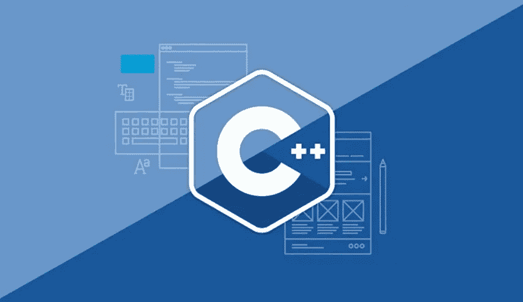

# 学习指南-如何开始 C++编程

> 原文：<https://medium.com/quick-code/learning-guide-how-to-get-started-in-c-programming-c31c11de52fd?source=collection_archive---------1----------------------->

一种经典的编程语言，位于汇编语言之上，C++是在大约 40 年前开发的。剑桥大学的博士生比雅尼·斯特劳斯特鲁普首先用类来称呼它为 C。它是第一种在高层次上结合了编写程序的简易性的语言，仍然作为汇编级语言与系统对话。在当前的世界中，C++的使用可以…