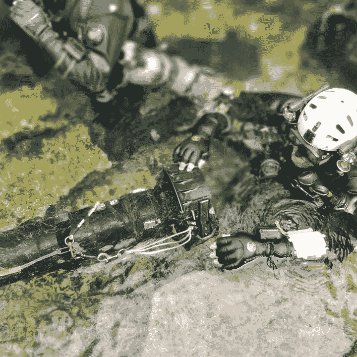

# 学习很有趣。知识是一种负担。

> 原文：<https://medium.com/version-1/learning-is-fun-knowledge-is-a-burden-891dca63eb5b?source=collection_archive---------5----------------------->

Author diving in Marche Pied, France

在我的空闲时间，我是一名技术潜水员。我计划并执行洞穴潜水，以此为乐。这不是我曾经打算要做的事情，它只是在过去的 22 年里发生了。

我第一次学习在马尔代夫温暖的水域潜水，那里非常温暖，我们只穿了短裤和 t 恤，我喜欢它，但我不可能在英国潜水，那里太冷了，太黑了，没有什么可看的(所以我想)。

不幸的是，我被这种错误迷住了，所以没过多久，我就在当地的潜水中心查找并预订了下一级课程。

娱乐潜水教育有趣且结构合理，它旨在吸引你进入课程，并总是让你想看下一集(就像一部好的电视剧)。

这和萨姆有什么关系？

我从未打算在 SAM 的世界里工作，我是一名“技术人员”，我为甲骨文工作，我热爱它(我之前已经承认[这个](https://www.linkedin.com/pulse/technology-186-vs-licensing-nil-jason-pepper/))。当我 2006 年离开甲骨文时，我被介绍到软件许可和 SAM 的世界。这是新的，不同的和有趣的(至少对我来说)。我遇到的每件事都是一个新问题，可以通过多种方式解决，我在软件开发和解决方案设计方面的背景让我想出了许多新的代码来解决问题。

我对 SAM 和软件许可了解得越多，我就越对“应该”让手头的任务变得简单得多的元数据感兴趣。这并不是说标准不存在。在我之前，许多聪明的人已经将他们的思想应用到这个问题上，并将解决方案发展成一套标准。ISO 19770 是一个吸引人的标题，它涵盖了软件资产管理的概念，并提供了一种标准化的方法来记录软件授权、使用和计算位置。

遗憾的是，与许多这些标准一样，软件供应商并不一定要遵守 ISO 19770 中适用于他们的部分。具体来说，我说的是处理标签或软件 ID (SWID)概念的[ISO 19770–2](https://en.wikipedia.org/wiki/ISO/IEC_19770#ISO/IEC_19770-2:_software_identification_tag)。想象一下，如果所有的供应商都标记他们的软件，以便 SAM 工具可以很容易地识别它，这将是多么容易？不幸的是，很多人不支持 SWID，在某些情况下，为了商业利益故意避开他们。

ISO-19770 是解决这个问题的一个善意的解决方案，但是除非得到软件行业的支持，否则它没有实施的动力。

因此，在缺乏一套所有人都认可的标准、方法和途径的情况下，SAM 市场就演变成了这样一个市场，在这个市场中，那些缺乏知识的人被卖给了不适合他们需求的解决方案，而这些解决方案通常是由不具备适当技能或经验的人提供的，以确保他们能够提供最好的建议。更糟糕的是，未受教育或部分受教育的人对解决问题的方法做出假设，最终被商业和金融违规行为的滚烫的水烫伤。

这让我又回到了潜水。

潜水行业与 SAM 市场非常相似，当你开始潜水之旅时，很难确保你得到最好的建议。

当然，这是有标准的，教师将接受培训来应用这些标准。然而，制定这些标准的机构名单令人难以置信。大多数人都听说过 PADI，但其他人呢？SSI，PSAI，NAUI，BSAC，CMAS，SDI，TDI，IANTD，RAID，CDG，GUE 怎么样？谁会想到有这么多的方法来记录和实现一套“标准”,当然，如果一个标准有这么多的版本，它就不再是一个标准了。

然后是教官。请注意我的话，当我告诉你，不是所有的导师都是生来平等的，是导师是与你沟通的渠道，是导师将标准应用于你并教育你。一个差的指导者不能实现一个好的标准。对你来说，问题是，直到你在潜水教育中走得更远时，你才会知道教练是否是个好教练。只交费不保证质量。

你觉得这些都是真的吗？我所说的关于潜水的事情同样适用于 SAM 行业。这有点像西部大开发，无论是那些不道德的软件销售人员，还是那些主要技能是自我推销的自封的专家，客户总是受害者。

自 2005 年以来，我一直在洞穴潜水，这既是一段非常有回报的时光(T1 ),也是一段潜在的限制生命的时光(如果做得不正确),它让从业者能够接触到我们地球上很少有人见过的部分(站在月球上的人比去过 T2 波佐阿苏尔 T3 洞穴的人还多)

即使在相对较小的洞穴潜水团体中，也已经发展出不同的标准和方法来解决从业者所面临的问题。

在英国，我们有 CDG，他在约克郡、萨默塞特郡、德比郡和威尔士的洞穴中发展洞穴探险和潜水，在那里潜水通常是零能见度的，至少可以说是最具挑战性的。CDG 洞穴潜水的方法是单人潜水，事实上任何潜水都是如此。完全自给自足，任何时候都要对自己负责。你让自己陷入问题，又让自己摆脱问题，否则你可能会过早死亡。

我们从佛罗里达州发展而来，那里的洞穴通道通常很宽，水非常清澈，我们有 [GUE](https://en.wikipedia.org/wiki/Global_Underwater_Explorers) ，他提倡三人一组进行团队潜水，每个人都使用相同的设备，以相同的方式配置，如果出现问题，你的队友会在那里帮助你。

这两种方法相距甚远，但它们都有各自的支持者和实践者。像往常一样，有狂热者会告诉你潜水的唯一方式是他们的方式。这告诉我的是，他们在潜水旅程中还没有走得足够远，以至于意识到每种方法都有其优点，都有一个它擅长的环境。

我并不是刚刚意识到这个结论，这是一种来之不易的心态。我的教育者的产物，犯错误，从书本和网络上吸收信息，自己思考。

完全相同的咒语适用于 SAM 世界。一个问题从来没有单一的解决方案([尤其不是 SAM tools](https://www.youtube.com/watch?v=yE6jrnBtKaE&) )，同样，在某些情况下，一些解决方案比另一些更好。问题是，你怎么知道哪一个适合你和你的环境？

很简单。与尽可能多的业内人士交谈，向工具供应商询问真实世界的演示，与他们的参考客户交谈，加入论坛并进行大量阅读。你也可以给自己找一个有经验的 SAM 顾问，他可以建议你正确的方法、正确的工具和最好的人来帮助你实现你想要实现的目标。好的人会非常乐意与你坦诚交谈。

一旦你吸收了所有的信息，并将其提炼为一套观点，对工具供应商告诉你的任何事情都应用一剂健康的犬儒主义，你将走上觉悟之路。

那么，为什么学习乐趣和知识是一种负担呢？

很简单，你知道的越多，你就越意识到风险和陷阱。我总是喜欢学习新的潜水相关技术，研究设备，并会见新的潜水员，他们可以教我一些东西。所有这些知识都是有代价的，代价是因为我已经了解了潜水的风险以及如何减轻这些风险，所以我越来越不愿意在不减轻这些风险的情况下潜水，有时这是不可能的。同样的情况也适用于山姆，我学得越多，就越意识到问题从来没有简单的答案。向门外汉解释这一点既费时又令人沮丧。问题是，我不能只给[简单的](https://dilbert.com/strip/1995-11-17)答案。

如果你喜欢谈论山姆或潜水，我很想听听你的意见。

**关于作者** Jason Pepper 是 SAM Practice 第一版的负责人。