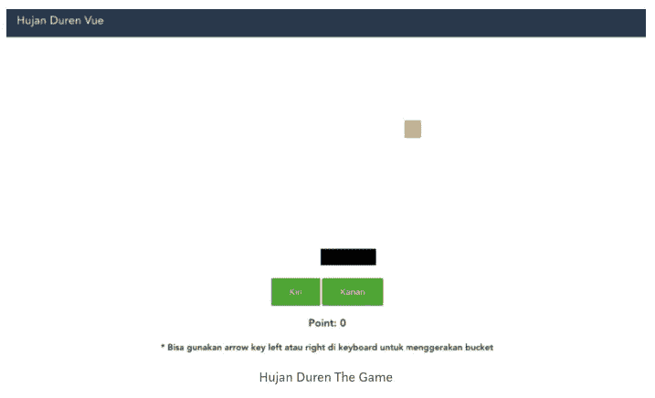
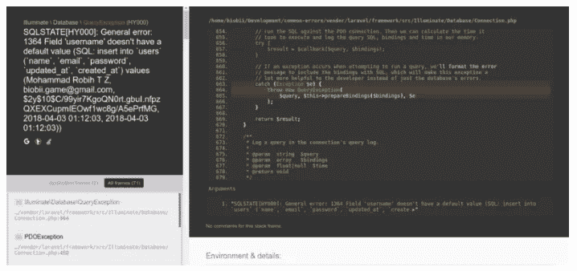
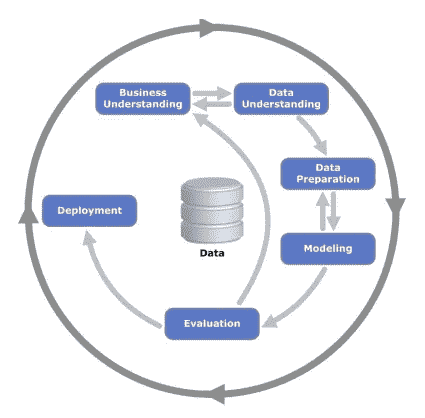

# Learning is: Transforming the Hardest Way to the Simplest Way

> 原文：<https://medium.easyread.co/learning-is-transforming-the-hardest-way-to-the-simplest-way-9b56cf4b0c0b?source=collection_archive---------8----------------------->

Hello *Easyreaders* Berikut top artikel [Easyread](https://medium.com/easyread) pada bulan April.

## JavaScript

> Di NPM, jika kamu ragu akan dependency yang kamu pakai, maka sesungguhnya kamu tidak membutuhkannya.

[**Belajar Redux dalam 3 Menit**](https://medium.com/easyread/belajar-redux-dalam-3-menit-b9afc7bc59f0) by [Haidar Afif Maulana](https://medium.com/u/631846fabf4?source=post_page-----9b56cf4b0c0b--------------------------------)

State merupakan salah satu fitur unggulan yang ada di *library front-end modern* ***Jaman Now*** yang biasa digunakan untuk ***SPA* ( *Single Page application* )** . Salah satu masalah yang dihadapi ketika membuat aplikasi SPA adalah mengolah *state* (data). Karena satu *state* yang ada di suatu komponen tidak bisa diambil oleh komponen lainnya.

[***Read more…***](https://medium.com/easyread/belajar-redux-dalam-3-menit-b9afc7bc59f0)

[**Membuat Game dengan Vuejs**](https://medium.com/easyread/membuat-game-dengan-vuejs-hujan-duren-the-game-c7d5ea886132) by [Haidar Afif Maulana](https://medium.com/u/631846fabf4?source=post_page-----9b56cf4b0c0b--------------------------------)

Kalau lagi belajar ngoding, kita pasti pernah kepikiran pengen banget bisa bikin game, *kan* ? Pasti. *Nah* di tulisan ini saya akan membagikan bagaimana cara membuat game di *website* dengan menggunakan vuejs. Gamenya gak usah yang berat-berat, yang sederhana saja. Nama gamenya **Hujan Duren.**

[***Read more…***](https://medium.com/easyread/membuat-game-dengan-vuejs-hujan-duren-the-game-c7d5ea886132)

## Golang

[**Deteksi Slow Function di Golang dengan Profiling**](https://medium.com/easyread/deteksi-slow-function-di-golang-dengan-profiling-2f6e5e51c1c) by [Iman Tumorang](https://medium.com/u/ef42567fbbae?source=post_page-----9b56cf4b0c0b--------------------------------)

Langkah sederhana untuk mendeteksi slow function di golang menggunakan pprof. Berangkat dari permasalahan yang kami alami ketika membangun sebuah fitur di Kurio.

Saat kami melakukan proses *deploying* untuk fitur tersebut *,* penggunaan CPU server kami tiba-tiba naik. Tentu saja hal tersebut sangat mengganggu, sehingga diperlukan penanganan serius. *What really happen there* ?

[***Read more…***](https://medium.com/easyread/deteksi-slow-function-di-golang-dengan-profiling-2f6e5e51c1c)

## Software Development

[**Dokumentasi Pengalaman Error pada Laravel #1**](https://medium.com/easyread/dokumentasi-pengalaman-error-pada-laravel-1-e3bcc4502f3c) by [Biobii](https://medium.com/u/37ae403df215?source=post_page-----9b56cf4b0c0b--------------------------------)

Setiap belajar pemrograman, pengalaman bersama *error* pasti terjadi. Mendokumentasikan hasil belajar sangat membantu proses pembelajaran. Menyerap materi belajar akan lebih cepat bila melibatkan banyak anggota tubuh. Mata untuk membaca, tangan untuk menulis dan telinga untuk mendengar. Tulisan ini saya buat untuk tujuan mendokumentasikan *error* yang pernah saya alami selama proses belajar.

> **Damian Conway** pernah mengatakan “dokumentasi adalah surat cinta kamu untuk masa depan”. Yang saya maksud disini bukanlah dokumentasi dari orang lain, tetapi dokumentasi yang kamu lakukan selama proses belajar.

[***Read more…***](https://medium.com/easyread/dokumentasi-pengalaman-error-pada-laravel-1-e3bcc4502f3c)

## Machine Learning

[**Sedikit Ilmu Tentang Pembelajaran Mesin**](https://medium.com/easyread/sedikit-ilmu-tentang-pembelajaran-mesin-58b9d375a38f) by [Greace Maulina Situmorang](https://medium.com/u/ea11b2d7b02c?source=post_page-----9b56cf4b0c0b--------------------------------)

Apa itu Pembelajaran Mesin? Kali ini kita akan membahas mengenai dunia ***Machine Learning*** . Seperti yang kita ketahui, saat ini *machine learning* menjadi topik yang hangat dibicarakan.

Di dunia *machine learning* kita belajar mengenai bagaimana kita membuat sebuah *agent* dapat mempelajari sesuatu. Dalam dunia *machine learning* sendiri, kita bekerja dengan *big data* , yang artinya bekerja pada data yang jumlahnya sangat banyak.

[***Read more…***](https://medium.com/easyread/sedikit-ilmu-tentang-pembelajaran-mesin-58b9d375a38f)

## Game Development

[**Part 2: UnityEngine Entity Component System (ECS)**](https://medium.com/easyread/part-2-unityengine-entity-component-system-ecs-cb22322d737f) by [Leo Pripos Marbun](https://medium.com/u/ea9a874c360d?source=post_page-----9b56cf4b0c0b--------------------------------)

**UnityEngine** adalah contoh *game* *engine* yang menggunakan **ECS** untuk pengembangan aplikasi di atasnya. Pada UnityEngine, konsep ECS diperkenalkan dengan istilah yang berbeda, yaitu :
- **Entity** direpresentasikan dengan **GameObject
- Component** direpresentasikan dengan **MonoBehaviour
- System** direpresentasikan dengan **MonoBehaviour.** [***Read more…***](https://medium.com/easyread/part-2-unityengine-entity-component-system-ecs-cb22322d737f)

Untuk menciptakan sesuatu yang istimewa merupakan hal yang sulit. Kamu membutuhkan ide dan kerja yang keras yang ekstra. Bahkan tidak sampai disitu saja, saat kamu sudah menciptakan sesuatu, kamu akan menemukan kesulitan lainnya dan sering sekali tidak dapat menceritakan apa yang akan kamu buat, dan kamu mengalami kebuntuan dengan ide kamu. Akan tetapi, Roma tentu saja tidak dibangun dalam satu malam. Sama halnya dengan proses yang harus kamu alami. Hanya dengan berlatih dan belajarlah yang akan mengasah kemampuan kita untuk menciptakan sesuatu.

Mari ceritakan ciptaanmu hari ini di [Easyread](https://medium.com/easyread) . Biarkan jemari dan kata-katamu menjelaskan bahwa kamu sudah melakukan hal tepat hari ini. Easyread is calling for [submission](https://medium.com/easyread/about-easyread-74b20960e180) . 😄