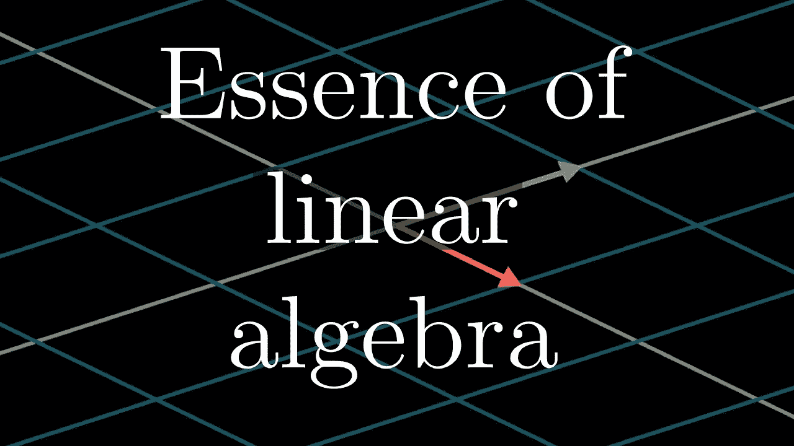

# 用 Scala 学习线性代数

> 原文：<https://medium.com/quick-code/learning-linear-algebra-with-scala-afa1f2fd76d4?source=collection_archive---------6----------------------->

最近偶然看到 3Blue1Brown 的“[线性代数的本质](https://www.youtube.com/playlist?list=PLZHQObOWTQDPD3MizzM2xVFitgF8hE_ab)”YouTube 播放列表。顾名思义，它涵盖了线性代数的基础知识。它不是专注于数学，而是奠定了一个基础，给你一个视觉直觉，帮助你思考它。如果你从来没有真正掌握过大学里教过的线性代数，或者你从来没有学习过线性代数，我强烈推荐你这么做。

3Blue1Brown’s Essence of linear algebra intro

在看第一个视频时，我决定用 Scala 把它全部编码出来，让它具体化。那时我才真正明白过来。在输入浮点乘法时，我注意到底层操作是多么简单。现在对我来说很有意义的是，GPU 针对浮点运算进行了优化，因为所有的向量和矩阵操作都是通过乘以或除以浮点数来编码的。很喜欢，谢谢格兰特！

现在轮到你把手弄脏了。我已经在这里 开源了单元测试 [**。如果你觉得有必要作弊，我的解决方案也有一个分支；)这些是您在观看视频时将要实现的功能:**](https://gitlab.com/ruurtjan/linear-algebra)

Vector operations that you’ll implement

Matrix operations that you’ll implement

可能有很多术语你还不熟悉，但不要担心，当你浏览视频时，这些术语都会变得有意义。

如果你有任何补充或更正，我真的很感激一个分叉和合并请求。

黑客快乐！