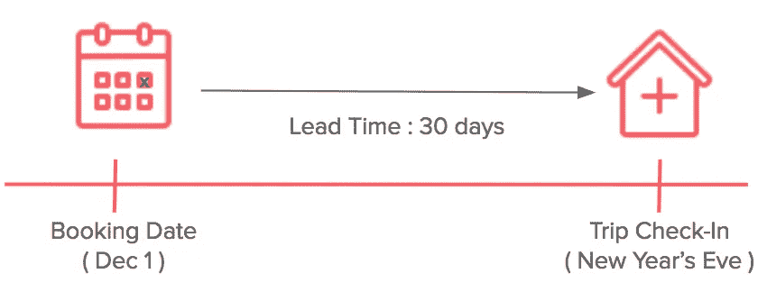
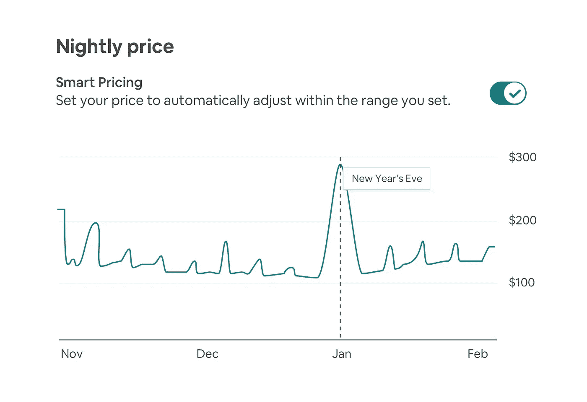
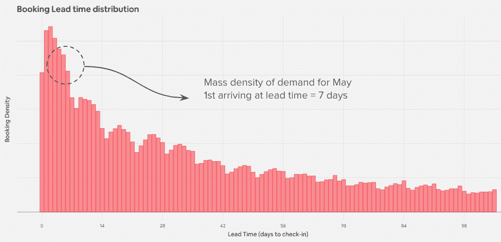
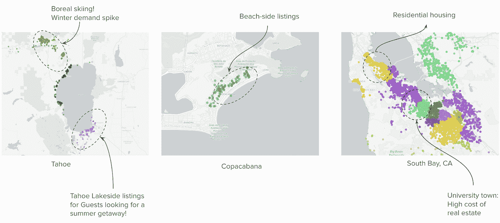
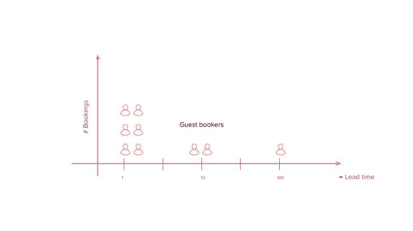
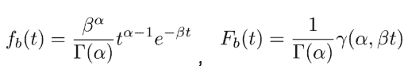
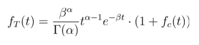
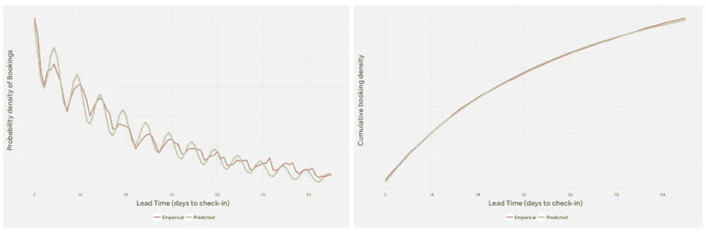

# 学习最优定价的市场动态

> 原文：<https://medium.com/airbnb-engineering/learning-market-dynamics-for-optimal-pricing-97cffbcc53e3?source=collection_archive---------0----------------------->

## 将机器学习的元素与结构建模相结合

How do you think market dynamics influences this beautiful home in Cape Town?

在 Airbnb 等双边市场中，市场动态在匹配客人和主人方面发挥着关键作用。在不同的地点、不同的入住日期和不同的入住前准备时间，供应和需求会有很大的不同。了解和预测这些空间和时间趋势对我们来说非常重要，以便为我们的东道主和客人社区找到更好的匹配。

在本帖中，我们描述了一个用于建模提前期动态的框架，以帮助房东更有竞争力地为他们的房屋定价，并提高他们的收入潜力。我们采用机器学习(ML)和结构建模来提高预测性能和模型的可解释性。

# 提前期动力学初级读本

预订的交付时间指的是预订日期和旅行登记日期之间的时间。以入住日期为除夕(12 月 31 日)的旅行为例，当客人提前 30 天(12 月 1 日)预订时，预订提前期为 30 天。另一方面，对于在入住当天最后一分钟预订的客人，预订提前期将为 0。

随着时间的推移，预订日期越来越接近年底，客人将继续预订年夜饭。这个预订过程反映了需求的流入，可以看作是一个随机的 ***到达过程*** 。提前期内相应的预订分布是预订 ***提前期分布*** 。

## 为什么要对提前期分布建模？

Nightly prices for each check-in date on the calendar as set by Smart Pricing

了解预订提前期分布有助于增强我们的定价系统。Airbnb 推出智能定价，帮助主机设定最优价格，实现收益最大化。这些工具考虑了需求、供应和个别房源等因素，以便为日历上的所有入住日期提供价格建议。然而，随着预订日期越来越接近入住日期，市场情况通常会发生变化，因此，我们必须考虑这些变化，并帮助主办方根据市场情况优化价格。

例如，在需求较高的夜晚，如除夕，客人往往会比一年中的其他时间提前预订(即提前时间较长)。这些信息有助于为新年夜制定正确的价格。同样，地点在这方面也起着很大的作用。与迈阿密南海滩这样的度假市场相比，供应受限的市场在入住前就能获得预订。通过了解每个入住日期和地点的抵达流程，Smart Pricing 考虑了这种“早期需求”,并生成一个定价策略，允许主机在我们临近入住时以最佳方式更新其价格。

## 到达过程是什么样子的？

为了使问题更具体，让我们从介绍一些符号开始。设 *X_T(t) = P( Xijt=1 | Bij = 1)* 代表客人预订的提前期分布，其中

*   *T* 是代表提前期的随机变量
*   *我*是入住日期
*   成为感兴趣的列表
*   如果入住日最终被预订，则 Bij 为 1
*   *如果入住日是在提前期预订的，则 Xijt* 为 1

下图是汇总到市场级别的提前期分布示例。正如我们所看到的，随着我们接近登记入住(从右到左)，预订密度逐渐增加，因为客人并不总是提前计划好他们的行程。

我们的目标是学习和估计 *f* (上面分布的密度)，对于每个列表 *i* ，签到日期 *j* ，以及每个提前日 *t* 进入签到。

# 可以直接用机器学习吗？

对于这个问题，使用典型的 ML 方法会是什么样子？嗯，我们将首先使用相关功能 X 和标签 y 构建训练数据集。在我们的示例中，标签将是每个客人预订的交付时间。为了预测这个标签，Airbnb 积累了各种预测信号，这些信号捕捉市场供应、市场需求以及上市级别的特征。然后，该模型将预测每个登记日期的平均提前时间。然而，最终我们得出结论，ML 方法会有几个复杂之处:

*   **统计概率结果**:到达过程是随机的。为了实现最优定价，我们需要了解预订在交付周期内的分布，而不仅仅是预订的平均交付周期。
*   **稀疏度**:每个房源在入住日期最多被预订一次，导致高度稀疏的数据集，在不显著增加模型复杂性的情况下，这将是一个挑战。我们必须以一种将房源信息汇集在一起的方式构建模型，实现房源间的迁移学习。
*   **高维度**:在 Airbnb，我们有数百万个独特的房源——每个房源都有自己的定义特征和特性，控制着到达过程。这使得每个列表都是非常高维的数据点，在经典的 ML 框架中使用效率很低。
*   **规模**:模型需要沿着三个维度进行预测，即。一式三份(列表 x 登记 x 交付周期数)。这带来了 *O(10⁶ x 10 x 10 )* 的复杂性，需要非常大的训练和评分数据集，并有延迟差的风险。

除了这些挑战之外，对提前期分布的仔细研究揭示了一种独特的单峰分布结构，具有明显的循环模式(可能是工作日/周末的变动)——事实上，仔细观察，我们注意到该分布类似于一个广义指数族。考虑到这些强参数特征以及纯 ML 方法的复杂性，我们受到启发，尝试了一种结合 ML 和结构建模的混合方法。

# 机器学习 vs 结构建模，还是两者都有？

现代 ML 模型在预测性能方面表现很好，但很少对底层数据生成机制进行建模。相比之下，结构模型通过允许我们明确指定变量(特征和响应)之间的关系来反映产生数据的过程，从而提供了可解释性，但通常在预测性能上有所欠缺。结合这两种思想流派，我们可以利用每种方法的优势，更好地对数据生成过程进行建模，并获得良好的模型性能。

当我们对建模任务有很好的直觉时，我们可以用我们的洞察力用结构上下文来加强 ML 模型。想象一下，我们正在根据特征 *(X₀,…,Xn).)预测一个响应 *Y* O* 通常，我们会训练我们最喜欢的 ML 模型进行预测。然而，假设我们也知道 *Y 是分布在输入特征 *X₀* 上的*，分布 *F* 由𝜃参数化，即*y ~f(x₀；𝜃)，*我们可以利用这些信息，并使用特征 *(X₀,…,Xn)* 将任务分解为学习𝜃，然后简单地将我们对𝜃的估计插回到 f 中，在最后一步中得到 *Y* 。

通过使用这种混合方法，我们可以利用 ML 提供的算法动力和统计建模的直觉。这是我们用来模拟提前期动态的方法。

# 建模方法

## 1.奠定基础——生成需求聚合

作为第一步，我们首先把我们的供应集中起来，形成上市集群。聚类是使用 Airbnb 上的客人搜索模式学习的，每个聚类都映射到一组常见的客人偏好。因此，一个集群中的列表共享共同的需求简档，并且倾向于见证相似的提前期分布。这一过程有助于克服维度和规模问题。

与酒店业的商品化住宿不同，Airbnb 上的每一个房源都是独一无二的。Airbnb 房屋的范围很广，从价格、位置、质量到面积等等。这种巨大的异质性给个性化带来了挑战。很难分别估计每个房源和每个入住日期的到达流程。将列表聚集成“需求集合”解决了这一挑战。需求汇总是指共享通用需求配置文件的一组列表。

当客人来到 Airbnb 时，他们会浏览我们目录中的多个房源，并有可能选择其中一个进行预订。通过追踪顾客的*购物路径，*我们可以更多地了解他们的考虑和偏好。当两个列表频繁地同时出现在几个客人的购买路径中时，它们往往反映了一组共同的客人偏好。例如，在寻找 Airbnb 住宿的滑雪爱好者的搜索会话中，西太浩湖的房源经常同时出现(如下图)。

我们可以采用上面的概念来生成低维列表嵌入，类似于[这种嵌入技术](/airbnb-engineering/listing-embeddings-for-similar-listing-recommendations-and-real-time-personalization-in-search-601172f7603e)。这项工作产生了列表嵌入，这些嵌入在语义上与它们的需求概要相关。有了清单嵌入，我们就可以按层次将它们聚集在一起，形成需求聚合。每个需求集合代表一个*考虑集*，客人在预订时会浏览这个考虑集。这种框架在需求估计的离散选择模型中非常普遍，特别是在网上市场。这里有一些这些星团的视觉效果。

Listing clusters map to identifiable guest preferences

这个供应池步骤有效地减少了清单维度上的基数，并有助于解决上面列举的一些问题。

## 2.添加钢筋-使用结构建模

以集群为基础，我们可以通过使交付周期分布遵循参数化的函数形式来构建结构强化的 ML 模型。这有助于我们避开对每个提前期 *t* 的预测，而是通过简单地预测函数形式的参数来预测分布。这将预测的维度减少到只有几个参数。

如果我们做一个简单的假设，单位时间间隔内的预订数量为泊松分布，那么事件发生的时间可以近似为伽玛分布。换句话说，我们可以通过假设每个集群的提前期分布为未知参数 *⍺，β的伽玛，来显式建模预订密度和提前期之间的关系。*

这实际上与我们之前观察到的类似指数族的提前期分布是一致的。这种方法也有很好的贝叶斯解释，因为伽玛是泊松过程中参数的共轭先验。由此产生的提前期分布将具有以下概率密度和累积分布函数:

有了这个结构，预测两个参数 *⍺，β* 并在分布的函数形式中使用它们来生成每个提前期的密度就足够了。

类似地，我们也改变函数形式来解释循环模式。我们将到达时间序列视为一个波形，并对其进行分解以提取固有分量。这通常包括，

1.  去除时间序列的趋势以处理残差
2.  应用傅立叶变换获得谐振频率(⍵)
3.  确定振幅(𝜌)和相位角( *φ)*

结果，我们得到稳态振荡波形 *f_c(t) = 𝜌.sin(⍵.t + φ)* 对循环分量进行建模。根据使用情况，这可以扩展到任意多的谐波。最后，我们将 *f_c(t)* 与 *f_b(t)* 结合起来，得到最终的函数形式来表征到达过程

该表格有 5 个参数 *(⍺，β，⍵，𝜌，φ)* 。为了预测每个未来登记日期的提前期分布，我们只需要预测这 5 个值。

## 3.谜题的最后一块——预测参数

我们首先用可用的预测值( *X* )和经验提前期分布作为标签构建训练数据(下图)。然后，我们训练我们的 ML 模型，以找到最佳参数集 *(⍺，β，⍵，𝜌，φ)* ，在给定训练集的情况下最大化可能性。得到的参数估计将最好地逼近观察到的经验分布的函数形式 *f_T(t)* 。下图证明了这一点

Predicting the empirical lead time distribution using the ML + Structural modeling framework (a) Mass Density (b) Cumulative Density

使用这种建模框架有几个优点。特别是我们

*   **降低问题的复杂性:**在我们的案例中，我们通过降低列表和交付时间的维度来实现。
*   **增加可解释性:**结构模型的各种参数告诉我们到达过程的不同组成部分。
*   **防止过度拟合:**在这个例子中，对模型输出实施参数形式在模型训练期间提供了额外的信息，这反过来充当自然正则化器。

该模型目前在产品中使用，主要用于智能定价。该工具使用每次登记的预测提前期分布来帮助主机保持最新的价格。我们还使用它来通知主机有关预订提前期的统计数据，以帮助他们就日历可用性做出明智的决策。例如，让太浩的主人知道我们希望客人提前预订，因为即将到来的滑雪季节可以帮助他们尽早取消日历上的日期，以抓住需求。

**Product use cases:** **(a) Guest side:** Information about average lead times for LA, helps guests time their booking. **(b) Host side:** Knowing the percentage of completed bookings can help drive pricing decisions.

# 最后的想法

在这个项目中使用 structural + ML 框架有助于将误差减半，并且比我们尝试的传统 ML 算法更好地概括。它还帮助我们理解和系统地模拟交付周期动态。该框架也适用于许多其他建模场景，特别是在以下情况下

*   在预测值和响应之间建立明确的关系
*   隔离感兴趣的关键变量的影响，如治疗或风险因素
*   随机过程的数据生成机制建模
*   处理不完善的训练数据，例如处理删除或截断的数据

今天，机器学习已经成为数据科学家工具箱中的一个常用工具。我们经常像对待银弹一样对待 ML——使用现成的方法来构建数据产品。还有许多开源工具，可以帮助自动化模型开发的各个方面，如特征生成、模型选择、部署等。使得模型构建更加容易。

在这样一个模型开发的程序性细节已经被抽象掉的世界里，合理的问题公式化得到了重视。特别是，我们可以使用领域知识，使用结构化技术，为这些 ML 模型配备正确的结构和公式。以这种方式利用人类的产品直觉来构建、指导和扩充 ML 模型，可以真正推动模型性能和可解释性的边界。

想了解更多的市场动态并建立这样的框架吗？我们一直在寻找[有才华的人加入我们的数据科学团队](https://www.airbnb.com/careers/departments/data-science-analytics)！

特别感谢我的所有团队成员，他们为这个项目做出了贡献，并帮助审查了这篇文章。米兰·沈、·罗贝尔、李敏勇、吴镇雄、巴尔·伊夫拉赫、罗伯特·张、纳文·西瓦南达姆、杰夫·冯、卢卡·贝尔特拉米、保罗·利特瓦克和克拉拉·拉姆。