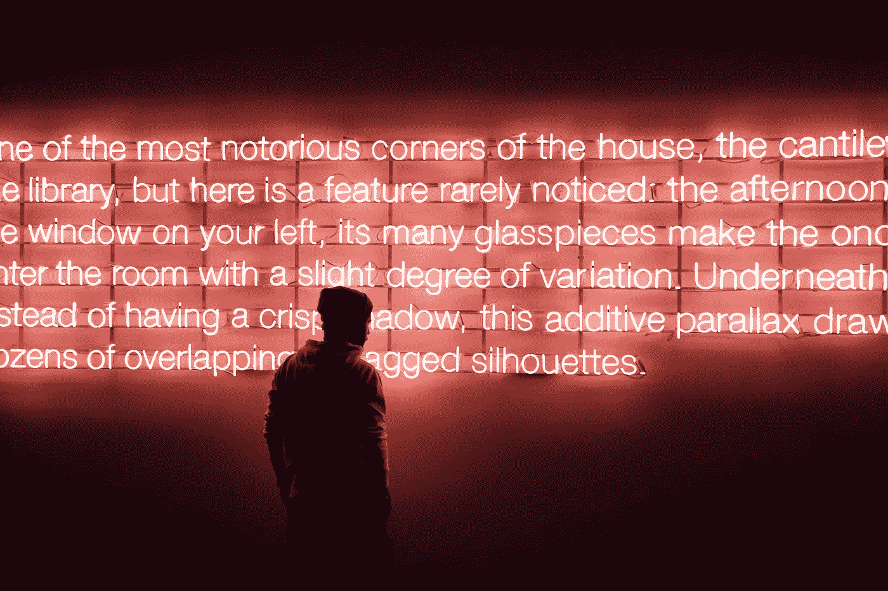
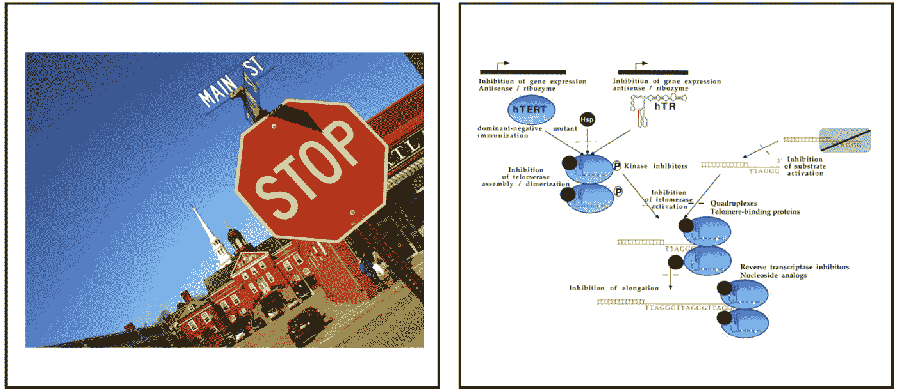
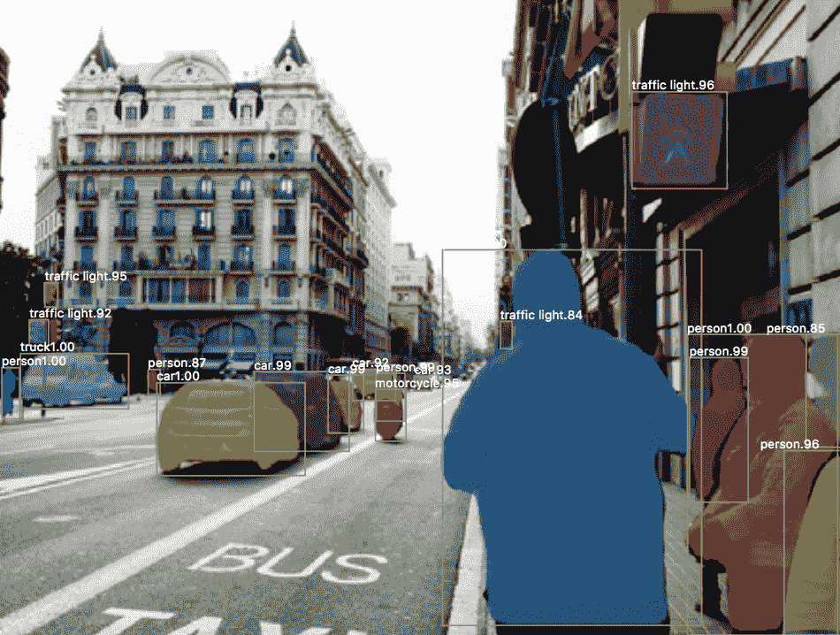
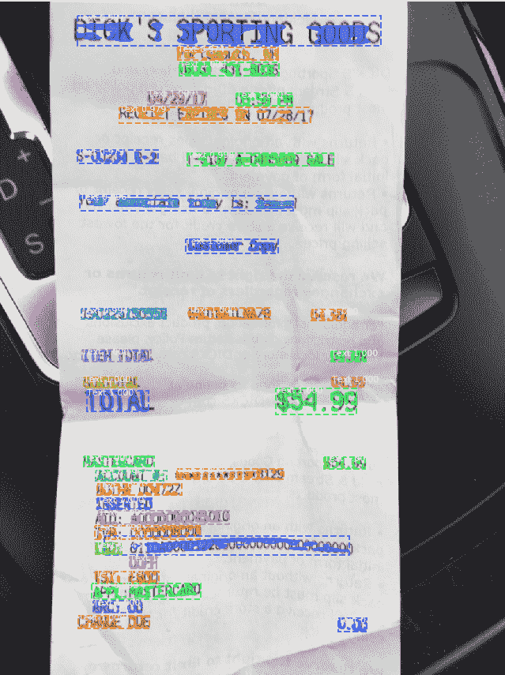
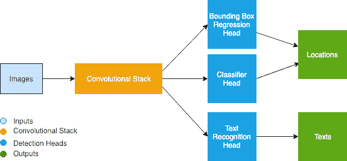
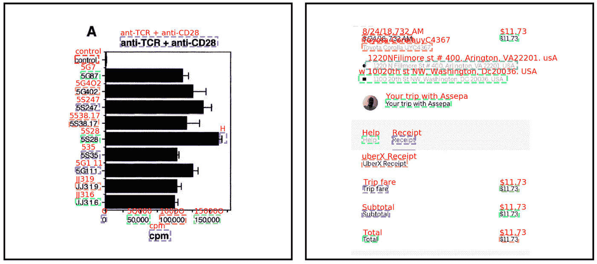

# 学习阅读:从图像中提取文本的计算机视觉方法

> 原文：<https://medium.com/capital-one-tech/learning-to-read-computer-vision-methods-for-extracting-text-from-images-2ffcdae11594?source=collection_archive---------0----------------------->

## 作者:雷扎·萨尔肖格和基根·海因斯，第一资本

与许多公司一样，尤其是金融机构，Capital One 需要处理、分析和转换成千上万的文档，以便进行日常运营。示例可能包括收据、发票、表格、报表、合同以及更多的非结构化数据，能够快速理解此类非结构化数据中嵌入的信息非常重要。

幸运的是，计算机视觉的最新进展让我们在减轻文档分析和理解的负担方面取得了长足的进步。在本帖中，我们将描述一个多任务卷积神经网络，我们开发该网络是为了高效准确地从文档图像中提取文本。

## **光学字符识别**

从文档图像中提取文本的挑战传统上被称为[光学字符识别(OCR)，并且一直是许多研究的焦点](https://static.googleusercontent.com/media/research.google.com/en//pubs/archive/33418.pdf)。当文档布局清晰并具有全局结构时(例如，一封商业信函)，现有的 OCR 工具可以很好地执行。一个流行的 OCR 开源工具是 Tesseract 项目，它最初是由 Hewlett-Packard 开发的，但近年来一直由 Google 负责。Tesseract 提供了一个易于使用的接口以及附带的 Python 客户端库，并且倾向于成为 OCR 相关项目的首选工具。最近，云服务提供商在推出各种计算机视觉产品的同时，也推出了文本检测功能。其中包括 [GoogleVision](https://cloud.google.com/vision/) 、 [AWS Textract](https://aws.amazon.com/textract/) 、 [Azure OCR](https://azure.microsoft.com/en-us/blog/how-to-leverage-ocr-to-full-text-search-your-images-within-azure-search/) 和 [Dropbox](https://blogs.dropbox.com/tech/2017/04/creating-a-modern-ocr-pipeline-using-computer-vision-and-deep-learning/) 等等。这是该领域令人兴奋的时刻，因为计算机视觉技术正变得广泛可用，以支持许多用例。

然而，在我们称之为非传统 OCR 的许多用例中，这些现有的通用解决方案并不十分合适。一个例子可能是从自然场景的图像中检测任意文本。这种性质的问题在 [COCO-Text challenge](https://vision.cornell.edu/se3/coco-text-2/) 中正式化，目标是提取可能包含在路标、门牌号、广告等中的文本。提出类似挑战的另一个领域是从复杂文档的图像中提取文本。与具有全局布局的文档(如信件、书籍中的一页、报纸中的一个栏目)相比，许多类型的文档在布局上相对来说是非结构化的，并且文本元素分散在各处(如收据、表单和发票)。类似这样的问题最近在 [ICDAR 从生物医学文献数字中提取文本挑战赛](https://journals.plos.org/plosone/article?id=10.1371/journal.pone.0126200)中正式提出。这些图像的特征在于分散在整个文档中的文本主体的复杂排列，并且被许多“分散注意力”的对象所包围。在这些图像中，主要的挑战在于正确分割图像中的对象以识别合理的文本块。来自 COCO-Text 和 ICDAR-DeTEXT 的示例图像如下所示。这些非传统 OCR 体制提出了独特的挑战，包括背景/对象分离、多尺度的对象检测、着色、文本方向、文本长度多样性、字体多样性、分心对象和遮挡。

*Figure 1\. Example images from COCO-Text challenge (left) and ICDAR DeTEXT challenge (right). Notice that OCR in this regime requires the detection of text objects as separate from background pixels and other distractions.*

非传统 OCR 中提出的问题可以通过计算机视觉的最新进展来解决，特别是在对象检测领域。正如我们下面讨论的，来自对象检测社区的强大方法可以很容易地适应 OCR 的特殊情况。

## **物体检测**

计算机视觉领域旨在通过解决诸如图像分类、对象检测、图像分割、深度估计、姿态估计等挑战，从数字化图像中提取语义知识。对于本次讨论，我们将重点关注对象检测(以及相关的图像分割)领域，该领域近年来取得了令人印象深刻的进步。[物体检测的早期尝试集中于将图像分类技术应用于图像的各种预先识别的部分](http://www.huppelen.nl/publications/selectiveSearchDraft.pdf)。许多方法都集中在加速候选区域的[识别](https://arxiv.org/abs/1512.02325)和使用[卷积机制进行特征提取和分类](https://arxiv.org/abs/1311.2524)。虽然该领域有许多有趣的发展，但我们将主要关注 [MaskRCNN](https://arxiv.org/abs/1703.06870) ，这是一种能够非常成功地进行对象检测和图像分割的模型。

MaskRCNN 的输出示例如下所示。对于任何输入图像，该模型试图完成三件事:对象检测(绿色方框)、对象分类和分割(彩色阴影区域)。下图中的绿色边界框是模型的输出，每个框的上方是对其中包含的对象类型的预测。我们可以看到，当这个繁忙街道的场景被输入到模型中时，MaskRCNN 能够成功地识别大量不同的场景对象，包括人、汽车和交通灯。此外，在每个识别的边界框内，彩色阴影区域准确地识别图像中的哪些像素对应于对象。这被称为分割，并且图像中的每个像素接收关于该像素属于哪种对象(或背景)的预测分类标签。

*Figure 2: Output of MaskRCNN for an image of a busy street scene. Notice that relevant objects are detected (people, cars, traffic lights) with bounding boxes as well as segmentation regions.*

MaskRCNN 是一个多任务网络的例子:在只有一个输入(图像)的情况下，模型必须预测多种输出。具体来说，MaskRCNN 被分成三个*头*，其中一个头涉及提出可能包含感兴趣对象的边界框，另一个头涉及对每个框中包含的对象类型进行分类，最后一个头标识用于估计每个框中的分割的逐像素位掩码。重要的是，所有三个头都依赖于从深度卷积骨干模型(如 [ResNet](https://arxiv.org/abs/1512.03385) 或类似模型)计算的共享表示。这种共享表示在多任务学习中很重要，并且允许每个头反向传播它们各自的错误并更新这种主干表示。这样做的总体效果是，每个头部实际上变得比作为单独的模型训练时更加准确。

## **检测文本对象**

诸如 MaskRCNN 及其前身的对象检测模型为识别图像内的感兴趣区域提供了非常灵活的机制。正如您可能猜到的，我们可以将非传统的 OCR 视为与对象检测密切相关。在这种情况下，我们只关心两类对象:文本对象和其他所有对象。从这个角度来看，我们可以训练一个非常类似于 MaskRCNN 的模型来识别图像中极有可能包含文本的感兴趣区域(RoI)，这一任务被称为*文本定位*。这种模型的输出示例如下所示。

*Figure 3: A text localization model applied to a cell phone picture of a receipt. Text segments are identified apart from scene objects and background pixels.*

请注意，这张收据的输入图像给文本提取带来了一些有趣的挑战。首先，感兴趣的文档出现在一些背景对象(方向盘)旁边。第二，文档中的文本是高度非结构化的，因此单独识别所有可能的文本块是有益的。模型的输出覆盖在上面的图像上——文本区域用虚线边框标识，我们甚至已经估计了文本的像素掩码。每个框的上方是预测的类别和置信度得分，由于我们只有一个感兴趣的对象类别，因此在所有检测到的情况下都是“文本”。请注意，边界框都非常紧密，并且相当准确地封装了文本区域。修改像 MaskRCNN 这样的模型并用 OCR 相关的数据集对其进行训练导致了一种有效的文本本地化方法。值得注意的是，尽管 OCR 并不固有地需要像素掩模，但是我们已经观察到，在多任务学习中包括这种约束迫使定位(边界框回归)更加精确。

如果我们所能做的只是识别对应于文本块的图像的 ROI，那么这对于 OCR 的效用显然是有限的。但是我们接下来需要做的是*读取*每个图像区域包含的文本；这就是所谓的*文本识别*。下面描述的模型偏离了 MaskRCNN，并且是用于解决文本本地化和文本识别的多任务网络。

## **用于文本提取的多任务网络**

从 MaskRCNN 等模型中获得灵感，我们设计了自己的多任务网络来解决文本定位和文本识别。类似于以前的方法，我们的模型需要一个卷积骨干提取图像特征。我们评估了 ResNet 和密集连接卷积网络(DenseNet) ，我们发现 DenseNet 具有更高的准确性。此外，卷积堆栈的输出随后被输入到[特征金字塔网络](https://arxiv.org/abs/1612.03144)，该网络有助于将堆栈早期的高空间分辨率信息与堆栈更深处的低分辨率但丰富的语义细节相结合。这些构成了卷积主干的基础，然后被发送到模型头。

类似于最近的对象检测模型，文本定位头由两阶段机制组成，具有区域提议网络，随后是包围盒回归网络。后一个组件的输出是一组可能包含文本的预测框(ROI)。模型的第二个部分是分类组件，其任务是估计每个 RoI 内包含的对象的类别，在本例中，是简单的二进制分类(文本与背景)。最后，我们有文本识别头，它将来自卷积主干的特征图和从文本定位头生成的 RoI 坐标作为输入。该文本识别头必须为每个 RoI 产生一个对应于每个框内文本的预测序列，并使用 [CTC loss](https://www.cs.toronto.edu/~graves/icml_2006.pdf) 进行训练。

*Figure 4: A simplified architecture of our multi-task model. Input images are passed through a convolutional stack which includes ResNet as well as Feature Pyramid Network. The resulting representations are then used by the model’s multiple heads in order to identify text locations and sequences.*

与对象检测方法相比，文本识别头是我们的模型的主要出发点，所以一些额外的细节是值得的。在对象检测中，从多层卷积骨干中提取特征图，并通过称为 RoIPool(或 RoIAlign)的机制汇集成固定的表示。在 OCR 中，我们必须保留高空间分辨率信息，因此我们只从卷积主干的早期块中提取特征。此外，我们依赖于一种新的池机制，它允许不同纵横比的对象被表示，而无需压缩长序列或拉伸短序列。

此外，对于如何实现文本识别头，存在巨大的可能性。一种简单的方法可能是裁剪由来自边界框回归头的[ROI 识别的输入图像，然后通过 RNN 架构](https://arxiv.org/pdf/1507.05717.pdf)【16】处理该裁剪图像。这种方法的局限性在于，我们不在头部之间重复使用图像特征表示，这需要识别头部自己进行更多的计算。相反，我们的多任务网络通过使用所识别的 ROI，然后从卷积骨干网获取每个区域的相关表示来进行。每个 RoI 的特征图然后被转换成如上所述的固定形状，并且文本识别可以继续进行。

序列分类和序列标记任务的典型方法是使用某种 RNN 架构，其中我们在 RoI 的大约 200 个水平空间步长上从左到右顺序处理，并尝试预测 RoI 特征图中每个位置的输出标记。然而，我们发现 RNNs 在文本识别方面表现很差。这可能是因为我们并不真的需要考虑这个序列中的长程相关性来解码文本。取而代之的是，我们只需要一次看几个“特征栏”,就可以知道代表的是哪个角色。出于这个原因，我们发现在这里使用简单的卷积方法和短程核宽度是最有用的。在每个空间步骤，卷积的输出用于预测输出字母，然后通过 CTC 层折叠整个序列，以输出 ROI 的最终序列。

为了训练这里描述的模型，我们需要大量带标签的图像。我们没有手工标记和生成这些文档，而是选择开发我们自己的综合培训文档。在字体、大小、颜色、干扰对象等方面有足够的可变性，我们的合成数据应该会产生一个能够在真实世界图像上表现良好的模型。我们生成了大约一万幅这样的图像，这些图像在我们这里强调的真实世界案例中表现出色。

我们模型的输出示例如下所示。左边是 ICDAR DeTEXT 挑战赛的一张图片，右边是一张收据的截图。文本段与背景像素和其他图像对象分开识别，并用虚线突出显示。每个 RoI 的预测文本序列以红色显示在每个框的上方。注意，该模型能够准确地识别以各种宽高比、字体、字体大小和颜色出现文本对象。

*Figure 5: Examples of our model applied to images from ICDAR DeTEXT challenge (left) and to a screenshot of a receipt from a ride sharing app (right). Text segment RoIs are identified as dashed lines. Note that text objects are identified apart from background pixels and distraction objects. Outputs from recognition head are shown above each RoI.*

## **结论**

计算机视觉给许多领域带来了令人印象深刻的进步，包括医疗诊断、机器人和自动驾驶。在这篇文章中，我们描述了文档分析和光学字符识别中的用例。依靠最近在对象检测方面的工作，我们的多任务网络能够同时定位和识别任意复杂文档中的文本块。这是一种提高文档处理管道效率的有前途的方法，并揭示了机器学习改变未来工作的力量。

*声明:这些观点仅代表作者个人观点。除非本帖中另有说明，否则 Capital One 不属于所提及的任何公司，也不被其认可。使用或展示的所有商标和其他知识产权都是其各自所有者的所有权。本文为 2019 首都一。*