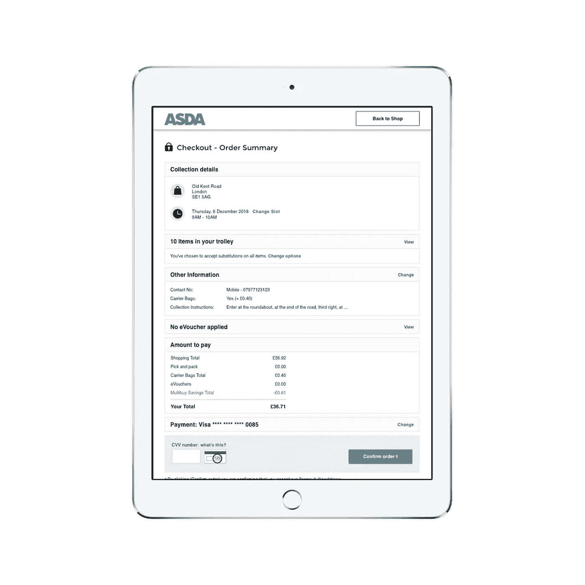

# 从重建我们的结账体验中学到的东西

> 原文：<https://medium.com/walmartglobaltech/learnings-from-rebuilding-our-checkout-experience-1d1ddebed00?source=collection_archive---------2----------------------->

Order summary screen for the new checkout experience

如果你住在英国，并且每周都和 ASDA 在网上购物，你可能会注意到我们最近完成了对结账体验的重新构想。与任何大型电子商务平台一样，结账是体验中最基本的部分之一。对于在线杂货平台来说尤其如此，用户很可能在购物车中有 40 多件商品，已经在网站上购物了大约 20 分钟，并将寻找非常具体的送货或提货时间以适应他们的日程安排。因此，在漏斗的这一部分，即使是最轻微的中断也会导致客户严重受挫，增加订单放弃。再加上市场竞争异常激烈，拥有快速直观的结账体验至关重要。

我们现有的结帐体验是在 6 年前推出的，从那时起，结帐体验就定期更新，增加了新的功能和改进。虽然这些改进中的大部分都显示出了价值，但当我们从整体和战略的角度来看待结账体验时，你会发现它已经失去了简单性，变得臃肿而混乱。此外，传统结帐是建立在过时的技术上，这意味着我们的开发团队正在努力维持这种体验。

因此，我们决定重建整个收银台的前端。在这样做的时候，我们心中有 3 个主要目标。

**客户**

我们的主要目标是优化用户体验，让一些核心交互和任务变得更快更简单。这包括集中精力改善几个关键用户的旅程。

*   用户为他们的订单选择交付或收取时间窗口的图书槽体验，
*   当用户通常添加地址和信用卡信息时的首次用户体验，
*   修改订单体验，其中用户已经下了订单，并且想要简单地添加或删除一些项目，
*   “出发前体验”建议用户通常购买但当前购物车中没有的产品，

**设计**

我们希望将收银台作为起点，让我们的视觉风格和方法焕然一新，更加现代化。结帐将在我们的风格指南中建立一个新的标准，我们最终将把它带到其余的体验中。这里的策略是减少视觉噪音，优化信息层次，简化互动，同时保持强烈的 ASDA 品牌意识。

**技术**

遗留客户端应用程序主要由 backbone.js 组成，并作为 SPA 与站点的其余部分绑定在一起。我们决定使用 react 和 redux 框架将新的 checkout 构建为一个独立的应用程序。这里的目标是提高部署速度，并降低其余体验的风险。我们的策略是开始构建标准化的组件，这些组件最终可以在站点的其余部分重用。此外，我们的工程团队将能够受益于使用更新技术提高的开发速度，以及使用 react.js 框架带来的巨大的开发人员和支持社区。

从第一次会议到 100%推广的整个过程用了将近 10 个月，其中包括 2-3 个月的推广/试验期。我们尽可能并行地运行这个过程。因此，当我们的产品和设计团队在进行研究和构建原型时，我们的开发团队在建立应用程序的框架，而 QE 团队在编写测试脚本。在为我们的用户推动根本性变革的过程中，整个过程确实是一次很棒的经历。我们从这个过程中学到了很多东西，但是有 7 个重要的话题是我想与考虑这样一个大项目的人分享的。

**保持你的核心团队规模较小，**

我们早期做出的一个有意识的决定是将核心决策者保持在最低限度，以便提高我们做出决策的速度。我们还试图给予团队尽可能多的自主权，并优先向前推进，而不是引入任何关卡或耗时的签署流程。

对于这种规模的项目，我们需要各种专家的帮助来推出产品，但大多数时候核心团队主要由以下人员组成:

*   2 名资深前端开发人员，
*   2 名 QE 工程师，
*   1 名产品负责人，
*   2 名设计师，
*   1 名工程经理，
*   1 名项目负责人，

**在模糊区域建立可配置性，**

在进行我们的研究和可用性研究时，我们多次遇到来自用户的反馈和数据被证明是不确定的，或者没有达到我们可以对我们的方法有信心的重要程度。这些似乎主要集中在我们的“出发前”页面，这是一个在用户结账前呈现给他们的功能，突出显示用户通常购买但目前没有放在篮子里的产品。这是杂货电子商务平台中非常有用和常见的功能。我们决定在这个特性中加入相当多的可配置性，这样我们就可以测试不同的场景。我们选择在我们的数据显示包容性结果的领域以及可配置性只是我们开发团队适应的一个小努力的领域中构建灵活性。这些变量包括:

*   要展示的产品数量，
*   产品的默认排序顺序，
*   页面的结构和布局，
*   在什么情况下应该显示页面，

我们最初推出的页面被证明是成功的，购物车增加了三位数的百分比。此外，在首次推出后，我们的优化团队可以继续改进功能，为用户找到变量的正确组合。现在，我们正处于这样一个阶段，其中一些变量将根据用户的配置文件而变化，从而使可配置性更进一步，而不必重新让我们的 checkout 开发团队参与进来。

**尽早展示产品，**

在像沃尔玛这样的大型组织中，可能会倾向于限制更广泛的利益相关者访问新的开发和产品，直到他们达到负责设计和开发该功能的团队感到舒适的特定质量。你可能会担心，你只有一次机会给人留下第一印象，你希望产品尽可能完整。然而，反其道而行之往往对产品最有利。在大部分主要功能构建或完全运行之前，我们就与我们的核心利益相关者团体分享了经验和进展。我们尽早寻求反馈，并定期在开放平台上分享我们的工作，以便我们的利益相关者可以看到我们每天的进展。这对项目的内部支持帮助很大。即使我们超出了产品发布的最初估计，因为我们的任何利益相关者都可以看到产品，我们也不必面对任何大型企业经常遇到的困难对话。

**利用同事进行测试，**

当我们完全重建结帐时，我们无法选择将变更迭代地部署到我们的最终用户，从而增量地交付好处，减少风险并增加反馈循环的数量。有一个给定功能的列表，这些功能对我们的用户来说是必不可少的，需要包含在第一个版本中。因此，为了确保我们有机会获得尽可能多的反馈，我们使用了我们的同事。我们将英国 ASDA 总部变成了我们的早期测试小组，并为来自我们总部 IPs 的所有请求启用了新的 checkout。该办公室拥有大约 1000 名员工，其中大多数人不从事电子商务工作。这被证明是验证我们的一些新设计以及突出潜在问题的可靠方法。我们使用我们的 AB 测试工具来确保我们所有的同事都获得了新的体验，发出了一些内部通信，最重要的是在页面上放置了一个反馈表，每天向核心开发团队发送反馈。

**尽量不要让经历过于复杂，**

一旦我们建立了所有的主要功能，收银台进行了广泛的测试，我们对产品的质量水平充满信心，我们开始将实时流量导向体验。为此，我们推出了 AB 测试，引导一小部分客户体验新体验。通过结合使用网络分析、会话回放和通过我们在新收银台放置的表格收集的反馈，我们能够密切监控客户的行为和特定功能的性能。我们将其与旧收银台的一组相似的顾客进行了对比。这种分析方法使我们能够非常迅速地发现体验中的问题，我们利用这些发现成立了一个开发团队，专门致力于每周 2-3 次部署修复和改进。然而，这是迄今为止体验中最令人羞愧的部分，因为即使我们已经显著改善了结账，并且有许多积极的客户评论，我们也发现了大量我们在测试中没有发现的错误。在分析这些错误的来源时，我们发现大部分是由于需求或者测试用例没有考虑到遗留检查体验中的边缘情况。我们也有点被动，如果与我们合作的一些团队进行更详细的端到端技术审查，一些问题本来是可以避免的。这段时间教会了我们很多关于保存好文档的价值，因为如果在我们的检查中有一些不太为人知的场景的坚实的知识库，我们所犯的一些问题和错误是可以避免的。为了改进这一点，我们已经简化了结账中的一些复杂性，使体验更容易测试，而不会影响我们的用户，并更新了我们的产品文档。

**确保你有一个公平的比较，**

我们犯的一个错误是没有花足够的时间来理解和验证如何在传统收银台上构建分析。当我们测试新的结账体验和旧的结账体验时，这引起了一些问题。传统的结帐体验在我们的数据如何被发送上有几个错误，直到我们进行测试时我们才意识到。这意味着我们没有对我们的数据集进行公平的比较。这是一个简单的错误，如果我们在发布前花时间检查数据的有效性，并确保我们比较的是相似的数据集，那么这个错误是可以很容易避免的。我们现在不仅需要一个清晰的分析计划，还需要在推出任何主要新功能之前收集基线数据并确保其准确性。

**就关键指标达成一致，**

我们从这次展示中学到的最后一个主要知识是，当我们决定是否继续展示时，我们的主要衡量标准是什么。我们有幸获得了大量的数据点，可以用来了解我们的顾客如何体验新的结账方式。然而，经常有太多的数据点需要考虑，这经常导致团队对某些方面的体验如何/是否有所改善感到困惑。以结帐转化率为例，完成结帐的用户与进入结帐的用户的百分比。我们可以用许多不同的方式来看待这个单一的数据点。您可以采用“点击”级别的视图，该视图在您每次进入结账时都会进行计数，因此可以很好地指示用户是否在没有离开结账流程的这一部分的情况下完成了结账。或者，您可以采用“访问”级别的视图，在该视图中，只要用户在同一个会话中，即使他们离开收银台并再次进入，他们的访问也只被计数一次。我们发现一个有趣的点是，当从“点击”的角度分析时，新的结帐具有较低的结帐转化率。然而，当我们用同样的标准来衡量“访问”级别时，新的结账方式表现得更好。当我们深入挖掘时，我们发现改进后的“出发前”页面显示了更多的产品建议，这实际上促使更多的客户想起他们忘记的东西。但问题是，他们想要的特定商品有时不在列表中，因此他们会返回主浏览体验，在重新进入结账前找到产品。这导致点击结帐转化率下降，但用户实际上并没有放弃他们的购物车。这是一次非常有见地的学习，我们已经启动了一个单独的工作流，专门围绕测试功能，以使这部分旅程对我们的用户来说更容易。这个例子向我们强调了在这些指标上达成一致的重要性，这些指标将决定推广的进度，在这种情况下是“访问”级别转换指标，以及那些只能提供用户体验信息的指标，即“点击”级别指标。

结账体验现已 100%上线两个月，表现良好。我们的优化团队目前正在制定测试和实验路线图。我们的技术团队已经采用了很多在 checkout 中构建的组件，并且现在在我们的应用程序的浏览区域中将它们用作未来项目的通用组件。我们的设计团队使用了风格指南的更新，并开始将它们应用到接下来的体验中。最重要的是，我们都将这些知识发扬光大，这样，当我们开始在网站的其他领域进行改进时，我们可以在产品开发过程中更加高效和有效。