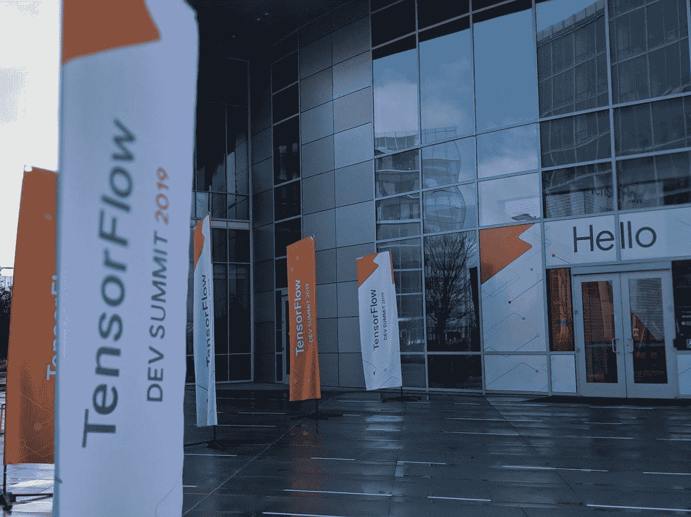

# 2019 年 TensorFlow 发展峰会的收获

> 原文：<https://medium.com/google-developer-experts/learnings-from-tensorflow-dev-summit-2019-1fc6484c1943?source=collection_archive---------0----------------------->

我于 3 月 6 日& 7 日在桑尼维尔的谷歌活动中心参加了 [**TensorFlow Dev 峰会**](https://www.tensorflow.org/dev-summit) 。这是一次令人难以置信的经历，充满了激动人心的新消息和新收获。我遇到了来自世界各地 TensorFlow 社区的许多人。



# 第 0 天

在峰会的前一天晚上，**机器学习** **GDEs** ( [谷歌开发者专家](https://developers.google.com/programs/experts/))聚在一起吃晚餐。我们一直在帮助测试 TensorFlow 2.0 预览版并提供反馈。这是我们许多人第一次见面。

# 第一天

这是桑尼维尔的一个雨天，但许多人在推特上发布了彩虹的照片。我们高兴地在雨中等待登机，对峰会感到非常兴奋。

尽管我知道这些录音会在以后公布，但我还是在演讲时做了笔记，因为这有助于我学习。我也喜欢和我遇到的人拍照，这样我就能记住他们。峰会上有这么多新的公告和要会见的人，我几乎跟不上。

## 张量流 2.0 Alpha

([视频链接](https://www.youtube.com/watch?v=k5c-vg4rjBw) | [文档链接](https://www.tensorflow.org/alpha))

峰会上最重要的宣布之一是 **TensorFlow 2.0 Alpha。**试试看:

```
pip install -U --pre tensorflow
```

最近我也分享了我在试用预览版时对 TF 2.0 的笔记。

TensorFlow 2.0 对新手和专家都很棒；对于研究人员和开发人员来说。它注重可用性、清晰性和灵活性:

*   **tf。Keras** 作为高级 API，**急切执行**作为默认
*   整理重复的 API 以保持一致性
*   仍然为那些需要低级 API 的人提供了灵活性

在休息时间，我可以和 TensorFlow 团队和社区一起出去玩。

很荣幸能见到 Keras 的创造者 Francois Chollet。我从他那里得到了一张新的 Keras 贴纸，我喜欢和他聊 Keras。

## TensorFlow Lite

([链接视频](https://www.youtube.com/watch?v=DKosV_-4pdQ) | [链接路线图](https://www.tensorflow.org/lite/guide/roadmap))

对在设备上的机器学习有大量的兴趣(Pete Warden 在 2018 年的“ [**为什么 ML 的未来很微小**](https://petewarden.com/2018/06/11/why-the-future-of-machine-learning-is-tiny/) ”)。TensorFlow Lite 在这方面非常重要。

看到了一个用 [**珊瑚**](https://coral.withgoogle.com/) **开发板**制造的可教机器的演示，这是第一个以 edge TPU 为特色的产品。Pete Warden 用 Sparkfun 的微控制器做了一个演示。

2019 年计划进行大量变革，重点关注四个领域:

*   **可用性** —让它端到端地工作。
*   **性能** —快速执行:边缘 TPU 代理，GPU 代理。
*   **优化** —带有量化的更小/更快模型&修剪 et。
*   **文档** —更好的文档、教程和示例。

## 张量流数据集

([链接到视频](https://www.youtube.com/watch?v=-nTe44WT0ZI) | [链接到文档](https://www.tensorflow.org/datasets))

数据+训练模型的 ML 伙伴关系，彼此配合得很好。用几行代码加载数据集。目前有 30 个[数据集可用](https://www.tensorflow.org/datasets/datasets)，更多正在添加中。通过添加您自己的数据集使您的数据出名。

## TensorFlow 的 Swift

([链接视频](https://www.youtube.com/watch?v=s65BigoMV_I) | [链接回购](https://github.com/tensorflow/swift))

我对下一代 ML 框架 TensorFlow 的 Swift 感到非常兴奋。Keras 简化了培训，但 Swift 更进一步:

*   部署动态模型
*   应用集成神经网络
*   灵活且可扩展的自动 diff
*   改进的开发人员工作流程

我们看到了一个图像分类代码的演练，看起来很像 Keras。Swift for TensorFlow 具有无缝的 Python 互操作性。Swift for TensorFlow 和 Python for TensorFlow 之间的高度集成应该能够更轻松地过渡到 Swift for TensorFlow。

## 张量流扩展(TFX)

(视频链接: [TFX 概况&培训前工作流程](https://youtu.be/A5wiwT1qFjc) | [培训后工作流程](https://youtu.be/0O201IQlkxc))

TFX 是一个端到端的 ML 平台，它现在集成了 [AirFlow](https://airflow.apache.org/) 和 [Kubeflow](https://www.kubeflow.org/) 。

## TensorFlow.js 1.0

([链接到视频](https://youtu.be/x35pOvZBJk8))

TensorFlow Javascript 是一个用于在浏览器中训练和部署 ML 模型的库:

*   预训练模型—图像、音频和文本分类(NPM 或托管脚本)
*   转换现有的 python 模型:使用命令行工具或通过保存的模型、TFHub 或 Keras。
*   在浏览器和 Node.js 中训练—使用层 API
*   在平台上部署

## 新的学习资源

峰会上宣布了来自 Udacity、Coursera 和 Fast.ai 的新课程，在峰会之前，mit 还用 TensorFlow 2.0 制作了一门新的深度学习课程。

*   [**深度学习 TensorFlow 简介**](https://www.udacity.com/course/intro-to-tensorflow-for-deep-learning--ud187)****[uda city](https://medium.com/u/2929690a28fb?source=post_page-----1fc6484c1943--------------------------------)****

*   ****新专精 **TensorFlow:从基础到大师(Deeplearning.ai 在 [Coursera](https://medium.com/u/99c0fb464c1f?source=post_page-----1fc6484c1943--------------------------------) 上**)。课程 1 **面向 AI 的 TensorFlow 入门，ML &深度学习** ( [链接](https://www.coursera.org/learn/introduction-tensorflow))现已上线。由谷歌大脑团队的劳伦斯·莫罗尼教授。****

*   ******Fast.ai** 宣布将[拥抱 Swift 进行深度学习](https://www.fast.ai/2019/03/06/fastai-swift/)。****

## ****其他公告****

*   ****[**tensor flow world**](https://conferences.oreilly.com/tensorflow/tf-ca)，为期 4 天的会议，由 O'Reilly 于 10 月份在圣克拉拉举办，提供实践培训和讲座。CFP 一直开放到 4 月 23 日。****
*   ****[**由 TensorFlow 2.0 提供动力的挑战赛**](https://tensorflow.devpost.com/) 在 DevPost 上举办，供人们展示自己用 TensorFlow 2.0 创造的东西。****
*   ****[**谷歌代码之夏**](https://summerofcode.withgoogle.com/organizations/6137730124218368/) **，**学生们一边在 TensorFlow 上工作，一边在暑期拿到工资。他们将接受 TensorFlow 团队和社区专家的指导。****

# ****第二天****

****在峰会的第二天，我又参加了几次会谈。****

******TensorFlow On-Device:压缩、量化和分发******

****这是一次受欢迎的会议。房间里非常拥挤，我设法找到一个角落站着，甚至溢出的房间都被填满了。****

****有两个讲座:第一个是“**TensorFlow Lite on Android**”——关于如何开始使用 tensor flow Lite。第二个演讲是“ **TensorFlow lite:量子化**”。之后是与 TensorFlow Lite 团队一样的 Q &。****

******研究与未来会谈:******

*   ******联合学习**—分散数据的 ML 训练。([视频链接](https://www.youtube.com/playlist?list=PLQY2H8rRoyvzoUYI26kHmKSJBedn3SQuB) | [文档链接](https://www.tensorflow.org/federated))****
*   ******网格张量流**——用于大比例模型。([链接到视频](https://www.youtube.com/watch?v=HgGyWS40g-g))****
*   ******十四行诗**(deep mind)——针对研究人员的复杂模型。([链接到视频](https://www.youtube.com/watch?v=rlpQjnUvoKw))****

******全球文档冲刺规划******

****在我去机场之前，Paige 和我聊了聊全球文档冲刺的计划，以帮助改进 TensorFlow 的文档。****

****你可以在这里观看**峰会[所有环节录音](https://www.youtube.com/playlist?list=PLQY2H8rRoyvzoUYI26kHmKSJBedn3SQuB)**，在这里查看**相册** [。](http://bit.ly/TFSummit19)****

**我在 sketchnotes 中总结了峰会的公告和收获。试图将我在峰会上的笔记写在一张纸上，真的有助于我将关键要点可视化。**