# 101 最小二乘回归法指南

> 原文：<https://medium.com/edureka/least-square-regression-40b59cca8ea7?source=collection_archive---------1----------------------->

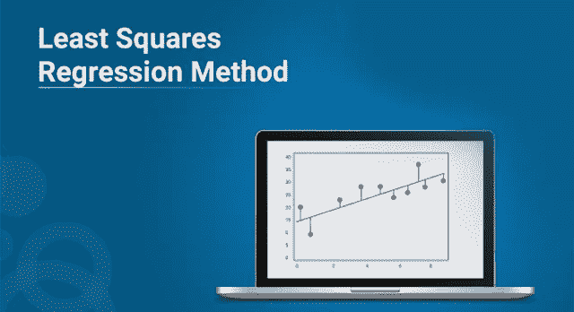

Least Square Regression Method — Edureka

随着机器学习和人工智能在 IT 市场的蓬勃发展，学习这些趋势技术的基础知识变得至关重要。这篇关于最小二乘回归方法的博客将帮助您理解回归分析背后的数学原理，以及如何使用 Python 实现它。

以下是本文将涉及的主题列表:

1.  什么是最小二乘法？
2.  最佳拟合线
3.  计算最佳拟合线的步骤
4.  最小二乘回归方法及实例
5.  实现线性回归的简短 python 脚本

# 什么是最小二乘回归法？

*最小二乘回归法是回归分析中常用的一种技术。它是一种数学方法，用于寻找代表自变量和因变量之间关系的最佳拟合线。*

为了理解最小二乘回归方法，让我们熟悉一下用公式表示最佳拟合线所涉及的概念。

# 最佳拟合线是什么？

绘制最佳拟合线来表示两个或更多变量之间的关系。更具体地说，最佳拟合线绘制在数据点的散点图上，以表示这些数据点之间的关系。

回归分析利用最小二乘法等数学方法来获得预测变量和目标变量之间的确定关系。最小二乘法是用来绘制最佳拟合线的最有效的方法之一。它基于这样一种思想，即所获得的误差的平方必须尽可能地最小化，因此被称为最小二乘法。

如果我们要绘制一条最佳拟合线来显示一家公司在一段时间内的销售情况，它看起来会像这样:

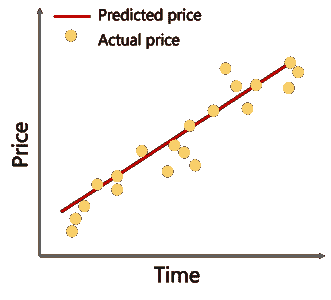

请注意，这条线尽可能靠近所有分散的数据点。这就是理想的最佳拟合线的样子。

为了更好地理解整个过程，让我们看看如何使用最小二乘回归计算直线。

# 计算最佳拟合线的步骤

为了开始构建最好地描述数据中变量之间关系的线，我们首先需要得到我们的基本权利。看看下面的等式:

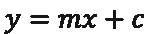

当然，你以前遇到过这个等式。这是一个简单的等式，表示沿二维数据(即 x 轴和 y 轴)的直线。为了更好地理解这一点，让我们来分解这个等式:

*   y:因变量
*   m:直线的斜率
*   x:独立变量
*   c: y 轴截距

因此，我们的目标是计算斜率、y 轴截距的值，并代入等式中相应的“x”值，以导出因变量的值。

让我们看看如何做到这一点。

作为假设，让我们考虑有“n”个数据点。

**第一步:** *用下面的公式计算斜率‘m’:*

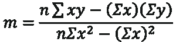

**第二步:** *计算 y 轴截距(直线与 y 轴交点处的 y 值):*

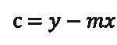

**第三步:** *代入最终方程中的值:*


很简单，不是吗？

现在让我们看一个例子，看看如何使用最小二乘回归方法来计算最佳拟合线。

# 最小二乘回归示例

考虑一个例子。汤姆是一家零售店的老板，他发现不同 t 恤的价格与一周内他店里卖出的 t 恤数量之间的关系。

他将此列表如下所示:

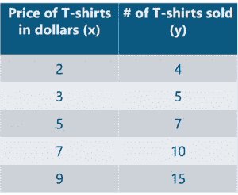

让我们用最小二乘回归的概念来找出上述数据的最佳拟合线。

**步骤 1:** 使用以下公式计算斜率‘m ’:


代入相应的值后，m 约为 1.518。

**步骤 2:** 计算 y 轴截距值


代入相应的值后，c = 0.305 左右。

**步骤 3:** 代入最终等式中的值


一旦您替换了这些值，它应该看起来像这样:

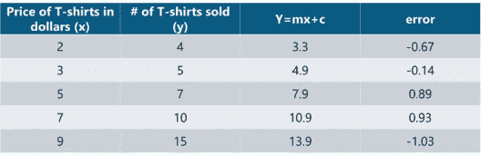

让我们构建一个代表最佳拟合的 **y=mx + c** 线的图形:

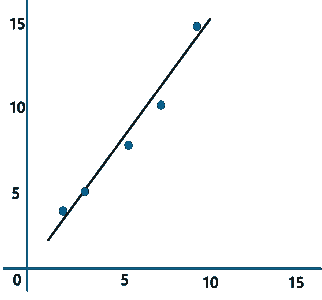

现在，汤姆可以使用上面的等式来估计他在零售店可以卖出多少件价格为 8 美元的 t 恤。

***y = 1.518 x 8+0.305 = 12.45*t 恤**

这归结为 13 件 t 恤！这就是使用线性回归进行预测的简单程度。

现在让我们试着理解基于什么因素我们可以确认上面的线是最佳拟合的线。

最小二乘回归方法的工作原理是使误差的平方和尽可能小，因此被称为最小二乘法。基本上，最佳拟合线和误差之间的距离必须尽可能地最小化。这是最小二乘回归方法背后的基本思想。

在实施最小二乘回归方法之前，需要记住以下几点:

*   这些数据必须没有异常值，因为它们可能会导致有偏见和错误的最佳拟合线。
*   可以反复绘制最佳拟合线，直到得到误差平方最小的线。
*   这种方法即使对于非线性数据也能很好地工作。
*   从技术上讲,“y”的实际值和“y”的预测值之间的差异称为残差(表示误差)。

现在，让我们来看一个使用 Python 的线性回归的实际实现。

# Python 中的最小二乘回归

在本节中，我们将运行一个简单的演示来理解使用最小二乘回归方法进行回归分析的工作原理。一个简短的声明，我将在这个演示中使用 Python。

**问题陈述:**应用线性回归，建立一个研究个体头部大小和大脑重量之间关系的模型。

**数据集描述:**数据集包含以下变量:

*   **性别:**男性或女性表示为二元变量
*   **年龄:**个人的年龄
*   **以厘米为单位的头部尺寸:**以厘米为单位的个人头部尺寸
*   **大脑重量克数:**个人大脑的重量克数

需要对这些变量进行分析，以建立一个研究个体头部大小和大脑重量之间关系的模型。

**逻辑:**实现线性回归，以建立一个研究自变量和因变量之间关系的模型。将使用最小二乘回归方法对模型进行评估，其中 RMSE 和 R 平方将作为模型评估参数。

我们开始吧！

**第一步:导入所需的库**

```
import numpy as np
import pandas as pd
import matplotlib.pyplot as plt
```

**第二步:导入数据集**

```
# Reading Data
data = pd.read_csv('C:UsersNeelTempDesktopheadbrain.csv')
print(data.shape)
(237, 4)
print(data.head())
   Gender  Age Range  Head Size(cm^3)  Brain Weight(grams)
0       1          1             4512                 1530
1       1          1             3738                 1297
2       1          1             4261                 1335
3       1          1             3777                 1282
4       1          1             4177                 1590
```

**第三步:将“X”指定为自变量，将“Y”指定为因变量**

```
import numpy as np import pandas as pd import matplotlib.pyplot as # Coomputing X and Y
X = data['Head Size(cm^3)'].values
Y = data['Brain Weight(grams)'].values
```

接下来，为了计算斜率和 y 截距，我们首先需要计算“x”和“y”的平均值。这可以按如下所示完成:

```
# Mean X and Y
mean_x = np.mean(X)
mean_y = np.mean(Y)

# Total number of values
n = len(X)
```

**步骤 4:计算斜率和 y 轴截距的值**

```
# Using the formula to calculate 'm' and 'c'
numer = 0
denom = 0
for i in range(n):
numer += (X[i] - mean_x) * (Y[i] - mean_y)
denom += (X[i] - mean_x) ** 2
m = numer / denom
c = mean_y - (m * mean_x)

# Printing coefficients
print("Coefficients")
print(m, c)

Coefficients
0.26342933948939945 325.57342104944223
```

以上系数分别是我们的斜率和截距值。代入最终等式中的值，我们得到:

***大脑重量= 325.573421049 + 0.263429339489 *脑袋大小***

就这么简单，上面的等式代表了我们的线性模型。

现在让我们用图表来表示。

**第五步:绘制最佳拟合线**

```
# Plotting Values and Regression Line

max_x = np.max(X) + 100
min_x = np.min(X) - 100

# Calculating line values x and y
x = np.linspace(min_x, max_x, 1000)
y = c + m * x

# Ploting Line
plt.plot(x, y, color='#58b970', label='Regression Line')
# Ploting Scatter Points
plt.scatter(X, Y, c='#ef5423', label='Scatter Plot')

plt.xlabel('Head Size in cm3')
plt.ylabel('Brain Weight in grams')
plt.legend()
plt.show()
```

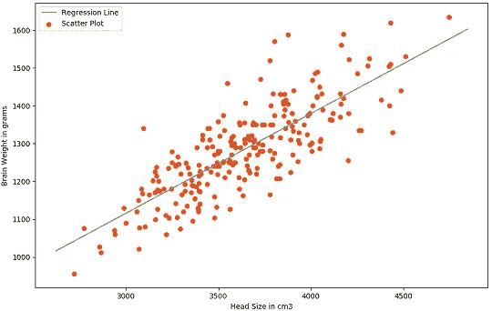

**第六步:模型评估**

考虑到我们的数据集很小，建立的模型相当不错。是时候对模型进行评估了，看看它对最终阶段(即预测)有多好。为此，我们将使用均方根误差方法，该方法主要计算最小二乘误差，并对求和值求根。

从数学上讲，均方根误差只不过是所有误差之和除以数值总数的平方根。这是计算 RMSE 的公式:

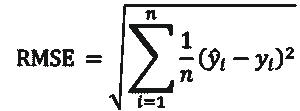

上式中，yi 为第 I 个预测输出值。让我们看看如何使用 Python 来实现这一点。

```
# Calculating Root Mean Squares Error
rmse = 0
for i in range(n):
    y_pred = c + m * X[i]
    rmse += (Y[i] - y_pred) ** 2
rmse = np.sqrt(rmse/n)
print("RMSE")
print(rmse)
RMSE
72.1206213783709
```

另一个模型评估参数是称为 R 平方值的统计方法，用于测量数据与最佳
拟合线的接近程度。

数学上，它可以计算为:

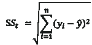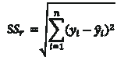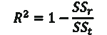

在哪里，

*   SSt 是平方和的总和
*   SSr 是残差平方和的总和

R 平方的值介于 0 和 1 之间。负值表示模型是弱的，并且由此做出的预测是错误的和有偏差的。在这种情况下，分析所有预测变量并寻找与输出高度相关的变量至关重要。这一步通常属于 EDA 或探索性数据分析。

我们不要忘乎所以。以下是如何在 Python 中实现 R 平方的计算:

```
# Calculating R2 Score
ss_tot = 0
ss_res = 0
for i in range(n):
    y_pred = c + m * X[i]
    ss_tot += (Y[i] - mean_y) ** 2
    ss_res += (Y[i] - y_pred) ** 2
r2 = 1 - (ss_res/ss_tot)
print("R2 Score")
print(r2)
R2 Score
0.6393117199570003
```

如你所见，我们的 R 平方值非常接近 1，这表明我们的模型运行良好，可以用于进一步的预测。这就是使用 Python 实现最小二乘回归方法的全部过程。

就这样，我们到了这篇文章的结尾。如果你对这个话题有任何疑问，请在下面留下评论，我们会尽快回复你。

如果你想查看更多关于人工智能、DevOps、道德黑客等市场最热门技术的文章，你可以参考 Edureka 的官方网站。

请留意本系列中的其他文章，它们将解释 Python 和数据科学的各个方面。

> 1.[Python 中的机器学习分类器](/edureka/machine-learning-classifier-c02fbd8400c9)
> 
> 2.[Python Scikit-Learn Cheat Sheet](/edureka/python-scikit-learn-cheat-sheet-9786382be9f5)
> 
> 3.[机器学习工具](/edureka/python-libraries-for-data-science-and-machine-learning-1c502744f277)
> 
> 4.[用于数据科学和机器学习的 Python 库](/edureka/python-libraries-for-data-science-and-machine-learning-1c502744f277)
> 
> 5.[Python 中的聊天机器人](/edureka/how-to-make-a-chatbot-in-python-b68fd390b219)
> 
> 6. [Python 集合](/edureka/collections-in-python-d0bc0ed8d938)
> 
> 7. [Python 模块](/edureka/python-modules-abb0145a5963)
> 
> 8. [Python 开发者技能](/edureka/python-developer-skills-371583a69be1)
> 
> 9.[哎呀面试问答](/edureka/oops-interview-questions-621fc922cdf4)
> 
> 10.一个 Python 开发者的简历
> 
> 11.[Python 中的探索性数据分析](/edureka/exploratory-data-analysis-in-python-3ee69362a46e)
> 
> 12.[带 Python 的乌龟模块的贪吃蛇游戏](/edureka/python-turtle-module-361816449390)
> 
> 13. [Python 开发者工资](/edureka/python-developer-salary-ba2eff6a502e)
> 
> 14.[主成分分析](/edureka/principal-component-analysis-69d7a4babc96)
> 
> 15. [Python vs C++](/edureka/python-vs-cpp-c3ffbea01eec)
> 
> 16.[刺儿头教程](/edureka/scrapy-tutorial-5584517658fb)
> 
> 17. [Python SciPy](/edureka/scipy-tutorial-38723361ba4b)
> 
> 18.[使用 Python 进行网页抓取](/edureka/web-scraping-with-python-d9e6506007bf)
> 
> 19. [Jupyter 笔记本小抄](/edureka/jupyter-notebook-cheat-sheet-88f60d1aca7)
> 
> 20. [Python 基础知识](/edureka/python-basics-f371d7fc0054)
> 
> 21. [Python 模式程序](/edureka/python-pattern-programs-75e1e764a42f)
> 
> 22.[Python 中的生成器](/edureka/generators-in-python-258f21e3d3ff)
> 
> 23. [Python 装饰器](/edureka/python-decorator-tutorial-bf7b21278564)
> 
> 24. [Python Spyder IDE](/edureka/spyder-ide-2a91caac4e46)
> 
> 25.[在 Python 中使用 Kivy 的移动应用](/edureka/kivy-tutorial-9a0f02fe53f5)
> 
> 26.[十大最佳学习书籍&练习 Python](/edureka/best-books-for-python-11137561beb7)
> 
> 27.[用 Python 实现机器人框架](/edureka/robot-framework-tutorial-f8a75ab23cfd)
> 
> 28.[Python 中的贪吃蛇游戏使用 PyGame](/edureka/snake-game-with-pygame-497f1683eeaa)
> 
> 29. [Django 面试问答](/edureka/django-interview-questions-a4df7bfeb7e8)
> 
> 30.[十大 Python 应用](/edureka/python-applications-18b780d64f3b)
> 
> 31.[Python 中的哈希表和哈希表](/edureka/hash-tables-and-hashmaps-in-python-3bd7fc1b00b4)
> 
> 32. [Python 3.8](/edureka/whats-new-python-3-8-7d52cda747b)
> 
> 33.[支持向量机](/edureka/support-vector-machine-in-python-539dca55c26a)
> 
> 34. [Python 教程](/edureka/python-tutorial-be1b3d015745)

*原载于 2019 年 9 月 6 日 https://www.edureka.co*[](https://www.edureka.co/blog/least-square-regression/)**。**