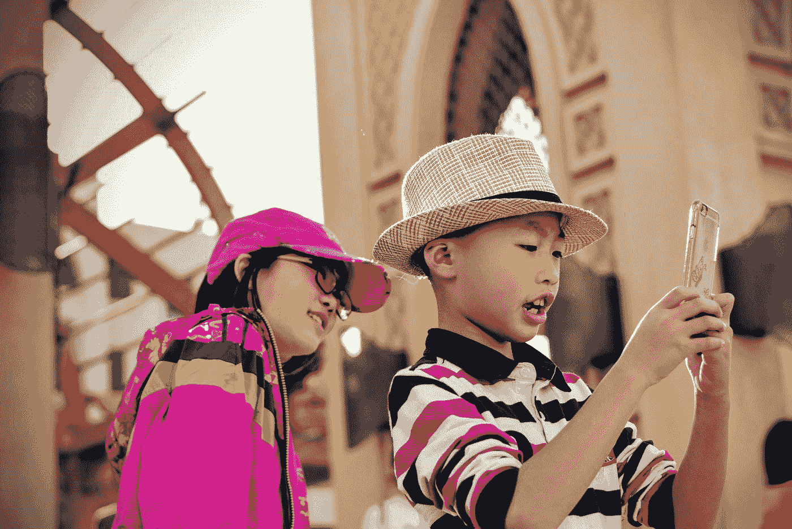
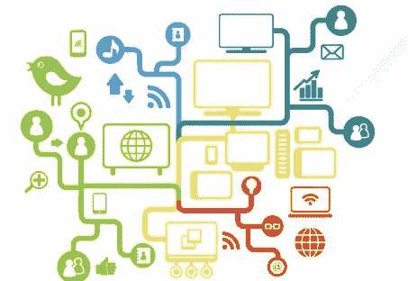
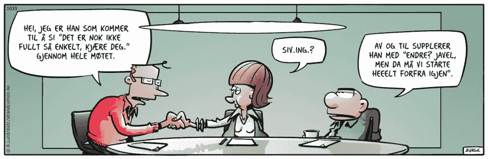

# “Ledere må forstå mulighetene teknologien gir!”

> 原文：<https://medium.com/compendium/ledere-m%C3%A5-forst%C3%A5-mulighetene-teknologien-gir-cd9e2c524e4b?source=collection_archive---------1----------------------->

*Dette proklameres til stadighet av konsulenter innenfor digitalisering, AI og maskinlæring. Men hva betyr det egentlig? Og er ledere flest virkelig så innesnødd som vi skal ha det til? Her får du 9 grunnleggende innsikter du trenger for å ta steget inn blant de innovative kule gutta og jentene som transformerer virksomheter fra trauste monolitter til lean startups — før frokost!*

Photo by [Tim Gouw](https://unsplash.com/@punttim?utm_source=medium&utm_medium=referral) on [Unsplash](https://unsplash.com?utm_source=medium&utm_medium=referral)

## 1\. Hva mener vi med “den nye teknologien?”

Når digitaliseringsguruene snakker er ordet *teknologi* synonymt med datateknologi, sensorteknologi, internet of things, AI-teknologier som tekst-, bilde- og talegjenkjenning, maskinlæring, skyløsninger, mobilbruk, sosiale medier og dette såkalte Big Data (med stor B og stor D. big data er nemlig noe heeelt annet…)

Med litt lesing på nettet klarer de fleste å begripe hva disse ulike tingene *er* . La oss for eksempel ta **maskinlæring** — dette er nemlig ikke magi: gitt en kjent input og en kjent tilsvarende output, hva er den funksjonen som gir best match mellom input og output på et sett treningsdata? (datasett der vi kjenner både input og forventet output, spørsmål og svar, symptomer og diagnose, værforhold og bussforsinkelser, demografiske karakteristikker og sannsynligheten for at du er en heterofil interiørdesigner med høyrepopulistiske meninger, eller hva du nå måtte ønske å lage en spådomsmaskin for). Maskinen lærer å tilpasse denne funksjonen *f* så godt som mulig for å matche input *x* med output *y* , slik at du kan komme drassende med en helt *ny x* der vi ikke kjenner *y* , og få maskinen til å fortelle deg hva *y* med en viss sannsynlighet har slags verdi. Nyttig og morsomt og noen ganger med fare for en [utilsiktet slagside](/grensesnittet/https-medium-com-mab-55055-what-is-fatml-and-why-should-you-care-dfb36e51f2f4) fordi du lar maskinen trene på inputverdier som du egentlig ikke ønsker at den skal legge for stor vekt på. Hint: rase, kjønn og religion. Da må der justeres og fikses, og det er det disse data scientistene og analytics- og ML-spesialistene får betalt for.

## 2\. Hva mener vi med “mulighetene?”

I denne sammenhengen er muligheter ofte evnen til å gjøre noe som du før ikke kunne gjøre i det hele tatt, eller bare med svært stor innsats, dvs. at det var økonomisk uinteressant å satse på. Ny teknologi bryter ned slike barrierer. Den skaper også nye behov. Før vi begynte å samle på masse data og maskinlæring ble økonomisk gjennomførbart i skyen, var det ingen som f.eks. trengte *Cloud brokers* . Men her er en helt ny næring i emning.

Muligheter til å lage business ut av noe som vi før bare gjorde for vår egen del i liten skala har vi mange eksempler på: fra formidlingstjenester for bruk av naboens drill eller luftmadrasser i fremmede menneskers boliger, til feriepassing av hus, katter og ektemenn (om noen faktisk tjener penger på dette er en annen sak). Og glem ordet *delingsøkonomi* . Det er ikke snakk om å *dele* noe, det er formidling av varer og tjenester mellom en som har noe å selge og en som vil kjøpe det handler om. Med andre ord markedsøkonomi. Fortsatt. Markedsplassen har bare blitt digital, formidlingen kjappere og aktørene flere.

Først solgte vi fysiske produkter i fysiske markeder, så begynte vi å selge fysiske produkter i digitale markeder (Amazon, 1997) og digitale produkter i fysiske markeder (Platekompaniet), deretter mer og mer digitale produkter i digitale markeder der vi ikke engang kjøper produktene, vi bare leier retten til å bruke dem (Spotify, Netflix). Hvilke deler av produktet ditt, kjøps- eller bruksopplevelsen kan digitaliseres?

Photo by [Mein Deal](https://unsplash.com/@meindeal?utm_source=medium&utm_medium=referral) on [Unsplash](https://unsplash.com?utm_source=medium&utm_medium=referral)

## 3\. Formålet med en bedrift er å skape en kunde

Når du skal forbedre produktene, opplevelsen eller distribusjonen gjelder det å ha fokus på brukeren — kunden. Hva er de opptatt av, hvilke behov har de som de selv kanskje ikke engang har tenkt at det er mulig for deg å løse for dem, hvordan opplever de hele løpet fra den første tanken om et behov oppstår, til de har tatt i bruk løsningen din? *Tjenestedesignere* er en gruppe profesjonelle mennesker som forstår seg på slikt og som kan hjelpe deg til å oppdage muligheter for å løse behov på nye måter.

## 4\. Automatisering er din venn

Det samme gjelder forbedring av din *evne til å levere* varer og tjenester raskere, med konsekvent høyere kvalitet. Ny teknologi som automatiserer rutineoppgaver kan frigjøre flere folk til morsommere og nyttigere arbeid og til å bruke mer hjernekraft på å utbedre og finne opp nye tjenester. Rutineoppgaver kan f.eks. være beslutninger som tas på bakgrunn av kjente størrelser og klare regler, kopiering av data mellom ulike systemer, utarbeidelse av rapporter og oversikter, oppgavefordeling og en hel masse annet. Her er det bare å se seg rundt. Softwareutviklere hater rutineoppgaver og automatiserer alt de kan, siden de både har kunnskapen og verktøyene til å gjøre det selv. Det burde mange flere profesjoner gjøre.

## 5\. Innovasjon er ikke så fryktelig komplisert

Innovasjon er å løse eller skape nye behov, eller løse gamle behov på nye måter (gjerne løse det *egentlige* behovet, og ikke det du løste før fordi du ikke hadde *mulighet* til å løse det egentlige behovet.) Et nærliggende eksempel er ledelsesrapporter over status og framdrift. Ingen ledere har behov for en *rapport* som sådan. Det du har behov for er innsikt i tilstanden til kritiske parametre som du må beslutte en handling ut fra. Et Excelark og en Powerpoint var gårsdagens måte å løse det på, som noen brukte timer og dager på å sette sammen. Et databasert live-oppdatert grafisk dashboard med alarmer og beslutningsstøtte kan være dagens løsning. Få tak i *essensen av behovet* og skap nye innovative løsninger ut fra denne innsikten, ikke ut fra en forutinntatt oppfatning av hvordan løsningen må være. Bli steingod på behovsanalyse eller hyr inn noen som er det. Prøv en [Design Sprint](/grensesnittet/innovation-design-sprint-a-road-map-on-why-and-how-to-start-183d4719d720) . Da har du et fortrinn.

## 6\. “Samarbeid på tvers” og “økosystemer”

Disse ordene er hyppig brukt i festtalene på digitaliseringsfronten. *Økosystem* er et ord vi har lånt for å få det til å høres ut som om alle er avhengig av alle og at alt er med i et stort kretsløp eller samspill. Mine etterlatenskaper er din gjødsel, for å si det på en annen, ikke fullt så ærbødig måte. Noen høster data fra brukerne (deg og meg) for å trekke slutninger om våre interesser og oppførsel slik at de kan finne smarte måter å tilby oss flere varer og tjenester på, som det er større sannsynlighet for at vi kjøper. Vi browser og handler og skaper slik nye data. Derfor er det viktig å ta vare på data. ALLE data? Ja. Du vet ikke i dag hva du kan få bruk for i morgen:

Nylig ble data fra tuberkulosescreeningen av 1.5 mill. norske innbyggere som var innsamlet fra 1960 og framover brukt til å trekke slutninger om [sammenhengen mellom kroppsvekt og en helt annen sykdom; ALS](https://www.aftenposten.no/norge/i/e86qqg/Norske-forskere-har-funnet-en-sammenheng-mellom-kroppsvekt-og-ALS) . Det visste vi ikke at vi kunne bruke disse dataene til da vi samlet dem inn. Dette er en av “mulighetene” som du må krysse av en helgardering på. Ta vare på data, og metadata (data om hva data betyr), gi andre tilgang til dine data, og spør deg selv ikke så mye hva kan vi finne ut fra disse dataene, men hvilke data trenger vi for å ta hvilke beslutninger? Har vi dem? Kan vi begynne å samle dem? Kan vi få dem fra noen andre?

## *7\. “Plattformer”* er et annet ord vi slenger rundt oss

Folk i teknologibransjen bruker det så mye at de tror de har en bare fordi de sier det, men det er oftest bare et synonym for system eller applikasjon. “Vi må lage en plattformløsning, vi må få kundene over på vår plattform.” Skal *alle* lage sin egen plattform? Og hva er nå egentlig en plattform? En virkelig plattform tilbyr et grensesnitt som lar kunder bygge noe nytt som er deres eget, på toppen av din løsning. Android er en plattform, Atlassian er en plattform, Salesforce er en plattform. Ditt virksomhetskritiske system kan godt være flott og viktig for kundene dine, men hvis de ikke kan bygge sine egne løsninger på toppen av det uten å snakke med deg, er det ikke en plattform. Og sannsynligvis trenger du heller ikke å tilby dem det.

## 8\. Smidig transformasjon

*Smidig transformasjon* nevnes ofte i samme åndedrag som *digitalisering* . Vi må bli mer smidige. Vi må levere raskere, oftere, bedre. Smidig handler ikke om teknologi i det hele tatt, men om hvordan vi organiserer, spesifiserer, deler opp, distribuerer og følger opp arbeid på en måte som gjør det mulig å korrigere kursen hyppig for å ta høyde for ny lærdom. Verden har blitt mer kompleks, software gjennomsyrer alt og softwareutvikling er en kompleks prosess med mange usikkerhetsmomenter. Disse forsvinner ikke gjennom mer planlegging. I en kompleks og usikker hverdag må vi evne å svare raskt på endringer og ny informasjon. Da er ikke hierarkiske beslutningsprosesser, årlige budsjettkonferanser, store prosjekter eller fagsilo-organisering løsningen. Hvis du vil lese mer om hva løsningen er, kan du ta en kikk på [denne bloggposten](/grensesnittet/slik-skaper-smidige-organisasjoner-mer-verdi-raskere-deada8ce6db0) .

## 9\. “Forklar det til meg som om jeg var en 10-åring!”

Så hva skal en stakkars leder med vanlig utdanning fra BI gjøre da? Alle som leser Børge Lunds stripe **Lunch** vet at siv.ing.en er en oppblåst blære som stiller usannsynlige krav og kommer med ubegripelige svar på enkle spørsmål. Tips til deg som leder: ikke la dem slippe unna med det! Krev forståelige svar og tydelig og trebokstavsforkortelsesfritt språk (TBFFS!) fra teknologene du omgir deg med. De dyktige klarer å gjøre det vanskelige enkelt. “Forklar det til meg som om jeg var en 10-åring,” skal du si. Du får kanskje ikke med deg alle nyanser og forbehold, men forståelse bygges stein på stein, og ett sted må man begynne.

Sånn. Det var første stein. Løp og utnytt noen muligheter nå!

Copyright Børge Lund