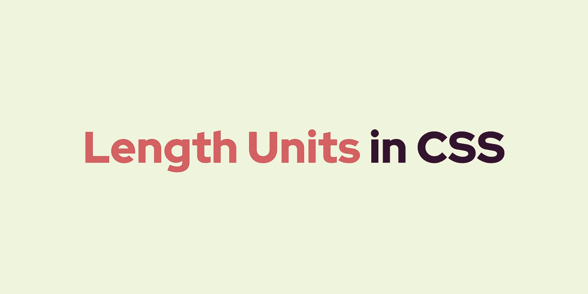
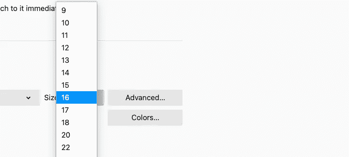
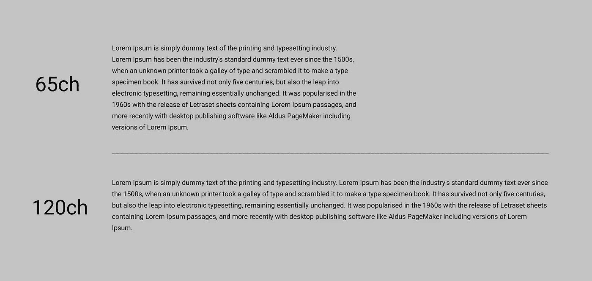
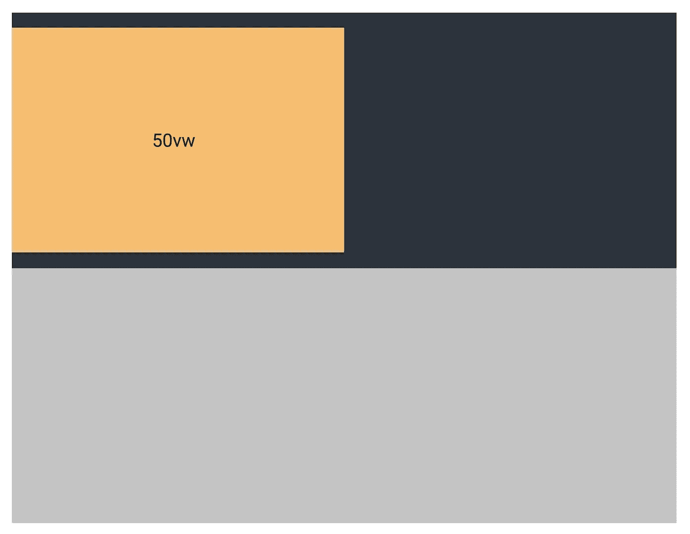
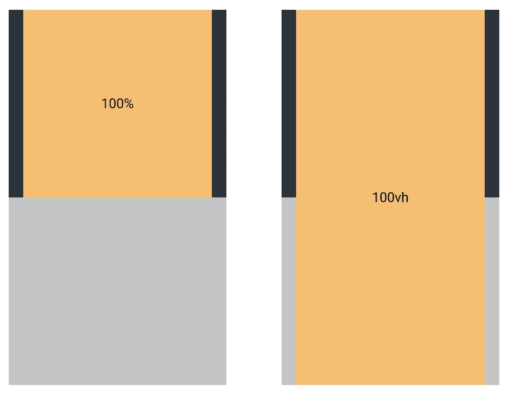

# CSS 中的长度单位

> 原文：<https://medium.com/compendium/length-units-in-css-263914aca2b?source=collection_archive---------0----------------------->

## 以及它们对可访问性的重要性



## 介绍

有几个选项可以用来确定不同 CSS 属性的长度单位。了解各种长度单位的工作原理以及如何利用它们是生成干净的样式表、良好的用户体验和包容性网站的关键。

CSS 声明包括一个*属性/值*对。属性值可以包括整数或关键字、关键字和整数的组合、有或没有 CSS 单元的值。

长度单位决定属性的大小。大多数 CSS 属性接受一组包含值和单位的数据类型。例如，一个段落具有属性`max-width`。我们可以给属性`max-width`赋一个*值*，而*值*成为长度单位的一部分。

```
p {
  max-width: 200px;
}
```

我们有不同类别的 CSS 长度单位:*绝对*、*相对*和*视口*。

# 绝对长度单位

所谓的绝对长度单位具有固定的大小。它们不会从父元素继承，也不会随着视口的尺寸而改变。因此，不建议在屏幕上使用，因为它们的大小、高度和宽度变化很大。无论是在桌面、平板还是移动设备上，绝对的 CSS 单元看起来都是一样的，并且通常被认为总是一样的大小。

## 像素

`px`单位是绝对的。`1px`相当于屏幕上的一个点(“点”)，与观看设备相关。

这个长度单位与当前字体无关，也与厘米或英寸无关。`px`用起来也有点奇怪，因为它是相对于物理属性而言的，而且它把用户可能需要缩放的网站搞得一团糟。

**例**:属性为`width`的元素，包含一个值，单位为`px`。

```
.element {
  width: 200px;
}
```

## 英寸、厘米、毫米

绝对长度单位`in`(英寸)`cm`(厘米)和`mm`(毫米)在网络上并不常见。对于网站来说，它们既不值得推荐，也不够准确。

这些装置适用于纸张、海报和其他印刷品等物理媒体。

```
1in = 2.54cm = 96px1cm = (96 / 2.54) = 38px1mm = 0.1cm = 3.78px
```

# 相对长度单位

相对长度单位有利于制作响应性强、易访问的网站。它们相对于父对象或视口进行缩放，用相对单位编写的样式表可以更容易地从一个环境缩放到另一个环境，就像从桌面缩放到移动屏幕。

在你的网页设计中，相对单位是排版的主要兴趣。网页设计的一个好策略是将字体大小设为相对值，而不是绝对值。那么更容易将某个东西的大小加倍或减半，而不是设置明确的值，比如一个图像`400px`。

## 全身长的

`em`单位相对于元素的当前字体大小。

`em` 和`rem`单元可用于创建完全可扩展和灵活的布局。如果用户调整文本大小或者将样式表中的字体大小变大或变小，em 单位将按比例缩放。

**例子**:我们希望子元素的字体大小是父元素的一半——它可以是主标题中的副标题。如果主标题的字体大小是`44px`，那么子标题就会变成`22px`。

```
.child {
  font-size: 0.5em;
}
```

## rem("根 em ")

`rem`单位与根元素的字体大小相关(例如`<html>`或`:root {}`)。与 em 一样，rem 单元将缩放，但使用根元素而不是父元素。

例子:标题通常比正文大。`:root`字号为`16px`。我们希望所有 H1 元素的大小都是两倍。我们可以使用`rem`来代替将`32px`定义为一个 H1 元素(它首先是固定的，不会使它相对于自身以外的元素):

```
h1 {
  font-size: 2rem;
}
```

一个`rem`单元非常有用，它还可以根据用户在浏览器中的偏好进行缩放。大多数浏览器都有默认的字体大小，通常设置为`16px`。如果在`:root`元素上没有设置默认的字体大小属性，将会使用浏览器的内置字体大小，并且仍然可以正确缩放网站。



Change default font size in Firefox

以上是 Firefox 中字体大小的浏览器设置示例。

## 荣誉勋爵

`ch`(“字符”)单位相对于元素字体中零(0)字符的宽度。

在网页上，段落和文本块不能太长，也不能太短。这对于有认知障碍或阅读困难的人来说至关重要。使用`ch`单元，我们可以确定每行应该有多少个字符，例如一个段落。互联网上似乎有一个标准协议，即段落文本*每行不应该超过 65-75 个单词*(包括空格)才能最具可读性。

**示例**:每行 65 个字符的段落，可读性最好。看看下面两张图用户体验的区别。

```
p {
  max-width: 65ch;
}
```



## 前夫;前妻;前男友;前女友

`ex`单位相对于字体的 **x 高度**。它很少使用，但与`ch`单元非常相似，只是高度不同。

# 视口长度单位

*视口长度单位*有时很有用，因为它们总是与视口的大小相关。在百分比(`%`)很难起作用的情况下，视口单位会很有帮助。视口由浏览器窗口的大小定义。

`viewport == browser window size`

## 视口高度(vh)

`vh`单位相对于 1%的视口高度。

```
1vh   = 1% of viewport height
100vh = 100% of viewport height
```

例如:我们有一个登录页面，我们希望在最顶端放置一张图片。图像应该占据整个屏幕的高度，就像全屏显示一样，当我们滚动时，其余的内容就会显示出来。下面的内容可能会占据视窗高度的一半:

```
*// See this example on* [*Codepen*](https://codepen.io/lobunto/pen/wvzGqvO)*.*.image {
  background: #F5BE70;
 **height: 100vh;**
}.text {
 **height: 50vh;**
}
```

## 视口宽度

`vw`单位与`vh`相似，但`vw`相对于 1%的视口宽度。

```
1vw   = 1% of viewport width
100vw = 100% of viewport width
```

**示例**:我们想要一个位于左侧的子`div`，它基于视口的宽度占据父`div`的`50%`宽度。



```
// *See this example on* [*Codepen*](https://codepen.io/lobunto/pen/GRjZvpY)*.*.parent {
  width: 100%;
  height: 400px;
  background: #2B343C;
}.child {
  **width: 50vw;** height: 300px;
  background: #F5BE70;
}
```

## 视口与百分比

视口大小类似于百分比单位，但工作方式不同。

百分比单位总是继承其父元素的*大小*，而不是视口。视口单位始终按视口大小计算，这意味着它可以扩展其父级的大小。

**举例:**你有一个`400px`为`height`的父`div`元素和一个`height`为`100%`的子`div`元素，那么子`div`在理论上可能会比视窗的大小大得多或小得多。

相反，在子元素上使用`100vh`,我们可以确保它填充视口的`height`的`100%`,而不一定是父`div`元素。当横幅占据网站顶部的整个屏幕高度时，这非常有用。

*(如下图所示)*



```
// left side of example - *see this example on* [Codepen.](https://codepen.io/lobunto/pen/eYdZEBB).parent {
  height: 400px;
  background: #2B343C;
}.child {
  **height: 100%;**
  background: #F5BE70;
}// right side of example - *see this example on* [Codepen.](https://codepen.io/lobunto/pen/VwKazmd).parent {
  height: 400px;
  background: #2B343C;
}.child {
  **height: 100vh;**
  background: #F5BE70;
}
```

## 视口最大值(vmax)和视口最小值(vmin)

`vmin`(“视口最小值”)是最小浏览器视口尺寸的 1%。`1vmin` = `1vh`或`1vw`，基于视口中哪个尺寸最小。

```
1vmin   = 1% of viewport height or width, whichever is smaller
100vmin = 100% of viewport height or width, whichever is smaller
```

`vmax`(“视口最大值”)相对于最大浏览器视口尺寸的`1%`，视口尺寸最大者为准。

```
1vmax   = 1% of viewport height or width, whichever is larger
100vmax = 100% of viewport height or width, whichever is larger
```

**它们什么时候有用:**

`vmin`和`vmax`对排版特别有用。通常我们会使用 *@media queries* 来设置不同的文本大小，因为应用程序布局会根据各种设备的高度和宽度进行缩放，比如手机和台式电脑。看来，找到正确的价值观需要一些调整，看看你想要的。

```
// See example on [Codepen.](https://codepen.io/lobunto/pen/MWjyvoj)h1 {
  width 10vmin;
}
```

使用相对 CSS 单位非常适合制作应该用于多种设备分辨率的网站，并注重可访问性和最佳用户体验。

感谢阅读！

*代码 foh shizzle*