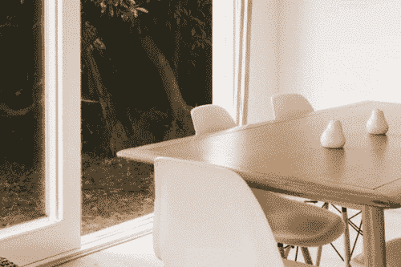

# Lens BETA 现已在美国上市，具有新功能

> 原文：<https://medium.com/pinterest-engineering/lens-beta-now-available-in-the-u-s-with-new-features-c1016476c703?source=collection_archive---------5----------------------->

Steven Ramkumar |视觉搜索和发现工程 Pinterest 工程经理

上个月，我们发布了 [Lens BETA](/@Pinterest_Engineering/introducing-the-future-of-visual-discovery-on-pinterest-48fb469b0d67#.nzczfs6mu) ，这是一种使用你的 Pinterest 应用程序中的摄像头来发现你周围世界的物体和想法的新方法。从那以后，我们已经向数百万 Pinners 推出了测试版，并获得了积极的早期反馈。正如我们所料，人们主要关注与时尚、家居装饰和产品相关的物品，以及艺术和食品等其他兴趣。因为我们看到了巨大的反响，所以今天我们向美国的所有 Pinners 推出了 Lens BETA，以在 iPhone 和 Android 上试用，并提供了更新的视觉模型和新的产品增强功能。

# **镜头 BETA 技术增强**

我们用来表现图像的视觉特征(也称为*视觉嵌入*)必须进行优化，以将镜头查询(通常包含次优的照明和取景条件)映射到我们在 Pinterest 上拥有的数十亿张高质量图像。解决这个*域转移*问题的关键包括训练一个联合嵌入模型，在这个模型中，我们使用野外相机图像和高质量库存摄影的正确组合。作为今天更新的一部分，我们推出了一个新的视觉模型，该模型针对用户生成的相机图像进行了更好的优化。最终，随着越来越多的人使用它，Lens 也在不断改进。

# **镜头 BETA 产品更新**

除了这些技术上的变化，你还会注意到使用 Lens 时的两个新特性。首先，我们让 Pinners 能够标记他们拍摄的物体。这使得 Pinners 成为构建 Lens 的一部分，并让 Lens 从真实数据中学习。

Pinterest Lens +

除了从您的相机和相机胶卷中拍摄照片，我们还增加了一种方法来发现更多您可能不知道的想法。只需点击 Pinterest 应用程序中的镜头图标，向上滑动即可找到新的创意镜头，从转盘到旅行创意。

Object lenses in Pinterest Lens

# 展望未来

Lens 的测试版发布真的只是一个开始。我们正在继续改进我们的视觉技术，以更好地理解图像和物体，因为我们面临的挑战是，图像是我们理解 Pinner 意图的唯一可用信号。这在真实世界相机图像的情况下尤其困难，因为人们在具有不一致图像质量和各种方向的各种照明条件下拍摄照片。

我们对对象和视觉搜索结合在一起所带来的可能性感到兴奋，并继续探索新的方法，利用我们的大规模对象和图像为世界各地的 Pinners 构建新的发现产品。

请务必将您的 iPhone 版 Pinterest 应用程序升级到 6.20 版，将您的 Android 手机升级到 6.10 版。如果您有兴趣应对这些计算机视觉挑战并为 Pinners 开发出色的产品，[请加入我们的活动](https://careers.pinterest.com/careers/engineering)！

*鸣谢:Lens 是 Pinterest 的合作成果。我们要感谢梅森·邱吉尔、杰夫·多纳休、雪莉·杜、杰米·法瓦扎、迈克尔·冯、纳文·加维尼、龚炳辉、安德烈亚斯·海林、杰克·许、·艾弗森、益铭·仁、、埃里克·金、德米特里·基斯柳克、克里斯蒂娜·林、拜伦·帕尔、维什瓦·帕特尔、艾伯特·佩雷塔、史蒂文·拉姆库马、埃里克·宋、伊万尼·托马斯、埃里克·曾庆红、许克雷、于哲飞、、特雷弗·达雷尔的建议，以及时宇(凯文)京、万加·约瑟夫夫斯基*