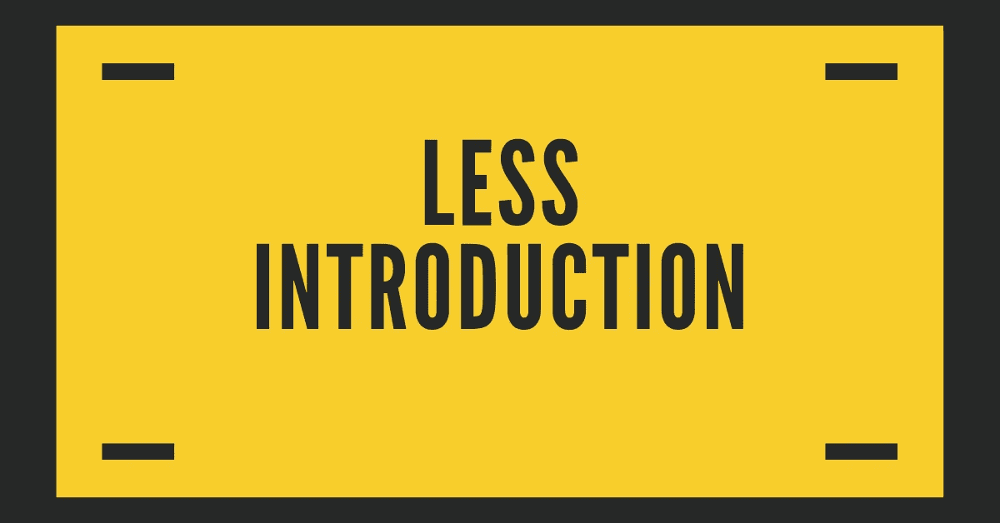

# 更少(更精简的样式表)😎

> 原文：<https://medium.com/quick-code/less-leaner-style-sheets-d9bac51753a3?source=collection_archive---------1----------------------->

*什么是少？又为什么用？。*💻

# 少介绍😉

Less History

LESS 是一个 CSS 预处理程序，为网站提供可定制、可管理和可重用的样式表。LESS 是一种动态样式表语言，它扩展了 CSS 的功能。LESS 也是跨浏览器友好的。

CSS 预处理器是一种脚本语言，它扩展了 CSS，并被编译成常规的 CSS 语法，以便您的 web 浏览器可以阅读。它提供了像变量、函数、混合和操作这样的功能，允许你构建动态 CSS。

Less(学习者样式表有时风格化为 LESS)是一种动态样式表语言，可以编译成级联样式表(CSS)并在客户端或服务器端运行。[2]Less 由 Alexis Sellier 设计，受 Sass 的影响，并影响了 Sass 的较新的“SCSS”语法，该语法修改了其类似 CSS 的块格式语法。【3】少就是开源。它的第一个版本是用 Ruby 写的；然而，在后来的版本中，Ruby 已经被弃用，取而代之的是 JavaScript。Less 的缩进语法是一种嵌套的元语言，因为有效的 CSS 是具有相同语义的有效 Less 代码。Less 提供了以下机制:变量、嵌套、混合、运算符和函数；Less 和其他 CSS 预编译器的主要区别在于 Less 允许浏览器通过 less.js 进行实时编译。

Less 是一个 CSS 预处理器，方便您定制、管理和重用网页的样式表。Less 是 CSS 和动态样式表语言的扩展，可以在客户端或服务器端运行。

Less 是一种开源语言。它也是跨浏览器兼容的。

## 为什么更少？😲

why use less?

*   让我们现在明白为什么我们用得更少。
*   LESS 支持更快、更容易地创建更干净、跨浏览器友好的 CSS。
*   LESS 是用 JavaScript 设计的，也是为了在 live 中使用而创建的，它比其他 CSS 预处理程序编译得更快。
*   LESS 以模块化的方式保持你的代码，这是非常重要的，因为它使你的代码可读并且容易修改。
*   使用较少的变量可以实现更快的维护。

## 历史

*   LESS 是 Alexis Sellier 在 2009 年设计的。更少的是开源。LESS 的第一个版本是用 Ruby 写的；在后来的版本中，Ruby 的使用被 JavaScript 所取代。

## 特征

*   Less 是干净、紧凑、可读性更强的代码，并以组织良好的方式编写。
*   Less 支持跨浏览器兼容。
*   越少越快越容易。
*   用 JavaScript 写的更少。它比 CSS 的其他预处理程序编译得更快。
*   Less 提供了使其维护更快的变量。
*   Less 提供嵌套，这使得代码简短、干净，并以特定的方式组织起来
*   Less 便于您定义可在整个代码中重用的样式。
*   Less 是 CSS 的扩展。所以也被称为 CSS 的超集。
*   Less 足以解决代码冗余的问题。
*   Less 提供了 [@import](http://twitter.com/import) 规则，让你可以轻松处理外部文件。导入是必需的，因为许多人将他们的样式表分成多个文件，而不是放在一个文件中。
*   Less 为共享相同样式规则的组选择器提供了扩展方法。它让不那么干净，更有条理。
*   Less 提供合并属性。这是 Less 最令人兴奋的特性，它接受多个值，如变换、过渡和框阴影。
*   LESS 是一个解决代码冗余问题的敏捷工具。

## 优势

*   少的是一个 CSS 预处理程序。编译后，它生成简单的 CSS，可以跨浏览器工作。
*   Less 支持跨浏览器兼容。
*   由于嵌套的使用，较少的代码是简单、干净和组织良好的。
*   由于变量的使用，维护变得更快。
*   Less 提供了一个操作符列表，使得编码更快更省时。
*   Less 通过在规则集中引用整个类来方便您重用它们。
*   Less 是新的，比传统的 CSS 更受欢迎，因为它可以简化冗长的样式。
*   LESS 提供了使编码更快和节省时间的操作的使用。

## 不足之处

*   如果你是 CSS 预处理的新手，你必须花一些时间来学习。
*   与包含 Compass、Gravity 和 Susy 等框架的 SASS 等旧预处理器相比，Less 提供的框架更少。
*   更少的是，模块之间是紧密耦合的，所以重用和/或测试依赖模块需要更多的努力。

Sass 和 LESS 都是向后兼容的，所以只需重命名。css 文件扩展名为。少还是。分别为 scss。LESS 基于 JavaScript，Sass 基于 Ruby。

Sass 让 CSS 再次变得有趣。Sass 是 CSS 的扩展，增加了嵌套规则、变量、混合、选择器继承等等。使用命令行工具或 web 框架插件，它被翻译成格式良好的标准 CSS。

萨斯 Vs 少。Sass 和 LESS 都是非常强大的 CSS 扩展。Sass 和 less 都是向后兼容的，所以只需通过重命名。css 文件扩展名为。少还是。分别为 scss。

Less Framework 是一个用于设计自适应网站的 CSS 网格系统。它包含 4 个布局和 3 套排版预设，都是基于一个单一的网格。

 [## 角度 7 游戏攻略

### 介绍角度 7 和安装角度 7 的步骤。

medium.com](/@dhavalpurohit/https-medium-com-dhavalpurohit-angular-7-introduction-e3a7a3b75995)  [## 自举角度 7

### 😎在 Angular 中安装和添加引导程序。💻

medium.com](/@dhavalpurohit/bootstrap-in-angular7-b9b540e41283)  [## Twitter 引导😎

### 什么是 twitter bootstrap？又为什么用？😉💻

medium.com](/@dhavalpurohit/twitter-bootstrap-33256da95588)  [## SASS(系统化的令人敬畏的样式表)😎

### 😳什么是萨斯？又为什么用？。优点和缺点。😛

medium.com](/@dhavalpurohit/sass-systematically-awesome-style-sheets-7525ad6da5b)  [## AngularJS 历史

### 谷歌员工 Misko Hevery 于 2009 年开始与 AngularJS 合作。

dhavalpurohitstudypoint.blogspot.com](https://dhavalpurohitstudypoint.blogspot.com/2018/10/angularjs-angularjs-version-1.html)