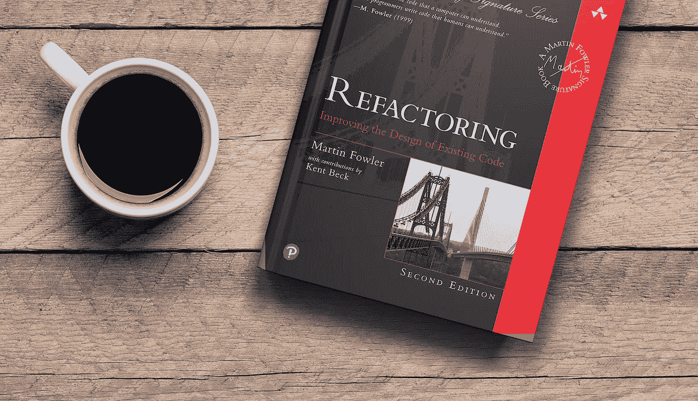

# 阅读《重构》一书后的经验教训

> 原文：<https://medium.com/quick-code/lesson-learn-after-reading-the-refactoring-book-348b7784330f?source=collection_archive---------0----------------------->

我总是喜欢阅读技术书籍，从[清洁代码](https://www.goodreads.com/book/show/3735293-clean-code)、[清洁编码员](https://www.goodreads.com/book/show/10284614-the-clean-coder)到[清洁架构](https://www.goodreads.com/book/show/18043011-clean-architecture)。为了成为一名更好的软件工程师，我从这些书中学到了很多东西。

*Refactoring: Improving the Design of Existing Code*

2018 年发布《重构》第 2 版: [**重构:改进现有代码的设计**](https://www.goodreads.com/book/show/35135772-refactoring) ，其示例用 Javascript 编写。因为我在日常工作中使用 Javascript，所以我决定抓住…