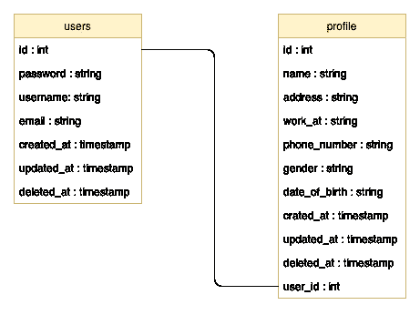
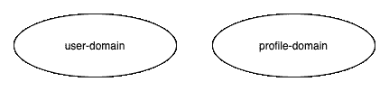
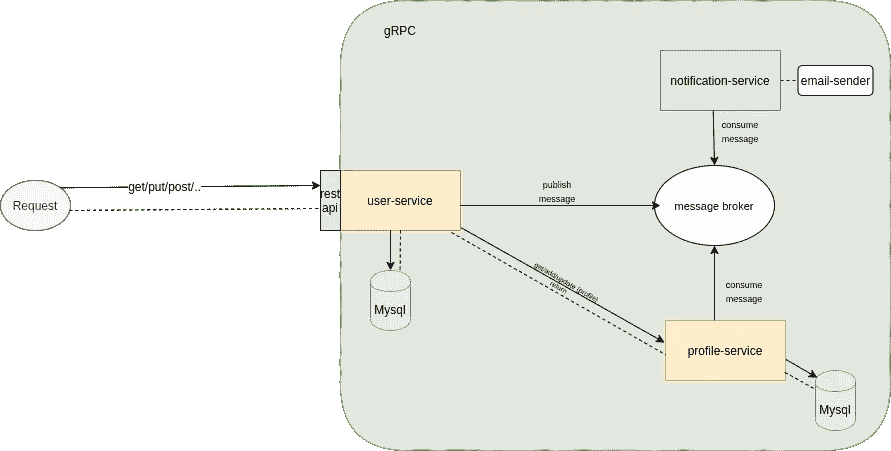

# 实施微服务架构的经验教训

> 原文：<https://medium.easyread.co/lesson-learned-on-implementing-microservices-architecture-af3be4c22a23?source=collection_archive---------1----------------------->

[https://encrypted-tbn0.gstatic.com/images?q=tbn%3AANd9GcToF5WiSIhYzxkISXwLQEjihYEDe1MMZHg6mpOb0r4HO97eUMFp](https://encrypted-tbn0.gstatic.com/images?q=tbn%3AANd9GcToF5WiSIhYzxkISXwLQEjihYEDe1MMZHg6mpOb0r4HO97eUMFp)

你好..在这里，我尝试实现微服务架构。我用来构建简单微服务的 Tech stack 有 ***Go、Kafka、gRPC*** 和 ***MySQL*** 。

[**微服务**](https://microservices.io/) 是创业公司中比较流行的术语，大型公司和基于 IT 的创业公司已经开始采用微服务架构的使用。采用微服务架构的公司包括网飞、亚马逊、优步、SoundCloud 和 Ebay (Richardson，2018)。在印度尼西亚，采用微服务架构的公司有 GOJEK、Traveloka、Bukalapak、Tokopedia、Kudo、Qoala、Koinworks 等。微服务架构来解决单片架构中的问题。微服务架构可以为应用开发提供一种有效的方式。更多关于微服务的解释你可以在这个链接上找到[https://micro services . io](https://microservices.io/)。

# 描述

我构建的应用程序有几个用例，如下所示。

*   用户能够注册帐户
*   用户能够登录和注销
*   用户能够更新他们的个人资料

从这个用例，这是数据库方案

Database scheme

确定一项服务是非常重要的。使用 [**域驱动设计**](https://dddcommunity.org/learning-ddd/what_is_ddd/#:~:text=Domain%2Ddriven%20design%20(DDD),complex%20designs%20on%20a%20model) 方法来确定服务。DDD 方法指导软件开发人员基于要解决的子域问题来设计系统。一个子域处理一个具体问题，会做成一个服务。

所以从问题描述来看，应用领域如下所示

Domain of the application

从上面的域来看，每个域由一个服务处理，用户域由用户服务处理，配置文件域由配置文件服务处理。

当用户注册一个帐户，她会收到一封电子邮件进行验证，她的/他的数据将被存储到数据库中。为了处理发送电子邮件验证，我们需要另一个服务，我们称之为通知服务。电子邮件发送过程将由一个事件触发。该事件在帐户创建后由用户服务发布。用户服务将事件发布到消息代理，在这个例子中我们使用 Kafka。该事件将由配置文件服务和通知服务使用。

silhouette desgin

你可以试着在这个链接上实现我的知识库:[https://github.com/sjuliper7/silhouette](https://github.com/sjuliper7/silhouette)

谢谢你