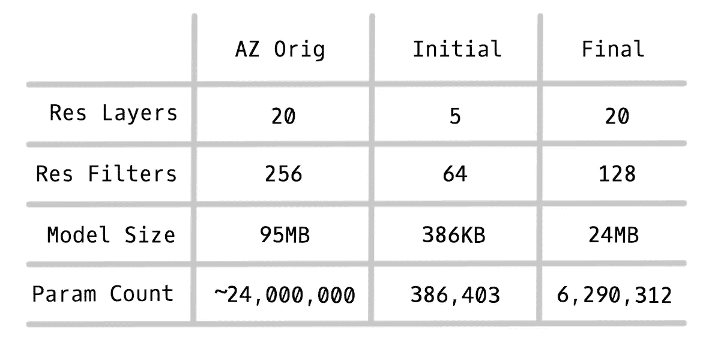
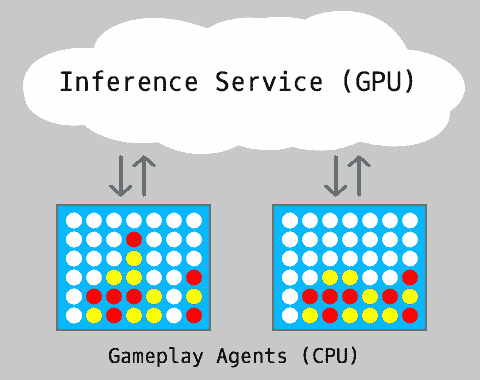
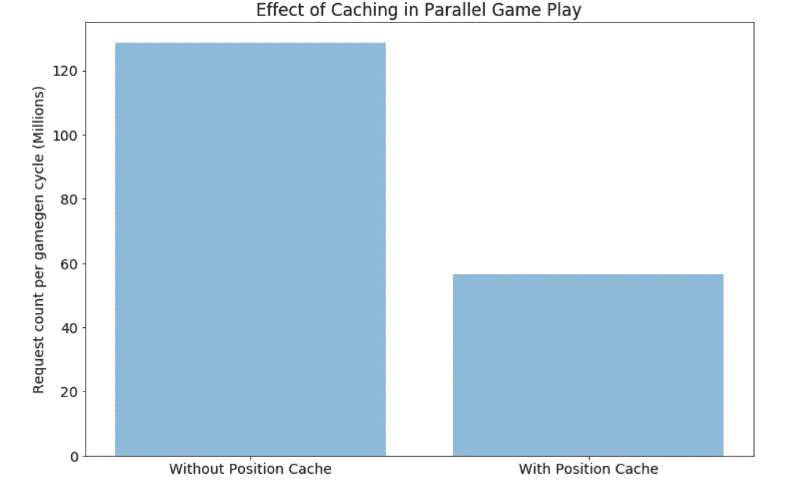
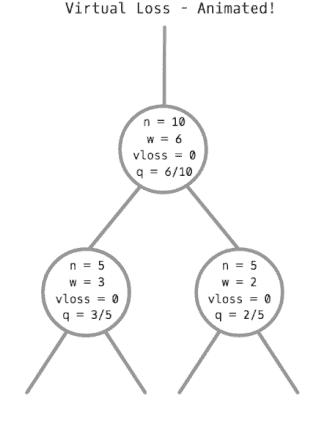
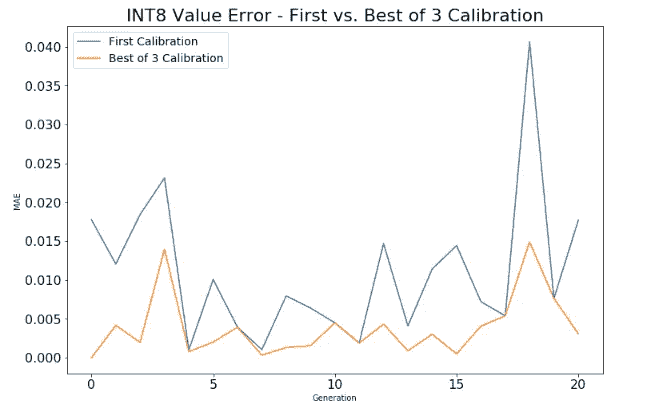
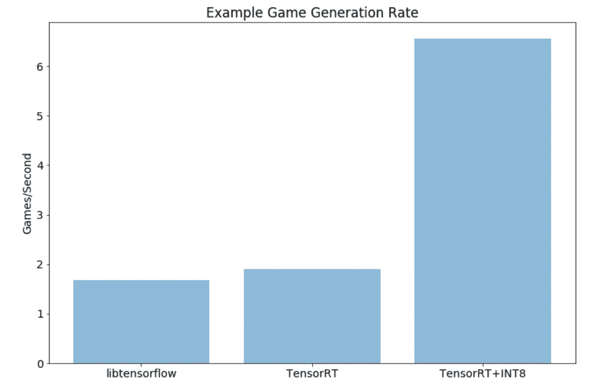
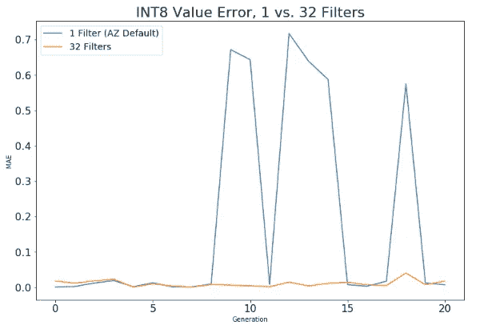

# Alpha Zero 的经验(第 5 部分):性能优化

> 原文：<https://medium.com/oracledevs/lessons-from-alpha-zero-part-5-performance-optimization-664b38dc509e?source=collection_archive---------0----------------------->

Photo by [Mathew Schwartz](https://unsplash.com/@cadop?utm_source=medium&utm_medium=referral) on [Unsplash](https://unsplash.com?utm_source=medium&utm_medium=referral)

这是我们关于实施 AlphaZero 的经验教训系列的第五部分。查看 [*第一部分*](/oracledevs/lessons-from-implementing-alphazero-7e36e9054191)*[*第二部分*](/oracledevs/lessons-from-alphazero-connect-four-e4a0ae82af68)*[*第三部分*](/oracledevs/lessons-from-alphazero-part-3-parameter-tweaking-4dceb78ed1e5)*[*第四部分*](/oracledevs/lessons-from-alphazero-part-4-improving-the-training-target-6efba2e71628) *。****

**在这篇文章中，我们回顾了 AlphaZero 实现的一些方面，这些方面让我们大大提高了游戏生成和训练的速度。**

# **概观**

**实现 AlphaZero 的任务令人生畏，不仅因为算法本身错综复杂，还因为作者们在研究中使用了大量资源:在许多小时的过程中使用了 5000 个 TPU 来训练他们的算法，这可能是在花费了大量时间来确定最佳参数以允许它快速训练之后。**

**通过选择 Connect Four 作为我们的第一个游戏，我们希望在利用更适度的资源的同时，实现 AlphaZero 的可靠实现。但在开始后不久，我们意识到即使像 Connect Four 这样简单的游戏也需要大量的资源来训练:在我们最初的实现中，在一台支持 gpu 的计算机上训练需要数周时间。**

**幸运的是，我们能够进行一些改进，使我们的培训周期时间从几周缩短到大约一天。在这篇文章中，我将回顾一些我们最有影响力的变化。**

# **瓶颈**

**在深入研究我们为减少 AZ 训练时间所做的一些调整之前，让我们描述一下我们的训练周期。尽管 AlphaZero 的作者使用了连续和异步的过程来执行模型训练和更新，但是对于我们的实验，我们使用了以下三阶段同步过程，我们选择该过程是因为它的简单性和可调试性:**

****While(我的模型不够好):****

1.  ****生成游戏:**每个模型周期，使用最新的模型，游戏代理生成 7168 个游戏，这相当于大约 140-220k 个游戏位置。**
2.  ****训练新模型:**基于开窗算法，我们从历史数据中采样，并训练改进的神经网络。**
3.  ****部署新模型:**我们现在采用新模型，将其转换为可部署的格式，并将其推送到我们的云中，以进行下一轮培训**

**毫无疑问，这个过程的最大瓶颈是游戏生成，当我们刚开始时，每个周期要花一个多小时。正因为如此，最小化游戏生成时间成为我们关注的焦点。**

# **模型尺寸**

**阿尔法零是非常推理重在自我发挥。事实上，在我们典型的游戏生成周期中，MCTS 需要超过 1.2 亿个位置评估。根据模型的大小，这可能会转化为大量的 GPU 时间。**

**在 AlphaZero 的最初实现中，作者使用了一种架构，其中大部分计算在 20 个剩余层中执行，每个层有 256 个过滤器。这相当于一个超过 90 兆字节的模型，这对于 Connect Four 来说似乎太大了。此外，考虑到我们最初有限的 GPU 资源，使用这样大小的模型是不切实际的。**

**相反，我们从一个非常小的模型开始，只使用了 5 层和 64 个过滤器，只是为了看看我们是否可以让我们的实现学习任何东西。随着我们不断优化我们的管道和改进我们的结果，我们能够将我们的模型大小提高到 20X128，同时仍然在我们的硬件上保持合理的游戏生成速度。**

****

# **分布式推理**

**从一开始，我们就知道我们需要不止一个 GPU 来实现我们所寻求的训练周期时间，因此我们创建了允许我们的 Connect 4 游戏代理执行远程推理来评估位置的软件。这使得我们能够将大量使用 GPU 的推理资源与只需要 CPU 的游戏资源分开。**

****

# **并行游戏生成**

**GPU 资源是昂贵的，所以我们想确保我们在播出期间尽可能多地饱和它们。这比我们想象的要棘手。**

**我们实施的第一批优化之一是在同一进程的并行线程上运行许多游戏。也许最大的直接好处是，它允许我们缓存位置评估，这可以在不同的线程之间共享。这将发送到我们的远程推理服务器的请求数量减少了两倍多:**

****

**缓存是一个巨大的胜利，但是我们仍然希望以高效的方式处理剩余的未缓存请求。为了最大限度地减少网络延迟并最大限度地利用 GPU 并行化，我们将来自不同工作线程的推理请求合并到一个桶中，然后将其发送到我们的推理服务。这样做的缺点是，如果桶没有被及时填满，任何调用线程都会一直等待，直到桶超时。在这种方案下，选择合适的推理桶大小和超时值非常重要。**

****

**我们发现在游戏生成批次的整个过程中，桶填充率会有所不同，主要是因为一些游戏会比其他游戏更早完成，留下越来越少的线程来填充桶。这导致一批游戏的最后一个游戏要花很长时间才能完成，而 GPU 的利用率却下降到了零。我们需要一种更好的方式来保持我们的水桶装满。**

# **平行 MCTS**

**为了帮助解决我们的未填充桶问题，我们实现了并行 MCTS，这在 AZ 的论文中讨论过。最初，我们忽略了这个细节，因为它似乎对竞技性的一对一游戏最重要，因为并行游戏不适用。遇到前面提到的问题后，我们决定试一试。**

**并行 MCTS 背后的想法是允许多线程承担累积树统计数据的工作。虽然这听起来很简单，但 naiive 方法有一个基本问题:如果 N 个线程同时开始，并根据当前的树统计选择一条路径，它们将选择完全相同的路径，从而削弱 MCTS 的探索组件。**

**为了抵消这一点，AlphaZero 使用了虚拟损失的概念，这是一种临时将游戏损失添加到模拟过程中遍历的任何节点的算法。锁用于防止多个线程同时修改节点的模拟和虚拟丢失统计。在访问了一个节点并应用了虚拟丢失之后，当下一个线程访问同一节点时，它将被阻止遵循同一路径。一旦线程到达终点并备份其结果，这种虚拟丢失将被删除，从而从模拟中恢复真实的统计数据。**

****

**随着虚拟损失的到位，我们终于能够在游戏生成周期的大部分时间内实现 95%以上的 GPU 利用率，这是我们接近硬件设置的真正极限的标志。**

**从技术上来说，虚拟损失增加了游戏播出的某种程度的探索，因为它迫使选择沿着 MCTS 可能不自然倾向于访问的路径移动，但我们从未测量过由于它的使用而产生的任何有害(或有益)影响。**

# **TensorRT/TensorRT+INT8**

**虽然没有必要使用与 AlphaZero 论文中描述的模型一样大的模型，但我们发现从更大的模型中学习更好，所以希望使用尽可能大的模型。为了帮助解决这个问题，我们尝试了 [TensorRT](https://developer.nvidia.com/tensorrt) ，这是 Nvidia 创造的一项技术，用于优化模型推理的性能。**

**使用几个脚本就可以很容易地将现有的 Tensorflow/Keras 模型转换为 TensorRT。不幸的是，在我们开发这个的时候，还没有发布 TensorRT 远程服务组件，所以我们自己写了。**

**使用 TensorRT 的默认配置，我们注意到推理吞吐量略有增加(约 11%)。我们对这种适度的改进感到高兴，但希望通过使用 TensorRT 的 INT8 模式，性能会有更大的提高。INT8 模式需要更多的努力，因为当使用 INT8 时，您必须首先生成一个校准文件，以告诉推理引擎在使用 8 位近似数学时将什么比例因子应用于您的层激活。这种校准是通过将您的数据样本输入 Nvidia 的校准库来完成的。**

**因为我们观察到校准运行质量的一些变化，所以我们将尝试对 3 组不同的样本数据进行校准，然后根据保留数据验证结果配置。在三次校准尝试中，我们选择了验证误差最小的一次。**

****

**一旦我们的 INT8 实现到位，我们看到推理吞吐量比股票 libtensorflow 增加了近 4 倍，这使我们能够使用比其他方式更大的模型。**

****

**使用 INT8 的一个缺点是，在某些情况下，它可能会有损耗并且不精确。虽然我们在训练的早期没有观察到严重的精度问题，但随着学习的进行，我们会观察到推理的质量开始下降，特别是在我们的值输出上。这最初导致我们只能在培训的早期阶段使用 INT8。**

**意外地，当我们开始尝试增加头部网络中卷积滤波器的数量时，我们能够几乎消除 INT8 精度问题，这是我们从 [Leela Chess](https://github.com/LeelaChessZero/lczero) 得到的想法。下面是我们的值输出的平均误差图，值头中有 32 个过滤器，与 AZ 默认值 1:**

****

**我们的理论是，给这些层增加额外的基数会减少激活的差异，这使得模型更容易精确量化。这些天来，我们总是在启用 INT8 的情况下运行我们的游戏，即使在 AZ 训练即将结束时也没有看到任何不良影响。**

# **摘要**

**通过使用所有这些方法，我们最终能够训练一个具有高 GPU 利用率和良好周期时间的体面模型。最初看起来，完成一次完整的训练需要几周时间，但现在我们可以在不到一天的时间内训练出一个像样的模型。这很棒，但事实证明我们才刚刚开始——在下一篇文章中，我们将讨论我们如何调整 AlphaZero 本身以获得更好的学习速度。**

**[第六部](/oracledevs/lessons-from-alpha-zero-part-6-hyperparameter-tuning-b1cfcbe4ca9a)现在出来了。**