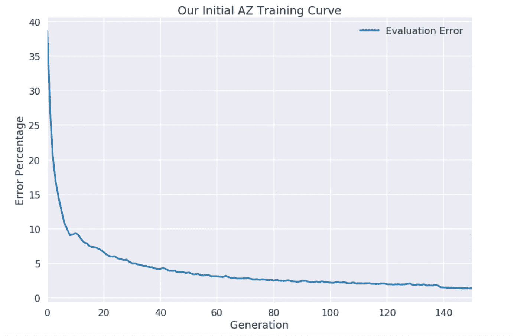
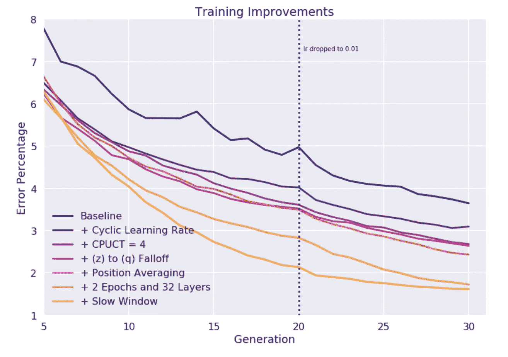
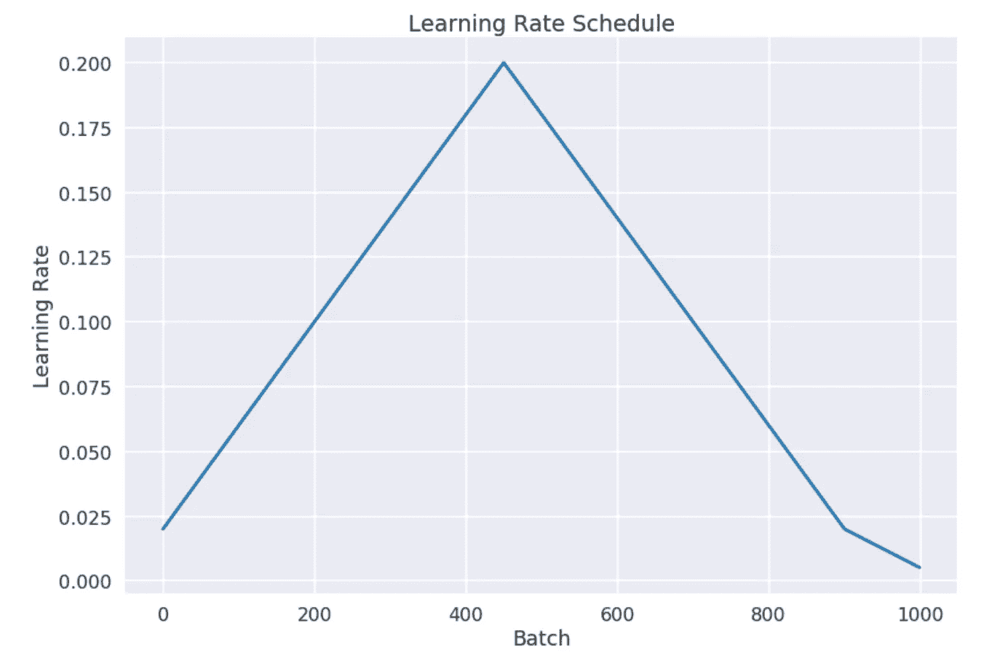
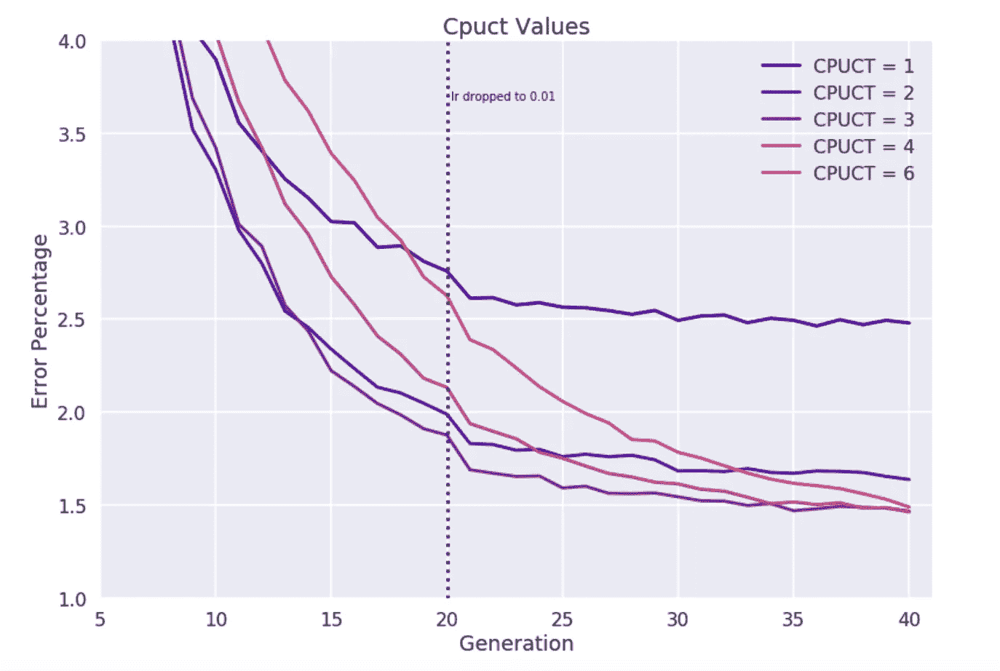
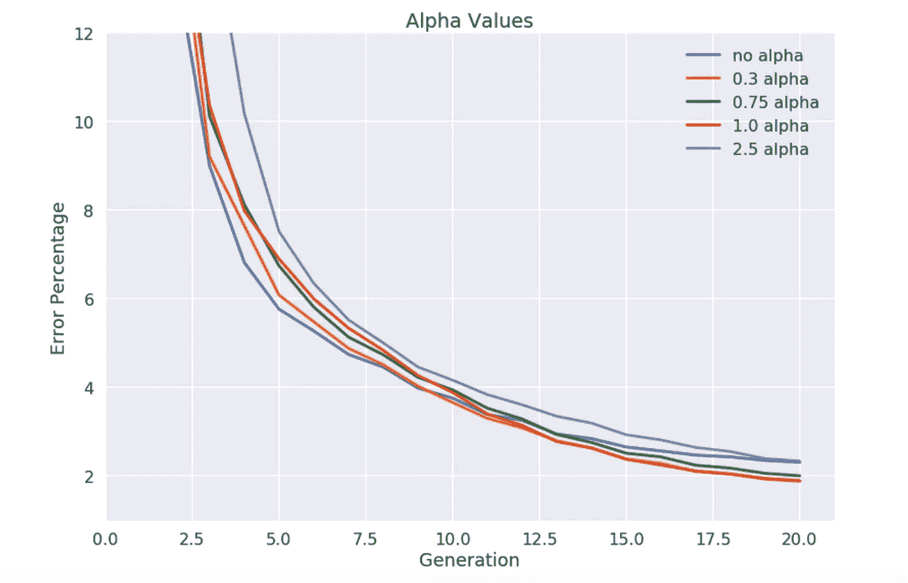
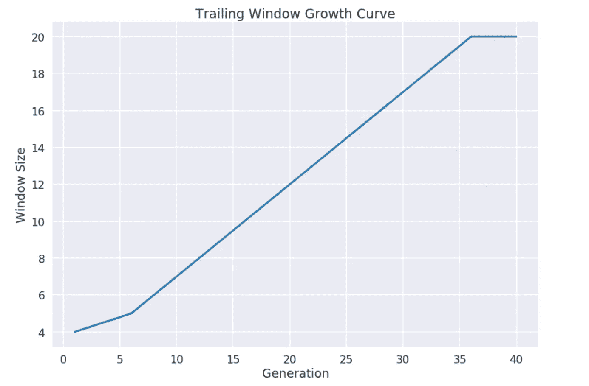
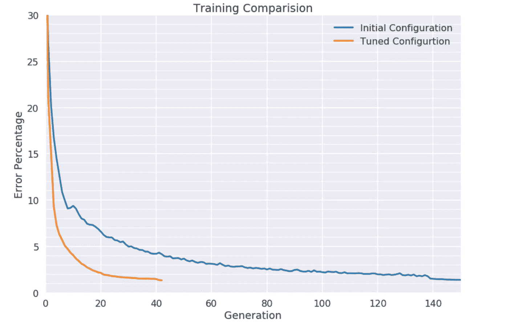

# Alpha Zero 的教训(第六部分)——超参数调谐

> 原文：<https://medium.com/oracledevs/lessons-from-alpha-zero-part-6-hyperparameter-tuning-b1cfcbe4ca9a?source=collection_archive---------0----------------------->

Photo by [Denisse Leon](https://unsplash.com/@denisseleon?utm_source=medium&utm_medium=referral) on [Unsplash](https://unsplash.com?utm_source=medium&utm_medium=referral)

这是我们从实施 AlphaZero 中学到的经验系列的第六部分。查看 [*第一部分*](/oracledevs/lessons-from-implementing-alphazero-7e36e9054191)*[*第二部分*](/oracledevs/lessons-from-alphazero-connect-four-e4a0ae82af68)*[*第三部分*](/oracledevs/lessons-from-alphazero-part-3-parameter-tweaking-4dceb78ed1e5)*[*第四部分*](/oracledevs/lessons-from-alphazero-part-4-improving-the-training-target-6efba2e71628)*[*第五部分*](/oracledevs/lessons-from-alpha-zero-part-5-performance-optimization-664b38dc509e) *。*****

**在本帖中，我们总结了使我们在 Connect Four 中获得最佳训练性能的配置和超参数选择。**

# **概观**

**当我们实现 AlphaZero 时，我们花了一些时间才意识到该算法有多挑剔，因为即使当你远离所有的超参数时，它仍然可以学习，尽管很慢。此外，还有相当多的超参数，其中许多在 AZ 论文中没有得到充分解释。**

**多亏了我们的[性能优化努力](/oracledevs/lessons-from-alpha-zero-part-5-performance-optimization-664b38dc509e)，我们能够比刚开始时更快地生成游戏。但它仍然需要许多代模型来创建一个近乎完美的连接 4 播放器。这是一个类似于我们原始配置的运行图。**

****

**对于大约 150 代模型，以每代 12 分钟计算，我们花了一天多的时间来执行上面的运行。**

**在上一篇文章中，我们研究了加快训练周期的方法。现在，我们将看看我们实际上减少获得专家算法所需的训练周期数的方法。**

# **我们的改进**

**在深入了解我们每项改进的细节之前，让我们先来看一张总结了我们所有调整的图表:**

****

**没有单一的银弹，而是参数调整的组合导致了我们的训练加速。**

# **循环学习率**

**在 AlphaZero 中，作者用一个固定的学习速率训练他们的网络，并定期调整。尽管我们是从这种方法开始的，但我们最终还是实施了一个 1 周期学习率计划，如下文[所述](https://arxiv.org/abs/1803.09820)。这背后的想法是，我们不是为训练选择一个单一的学习率，而是随着训练的进展明确地上下改变学习率。我们尝试了一些循环调度，比如带重启的余弦调度，但是发现 1cycle 是我们尝试过的最好的方法。**

****

**Cyclical Schedule with base learning rate of 0.02**

**虽然 1 个周期的调度通常应用于多个时期，但我们发现即使在单个时期内对多个批次进行调整时，它也是有帮助的。**

**随着训练的进行，我们确实降低了我们的基础学习率，但发现我们不必像没有 1 个周期时那样精确或频繁。**

# **C-PUCT**

**在播出期间，MCTS 使用 PUCT，UCT 的一种变体，来平衡探索与开发。关于算法如何工作的细节，请参见我们的[之前关于这个主题的帖子](/oracledevs/lessons-from-alphazero-part-3-parameter-tweaking-4dceb78ed1e5#8e97)。**

**在我们的实验中，我们尝试了各种 C-PUCT 值，但最终发现 C 在 3-4 范围内是一个最佳点。**

****

# **希腊字母的第一个字母**

**Dirichlet 噪声的使用是 AlphaGo 的一项有趣的创新，它在游戏播出期间将噪声添加到根节点的先验中。在推荐的配置中，这种噪声往往是尖锐的，产生的噪声集中了从根节点到偏离策略路径的一个小子集的探索，这种特性对于鼓励在具有高分支因子的游戏中集中探索可能特别有用。要了解更多关于狄利克雷噪声和阿尔法的信息，请查看我们的[之前的帖子](/oracledevs/lessons-from-alphazero-part-3-parameter-tweaking-4dceb78ed1e5#9847)。**

**下面是不同α值的学习曲线图。我们发现在我们的测试中，α值为 1 的表现最好。**

****

# **位置平均**

**在我们实验的某个时候，我们开始跟踪训练集中出现的独特位置的数量，以此来监控 AlphaZero 的各种探索参数的效果。例如，当 C=1 时，我们会在生成的位置中观察到大量的冗余，这表明该算法以高频率选择相同的路径，并且可能没有进行足够的探索。在 C=4 时，重复位置的数量较低。一般来说，对于 Connect Four，您的培训窗口中有大约 30–50%的重复数据并不罕见。**

**当在您的训练窗口中发现重复的位置时，它们可能来自不同的模型代，这意味着它们相关的先验和值可能不同。通过向神经网络呈现这些具有不同目标的位置，我们有效地要求它为我们平均目标值。**

**我们没有要求我们的网络自行平均数据，而是尝试在将数据呈现给网络之前执行重复数据删除和平均。理论上，这减少了网络的工作量，因为它不需要自己学习这个平均值。此外，重复数据删除允许我们在每个培训周期向网络呈现更多独特的职位。**

# **额外的最后一层过滤器**

**在 AlphaZero 的论文中，神经网络获取游戏输入，然后通过 20 个残差卷积层运行它。这些剩余卷积层的输出然后被馈送到卷积策略和值头，它们分别具有 2 个和 1 个滤波器。**

**我们最初实现了该模型及其头部网络，如论文中所述。基于 Leela Chess 报告的发现，我们将头部网络中的过滤器数量增加到 32 个，这大大加快了训练速度。**

**添加额外的头部过滤器有意想不到的副作用，也减少了 INT8 训练期间的精度误差，这使我们可以在整个训练周期中使用 TensorRT+INT8。更多关于这个[这里](/oracledevs/lessons-from-alpha-zero-part-5-performance-optimization-664b38dc509e#4ceb)。**

# **每一代多个时代**

**在游戏生成之后，进行训练，这样我们的模型可以从最近生成的数据中学习，在下一个周期中创建更精细的游戏示例。我们发现，每个窗口样本使用 2 个时期的训练比单个时期的训练在学习方面提供了很好的提升，而不会使我们的同步训练周期长时间处于瓶颈状态。**

# **慢速窗口**

**在 AlphaZero 中，作者使用了一个大小为 50 万场比赛的滑动窗口，从中统一采样他们的训练数据。在我们的第一个实现中，我们使用了由 20 代数据组成的滑动训练窗口，这相当于 143360 场比赛。在我们的实验中，我们注意到，在模型 21 中，训练错误会有很大的下降，评估性能会有明显的提升，就像可用数据量超过训练窗口大小，旧数据开始被删除一样。这似乎暗示着旧的、不太精确的数据可能会阻碍学习。**

**为了抵消这一点，我们实现了一个缓慢增加的采样窗口，窗口的大小开始时很小，然后随着模型代数的增加而慢慢增加。这允许我们在固定窗口大小之前快速淘汰非常早期的数据。我们从窗口大小为 4 开始，因此到了模型 5，第一代(也是最差的)数据被淘汰。然后，我们每两个模型增加一个历史大小，直到我们在第 35 代达到 20 个模型的历史大小。**

****

**实现类似的另一种方法是改变我们的采样分布，尽管我们选择上述方法是因为它简单。**

# **把它放在一起**

**有了这些调整，我们能学得多快呢？几乎快了 4 倍:过去训练一个 Connect Four 玩家需要大约 150 代，现在我们可以训练大约 40 代。**

****

**对我们来说，这相当于从 77 个 GPU 小时减少到 21 个 GPU 小时。我们估计我们原来的训练，没有这里或者上一篇文章提到的改进(比如 INT8，并行缓存等。)，将花费超过 450 个 GPU 小时。**

**通过调整这些参数的练习，我们感受到了超参数调整在 Alpha Zero 中的重要性。希望我们能够将这些知识应用到更大的游戏中。**