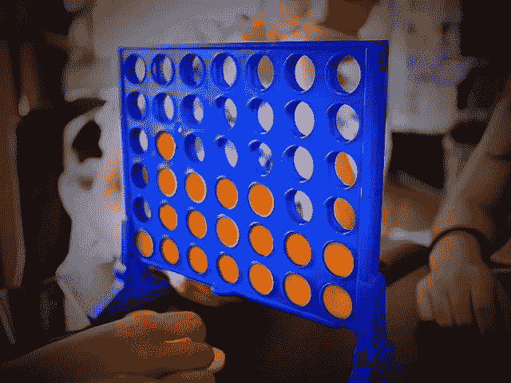

# AlphaZero 的教训:连接四个

> 原文：<https://medium.com/oracledevs/lessons-from-alphazero-connect-four-e4a0ae82af68?source=collection_archive---------0----------------------->

欢迎回来！在我们的[上一期](/oracledevs/lessons-from-implementing-alphazero-7e36e9054191)中，我们简要回顾了 DeepMind 的 AlphaZero 算法如何快速学会比最好的人类(有时也是现有的最好算法)更好地玩游戏。回想一下，它使用基于神经网络的蒙特卡罗树搜索(MCTS)来与自己对弈，并使用这些自我对弈的结果来进一步训练网络，处于自我强化的循环中。

在接下来的几个帖子中，我们将分享一些我们从教它玩[连接四个](https://en.wikipedia.org/wiki/Connect_Four)中学到的经验。

# 为什么连接四个？

为了实现和测试 AlphaZero，我们首先要选择一个游戏让它玩。与围棋(在难度的一个极端)或井字游戏(在另一个极端)不同，Connect Four 似乎提供了足够的复杂性来引起兴趣，同时仍然足够小，可以快速迭代。特别是我们选择了常见的 6x7 变体(如上图)。

它还有另一个好处:作为一个完全[解决的游戏](https://en.wikipedia.org/wiki/Solved_game)，我们可以根据最优策略测试我们的模型。也就是说，一旦我们使用 AlphaZero 训练了我们的网络，我们就可以向它输入我们知道正确答案的测试板位置，以获得有意义的“基本事实”准确性。

此外，它让我们发现在给定的架构下，我们的网络*能有多完美。让我们来看看它是如何工作的。*

# 培养

培训和评估流程如下:

1.  使用 Connect Four *解算器*(即，将告诉您任何板位置的正确移动的程序)来生成带标签的训练和测试集。
2.  选择神经网络体系结构。AlphaZero 的论文给出了一个很好的起点，但显而易见，不同的游戏将受益于对它的调整。
3.  使用监督学习来训练带有标签的训练集的网络。这给了我们一个关于架构应该能够学习得多好的上限。
4.  使用相同的网络架构训练 AlphaZero，并使用标记的测试集对其进行评估，以查看它与上限的接近程度。

假设 AlphaZero 训练的网络达到了 90%的测试准确率。这告诉我们什么？

*   如果同样的架构在监督训练下达到了 99%，那么网络*可以*学到比 AlphaZero 教给它的更多的东西，我们应该改进 AlphaZero 的自玩组件。
*   如果监督训练只达到 91%，那么网络架构本身很可能是限制因素，应该加以改进。

使用这种策略帮助我们调整网络架构，发现错误，并在我们的 MCTS 自我游戏中进行其他改进。

# 挑战

当生成带标签的训练数据时，我们将随机的电路板位置输入到一个连接四个解算器中。问题是，什么构成了“随机”

因为 AlphaZero 应该学会只玩完美的游戏，它的网络最终将不再看到玩得不好的位置。因此，在他们身上进行测试是不公平的。另一方面，Connect Four 非常简单，完美的游戏屈指可数，因此不可能只使用完美的棋盘位置来构建大型训练集。

另一个困难是确定什么是一个职位的正确答案。在任何给定的位置，可能会有多次移动导致胜利。赢的越快越好吗？好多少？如果有*而不是*一个确定的胜利，你应该选择输得最慢的一步棋(假设对手完美)，还是最有可能让他们犯错的一步棋(如果对手不完美)？你如何做到精确？

最后，我们决定使用非常不完美的游戏中的位置来生成我们的标签集，从而使我们经过 AlphaZero 训练的网络在比较中处于劣势。然而，正如我们很快就会看到的那样，它在这种不利条件下表现得出奇地好。

我们还决定使用两种不同的“最佳行动”定义当生成**【强】**训练/测试集时，只有当一步棋导致*最快的*可能胜利(或最慢的可能失败)时，我们才会将其标记为正确。在**“弱”**的情况下，*所有的*赢棋都被赋予同等的权重。为了保持比较的公平性，我们还在强模式和弱模式下训练了 AlphaZero，鼓励它在前一种情况下更喜欢更快的胜利(通过根据游戏长度缩放最终结果值)。让我们简单看一下。

## 强对弱 AlphaZero

在 MCTS 模拟期间，非终端位置从网络获得一个初始*值*，表示预期的游戏结果(在[-1，1]范围内)。另一方面，终端位置不需要这样的估计；我们可以直接给它们赋值+/-1。这对于*弱*训练来说没问题，在那里两个获胜的位置被认为是同样好的，不管到达那里需要多长时间。对于*强*训练，我们通过游戏长度来衡量终端结果。

最快的连四胜是 7 步，最长的是 42 步(用尽整个棋盘)。一些快速代数表明，如果 *n* 是实际的游戏长度，那么表达式 1.18-(9 * n/350)*将产生一个在[0.1，1]中的值用于获胜。这使得 MCTS 更喜欢速赢(和慢输)。*

# *评价*

*我们进行了两种评估:*

*   ***网络专用**:给网络一个测试板位置，检查其预测移动是否正确。*
*   ***MCTS** :在网络支持下运行 MCTS(有 800 次模拟)，评估它的首选行动。*

*回想一下，我们使用了两种不同的培训方法:*

*   ***AlphaZero ("AZ")** 训练。*
*   ***监督**训练(即使用来自解算器的标记训练数据)。*

*这给了我们四个组合来评价:**阿兹-网络，阿兹-MCTS，监督-网络，监督-MCTS。***

*最后，有两种训练模式(强对弱)。我们将依次查看每一项。*

# *结果*

## *强劲的结果*

*   *监督网络: **96.20%***
*   *受监管-MCTS: **97.29%***
*   *AZ-网络: **95.70%***
*   *阿兹-MCTS: **96.95%***

*这告诉我们的是:*

1.  *我们的 AlphaZero 训练几乎和监督训练一样好(尽管有前面提到的缺点)。*
2.  *尽管网络本身做得非常好，但是在 MCTS 使用它进一步降低了大约 29%的错误率(从大约 4%到大约 3%)。*

## *微弱的结果*

*   *监督网络: **98.93%***
*   *受监管-MCTS: **99.79%***
*   *阿兹-网络: **98.83%***
*   *阿兹-MCTS: **99.76%***

*这一次，AlphaZero 训练更加接近监督训练，几乎与之相当。此外，MCTS 减少了高达 80%的错误率，几乎每个位置都是正确的。*

*在弱测试集中，一个位置平均有 4.07 次正确移动(相比之下，强测试集为 2.16 次)。这意味着在 7 个可能的移动中随机猜测只能得到 58.1%。*

# *结论*

*Connect Four 是一个很好的游戏，可以用来训练你的 AlphaZero 实现(并找出其中的错误)。它允许快速迭代，并且足够复杂以至于有趣。因为这是一个已解决的游戏，所以也有可能得到一个训练成功程度的客观测量。*

*当只寻找*任何*最优走法(不管它赢得多快，或者避免输得多快)，再加上 MCTS，AlphaZero 训练过的网络在 400 个位置中只有一次走错。甚至在必须找到*最快的*赢(或不输)，并且单独使用网络预测时，它也只在 25 个位置中出错一次。相当不错！*

*在接下来的几周里，我们将看看我们所做的一些调整，以获得最好的结果。到时候见！*

**Part 3 现公布* [*此处*](/oracledevs/lessons-from-alphazero-part-3-parameter-tweaking-4dceb78ed1e5) *。**