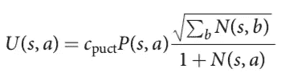
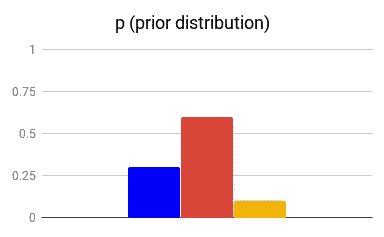
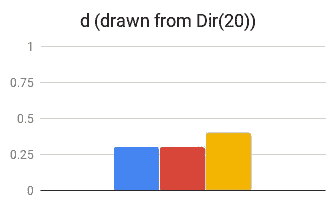
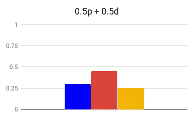
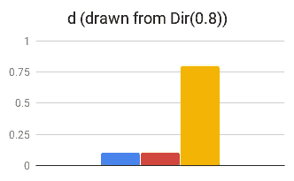
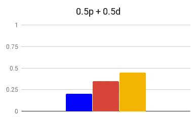

# AlphaZero 的经验(第 3 部分):参数调整

> 原文：<https://medium.com/oracledevs/lessons-from-alphazero-part-3-parameter-tweaking-4dceb78ed1e5?source=collection_archive---------0----------------------->

这是一系列讨论我们如何以有趣的方式复制和扩展 DeepMind 的 AlphaZero 算法的第三部分。 [*你可以在这里找到第一部分*](/oracledevs/lessons-from-implementing-alphazero-7e36e9054191) *。*

又见面了！在本周的文章中，我们将分享一些关于调整 AlphaZero(超级)参数的想法。这些参数不是在训练期间学习的(像网络权重)，而是预先固定的。通过选择好的价值观，训练可能会进行得更快或更好。

这些参数中有许多会影响所谓的探索-利用权衡:算法需要在利用其现有知识和探索新的可能性之间进行平衡。当训练 AlphaZero 与高技能对手比赛时(如论文中所述)，探索很重要，但当训练它在更广泛的位置上发挥出色时，探索更重要。正如[上一篇文章](/oracledevs/lessons-from-alphazero-connect-four-e4a0ae82af68)所述，我们的测试集包括不完美的游戏。因此，我们花了一些时间来调整我们的实现，以充分广泛地探索不仅是一个好的*最佳*玩家，而且是一个好的*一般*玩家。

# AlphaZero 中的超参数

让我们来看看我们可能想要优化的一些超参数。在这里，我们将只看一眼他们是什么和做什么。

## c_puct

在蒙特卡罗树搜索(MCTS)模拟过程中，该算法根据预期的游戏结果和已经探索的程度来评估潜在的下一步棋。常数 *c* 用于控制这种折衷。

标准 MCTS 使用[置信上限-1 (UCB-1)](https://jeremykun.com/2013/10/28/optimism-in-the-face-of-uncertainty-the-ucb1-algorithm/) 公式的一个变体，称为 [UCT(树木的 UCB)](https://en.wikipedia.org/wiki/Monte_Carlo_tree_search#Exploration_and_exploitation)。AlphaZero 使用了一个名为多项式上置信树(PUCT)的版本。如果我们处于状态 **s** 并考虑动作 **a** ，我们需要三个值来计算 PUCT(s，a):

*   **Q** —平均动作值。这是采取行动**和**的当前模拟的平均游戏结果。
*   **P** —从网络中获取的*先验概率*。
*   **N**—*访问计数*，即我们在当前模拟过程中采取此操作的次数。

我们计算 **PUCT(s，a) = Q(s，a)** + **U(s，a)** ，其中 **U** 计算如下:

请注意我们是如何在分子中对所有潜在的操作( **b** )求和的，分母中是正在考虑的操作( **a** )的访问次数。因此，少了*就少了*这个动作，多了***就多了**。这鼓励探索。*

*通过增加 *c_puct* ，我们将更多的权重放在这个探索项上。通过减少它，我们更加重视利用预期结果( **Q** )。*

*在尝试了一些值(从 1 到 6)之后，我们发现大约 4 是最佳的。*

## *狄利克雷(阿尔法)*

*AlphaZero 的一项创新是将噪音引入 MCTS。*

*在 MCTS 模拟期间，我们从代表当前棋盘状态的根节点( **s** )重复模拟游戏。我们做的第一件事是向神经网络查询来自 **s** 的潜在动作的*先验概率*向量( **p** )。*

*AlphaZero 没有按原样使用 **p** ，而是根据[狄利克雷分布](https://en.wikipedia.org/wiki/Dirichlet_distribution)用参数ɑ，aka Dir(ɑ)添加噪声。为了帮助理解这意味着什么，让我们看一些具有不同ɑ的狄利克雷分布的例子。对于这些例子，我们假设有 **n** 个潜在的下一步行动。*

*首先回想一下狄利克雷的*支集*(即定义它的地方的值)是坐标非负且和为 1 的向量(x_1，x_2，…，x_n)的集合。如果 n=3，那么一些例子将是(0.1，0.5，0.4)和(0.3，0，0.7)。这个集合也被称为(n 维)单形。*

*现在注意 Dir(1)是一致的。这意味着从其采样将产生上述两个向量(或任何其他有效向量)的机会均等。随着ɑ变小，狄利克雷开始偏好基向量附近的向量:(0.98，0.01，0.01)或者(0.1，0.9，0)会比(0.3，0.3，0.4)更容易被画出来。对于大于 1 的值，情况正好相反——基础向量被 *de* 强调，更平衡的向量是首选。*

*为了给 **p** 添加噪声，我们从 Dir(ɑ)中采样一个值 **d** ，取一个加权和:x* **p** + (1-x)* **d** 。因为 **p** 和 **d** 的坐标总和为 1(并且权重 *x* 和 *1-x* 总和为 1)，所以该属性保留在加权总和中，使其成为有效的概率分布。在本文中， *x* 设定为 0.75。下面我们就用 *x* =0.5 来夸大 **d** 的效果。*

*当ɑ大于 1 时，这往往会“拉平” **p** ，使我们不那么强烈地偏好任何一步棋:*

******

*Dir(20) tends to ***flatten*** *the weighted sum**

*对于\u\u<1, it will cause a random component to become more emphasized:*

******

*Dir(0.8) tends to **exaggerate** (a random component of) the weighted sum*

*In both cases, we are encouraged to explore away from our prior (which strongly preferred the middle move).*

*To pick a value, we first looked at the values they used for chess, shogi, and Go: 0.3, 0.15, and 0.03\. The [来说，这些游戏中合法移动的平均次数分别为 35、92 和 250 次。很难知道如何进行最佳外推，但合理的第一个猜测似乎是选择\593; = 10/n。由于在“连四”位置大约有四个合法移动，因此我们得到\593; = 2.5。确实，这个数大于 1，而其他的都小于 1，但是这个数在我们的测试中表现不错。稍微摆弄一下，我们发现 **1.75** 做得更好。](https://en.wikipedia.org/wiki/Game_complexity)*

***更新:虽然我们训练的早期版本在 a=1.75 时表现最佳，但我们最终决定将 a=1.0 作为我们训练的最佳值。***

*更多的研究(和计算时间)将有助于获得更多的洞察力。*

## *温度，τ(τ)*

*在 MCTS 完成一轮模拟之后，在它选择要走的一步棋之前，它已经为每个潜在的下一步棋累积了一个拜访计数( ***N*** )。MCTS 的工作使得好的棋最终比坏的棋更经常被访问，并且是在哪里玩的好的指示。*

*通常，这些计数被标准化，并用作选择实际移动的分布。但是所谓的*温度*参数(τ)可以用于首先对这些计数求幂:N^(1/τ).他们为游戏的前 30 步设置τ=1(这没有影响)，然后为游戏的其余部分将其设置为一个无穷小的值(这在标准化后会抑制除最大值以外的所有值)。*

*   *N = (1，2，3，4)*
*   *归一化 N: (0.1，0.2，0.3，0.4)*
*   *使用τ=1: (0.1，0.2，0.3，0.4)*
*   *使用τ~0: (0，0，0，1)*

*因此，前 30 个动作有些探索性，其余的将只播放访问次数最多的动作。*

*我们决定玩玩这个。首先，我们尝试让τ为 1，而不是减小它。这导致了性能的显著提高。受到这次成功的鼓舞，我们尝试了一些生活在边缘的游戏，并在整个游戏中将它提高到 1.75:*

*   *使用τ=1.75: (0.15，0.23，0.29，0.34)*

*τ越大，分布越平坦，导致勘探更加均匀。虽然τ=1.75 在我们尝试的值中给出了最好的结果，但我们发现它并不比简单地增加 c_puct 好。所以我们干脆把它留在了 **1** 。*

# *其他调整*

*除了调整超参数，我们还尝试了一些其他的修改。*

## *Nvidia-TensorRT 和 int8*

*Nvidia 提供了一个[推理优化工具](https://devblogs.nvidia.com/tensorrt-integration-speeds-tensorflow-inference/)，将我们的推理速度提高了 3-4 倍。除了优化张量流图，它还支持 [8 位量化](http://on-demand.gputechconf.com/gtc/2017/presentation/s7310-8-bit-inference-with-tensorrt.pdf)，以精度换取吞吐量。*

*这种量子化的副作用是它鼓励探索。例如，如果神经网络预测两个位置具有稍微不同的结果(范围[-1，1]内的数字)，那么在精度稍微降低的情况下，它们可能看起来相等。*

## *定位重复数据删除*

*当训练神经网络时，在最近的游戏中随机选择位置。因为 Connect Four 只有很少的合理开盘价，我们发现这导致早期董事会头寸的大量增加。这导致网络过于关注他们。*

*我们通过在随机选择职位进行培训之前进行重复数据删除来缓解这个问题。在这个过程中，我们对先验值和结果值进行平均。这似乎很有效。*

# *结论*

*正如许多机器学习一样，AlphaZero 的论文有许多没有得到充分解释的“神奇数字”。很难知道做了多少探索来确定所提供的值。对于某些参数，有原则的方法可以帮助缩小选择范围，但总的来说，这是一个“试试看”的游戏*

**探索与利用*是强化学习中的一个核心概念，因此，我们所做的许多调整以各种方式影响了这种权衡。*

*我们当然还没有找到*最优*选择，但是通过大量实验，我们帮助 AlphaZero 在 Connect Four 上做得比“开箱即用”好得多。*

**第 4 部分现公布* [*此处*](/oracledevs/lessons-from-alphazero-part-4-improving-the-training-target-6efba2e71628) *。**